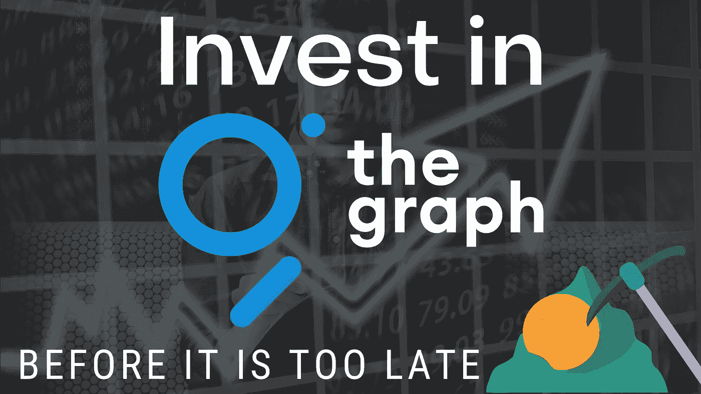
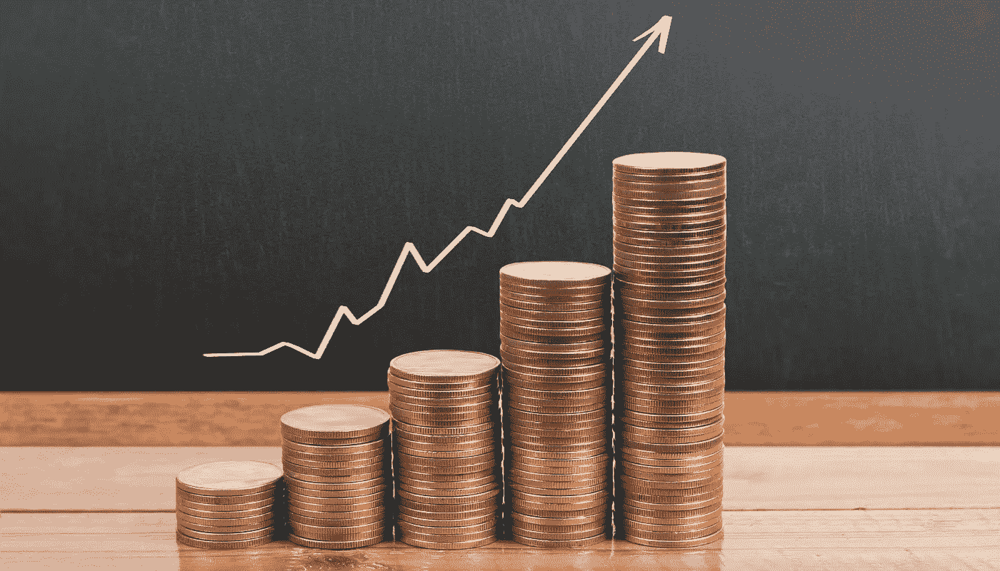
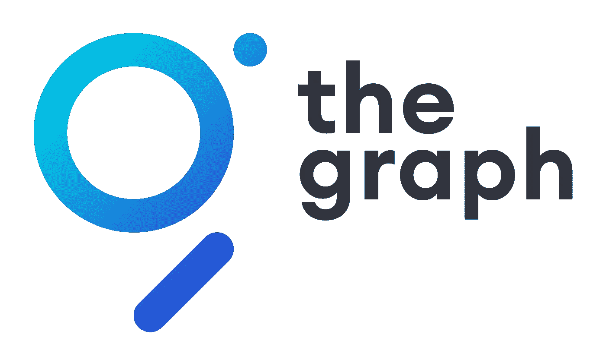
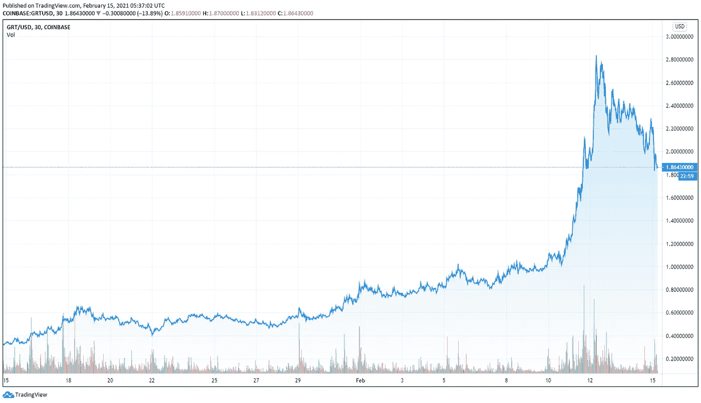

# 现在是时候了:在为时已晚之前投资 Graph GRT 为您的投资组合提供热门的新 altcoin 密码

> 原文：<https://medium.datadriveninvestor.com/now-is-the-time-invest-in-the-graph-grt-before-it-is-too-late-the-hot-altcoin-for-q1-q2-of-be8fcff6c423?source=collection_archive---------2----------------------->

Now is the time! The hot, new altcoin crypto for your portfolio!

你有没有看过最近流传的关于新加密货币 Graph (GRT)的统计数据？由于积极的网络增长和对加密货币的兴趣普遍增加，该货币在过去几天飙升了 50%以上。在我写这篇文章的时候，它的平均增长率接近上周的 100%，但是在过去的几天里已经高达 185%。

这使得图表(GRT)值得关注，但你应该投资一种最近受到很大关注的货币吗？作为股票市场的个人交易者，通过风险/回报计算等安全手段来保护你的投资变得更加重要。

这对自由市场尤其重要，因为这条路线本身就存在不确定性和风险。然而，你可以通过寻找更不对称的投资和交易机会来改变不确定性。意味着损失的可能性相对于获得的可能性较小。

# 不对称投资

在我们进入图表(GRT)的细节之前，作为一个投资者，你应该熟悉一些东西。进行不对称投资意味着避免平衡，寻找与潜在收益相比有轻微损失可能性的机会。

当你投资的时候，没有绝对确定的事情。这对你的任何投资都是一样的。然而，投资加密货币让你有机会寻找回报本质上超过下行风险的可识别场景。

Investment is high risk, high reward

例如，一个场景有 30%的机会失去 15 个点，有 30%的机会赢得 10 个点。还有一个是 15%的几率输 15 分，30%的几率赢 10 分；作为投资者，第二种选择是成功的最大可能性。这表明你的损失得到了控制，你得到的超过了潜在的损失。

记住这一点，我们知道加密货币有自己的思想。虽然我们可以尽最大努力给它一个结构，但这种货币的波动可能会让你陷入不良境地。

如果你最近对加密市场感兴趣，你可能熟悉每天出现的高点和低点。不管附带的风险如何，在 crypto 的价值形成后，投资 crypto 仍然是一个有利可图的投资机会。

# 加密值是什么意思？

与任何货币一样，加密价值通过社区的既得利益、硬币的效用和用户需求的增加而获得价值。然而，你必须意识到，这种货币是由与区块链有关的私人公司发行的。

如果他们的名声在他们之前，你可能会看到 crypto 得到更多的关注和兴趣；这样，它的附加价值就会增加。在判断加密货币的价值时，公司的形象和效率将非常重要。

# 加密货币的价值

让加密货币变得有用意味着当货币从一个分散的账本中出现时，给它一个特定的区块链生态系统，即区块链技术。比如 GRT 就是以太坊令牌。如果没有以太币，也就是一枚在以太币平台内推动交易的硬币，你就不能开始使用以太币平台。以太坊的价值取决于对平台服务的需求。

与比特币非常相似，加密货币具有有限性。这是一个很好的增加硬币供给需求的场景。这增加了购买硬币的紧迫感，使它们更有价值。

最后，加密货币的价值还取决于它的生存能力和项目开发的进度。如果项目持续流行、发展、实现一个接一个的里程碑，那么在市场看来，这就为增加价值的合作关系提供了一个有吸引力和有利可图的基础。这些原因为 crypto 创造了一个积极的环境，增加了它的价值，甚至有望在未来看到一个上升的趋势。

# 什么是 Graph GRT？

Graph GRT 是一个以太坊令牌，用于支持 Graph，这是一个用于索引和查询区块链的分散式协议。简单来说，这个图表就像是区块链变迁的搜索引擎，这意味着你不必去一个网站阅读一整页来获取信息。相反，您可以从图的网络中获得您需要的特定数据碎片。它效率更高，计算能力更低。

在过去的 5-6 周内，该图已经从 3.35 美元反弹超过 600%，达到 2.2 美元的普遍市值。这打破了 2020 年 0.64 的前历史高点，引发了许多购买订单，这意味着有一个上升趋势，使货币进入上升轨道。有传言说价格会涨到 5 美元。

# 图形是如何独特的？

该图的主要目标是将可靠的分散式公共基础设施引入主流市场。GRT 保证了图的经济安全性；它是一个工作令牌，由索引器、管理器和委托器锁定，为网络提供管理和索引服务。

该图使用 GRT 作为其同名硬币来激励用户将他们的计算机添加到公司的网络中。据 FXStreet 报道，图表显示本周其网络上的新地址增加了[。](https://www.fxstreet.com/cryptocurrencies/news/the-graph-price-prediction-grts-600-rally-unstoppable-as-bulls-eye-upswing-to-5-202102120519)

在 2020 年 12 月 17 日发布后，GRT 在比特币基地之后的 3 天内增长了 425%以上。据说，加入网络的新地址的激增对令牌和项目价值都是一个利好信号。

The Graph as of writing this article on February 15th, 2021

然而，理解你不应该忽视成功的另一面总是很重要的。虽然有一次成功的反弹，但 GRT 鲸正在快速脱手。据 FXStreet 报道，Satiment 的持有人分布显示，持有 100 万至 1000 万 GRT 的[地址从 1 月 28 日的 71 个减少到 2 月 12 日的 58 个](https://www.fxstreet.com/cryptocurrencies/news/the-graph-price-prediction-grts-600-rally-unstoppable-as-bulls-eye-upswing-to-5-202102120519)。这可能会危及我们之前讨论过的对 5 美元的预期上涨。

然而，加密货币的易变特性拯救了加密，并使其更具投资吸引力。人们对区块链非常感兴趣，不仅是主流媒体，还有科技巨头和有影响力的人士。埃隆·马斯克发一条推特就能让价值飙升。这也有助于我们慢慢地将生活的许多方面数字化；因此，加密货币的时机与这一进程几乎完美契合。

具体来说，随着 GRT 似乎在所有社交媒体平台上获得积极的前景，谣言很有可能很快成为现实，投资 GRT 很快就会更加有利可图。

*作者免责声明:此信息是作者的观点。不能保证这项投资是安全的，也不能保证会让你赚钱。如果你不确定在投资前应该采取什么步骤，请咨询财务顾问或会计师。

沙恩·萨顿
金融大师