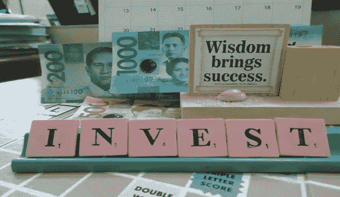

# 现在是投资、改变世界的时候了

> 原文：<https://medium.datadriveninvestor.com/now-is-the-time-to-invest-to-change-the-world-ce95d088c67b?source=collection_archive---------11----------------------->

[*“where should i invest my money for good returns”*](https://www.flickr.com/photos/127741715@N07/26708148114) *by* [*InvestmentTotal.com*](https://www.flickr.com/photos/127741715@N07) *is licensed under* [*CC BY 2.0*](https://creativecommons.org/licenses/by/2.0/?ref=ccsearch&atype=rich)

## 但这必须是正确的投资

随着冠状病毒的出现，我们看到经济系统摇摇欲坠。

这意味着，如果你投资了股票，你可能会四处寻找更安全的投资对象。

黄金和白银是天然的安全港，对吗？

没错，如果我们想要做的是支撑在 2008 年失败、现在再次失败的旧体系，这个旧体系已经让我们陷入了多次关于错误信息的战争，让我们大多数人成为没有前途的工作中的终身债务囚犯，似乎很快就会让我们与环境进行最终的生死决战。

因为将延续这一体系直到地球上所有生物灭绝的同一批人[已经在黄金和白银上投入了大量资金](https://gsiexchange.com/jp-morgan-cornered-silver-market/)。

黄金和白银是他们的保险政策，因为当事情发生时，就像现在一样，不管对生命和我们的星球有多大的危险。

 [## 数据驱动投资的兴起|数据驱动投资者

### 当 JCPenney 报告其 2015 年 2Q 的财务结果时，市场感到非常震惊。美国零售巨头…

www.datadriveninvestor.com](https://www.datadriveninvestor.com/2019/02/28/the-rise-of-data-driven-investing/) 

购买他们的黄金和/或白银可以让他们摆脱困境，让我们和我们的孩子背负更多的终身债务，在接下来的几年里从事更多没有前途的工作，或者直到我们污染了我们的环境，无法生存，那时我们都会死去。

是时候投资新的东西了。一些真正会改变世界的东西。

比特币。

现在在你逃之夭夭之前，请听听这个。我不是一个投资者，除非你算上我围绕这个主题投入的工作和研究时间，即使是在博士阶段，我也绝对没有投入任何其他东西，也没有什么可投资的，我只是希望看到我们作为一个物种的问题结束。

比特币有着非常、非常、特别的地方，除了被所有普通媒体视为负面之外，它似乎没有得到太多的强调，这些媒体在保持旧体系的活力方面有着既得利益。

比特币耗电。地段和*地段*的权力。

根据一些统计，即使是在 2017 年，也足以为一个小国供电。

每一个比特币都需要一定的能量来生产，而对于后来的比特币来说，这个能量比早期生产的比特币要多得多。

每枚比特币不断上涨的能源成本已经迫使人们寻找廉价的替代能源来继续生产比特币并从中获利。

现在唯一足够便宜的能源来自自然资源，比如地热和 T2 太阳能。

这些类型的发电厂生产的电力在初始投资后是免费的。

一旦你在一个系统中拥有了自由的力量，继续使用其他不自由的资源就没有意义了。对于比特币的生产而言，自由权力迅速让其他形式的权力变得过时。当你可以免费得到一点时，为什么要付钱呢？一点电力仍然可以生产一枚比特币，只是需要更长的时间，而任何价格下每千瓦小时特定成本的能源都会迅速侵蚀比特币开采的盈利能力。

如果比特币价格上涨，那么为了在众多矿业组织的环境中竞争，每个组织都必须努力扩大规模。

最具规模的自由能源是太阳能。

因此，比特币采矿社区对太阳能基础设施有需求，这种需求随着比特币价格的上涨而增加。

那不是很美吗？

目前这个社区仍然相当小，但是它已经在消耗国家规模的能量。

通过投资比特币来扩大社区规模，从而推高比特币的价格；迫使社区随着电力需求的相应增加而扩大，包括支持太阳能基础设施，所有这些都是由利润驱动的。

这是资本主义最强大的时候；像工业革命一样推动基础设施的发展。

有了足够的投资，该社区将迅速扩大电力生产，达到与我们世界已经消耗的电力相匹敌的规模。

到那时，它将生产足够的太阳能基础设施来为世界供电。

当 2100 万枚比特币的总存量被生产出来时，电力基础设施将突然变得多余。

由于所有的基础设施都已经付费，来自它的电力将完全免费，向全世界开放。

同样，按每桶或千瓦时收费的传统化石能源无法与免费能源竞争。

我们，以及我们的星球将最终摆脱化石能源不可思议的危害。

我们将为所有人提供免费电力，这可以很容易地满足任何未来的人口需求，并且没有持续的碳影响。

权力直接转化为财富。

所有未来的努力将只需要材料的费用，而这些费用可以由自由的力量和一点想象力创造出来。

[免费的太阳能很容易以最小的成本转化为氢等零碳燃料](https://heliogen.com/)，这种燃料可以在内燃机中燃烧，而内燃机不容易被电动机取代，如现有的飞机。

换句话说，对所有人来说，一切都是免费的。

不再有债务。

不再有“狗屁工作”

不再与我们的人类同胞竞争。

不再有战争。

不再有有毒的行星污染。

如果你想要这样一个新世界，忘掉黄金或白银，投资比特币吧。

其他的都没有意义。