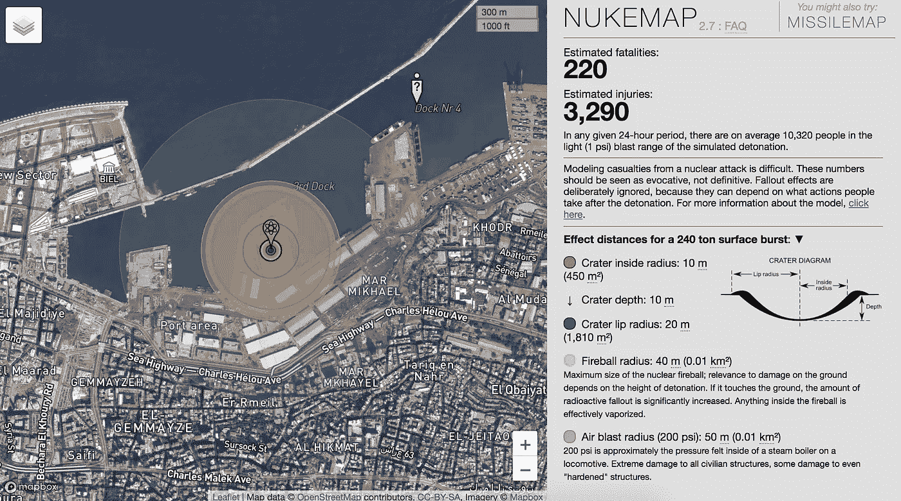
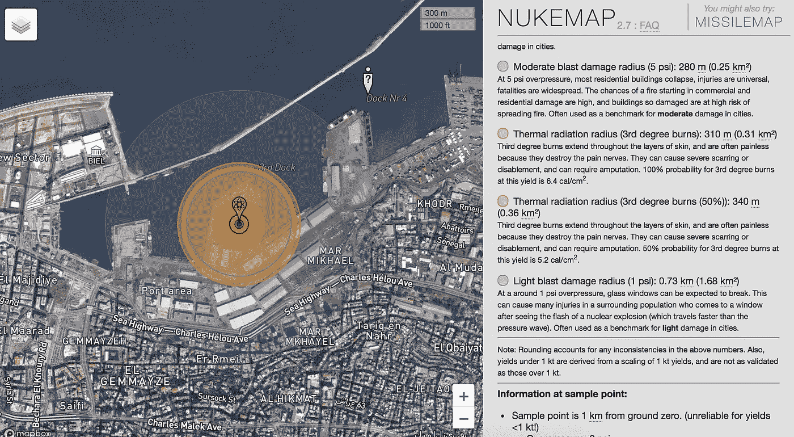
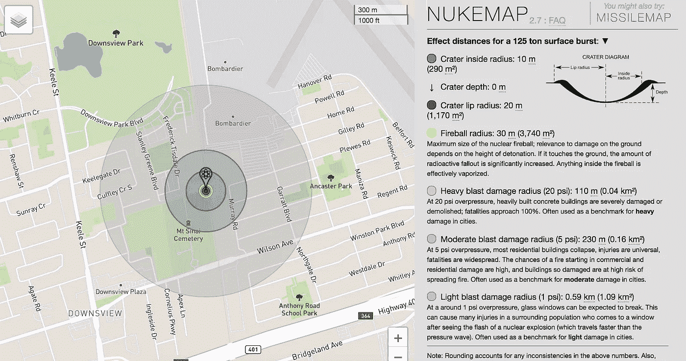

# Nukemap 和贝鲁特

> 原文：<https://medium.datadriveninvestor.com/nukemap-and-beirut-adf154243b9e?source=collection_archive---------13----------------------->

## 使用开源工具理解爆炸

From [https://nuclearsecrecy.com/nukemap/](https://nuclearsecrecy.com/nukemap/)

我同情那些受贝鲁特事件影响的人。震惊，对亲人的不确定，克服伤害，同时还要应对经济和疫情。已经是势不可挡了。

就像现代的其他灾难一样，这一事件有太多的镜头，看起来令人着迷和恐惧，就像 2006 年的海啸或福岛灾难，或龙卷风追逐。

仲夏爆炸也让 be 回到了 2008 年 8 月 10 日多伦多爆炸。我记得当时在 Tisha B'Av(我的策略是在斋戒日尽可能晚睡，然后白天睡觉)上，凌晨 3:50 听到我后院的滑动门在颤抖。我以为是我当时的一个室友出去呼吸新鲜空气了。

这正是 YouTube 起飞的时候，直到第二天我才意识到发生了什么。我看了 iPhone 问世前的几个视频。我的祖父母被埋在爆炸发生地的对面，谢天谢地，他们的墓地没有被破坏，尽管离爆炸点很近。

那次爆炸的当量是贝鲁特爆炸的一半。贝鲁特的爆炸也发生在白天，几乎没有建筑物遮挡爆炸。这种情况现在已经发生了——大多数人随身携带 3-4 台高清摄像机，而且 4K 流式闭路电视无处不在。

一个地点似乎是理解爆炸影响的一个很好的参考，如果爆炸发生在其他城市会是什么样子。访问[核弹地图](https://nuclearsecrecy.com/nukemap/)，如果爆炸发生在你的家乡，你可以绘制出这次爆炸的生存能力。

虽然该场所是为核爆炸设计的(比常规炸药有更多的热辐射和电离辐射)，但它似乎确实会对所发生的事情进行数量级的计算。

对于低于 1 KT TNT 当量的爆炸，Nukemap 只是缩小了半径，但实际上，这些遵循幂律，所以在 500 T 时，它可能是 1 KT 的四分之一，而不是一半。

使用 2008 年多伦多爆炸的核弹地图得到了这张地图(原谅他的双关语):

同一工具估计，近 1，000 人应该死于多伦多爆炸，而事实上，奇迹般地，只有一人(和一名消防员，因心脏病发作)死于爆炸。

这些地图完全没有显示爆炸将对幸存者造成的噩梦般的影响，这种影响可能会持续他们的余生。那些失去亲人的人的悲痛是无法想象的。