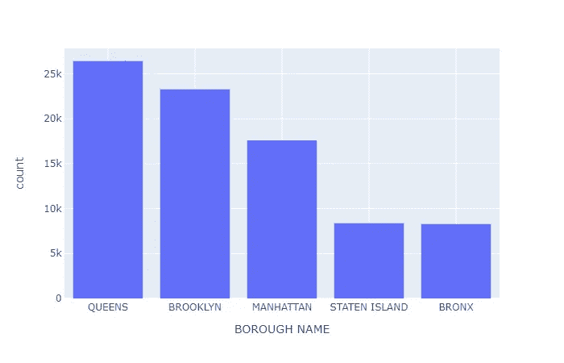
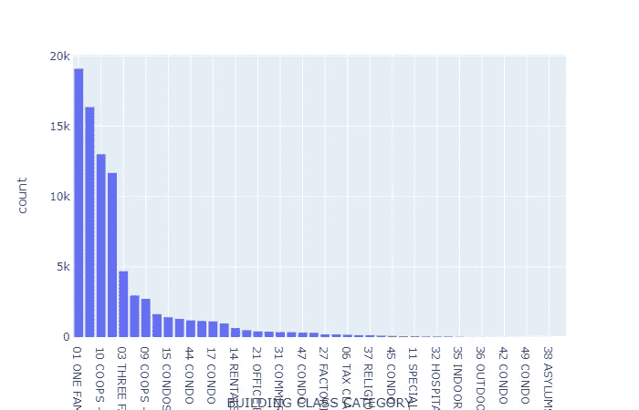
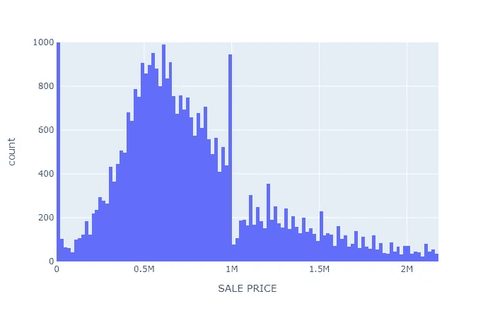
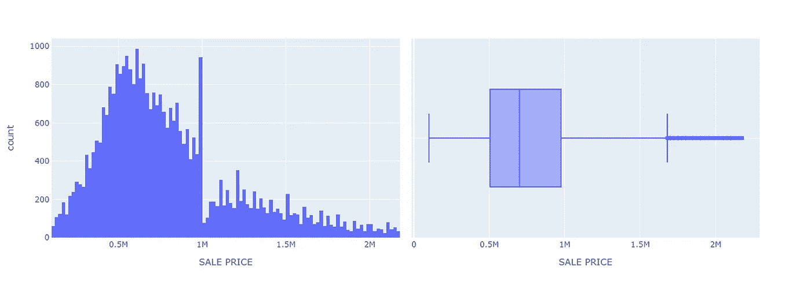
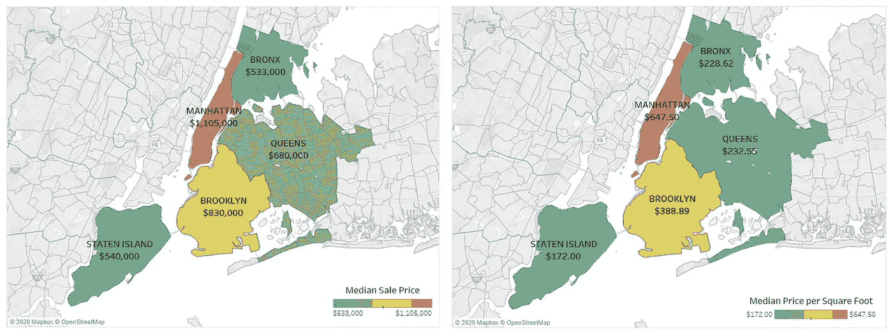
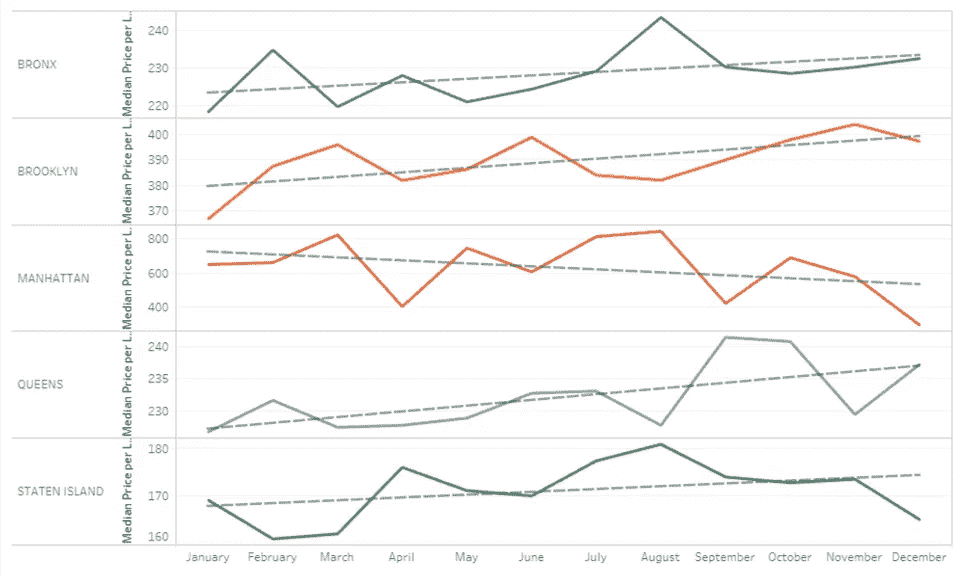
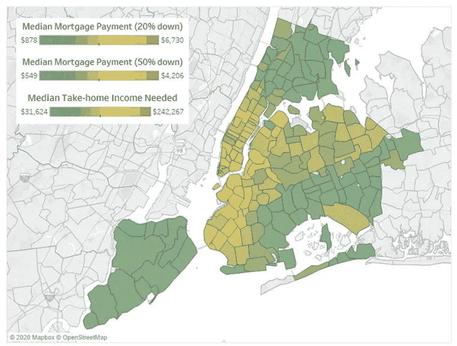

# 纽约房地产有多贵？

> 原文：<https://medium.datadriveninvestor.com/nyc-real-estate-where-can-you-afford-to-live-82932e1ddeb8?source=collection_archive---------15----------------------->


Photo by [Patrick Tomasso](https://unsplash.com/@impatrickt?utm_source=medium&utm_medium=referral) on [Unsplash](https://unsplash.com?utm_source=medium&utm_medium=referral)

## 2019 年纽约市房地产前景展望

纽约市因拥有世界上最昂贵的房地产而臭名昭著，因此经常被称为生活成本最高的城市之一。不管怎样，拥有一个家仍然是许多居民为之奋斗的“美国梦”的一部分，比如我自己。但正如我以前多次听说的那样，纽约的房地产价格一年比一年贵。作为一个纽约人，我能买得起房子吗？你会吗？普通纽约人能拥有住房吗？所以我看了一下去年纽约市出售的房产清单，想知道答案。

# 数据

2019 年纽约市房地产销售数据从[纽约市财政局](https://www1.nyc.gov/site/finance/taxes/property-annualized-sales-update.page)下载，作为每个区的 XLSX 文件。在 Python 中，使用 Pandas 导入、整理和清理文件。数据框被连接在一起以创建主数据集。该数据集中的每一行都代表一笔销售和与该房产相关的信息(如销售价格、房产大小和位置)。

```
import pandas as pd# 2019 NYC Property Sales Data for each borough
brooklyn = pd.read_excel('2019_brooklyn.xlsx',skiprows = 4)
bronx = pd.read_excel('2019_bronx.xlsx',skiprows = 4)
manhattan = pd.read_excel('2019_manhattan.xlsx',skiprows = 4)
queens = pd.read_excel('2019_queens.xlsx',skiprows = 4)
statenisland = pd.read_excel('2019_statenisland.xlsx',skiprows = 4)# Create column with borough name
brooklyn['BOROUGH NAME'] = 'BROOKLYN'
bronx['BOROUGH NAME'] = 'BRONX'
manhattan['BOROUGH NAME'] = 'MANHATTAN'
queens['BOROUGH NAME'] = 'QUEENS'
statenisland['BOROUGH NAME'] = 'STATEN ISLAND'# Concatenate each borough dataset
sales_2019 = pd.concat([brooklyn,bronx,manhattan,queens,statenisland])# Remove new line in column names
sales_2019.columns=sales_2019.columns.str.replace('\n','')# Zip code from float to string
sales_2019['ZIP CODE'] = sales_2019['ZIP CODE'].to_string()
```

# 所有属性

乍一看，我们看到 2019 年共有 83，920 辆销售。当细分到每个区时，皇后区的销量最高，为 26421 辆。与此同时，斯塔滕岛和布朗克斯销量最低，分别为 8371 辆和 8269 辆。布鲁克林和曼哈顿的销量分别为 23276 辆和 17583 辆。似乎皇后区和布鲁克林是最热门的居住地。



当我们根据建筑类别(物业类型)细分销售时，我们可以看到大多数销售是住宅类物业，这是意料之中的，因为大多数人购买物业的目的是居住。五种最常见的房产类型占 2019 年总销售额的 77%:一户住宅(19，081 套)、两户住宅(16，355 套)、电梯合作公寓(13，004 套)、电梯公寓(11，676 套)和三户住宅(4，690 套)。



如果你想知道，2019 年出售的最昂贵的房产是贾维茨中心区的一栋公寓办公楼，售价高达 21.55 亿美元！如果你不熟悉这个地区，这里是曼哈顿最新、最昂贵的开发区之一，名为 Hudson Yards，也是船只和大量高端商店的所在地。

# 住宅物业

查看整个数据很有趣，但对于普通纽约人来说，它并没有告诉我们任何实际的东西。纽约人需要一个住的地方。因此，在我们深入研究这些数据之前，我将数据精简为住宅物业。这被确定为至少有一个住宅单元的房产。

```
# Property sales with at least one residential unit
df_RU = df[df[‘RESIDENTIAL UNITS’]>0]
```

此外，我们可以相当肯定地说，普通纽约人不可能花几亿美元买下一整栋公寓楼。因此，我采取了额外的步骤，使用 1.5 倍四分位间距方法，根据销售价格去除异常值。

```
# Summary statistics for property sales with residential units
df_RU_stats = df_RU['SALE PRICE'].describe()# Calculate lower outlier bound with IQR
lower_outlier = df_RU_stats[4]-1.5*IQR# Calculate upper outlier bound with IQR
upper_outlier = df_RU_stats[6]+1.5*IQR# Trim data based on outlier bounds
df_RU_Xout = df_RU[df_RU['SALE PRICE']<=upper_outlier]
```

这给我们留下了以下 55，975 个住宅物业的分布，这突出了几个有趣的点。



## 零销售额

首先，第一次 bin 展中的大峰值显示 22，651 处房产以 0 美元到 20，000 美元的价格售出。这部分中，有 21331 个是以 0 美元(免费)的价格“卖出”的！在如此低的价格下，它们可能是捐赠、所有权转让和类似交易的结果，占所有住宅销售的近 40%。由于这些很可能没有以他们的估价出售，他们被排除在进一步的分析之外。

[](https://www.datadriveninvestor.com/2020/07/29/money-investing-during-the-coronavirus-pandemic/) [## 金钱:冠状病毒疫情期间的投资|数据驱动的投资者

### 在我将近 20 年的金融服务生涯中，我曾经负责监督整个…

www.datadriveninvestor.com](https://www.datadriveninvestor.com/2020/07/29/money-investing-during-the-coronavirus-pandemic/) 

## 豪宅税

其次，有 945 处房产的售价飙升至 100 万美元以下。我在谷歌上快速搜索了一下，了解到对超过 100 万美元的房产销售征收 1%的“豪宅税”。以低于 100 万美元的价格出售，卖家可以避免至少 10 万美元的税收！未来买家需要记住的一些事情。

## 最终住宅物业分配

在去除低于 100，000 美元的不切实际的低销售价格和其他异常值后，我们得到了下面的最终分布，我认为它更好地代表了住宅房地产市场。这些销售中有一半的价格在 50 万美元到 100 万美元之间，最高价格为 217.5 万美元(由我们的异常值范围设定)。



## 按行政区

那么，每个区的平均房价是多少？为了更直观地看这个，为了更好的地理可视化，我转到了 Tableau。



曼哈顿的平均房价(110.5 万美元)是最便宜的行政区布朗克斯(53.3 万美元)和斯塔滕岛(54 万美元)的两倍多。当我们按平方英尺标准化房地产价格时，曼哈顿土地的价值变得更加明显，几乎是斯塔滕岛的 4 倍(可以理解，这是因为它与纽约市的其他地方隔离)！布朗克斯和皇后区每平方英尺的价格差不多。

然而令人惊讶的是，当我们观察每个区的每月每平方英尺价格的趋势时，曼哈顿全年都有急剧下降的趋势。值得注意的是，布鲁克林的每平方英尺价格涨幅最大，其次是布朗克斯。由于曼哈顿的房价，买家可能会在其他区寻找更便宜的选择，从而慢慢推高这些价值。



# 普通的纽约人

因此，我们再次确认，在纽约拥有房产越来越贵，甚至一套普通住宅至少要 50 万美元。但是这对于普通纽约人来说意味着什么呢？他们买得起吗？他们住得起哪里？

美国人口普查局估计纽约家庭年收入中值大约为税前 60，000 美元。假设所得税为 25%，税后收入每年将剩下 45，000 美元，或每月 3，750 美元。

如果一个家庭想在斯塔滕岛或布朗克斯买一套略低于平均价格的房子，价格在 500，000 美元左右，那么他最有可能需要获得抵押贷款，并至少攒下 100，000 美元作为 20%的首付。如果他们获得 30 年期 4%的标准固定利率抵押贷款，他们每月的抵押贷款支付额将为 1910 美元(使用下面的公式)。这种规模的抵押贷款将需要他们每月超过一半的税后收入，这不是最经济的决定。

```
Monthly Payment = ([Mortgage]*([Interest Rate]/12)*(1+[Interest Rate]/12)^(12*30))/((1+[Interest Rate]/12)^(12*30)-1)
```

可视化跨邮政编码的抵押贷款支付中值，我们看到最昂贵的地区在曼哈顿和西布鲁克林，最昂贵的是曼哈顿下城。从地理上来说，很明显，离曼哈顿下城越远，越便宜。然而，更大的首付比例为 50%，购房者可以减少 37%的抵押贷款付款，让他们有更多的选择在更昂贵的地区购买。



最后，假设购房者只将税后收入的三分之一用于支付抵押贷款，他们将需要超过 10 万美元的税后收入(税前收入为 133，333 美元)才能负担得起曼哈顿下城和西布鲁克林的住房。

# 最后的想法

实际上，普通的纽约家庭负担不起在城里任何地方买房的费用。然而，如果潜在买家攒下超过 20%的首付款，那么每月的抵押贷款付款就变得更容易管理，在财务上也更可行。这最终为他们打开了更广阔的市场，包括靠近城市的更昂贵地区的房屋。但是，对于这样一个昂贵的城市来说，存下这笔巨款本身就是一场斗争。最后，另一个选择是住在离市中心更远的地方，或者租房而不是自己住。

希望你发现这个纽约市房地产分析有趣和有见地！如果你有兴趣查看我的代码，请查看我的 [GitHub](https://github.com/matchin/nyc_real_estate) ！

**访问专家视图—** [**订阅 DDI 英特尔**](https://datadriveninvestor.com/ddi-intel)