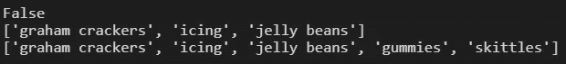
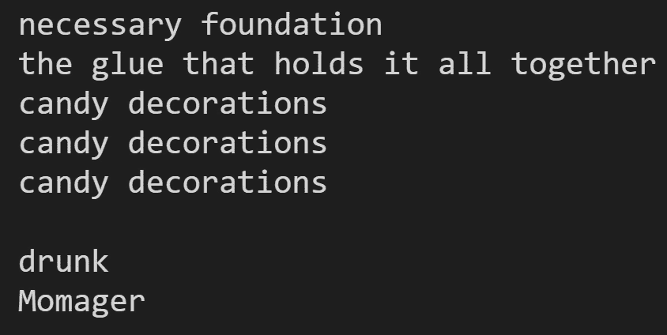

# 面向对象编程

> 原文：<https://medium.datadriveninvestor.com/object-oriented-programming-b36019497e4c?source=collection_archive---------43----------------------->

*姜饼类*

那是 2022 年 12 月 25 日。世界陷入了混乱。为了消除 2020 年的负面情绪，我知道我需要用一些有趣的东西来分散自己的注意力。我觉得把快乐带回我的生活，带回我母亲、祖母和哥哥的生活，是我的工作。我想，圣诞节我们能做什么新冠肺炎安全活动呢？像许多其他人一样，我们决定建造姜饼屋。值得注意的是，我们无法购买工具包，因为他们卖完了。相反，我们买了全麦饼干、糖霜、彩虹糖、软糖豆、咸饼干和其他一些糖果。从头开始构建要有趣得多。另外，这些工具很贵。此外，我那份“带来快乐”的工作并不能带来收入。

我决定把建造姜饼屋作为一项比赛，我的家人同意了。比赛的评委是我妈妈在脸书的朋友。根据我的姜饼屋收到的赞数，我认为她没有多少脸书朋友。还好我赢了！


brother, grandmother, me, mother

# 用 Python 建造姜饼屋

一个类通常被认为是蓝图。在这种情况下，我们将创建一个姜饼屋的蓝图。我们的第一步是定义类。

```
class Gingerbread_House:
```

接下来，我们将使用构造函数方法来构建一个类。__ **init__** :构造函数和 __init__ 构造函数是一个 **dunder 方法:**由 init 前后的双下划线表示

```
def __init__
```

声明构造函数后，我们添加 *self* 。Self 是 Gingerbread_House 类的一个实例。Gingerbread_House 是创建的对象。*自我*、n *姓名*、*清醒*、*内容*为参数。

```
def __init__(self, name, sober, contents): 
```

Name、sober 和 contents 是 init 方法中的局部变量。 *Self.name* 、 *self.sober* 、 *self.contents* 是姜饼屋类的属性。可以在类内部的任何地方调用属性。

```
self.name = name
self.sober = sober
self.contents = contents
```

Name 将接受一个字符串参数。清醒将接受一个布尔参数。内容将接受列表参数。

到目前为止，我们总共有:

# 类中的函数

类中的任何函数都是方法。自我永远是参数之一。

```
def is_sober(self):
   if self.sober:
     return 'drink more'
   else:
      return 'drunk'
```

Self 是 Gingerbread_House 的实例，并被传递给 is_sober 方法。 *Self.sober* 是属性。如前所述，属性可以存在于类中的任何地方。

```
def build(self):
   for i in self.contents:
      if i == 'graham crackers':
         print('necessary foundation')
      elif i == 'icing':
         print('the glue that holds it all together')
      elif i == 'jelly beans' or 'gummies' or 'skittles':
         print('candy decorations')def family(self):
   if self.name == 'Ana':
      return 'grandma'
   elif self.name == 'Bebe':
      return 'Momager'
   elif self.name = 'Marc':
      return 'brother'
   elif self.name == 'Raizel':
      return 'the sun ... everything revolves around her'
   else:
      return 'who are you'
```

又创造了两种方法。 *def build* 使用属性 self.contents 来显示姜饼屋的构建模块。 *def family* 使用属性 self.name 显示竞争对手的名称。

[](https://www.datadriveninvestor.com/2020/07/23/learn-data-science-in-a-flash/) [## 一瞬间学会数据科学！？数据驱动的投资者

### 在我之前的职业生涯中，我是一名训练有素的古典钢琴家。还记得那些声称你可以…

www.datadriveninvestor.com](https://www.datadriveninvestor.com/2020/07/23/learn-data-science-in-a-flash/) 

# 最后

# 在代码中应用姜饼屋类

person_(number)是分配给特定实例的变量。当调用不同的方法和/或属性时，person_(number)就变成等同于 self。每个人都被传递了一组由构造函数方法表示的参数。

```
print(person_2.sober)
print(person_4.contents)
print(person_5.contents)
```



如上所述，当每个属性被打印时，属性的组成被输出到控制台。

```
person_1.build()
print()
print(person_2.is_sober())
print(person_3.family())
```



当方法被调用时，它运行，结果被打印出来。

**进入专家视角—** [**订阅 DDI 英特尔**](https://datadriveninvestor.com/ddi-intel)