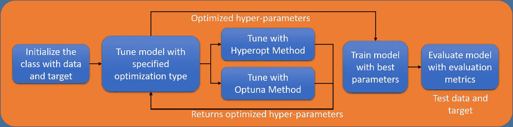

# 调整 ML 模型的面向对象程序设计

> 原文：<https://medium.datadriveninvestor.com/object-oriented-programming-to-tune-ml-model-2c6922f5077f?source=collection_archive---------2----------------------->

## 为不同的超参数调整技术创建 ML 类的示例


Photo on VectorStock.com/24059883

这篇文章是为新的和有抱负的数据科学家准备的，展示了使用 Python 中的面向对象编程来调优机器学习(ML)模型。因此，如果你是新手，并且越来越喜欢这个令人惊叹的领域，你应该已经意识到你的学习曲线中的某些里程碑，首先你会刷你的统计技能，然后学习像 numpy 和 pandas 这样的工具的可视化和数据转换，最后会创建和测试你的机器学习模型。下一步是熟悉面向对象编程(OOP ),并开始编写 Python 脚本。到本文结束时，您将对参数调优和创建 ML 模型的类对象有所了解。这篇文章分为两部分，所以你可以随意跳到你认为合适的部分(查看[笔记本](https://github.com/kshitijmamgain/Mlclass/blob/master/ML_class_demonstration.ipynb))。

1.  贝叶斯优化简介
2.  用于超参数调整的 ML 对象类

## 贝叶斯优化简介

不久前，超参数的选择被称为“艺术”，有些人会说它需要技巧来调整，而其他人会说它是基于直觉。此外，ML 算法越复杂，需要调整的超参数就越多。在这种情况下，一种选择是用每一种可能的调整组合(也称为网格搜索，也称为强力法)来调整模型。或者另一种方法是用试错法测试超参数，并随机选取参数集。后一种方法优于前一种方法，因为有更好的机会识别性能良好的参数。随机搜索和网格搜索都可以在 sklearn 库中使用，并带有交叉验证。

[](https://www.datadriveninvestor.com/2020/02/19/cognitive-computing-a-skill-set-widely-considered-to-be-the-most-vital-manifestation-of-artificial-intelligence/) [## 认知计算——一套被广泛认为是……

### 作为它的用户，我们已经习惯了科技。这些天几乎没有什么是司空见惯的…

www.datadriveninvestor.com](https://www.datadriveninvestor.com/2020/02/19/cognitive-computing-a-skill-set-widely-considered-to-be-the-most-vital-manifestation-of-artificial-intelligence/) 

幸运的是，有更好的方法来调整超参数，这比贝叶斯优化等随机搜索更有效，贝叶斯优化通过估计和更新描述目标函数潜在值的概率分布来获得最佳超参数值。简而言之，这意味着当算法为超参数的特定值找到一个好的结果时，它会加强对该值的搜索。我们将讨论使用这种方法的两个 python 库[**hyperpt**](http://hyperopt.github.io/hyperopt/)和 [**Optuna**](https://optuna.readthedocs.io/en/stable/index.html#) 。

Hyperopt 有优秀的[教程](https://github.com/hyperopt/hyperopt/wiki/FMin)，我们将在 LightGBM 模型上演示它的使用。梯度提升树算法是构建监督学习模型的常用算法，LightGBM 是其中的一种。我们将在 sklearn 中使用乳腺癌数据集

```
# importing the essential libraries
import numpy as np
import pandas as pd
import lightgbm as lgb
from sklearn.model_selection import train_test_split
from sklearn.metrics import f1_score, confusion_matrix, classification_report# importing the dataset
from sklearn.datasets import load_breast_cancer
# importing the hyperopt methods
from hyperopt import fmin, hp, tpe, Trials, STATUS_OKdataset = load_breast_cancer()X = dataset.data
y = dataset.targetX_train, X_test, y_train, y_test = train_test_split(X, y, train_size = 2/3, random_state = 1)
```

从 Hypeopt 库中调用了四个方法— *fmin、hp、tpe 和 STATUS_OK。*第一种， **fmin** 是最小化目标函数损失的方法。如果我们希望我们的模型以更高的精度运行，那么我们希望最小化的是(1-精度)。同样，如果我们希望最小化 f1 得分，我们将最小化的损失是(1-f1 得分),如下所示:

```
#lgb model takes param as dict
param = {'objective': 'binary', 'learning_rate': 0.5,'reg_alpha': 0.5, 'reg_lambda': 0.5}
model = lgb.train(params, lgb.Dataset(X_train, label = y_train))
# lgb mode.predict gives predict probabilities
pred=h_model.predict(X_test)
# defining predicted label based on 0.5 threshold
y_pred = np.where(pred>0.5,1,0)# claculating the f1 score
f1sc = f1_score(y_test, y_pred
>>0.9561752988047808
loss = 1-f1sc
>>0.0438247011952192‬
```

在上述代码中，超点 fmin 方法可用于优化损失，即有助于提高 f1 得分。为了创建这样的函数，我们希望它采用不同的超参数作为输入，并在 F1score 中测试改进。因此，我们可以做到以下几点:

```
def objective(params):# an objective function
  h_model = lgb.train(params, lgb.Dataset(X_train, label = y_train))
  pred=h_model.predict(X_test)
  y_pred = np.where(pred>0.5,1,0)
  f1sc = f1_score(y_test, y_pred)
  loss = 1 — f1sc
  return {‘loss’: loss, , 'status' : STATUS_OK}
```

这个目标函数将在任何被定义为损失的基础上被优化。接下来，我们需要一个参数空间，从中选择超参数的值。这样的搜索空间由 **hp:** 定义

```
# quniform: quantile uniform distribution (discrete); 
space = {
         ‘lambda_l1’: hp.uniform(‘lambda_l1’, 0.0, 1.0),
         ‘lambda_l2’: hp.uniform(“lambda_l2”, 0.0, 1.0),
         ‘learning_rate’ : hp.loguniform(‘learning_rate’,                                                                                                      np.log(0.05), np.log(0.25)),
         ‘objective’ : ‘binary’}
trials = Trials()
```

**tpe** 方法具有从上面定义的空间进行搜索的算法，并且**试验**方法创建数据库以记录试验。最后是 **STATUS_OK** ，它是目标函数强制返回的，用于存储运行的成功。fmin 方法将存储从超参数空间中选择的最佳结果参数。

```
best = fmin(fn=objective, space=space, algo=tpe.suggest, max_evals=1000)
best
output> {'lambda_l1': 0.0021950856879321273,  'lambda_l2': 0.004537789645112988,  'learning_rate': 0.10215913897624063,  'num_leaves': 176.0}
```

请注意，当调用 fmin 方法时，我们还必须指定最大评估次数或空间搜索次数，以预测最佳参数。

Optuna 库也使用贝叶斯优化来优化超参数。首先，我们在单个函数中定义了目标函数和超参数空间。第二，与远视不同，远视只“最小化”Optuna 中的目标函数，如果我们希望最大化或最小化目标，我们可以定义它。

```
import optunadef optuna_obj(trial):
  '''Defining the parameters space inside the function for optuna optimization''' params = {‘num_leaves’: trial.suggest_int(‘num_leaves’, 16, 196, 4),
  ‘lambda_l1’: trial.suggest_loguniform(‘lambda_l1’, 1e-8, 10.0),
  ‘lambda_l2’: trial.suggest_loguniform(“lambda_l2”, 1e-8, 10.0),
  ‘learning_rate’ : trial.suggest_loguniform(‘learning_rate’, 0.05, 0.25)} o_model = lgb.train(params, lgbo.Dataset(X_train, label = y_train))pred=o_model.predict(X_test)
  y_pred = np.where(pred>0.5,1,0)
  f1sc = f1_score(y_test, y_pred)
  loss = 1 — f1sc
  return lossstudy = optuna.create_study(direction=’minimize’)
study.optimize(optuna_obj, n_trials=2000)
```

请注意，我们使用“最小化”作为方向，因为我们想要一个类似于 Hyperopt 的输出。我们也可以在 Optuna 中返回方向为“最大”的 f1 分数。优化的超参数存储在研究的 best_params 属性中。

```
study.best_params
>> {'lambda_l1': 9.81991399439663e-07,  'lambda_l2': 4.23211064923651,  'learning_rate': 0.1646975912311242,  'num_leaves': 64}
```

我们应该观察到我们的初始参数和来自远视和 Optuna 的最佳参数都是不同的。虽然手动定义的参数不同是可以理解的，但是 Optuna 和 Hyperopt 最佳参数不同的原因可能在于最大评估和内部算法的优化方法。新参数确实提高了 f1 的分数

## 用于超参数调整的 ML 对象类

本节的重点是演示如何创建一个分类器类。有大量关于 OOP 编程的资源，但是完整类的演示是有限的。我们将使用上面的例子来创建一个类。在构建一个类时，可视化你的类的结构是很重要的，这里我们将创建一个简单的流程，如下图所示。



Structure of defined ML class

上述类的整体结构如下所示:

```
class Mlclass():
  def __init__(self,...):
    ...
  def tuning(self, ...):
    ...
  def hyperopt_method(self):
    ...
  def optuna_method(self):
    ...
  def train(self):
    ...
  def evaluate(self):
    ...
```

这个基本结构将使我们很好地理解不同类型的类方法，有一些方法如 tuning、train 和 evaluate 将由用户调用，而其他方法如 hyperopt 和 optuna 将在类中使用，而不需要用户调用它们。

```
class MLclass():
  '''Parameter Tuning Class tunes the LightGBM model with different   optimization techniques - Hyperopt, Optuna.''' def __init__(self, x_train, y_train):
    '''Initializes the Parameter tuning class and also initializes   LightGBM dataset object
    Parameters
    ----------
    x_train: data (string, numpy array, pandas DataFrame,or list of numpy arrays) – Data source of Dataset. y_train: label (list, numpy 1-D array, pandas Series / one-column DataFrame or None – Label of the data.''' self.x_train = x_train
    self.y_train = y_train
    self.train_set = lgb.Dataset(data=train_X, label=train_y)
```

ML 类方法首先用训练数据集和目标初始化。从 *class 开始定义一个类。*类内部定义的函数被称为*方法*。我们的第一个方法是 *__init__* ，用于初始化类。这里，我们希望用数据集和目标来初始化我们的类，因此我们将输入参数指定为“x_train”和“y_train”。方法中的 *self* 用于将函数与实例关联起来。使用“自我”作为变量的前缀也使得类变量特定于该实例。调用这个类非常简单:

```
#defining a unique class object
obj = MLclass(X_train, y_train)
```

一旦初始化了类方法，我们将添加用于 Hypeorpt 优化的方法。我们希望用户输入优化类型作为 Hypeorpt，然后调整模型。

```
def tuning(self, optim_type):
  '''Method takes the optimization type and tunes the model'''
  #call the optim_type: Hyperopt or Optuna
  optimization = getattr(self, optim_type)
  return optimization()def hyperopt_method(self):
  # This method is called by tuning when user inputs   'hyperopt_method' while calling the tuning method
  #define the hyperopt space
  space = {'lambda_l1': hp.uniform('lambda_l1', 0.0, 1.0),
  'lambda_l2': hp.uniform("lambda_l2", 0.0, 1.0),
  'learning_rate' : hp.loguniform('learning_rate',
np.log(0.05), np.log(0.25)),
  'objective' : 'binary'} # define algorithm and trials inside the class
  algo, trials= tpe.suggest, Trials() #Call the fmin from inside the class
    best=fmin(fn=objective,space=space,algo=algo,trials=trials,max_evals=1000)
  self.params = best
  return best, trialsdef objective(self, params):
  # same objective function with added self
  h_model = lgb.train(params, lgb.Dataset(X_train, label = y_train))
  pred=h_model.predict(X_test)
  y_pred = np.array(list(map(lambda x: int(x), pred>0.5)))
  f1sc = f1_score(y_test, y_pred)
  loss = 1 - f1sc
  return {'loss': loss,'status' : STATUS_OK}#call the tuner method
obj.tuning('hyperopt_method')return optimization()def hyperopt_method(self):# This method is called by tuning when user inputs 'hyperopt_method' while calling the tuning method#define the hyperopt spacespace = {'lambda_l1': hp.uniform('lambda_l1', 0.0, 1.0),'lambda_l2': hp.uniform("lambda_l2", 0.0, 1.0),'learning_rate' : hp.loguniform('learning_rate',np.log(0.05), np.log(0.25)),'objective' : 'binary'}# define algorithm and trials inside the classalgo, trials= tpe.suggest, Trials()#Call the fmin from inside the classbest = fmin(fn=objective,space=space,algo=algo,trials=trials,max_evals=1000)self.params = bestreturn best, trialsdef objective(self, params):# same objective function with added selfh_model = lgb.train(params, lgb.Dataset(X_train, label = y_train))pred=h_model.predict(X_test)y_pred = np.array(list(map(lambda x: int(x), pred>0.5)))f1sc = f1_score(y_test, y_pred)loss = 1 - f1screturn {'loss': loss,'status' : STATUS_OK}#call the tuner method
obj.tuning('hyperopt_method')
```

当在上面的代码中调用调优方法时，将执行超点优化。让我们为 Optuna 定义一个类似的方法

```
def optuna_method(self):
  study = optuna.create_study(direction=’minimize’)
  study.optimize(optuna_obj, n_trials=2000)
  self.params = study.best_params
  return studydef optuna_obj(self, trial):
  '''Same optuna objective with parameters space inside the function for optuna optimization''' params = {‘num_leaves’: trial.suggest_int(‘num_leaves’, 16, 196, 4),
  ‘lambda_l1’: trial.suggest_loguniform(‘lambda_l1’, 1e-8, 10.0),
  ‘lambda_l2’: trial.suggest_loguniform(“lambda_l2”, 1e-8, 10.0),
  ‘learning_rate’ : trial.suggest_loguniform(‘learning_rate’, 0.05, 0.25)} o_model = lgb.train(params, lgbo.Dataset(X_train, label = y_train)) pred=o_model.predict(X_test)
  y_pred = np.array(list(map(lambda x: int(x), pred>0.5)))
  f1sc = f1_score(y_test, y_pred)
  loss = 1 — f1sc
  return loss#calling tuner with optuna
obj.tuning('optuna_method')
```

为了使用最佳参数进行评估，我们定义了另一个变量 self。 *params* 将为该实例定义，并可由尚未定义的训练方法访问。

```
def train(self):
  """This function evaluates the model on best parameters"""
print("Model will be trained on the following parameters: \n{}".format(self.params)) #train the model with best parameters
  self.gbm = lgb.train(self.params, self.train_set)obj.train()
>> Model will be trained on the following parameters: 
>>{'lambda_l1': 9.81991399439663e-07,  'lambda_l2': 4.23211064923651,  'learning_rate': 0.1646975912311242,  'num_leaves': 64}
```

一旦模型被训练，我们可以通过给定测试数据集和测试目标作为参数来评估它。

```
def evaluate(self, x_test, y_test):
  # predict the values from x_test
  pred = self.gbm.predict(x_test)
  y_pred = np.where(pred>0.5,1,0)
  #print confusion matrix
  print(confusion_matrix(y_test,y_pred)
  #print classification report
  print(classification_report(y_test, y_pred)
```

通过这种方式，我们展示了如何创建一个 ML 类及其不同的方法。我们应该理解，创建一个 ML 模型是一个迭代的过程，包括用特征工程训练模型、数据预处理和用不同算法测试。创建类函数有助于更快地调试代码，节省重写代码的时间，并且只需稍加修改就可以再次运行它们。

希望这篇文章对你有用。