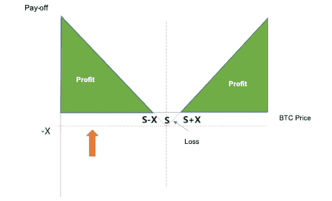
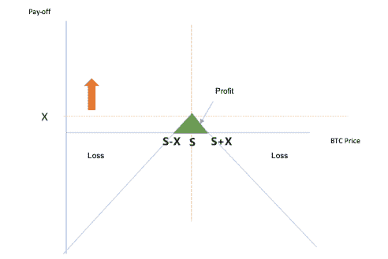
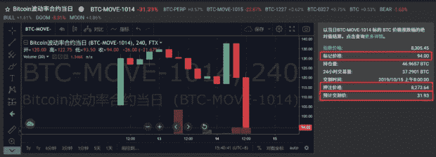
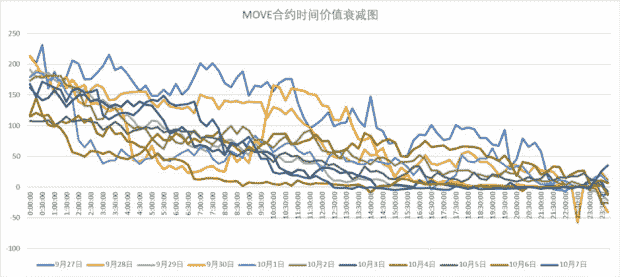
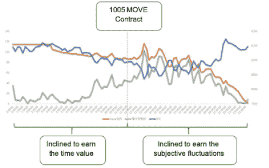

# 对代币衍生产品的观察| FTX 双重期权分析—移动合同，第一部分

> 原文：<https://medium.datadriveninvestor.com/observations-on-token-derivatives-analysis-of-ftxs-double-options-move-contract-part-1-d8a43fa901a7?source=collection_archive---------4----------------------->

## 在第 1 部分中，我们介绍了 FTX 的移动合同，以及如何使用移动合同。

投资和研究机构 X-Order 的金融分析师 Alan Zhang 撰文，该机构致力于研究开放金融中的价值捕捉。我们努力成为新金融和与科学和研究相关的跨学科领域之间的桥梁。 *由托尼·陶(Tony Tao)创立，他也是 NGC 风险投资公司的合伙人。*

衍生品已经成为[加密货币](https://www.datadriveninvestor.com/glossary/cryptocurrency/)交易中的一个竞争领域。无论是传统的复杂衍生品，如期权，还是加密货币行业独特的创新衍生品，如杠杆代币，对大多数用户来说都是相对陌生的。

自然有巨大的机会。

> *对于* [*交易所*](https://www.datadriveninvestor.com/glossary/exchange/) *的机会在于流动性，而对于用户的机会则来自于前期流动性不足带来的定价问题以及对规则理解的一些漏洞。*

说到衍生产品的创新，FTX 在中国国庆节前发布了移动合同。这是一种允许用户押注波动性的投资形式，无论用户是做多还是做空[比特币](https://www.datadriveninvestor.com/glossary/bitcoin/)，都会产生利润。

本着所有衍生品都有其应用场景的原则，本文详细解释了该合约的**使用方式，以及作为交易工具的适用范围。**

# 1.移动的基本介绍

移动合同是 FTX 创造的**双期权合同。用于押注一种加密货币(目前为比特币)在一天内(北京时间早上 8 点开始)价格波动的绝对值。举个例子，如果比特币昨天的价格是 8000，今天的交割价格变成了 8200。然后不管价格波动有多大，最后发货价格都是 200 元。**

**买方**是**做多波动**的一方。如果买家当天以低于 200 元的价格购买，他/她在交货时获得利润。**卖方**是**做空波动**的一方。如果卖家当天以高于 200 元的价格出售，他/她在交货时获得利润。

CoinTelegraph.com

## 双方损益表

假设前一天比特币的基准价为 S，现价为 P，比特币交割价为 St，当前 MOVE 合约价为 X，预期交割价为|P-S|，最终交割价为|St-S|。

**买方损益说明**

> 买方的成本是 X，
> 
> 收盘收益为| St-S |。
> 
> 最终收益是| St-S | — X。
> 
> 因此，
> 
> 当 St < S-S, or St > S + X 时，买方的利润为正。
> 
> 当 S-X < St < S + X, the buyer’s income is negative
> 
> The maximum loss is — X, with limited cost and unlimited income.
> 
> Since S has been determined, the smaller X gets, the more benefits the buyer obtains.

**卖家的损益图解**

> 与买方相反，卖方获得 X — | St-S|的净收入。
> 
> 当最终交割价格 St 介于 S — X 和 S + X 之间，即 S — X < St < S + X, the seller’s income is positive.
> 
> On the contrary, when St < S — X, or St > S + X 时，卖方将出现净亏损。
> 
> 卖方的最大利润是 X，利润有限，亏损无限。由于 S 是固定的，X 越高，对卖方越有利。

为了更直接地看到它，下面显示了**实际交易界面**的样子:

**标示价格**简单理解为当前的移动价格，**下注价格**是以今日波动率的绝对值衡量的基准价。**预期交割价格**是指数价格减去下注价格的绝对值。

作为补充，还有一些其他规则:

1.  **起拍价和交割价由前一小时的加权平均价格决定。这是为了避免基础资产价格剧烈波动的影响。**
2.  **搬家买家的利润与期货类似:**买卖搬家合约都需要保证金，保证金要求与 BTC 期货合约大致相同。

也就是说，虽然 MOVE 合约只有 100 美元，但买家需要支付相当于 1 个比特币的保证金。假设 BTC 价值 8500 美元，即使它可以应用 10 倍的杠杆，它仍然需要 850 美元的保证金来购买一个移动合同。

> ***如果没有时间价值，其收益与期货基本相同。***

**买入举动没有充分发挥买入期权的高回报赔率特性。这应该与 FTX 创造 MOVE 的原理有关。**

3.同时会有**两份移动合同**，一份是当天的，另一份是第二天的(即北京时间上午 8 点)。

4.**管理费更贵**:它的管理费和开期货产生的费用差不多，比如 100 美元的移动合约，同样需要 8500 * 0.07% = 5.95 美元。

*查看以下* [*网站*](https://help.ftx.com/hc/zh-cn/articles/360033349672-%E5%8F%8C%E5%90%91%E6%9C%9F%E6%9D%83%E5%90%88%E7%BA%A6%20(MOVE%20%E5%90%88%E7%BA%A6)) *了解更多详细信息。*

# 2.如何使用移动合同？

## **2.1 它与伽马&有关，与织女星**无关

与普通期权不同，移动合约只押注 BTC 价格一天的变化，因此价格很难反映波动性。

因此，相对而言，期权中的**各种希腊字母对移动合同的影响是有限的；主要矛盾是绝对波动率的变化。**

## **2.2 时间价值的概念**

在传统期权中，时间价值是期权金减去期权内在价值后的剩余价值。时间越接近到期，时间价值越小，反之亦然。在 MOVE 中，由于只有一天的周期，时间价值可以理解为(实际价格—预期交货价格)，时间价值逐渐递减。

例如，某一天上午 8:00 的移动价格为 200。由于上午 8:00 是起始时间，预期交货价格为 0，因此移动价格和预期交货价格之间存在 200 元的价格差异。假设 BTC 价格变化不大，**移动价格将逐渐下降到接近预期交货价格。**

The Decay of Time Value Graph of the MOVE Contract

*(图例从左至右:9 月 27 日至 10 月 7 日)*

上图显示了从 9 月 27 日到 10 月 7 日 MOVE 的时间价值的下降。

> *可以看出，时间值是随时间递减的。*

MOVE 合约刚推出的时候，BTC 的波动比较大；这些合约的开盘价也很高(一般超过 200)，时间价值衰减较慢(时间价值往往呈线性下降趋势)。随着 BTC 波动的下降和用户对 MOVE 合约理解的加深，合约的开盘价走了一段低迷期(一般在 150 以下)，时间价值在半天内趋于下降几乎为零。

## **2.3 卖家如何操作？**

**A)利润来源**

卖方有两个利润来源，**一个是收集时间价值，另一个是绝对波动率的回报。**

对于时间值，“X — | S — P |”越大，时间值越高。

> *这里卖家的目标是消耗时间价值。*

当时间价值较低时，做空实际上是押注期货将反向波动。

以 10 月 5 日的搬迁合同为例，相关价格变动如下:

**B)什么时候做卖家？**

对于想要赚取时间价值的**用户来说，“X-S”越高，作为卖家的潜在利润越高，BTC 的价格波动敏感度越低(delta 越低)，安全缓冲越高。因此，这是一个很好的时间为卖方当天移动合同开放和第二天当它是高的。**

对于**赚取波动率回调**的用户来说，与期货反弹或从高价做空的主观时机没有实质性区别。但是，应该注意的是，此时，移动合同的价格也必须处于高位。

**C)卖方如何管理风险？**

对于希望赚取时间价值的**用户来说，由于**最佳做空时机是在**开盘时，最有利的情况是预期交割价格保持低位，合约价格 X 趋近于 0。但是，**随着 X 趋近于 0，时间值衰减，自身风险增大。****

> *因此，作为卖方，不仅要考虑时间价值和风险积累的平衡，还要考虑波动率绝对值快速上升时的风险。*

# 下一步是什么？

在第 2 部分中，我们继续讨论如何通过理解买方如何操作来使用移动合同。此外，我们还讨论了该策略的实际效果，在得出结论之前，我们讨论了 MOVE 的一些问题以及对潜在改进的思考。

Alan Zhang 是一名投资者和市场观察者，他在决策中充分利用了数据技术。他熟悉中国不同的金融市场，包括股票、期货和加密货币市场。此外，他从 2014 年开始参与建立类似红茶的另类投资市场，并在 2015 年负责黄山旅游股份(600054.sh)的私募。

*原载于 2020 年 1 月 31 日 https://www.datadriveninvestor.com**的* [*。*](https://www.datadriveninvestor.com/2020/01/31/observations-on-token-derivatives-part-one/)

## 在 Linkedin 上与我们联系！

**翻译**(通过我们的微信账号):心悦

**编辑:**谭瑞香