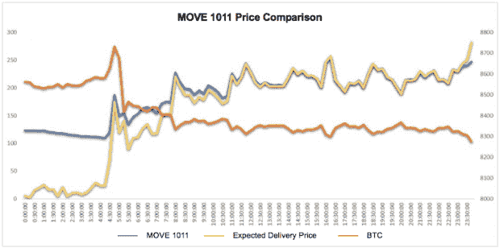
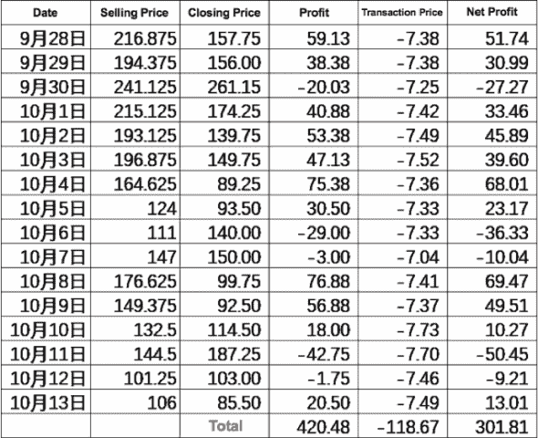
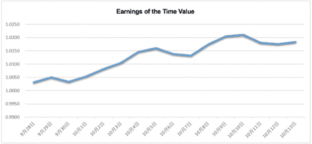
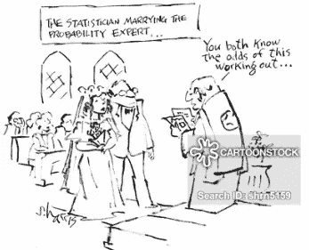

# 对代币衍生产品的观察| FTX 双重期权分析—移动合同(下)

> 原文：<https://medium.datadriveninvestor.com/observations-on-token-derivatives-analysis-of-ftxs-double-options-move-contract-part-2-edca39ea7d7a?source=collection_archive---------7----------------------->

## 在第 2 部分中，我们继续讨论如何通过理解买方如何操作来使用移动合同。此外，我们还讨论了该策略的实际效果，在得出结论之前，我们讨论了 MOVE 的一些问题以及对潜在改进的思考。

投资和研究机构 X-Order 的金融分析师 Alan Zhang 撰文，该机构致力于研究开放金融中的价值捕捉。我们努力成为新金融和与科学和研究相关的跨学科领域之间的桥梁。 *由托尼·陶(Tony Tao)创立，他也是 NGC 风险投资公司的合伙人。*

在这里阅读 [**Part 1**](https://medium.com/datadriveninvestor/observations-on-token-derivatives-analysis-of-ftxs-double-options-move-contract-part-1-d8a43fa901a7) 。

# 2.如何使用移动合同？[续]

## 2.4 采购员如何操作？

**A)利润来源**

买方的利润主要来自**波动率绝对值的增加**。所以前提是要有低时间值。当预期交割价格与实际价格相同时，delta 接近于 1，移动合约的价格波动与 BTC 基本相同。

但考虑到保证金，渴望之举无法拥有和“末日”选项一样的高赔率，而且**不适合风险偏好较高的用户。**

**B)何时成为买家？**

无论如何，X 越小，做买家越安全。

BTC 大幅波动时，运行价格基本上与 BTC 同步。但是当期货在追高，价格暴跌的时候，就会招致很大的损失。而如果我们做多，在价格下跌到一定程度的情况下，我们可以减少损失，甚至赚钱。

 [## 总部位于瑞士的 ETP 进入加密交易市场

### 虽然金融市场几乎没有沉闷的时刻，特别是在引入…

www.datadriveninvestor.com](https://www.datadriveninvestor.com/2019/03/10/swiss-based-etp-enters-the-crypto-trading-market/) 

例如，下图比较了 10 月 11 日的 BTC 价格、MOVE 1011 价格和 BTC 价格减去当天的基准价格(即预期交货价格)。

BTC 升至 8800 点上方的峰值，然后暴跌至 8300 点以下。

与此同时，当一个已经在比特币 8800 的位置追上[比特币](https://www.datadriveninvestor.com/glossary/bitcoin/)期货，MOVE1011 合约；在期货方面，他最终损失了大约 500 美元。

而在 MOVE 合约上，8800 元对应的价格是 194。虽然比特币的价格从 194 降到了 134，但是 MOVE1011 的基准价格是 8556。因此，当 BTC 价格跌破 8450 时，移动合约的预期交割价格已经达到 100。再加上一个时间值，**得到了支持。**

随着 BTC 价格的持续下跌，绝对波动率值进一步扩大，在 BTC8800 最高点买入的 MOVE 合约可以 247 元交割，一天下来获利 54 美元。

> ***与追高期货损失 500 美元相比，可以看出，在极端市场条件下，移合约是更好的替代方案。***

# **3。战略的实际结果**

卖家的简单时间价值策略

**策略:**开盘价卖出，时间值小于 50 时平仓

假设每笔交易的管理费为 0.09%，价格接受者和制定者各一人，不考虑套期保值成本。

时间:9 月 28 日至 10 月 13 日。

## **3.1 回测结果**

假设投资 1 万美元，同时考虑不使用保证金的资金使用效率，16 个交易日累计净利润 183 美元，年化收益率 41.2%。

***风险提示:*** *这只是基于历史数据，并不代表以后可以维护。样本量也太小，不能完全揭示卖家的风险。此外，不考虑资本容量和其他因素。*

# **4。MOVE 的一些问题和潜在改进的想法**

## **4.1 买方付款几率不足**

也许是出于对产品或风险控制的考虑，因此与传统期权的购买者不同，移动合约不具有高赔率的特点。

CartoonStock

## **4.2 难以匹配买方和卖方的要求**

由于没有高赔率，**无法吸引“风险偏好”强烈的用户。在每天开始的时间价值高的交易时段，很难吸引买盘。在低时间价值阶段，买卖双方的收益曲线更类似于期货，对买方更有利。所以这段时间对卖家的吸引力较小。**

在搬家合同中很难匹配双方的需求。其实交易量也不大。

从这两点来看，FTX 的 MOVE 合约需要在机制上进一步完善，引入风险偏好更高的**用户**作为买卖双方的撮合粘合剂。如何**同时匹配买卖双方不同的交易需求**也是**未来衍生品创新设计需要考虑的重要部分。**

# **5。结论**

相信未来 [token](https://www.datadriveninvestor.com/glossary/token/) 衍生品的创新会层出不穷，盈利方式也会越来越复杂。传统的一方下注的方式，会让投机者越来越难和专业的投资机构坐在一起。

所以，在代币衍生品方兴未艾，还有很大试错空间的时候，就要抓紧进行研究。

CoinTelegraph

***免责声明*** *:期货、远期* [*交易所*](https://www.datadriveninvestor.com/glossary/exchange/) *差价协议、期权、合约(场外交易)是高风险的杠杆产品，可能导致您本金投资的损失。因此，它可能不适合每个人。请确认您完全了解这些产品交易所涉及的风险，并且不投入超出您损失承受能力的资金。*

# 下一步是什么？

请继续关注我们对仙女座菌株的采访记录！

Alan Zhang 是一名投资者和市场观察者，他在决策中充分利用了数据技术。他熟悉中国不同的金融市场，包括股票、期货和加密货币市场。此外，他从 2014 年开始参与建立类似红茶的另类投资市场，并在 2015 年负责黄山旅游股份(600054.sh)的私募。

*原载于 2020 年 2 月 5 日 https://www.datadriveninvestor.com***。**

## *在 [Linkedin](http://linkedin.com/company/xorderglobal) 上与我们联系！*

***翻译**(通过我们的微信账号):心悦*

***编辑:**谭瑞香*