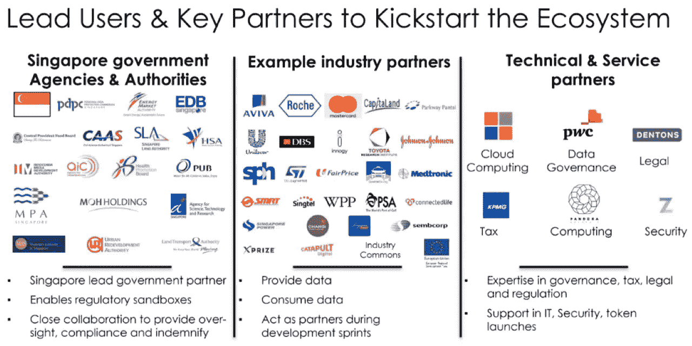

# 海洋协议将如何改变世界数据经济

> 原文：<https://medium.datadriveninvestor.com/ocean-protocol-will-change-the-data-economy-blockchain-review-d48a3988296b?source=collection_archive---------3----------------------->

## 对 Ocean Protocol 的区块链技术进行全面详细的分析，将为企业和个人解锁数据。

*“电梯停在大楼的最高一层。走到办公室门口时，他无意中听到了他们的讨论:“……这就是我们如何主宰全球数据市场，同时让用户误以为我们的服务是免费的。一位优雅的金发助理拿走了文件夹，同时在桌子上放了一杯水。脸书谷歌的高管们正在密谋统治世界。电话铃响了，一名美国国家安全局的高级雇员命令打开系统后门，随意分享用于大规模监控的客户数据，没什么特别的，只是普通的程序。”*

[**海洋协议**](https://oceanprotocol.com/) 是一家总部位于区块链的组织，旨在以安全和保密的方式分散和民主化地共享全球数据。它是由一个开发人员和人工智能科学家团队在 2017 年创建的，从那时起，他们一直在努力实现他们的愿景:*释放世界上未使用的私人数据，同时将经济利益分配给每个人，而不是只给少数精英公司。*

Ocean 与汽车和医疗保健等各种行业有着密切的联系，它将使大企业和个人开发者能够创建*数据市场*和其他应用，以便*货币化和共享他们的数据*。这将极大地推动人工智能的发展，并将以公平透明的方式启动数据经济。

## 我个人的想法

我已经跟踪这个项目一年多了。我能说的就是这个团队是道德的，诚实的，信守诺言的。他们总是按时交货，并投入大量的工作。他们有德国人的思维定势*“承诺不足，兑现过度”*。这项技术已被证明是伟大的，并得到了各国政府、多家市值 1000 亿美元的国际公司和全球其他组织的认可。

虽然大数据集中在少数科技企业手中，但 Ocean Protocol 为普通用户提供了投资并受益于数据共享未来的机会。开发人员将第一次有机会访问大量以前无法获得的数据集。他们将能够参与生态系统并分享他们的想法，同时也有机会让他们的想法得到[资助](https://oceanprotocol.com/fund)。

 [## 后疫情经济中的基本 GTM 变革策略|数据驱动的投资者

### 新冠肺炎以一种新的不可想象的方式开展业务。这个疫情甚至强迫…

www.datadriveninvestor.com](https://www.datadriveninvestor.com/2020/08/11/an-essential-gtm-change-strategies-in-the-post-pandemic-economy/) 

海洋社区由密码爱好者、人工智能/数据开发人员、企业和其他实体(如非营利组织)组成。随着向 V4 和 2020 年末)的过渡，一切都将以分散的方式运行，因为社区资金将通过 DAO 提供，体现了数字和统一民主的加密愿景。

接下来是一篇很大的文章，但是我强烈建议你阅读所有内容，这样你就不会错过这个伟大项目的任何部分。

“人工智能正呈指数级增长。限制因素是数据。数据不共享，因为大部分数据是私人的，在大公司的小仓库里。这些大公司害怕共享数据，因为当前的集中式解决方案迫使他们放弃控制和隐私，并且没有提供足够的透明度。”

对于 [$OCEAN](https://coinmarketcap.com/currencies/ocean-protocol/) token 市场来说，突破性的时刻(以及为其带来更广泛认可的时刻)是 Ocean Protocol 与戴姆勒(梅赛德斯-奔驰母公司)之间的[合作伙伴关系的宣布。PoC 公开后，整个技术世界都在谈论它。通过在 LinkedIn 上进行简单的搜索，人们可以看到无数世界知名公司的高级员工和高管称赞海洋协议的技术。从 Accenture & IBM 到 Oracle & Deloitte，每个人都在谈论这种新的基于区块链的、支持隐私的数据共享解决方案，它将解锁世界的数据。](https://www.coindesk.com/mercedes-maker-daimler-tests-blockchain-for-supply-chain-data-sharing)

“Ocean Protocol 的创始人 Bruce Pon 曾在戴姆勒的 IT 部门工作了五年，他说*这样规模的公司一年可以花费大约 3 亿美元*仅仅是为了协调软件、安全措施和各种类型的管理—透明的数据共享和协调方法可以大幅削减这些成本。”

> “我们已经证明内部和外部数据共享是可行的，”庞在接受 CoinDesk 采访时说。“戴姆勒的 IT 部门可以处理它，业务部门也需要它。区块链可以把公司的 IT 系统从成本中心变成利润中心。”

 [## 梅赛德斯制造商戴姆勒测试供应链数据共享的区块链

### 总部位于区块链的数据共享平台 Ocean Protocol 已经与戴姆勒完成了概念验证(PoC ),显示…

www.coindesk.com](https://www.coindesk.com/mercedes-maker-daimler-tests-blockchain-for-supply-chain-data-sharing) 

2020 年对 Ocean 来说是爆炸性的一年，因为团队接近完成其[路线图](https://oceanprotocol.com/technology/roadmap)，并以稳定的方式不断推进更新。

> “*的技术*本身必须改变。它必须默认数据保护的理想，在保留隐私权的同时实现数据民主化。”——Trent McConaghy，海洋议定书创始人

**社会依靠数据运行，但大部分数据被少数几家公司控制，这些公司比大多数国家拥有更多权力、资源和影响力。我们如何才能平等地访问数据，从而有机会充分利用现代人工智能和计算？**

使命:Ocean 旨在利用技术和治理的周到应用，为更公平的结果解锁数据。

# 庞大、隐蔽的数据经济

作为一个社会，我们生活在一个数据时代。我们的经济越来越成为数据经济。然而，现在这种经济被少数公司所控制，它们吸收任何出现的竞争。让我们潜入更深的地方。

脸书、谷歌和其他互联网公司发现了如何通过使用你的数据销售广告来赚大钱。具体来说:[更多的数据创造更准确的人工智能](https://research.google.com/pubs/archive/35179.pdf)，用于更有针对性的广告，用于更高的收入。这使得他们成为这个星球上最有价值的公司。

目前，每当你浏览网页时，你访问的每个新网站都会弹出一个突出的窗口，上面写着“我们重视你的隐私”，用小字写着“我们使用 cookies”，在一个 20 页的服务条款链接中基本上写着“我们正在记录你的所有信息，我们将按照你喜欢的方式使用它”。它给出了一个写着“接受”的大按钮。你的大脑认为“酷，他们重视我的隐私，我没意见”，然后你点击按钮。然后他们挖掘你的浏览数据，试图向你出售你可能不需要的东西。他们把它卖给“成熟的渠道”。数百家公司购买这些信息。这是一个数据经济，但却处于阴影中。

Photo by [Tobias Tullius](https://unsplash.com/@tobiastu?utm_source=medium&utm_medium=referral) on [Unsplash](https://unsplash.com?utm_source=medium&utm_medium=referral)

> 如果你不知道产品是什么，你就是产品。([来源](https://quoteinvestigator.com/2017/07/16/product/))

 [## 美国国家安全局棱镜计划窃听苹果、谷歌和其他公司的用户数据

### 美国国家安全局已经获得了直接进入谷歌、脸书、苹果和其他美国互联网系统的权限…

www.theguardian.com](https://www.theguardian.com/world/2013/jun/06/us-tech-giants-nsa-data) 

如果你使用谷歌和脸书的服务，它们拥有数十亿字节的关于你的数据。谷歌有你去过的所有地方的[位置](https://www.theverge.com/2018/8/13/17684660/google-turn-off-location-history-data)(如果你在你的智能手机上使用它)，它知道你做过的每个搜索和你访问过的每个网站，它可以阅读你所有的[电子邮件](https://www.theguardian.com/technology/2014/apr/15/gmail-scans-all-emails-new-google-terms-clarify)，并创建了你的广告档案。这还不包括他们对你的摄像头和麦克风的访问。

这些大公司的很多服务器都被美国和其他五只眼国家的情报机构监听，比如英国、加拿大、澳大利亚和新西兰。然后，这些机构会在他们的数据中心保存一份与你的电话号码相关联的搜索历史记录。如果他们无法跟踪你或找到你的号码，他们会求助于他们的 10 万个第三方合作伙伴，从 ISP、cdn 或像 Acxiom 这样的数据经纪人那里购买你的浏览记录。你的数据 ***是*** 有价值的，他们在你没有意识到的情况下使用它，用于盈利和监视。

一路走来，数据已经成为世界上最有价值的资源。数据已经是一个 11 万亿美元的产业，占全球 GDP 的 15%。在接下来的 5 年里，这个比例将达到 25%。它很大，而且只会越来越大。

Source: [https://www.statista.com/statistics/254266/global-big-data-market-forecast](https://www.statista.com/statistics/254266/global-big-data-market-forecast)

## 价值观念

这些是海洋基金会和海洋网络的[值](https://blog.oceanprotocol.com/oceans-top-level-goals-3dd75907187):

*   **解锁数据**让更多人&组织更容易访问数据。更多的机会来最大限度地发挥数据的潜力。
*   **个人数据隐私权&同意**民主化数据。数据提供者必须拥有使用其数据的权利和控制权，并进行可验证的审计。
*   **权力的扩散**——透明治理。民主理想(相对于新富豪统治)。努力使资本与治理脱钩，同时考虑“游戏中的皮肤”。
*   **价值传播** —在社区中传播财富创造(相对于新的寡头政治)。奖励基于与价值观一致的行动。劝阻投机，鼓励建设&社区。
*   **与法律打交道。**积极主动，而不是事后“请求原谅”。遵循尊重个人数据隐私人权的数据合规性法规&同意。

*“大数据就是大钱。区块链数据库技术可以帮助解决大数据的两个突出挑战:如何信任数据，以及如何建立一个通用的数据交换。”*

区块链技术和加密货币生态系统为大型科技公司的寡头统治和世界大国的监控机制提供了一种替代方案，这些机制总是导致个人失去自由。为了打破这种数字反乌托邦，公民必须拥有隐私和主权。

## 数据市场和数据科学工具

个人和公司早就明白他们的数据可能是有价值的。但他们对控制和隐私的合理担忧阻碍了过去在市场上出售他们数据的尝试:

*   **控制。**在加密领域，我们已经看到了*非托管*令牌交换的兴起，中间人不控制令牌。Ocean 将同样的方法应用于数据市场。
*   **隐私。** Ocean 在这方面也提供了解决方案。你可以在市场上购买&出售私人数据[而不损害隐私](https://blog.oceanprotocol.com/v2-ocean-compute-to-data-release-b856131f1ad8)。乍一看，这听起来像是一个悖论。诀窍是对数据进行计算。是给“AI 眼专用”的。

该团队正在开发这两种产品:

*   **数据生态系统平台** —用于各种开发者级接口的访问控制。这包括区块链网络、智能合同和库/软件开发工具包(SDK)。
*   **数据市场** —它有两个互补的子产品，构建在一个共享的代码基础上。**企业市场**可为数据提供商定制，通常是在特定的垂直领域(医疗、移动、物流)。**社区市场**是供社区买卖数据集的。两者都是分散的和非监禁的；没有集中的中间人控制资产。

*市场是使用 Ocean 组件开发的第三方应用程序，其主要目标是促进数据提供商和数据消费者之间的数据交换。*

Marketplaces Architecture

Ocean Data Marketplace Design

“海洋议定书是 L2 的解决方案。它骑在以太坊和其他链条之上。可以把它想象成 L1 链上的一个操作系统，它是面向通用的分散访问控制的。开发者和公司可以在海洋之上建立他们的市场和服务。这些服务可以是 B2C(企业对客户)、B2B(企业对企业)或 C2C(客户对客户)——任何有助于人们安全共享数据的工具或应用。”

该社区还将能够在海洋生态系统中创建应用程序，如:

*   **手机应用**
*   [**数据钱包**](https://blog.oceanprotocol.com/data-tokens-1-data-custody-1d0d5ae66d0c) 和 [**数据交换**](https://blog.oceanprotocol.com/data-tokens-3-data-and-decentralized-finance-data-defi-d5c9a6e578b7)
*   **Web2 & Web3 存储和计算**如 [AWS](https://aws.amazon.com/) 、 [Azure](https://azure.microsoft.com/en-us/) 、 [Filecoin](https://filecoin.io/) 、 [SingularityNET](https://singularitynet.io/) 和 [Enigma](https://enigma.co/)
*   **数据科学工具**，如 [Anaconda](https://www.anaconda.com/) 、 [scikit-learn](https://scikit-learn.org/stable/) 和 [TensorFlow](https://www.tensorflow.org/)

## 数据管理和用户数据联合

Photo by [Kevin Rajaram](https://unsplash.com/@kevinrajaram?utm_source=medium&utm_medium=referral) on [Unsplash](https://unsplash.com?utm_source=medium&utm_medium=referral)

基于海洋的数据管理不仅可以由企业使用，还可以用于各种规模的组织，从小型到大型:个人(个人数据管理)、中小企业(通过数据 Dao 的数据合作)、智能城市和国家(GAIA-X)。

数据 Dao 可以实现多种形式的集体谈判:数据信托、数据联盟和数据合作。

*例如，想象一下和其他 100，000 名柏林人一起加入一个“位置合作社”,合作社有几名全职员工来营销和出售你的* [*泡沫*](https://foam.space/) *【基于实时位置(和其他 99，999 人一起),确保一个好价格，以及你的数据的道德和合法使用。*脸书的套利&别人:他们有把你的数据转化为价值的诀窍和资源；而你通常不会。*像位置合作社这样的数据 Dao 改变了这一点，因为利益一致，普通公民可以低摩擦地利用他们的数据赚钱，而不会被剥削。*

“社会已经变得依赖于数据和新兴的数据经济。然而，我们目前有一种影子数据经济，这种经济是榨取性的，让一小部分人富裕起来。如果社会要在数据经济中繁荣，我们需要经济*锁定-开放* *包容*:一个 Web3 数据经济。”

# 海洋令牌和数据令牌

## $海洋代币

OCEAN utility token 被用作买卖数据和 AI 服务的交换单位。在未来，它将被用于管理市场上的数据，也可能用于管理未来的平台。2020 年第 3 季度将推出更多功能，如数据令牌和堆栈。

The token for the data economy.

To be released in Q3, 2020.

## 数据令牌和 DeFi 实现

*数据令牌*将改善 Web3 开发者在 Ocean 上构建的体验，并更好地利用 Web3 钱包和其他 Web3 基础设施，如 Uniswap。

*令牌化*访问控制。这意味着加密钱包也可以保存您的数据。准确地说，它拥有*访问*数据(相对于数据本身)的权利。这一权利体现在一个区块链式的令牌中。你的加密钱包给你保管这个权利。您也可以通过点击钱包中的“发送”来转移此权限。*结果:加密钱包成为* [*数据管理的新方法*](https://blog.oceanprotocol.com/data-tokens-1-data-custody-1d0d5ae66d0c) *。*

数据令牌就像是海洋数据在以太坊 DeFi 生态系统中流动的 API。他们将 AI(人工智能)/ML(机器学习)和数据科学的世界连接到以太坊的世界，不仅作为简单的数据馈送，而且作为一流的金融公民与数据连接。这导致了数据索引、数据贷款、由数据资产支持的稳定账户、金融供应链中的数据令牌等等。*数据* DeFi 前途无量！*

The Ocean Data Economy compared to the existing Token Economy

海洋是这个 Web3 数据经济的基础层。Ocean 可以用作储备货币(通过赌注)、具有交换单位的数据/资产平台以及融资平台(通过债券曲线)。上图中“最后几英里”的中间一行指的是实用工具:数据科学工具。最上面一行是“最后几英里”，如数据交换和挖掘(例如提供数据)。

# 海洋议定书合作伙伴和生态系统

Ocean 在汽车、能源、金融、医疗保健、物流、移动及其他行业拥有广泛的合作伙伴关系。

## 汽车行业— MOBI(移动开放区块链计划)

MOBI 是一个致力于为智能移动区块链的采用创建和推广高行业标准的联盟。它的一些成员是埃森哲，宝马，康森斯，欧洲环境署，福特，本田，现代，IBM，海洋协议，R3 和其他。

海洋协议最近与戴姆勒的**奔驰**合作:

 [## 海洋协议与戴姆勒东南公司合作，为戴姆勒股份公司提供概念验证…

### 此次合作探索了为戴姆勒使用分散式数据共享平台

blog.oceanprotocol.com](https://blog.oceanprotocol.com/ocean-protocol-delivers-proof-of-concept-for-daimler-ag-in-collaboration-with-daimler-south-east-564aa7d959ca) 

## 卫生保健

Ocean Protocol 已与大型医疗保健公司合作，如**强生&强生、罗氏诊断公司、英杰华和联合利华**等，以在政府机构、企业和初创企业使用的数据市场中实现可信和安全的数据共享。

强生公司是世界上最大的独立生物技术公司，市值 3461 亿美元。

罗氏市值:2349.7 亿美元
联合利华市值:1648.4 亿美元

## 物流——运输/交付

Ocean】与 [DexFreight](https://dexfreight.io/) 签署了合作伙伴关系，以解锁和货币化运输和物流数据。最近，DHL 分享了一条关于 Ocean 与奔驰合作的推文:

 [## dexFreight &海洋协议合作伙伴，帮助运输和物流公司将数据货币化

### 面向物流行业的首个 Web3 全渠道数据市场

blog.oceanprotocol.com](https://blog.oceanprotocol.com/dexfreight-ocean-protocol-partner-to-enable-transportation-logistics-companies-to-monetize-data-7aa839195ac) 

## 欧洲联盟和海洋协议连接

Photo by [Guillaume Périgois](https://unsplash.com/@guillaumeperigois?utm_source=medium&utm_medium=referral) on [Unsplash](https://unsplash.com?utm_source=medium&utm_medium=referral)

*2019 年欧洲对 AI 创业公司的投资上升至****【47 亿美元*** *。欧洲拥有成为全球领先人工智能市场的血统。一流的大学、5 亿强大的消费者基础以及广泛的数字化转型。然而，该地区在几项人工智能指标上落后于美国和中国，包括专利活动和谷歌或阿里巴巴等真正的科技巨头的诞生。*

Ursula von der Leyen is the President of the European Commission

> "**欧盟将创建一个单一的数据市场**,数据可以在欧盟内部和跨部门流动，造福于所有人。欧洲规则，特别是**隐私**和**数据保护**，以及竞争法都得到了充分尊重。获取和使用数据的规则是公平、实用和清晰的。”

欧盟将公布其提议的人工智能法规。这是挑战美国和中国在该领域主导地位的计划的一部分。这包括投入数十亿美元的公共和私人基金来推进人工智能背后的科学。

欧森在科技界有很多人脉。[Irene Lopez de Vallejo 博士](https://www.linkedin.com/in/irenelopezdevallejo)是海洋议定书的创始成员和合作伙伴负责人。2019 年，她开始为欧盟的 [BDVA](https://www.linkedin.com/company/big-data-value-association) *(大数据价值协会)*项目工作，担任数据共享空间 [TF1:SG7](https://www.bdva.eu/node/1441) 的联合主席。她也是过去 20 年欧洲委员会的项目评估员。

**BDVA** 的使命是开发创新生态系统，该生态系统将 ***“在欧洲实现* *数据和人工智能驱动的数字化转型”*** 提供最大的经济和社会效益，并实现&保持欧洲在*大数据价值创造*和*人工智能*方面的领导地位。

董事会成员是 Atos、Fraunhofer、华为、IBM、诺基亚、飞利浦、西门子等公司的高级职员。

海洋协议在各种 [**欧盟报告**](https://twitter.com/NagatoDharma/status/1282200697363206145?s=20) 中被提及，其技术被新加坡**政府**使用，在 GAIA-X 项目中被德国政府提及。

在我关于欧盟计划促进数据和人工智能发展的文章中，你可以找到更多关于海洋协议和欧盟的信息和细节:

 [## 数字欧洲:€2000 亿人工智能、数据和区块链投资策略

### 欧盟 2020-2030 十年间的数字化转型计划。

medium.com](https://medium.com/datadriveninvestor/digital-europe-200-billion-investment-strategies-for-artificial-intelligence-data-and-blockchain-f7f656e66603) 

这篇推文的快速总结:

海洋协议最近也被麻省理工科技评论 Insights 在论文*[*中提到全球 AI 议程:欧洲*](https://mittrinsights.s3.amazonaws.com/AIagenda2020/EUAIagenda.pdf)*。沃达丰产品创新主管 ADI Chhabra[表示](https://twitter.com/oceanprotocol/status/1295389928675713024?s=20) : *“无论你想匿名，共享数据的用户都可以找到方法来跟踪数据所涉及的客户。”*他认为，区块链和更新的发展，如海洋协议及其安全数据市场，最终将确保人工智能模型可以在完全匿名的数据上运行。**

****

**Survey of 1,000 AI experts**

## **支持者和合作伙伴**

************

## **世界经济论坛**

****世界经济论坛(WEF)的一份报告中提到了海洋:****

** [## 数据业务的新范式

### 我们使用 cookies 来改善您在我们网站上的体验。通过使用我们的网站，您同意所有 cookies 符合…

www.weforum.org](https://www.weforum.org/reports/new-paradigm-for-business-of-data) 

## 联合国

Ocean 是联合国的成员，将帮助满足物联网的标准化要求，重点关注智能城市的发展。

*“预计到 2020 年，物联网技术的部署将使大约 500 亿台设备连接到网络，影响我们日常生活的几乎每个方面。物联网正在推动行业领域的融合，SG20 为这种融合提供了必要的专业物联网标准化平台，以建立在一套有凝聚力的国际标准之上"*

[https://www.itu.int/en/ITU-T/about/groups/Pages/sg20.aspx](https://www.itu.int/en/ITU-T/about/groups/Pages/sg20.aspx)

## 能源网络基金会和海洋协议

EWT 最近宣布与 Ocean Protocol 合作，Ocean Protocol 是一座为数十亿物联网设备提供电力分析和智能市场(AI learning)的桥梁:

*“EW-AI 提议在能源网络链和海洋协议之间架起一座桥梁，利用 EW-DOS 为来自 IOT 设备的电力电子数据创建一个市场。这样的市场将促进能源数据的交换和深入分析，同时保持严格的所有权、访问和隐私要求。最终，对能源数据进行更深入的分析可以提高能源生产、运营和采购流程的效率。”*

能源网络基金会的一些合作伙伴包括**壳牌(3450 亿美元)、PTT 集团(550 亿美元)、Innogy(370 亿美元)**和**Iberdrola(32b 美元)**等等。

 [## 能源网宣布创新挑战赛获胜者

### 瑞士楚格—2020 年 7 月 29 日—今天，能源网宣布了首届创新挑战赛的三名获奖者…

medium.com](https://medium.com/energy-web-insights/energy-web-announces-innovation-challenge-winners-91b8a7a17529) 

## 数字货币集团投资

由[巴里·希尔伯特](https://twitter.com/barrysilbert)、[数字货币集团](https://dcg.co/)创立的公司，是[灰度投资有限责任公司](https://grayscale.co/)的母公司，投资于海洋协议。

## 比特币基地

[比特币基地](https://www.coinbase.com/)已经[宣布](https://twitter.com/CoinbaseCustody/status/1281324961764909056?s=20)其对《海洋议定书》的兴趣和支持，将其加入其面向机构投资者的国际平台——比特币基地托管，并探索潜在的上市。

 [## 比特币基地继续探索对新数字资产的支持

### 我们将继续探索为全球客户增加新资产。

blog.coinbase.com](https://blog.coinbase.com/coinbase-continues-to-explore-support-for-new-digital-assets-37c9737546b0) 

## 币安

今天，海洋协议在世界上最著名的加密货币交易所 binance.com 上市。

 [## 币安列出海洋协议(海洋)|币安支持

### 币安将列出海洋协议(海洋),并开放海洋/BTC、海洋/BNB 和海洋/BUSD 交易对的交易

www.binance.com](https://www.binance.com/en/support/articles/9b6968ab7db84b5e98e55e8bcd2db094) 

# 组

两位主要创始人是 [Trent McConaghy](https://twitter.com/trentmc0) 和 [Bruce Pon](https://twitter.com/BrucePon) 。

一点背景知识:

Trent McConaghy, Ocean Co-Founder

遄达于 1997 年在加拿大政府开始专业的人工智能工作。在那里，他设计了人工智能模型来自动分类音频雷达信号。大学毕业后，他创建了 ADA，该公司利用人工智能帮助模拟设计人员更快地确定电路尺寸。ADA 扩大了其客户群，并于 2004 年被行业领导者 Synopsys Inc .收购。

他接着创建了 Solido，该公司使用人工智能来帮助电路设计人员估计制造差异对产量的影响。他们还使用人工智能来帮助推动摩尔定律，这一定律由于制造差异很大而受到威胁。到 2017 年西门子收购 Solido 时，其软件已被世界前 20 大半导体公司中的 19 家使用，包括*英伟达、索尼、高通、苹果、三星和 TSMC，*用于设计手机、平板电脑、汽车、GPU 等芯片。

Bruce Pon, Ocean Co-Founder

[**Bruce Pon**](https://www.linkedin.com/in/ponbruce) 曾在戴姆勒金融服务公司(奔驰)工作 5 年，在埃森哲工作 6 年(1996-2008)。他是 Avantalion 国际咨询公司的创始人，该公司的使命是为没有银行账户的人建立银行。他还在 15 个国家帮助建立了 18 多家银行金融服务公司，客户包括戴姆勒、大众、现代、三菱、捷豹路虎、T7 等。

他在麻省理工学院、牛津大学、NYU 大学和 ESMT 大学做过客座演讲，并就区块链和分散化技术发表过 100 多次公开演讲。

自 2013 年以来，Trent McConaghy 和 Bruce Pon 共同创立了 3 家区块链公司:

- [BigchainDB](https://www.bigchaindb.com/) ，一个数据驱动用例的区块链数据库
-[attribute . io](https://www.ascribe.io/)，一个创作者在区块链上主张归属和转让权利的服务，包括 WhereOnThe.net 和图像匹配 ML 工具。
- [海洋协议](https://oceanprotocol.com/)，为 AI 解锁数据的分散式数据交换协议

海洋议定书核心小组由 16 人组成，24 名顾问协助该项目。根据 [LinkedIn](https://www.linkedin.com/company/ocean-protocol/) 显示，目前有 44 名员工。

## 顾问

一些有趣的顾问:

*   MOBI 创始人兼首席执行官克里斯·巴林杰

([Source](https://twitter.com/NagatoDharma/status/1293630867273809928?s=20))

*   大卫·霍尔茨曼，域名系统的创建者，安必卡首席战略官&首席执行官

([Source](https://twitter.com/NagatoDharma/status/1293651443224850437?s=20))

*   阿纳康达公司的联合创始人兼首席执行官王蒙杰。

([Source](https://twitter.com/NagatoDharma/status/1293667407844843521?s=20))

*   汉森机器人公司的首席科学家本·戈泽尔

和其他支持该项目的具有良好关系网的关键合作伙伴。

# 2020 年路线图

**V2 启用了计算到数据**，解决了[在不暴露隐私数据](https://blog.oceanprotocol.com/how-ocean-compute-to-data-relates-to-other-privacy-preserving-technology-b4e1c330483)的情况下共享隐私数据的问题。它让数据留在本地，同时帮助人工智能从业者访问有价值的私人数据，以获得更准确的人工智能模型。数据所有者可以保留*的隐私*和*控制*他们的数据和定价。

**V3** 的目标是为了简单起见重构令牌代码，并引入 [**数据令牌**](https://blog.oceanprotocol.com/data-tokens-1-data-custody-1d0d5ae66d0c?gi=55c2e8af12b2) **，新的令牌设计(+staking) &激励**，还将添加**无权限**属性，该属性最初计划在 **V5** 中添加，但现在将在 V3 中添加。— *于 2020 年第三季度* ***完成。***

V4 将引入一种分散模式，以确保社区和项目能够自我维持。为社区/生态系统工作的软件开发(核心、应用、基础设施)和*激励数据供应*提供资金。—***2020 年第四季度***

# 令牌组学

*   海洋协议的令牌 IEO 价格为**【0.12】美元**。
*   目前循环供应量为**347 米**，总供应量为 **1.4b.**
*   总供应量将在 50 年内释放。

到 2022 年 10 月，流通中的海洋代币将达到 6.5 亿英镑。

撰写本文时的指标:

Ocean Token Statistics ([Source](https://coinmarketcap.com/currencies/ocean-protocol/))

Contract address: [https://etherscan.io/token/0x985dd3D42De1e256d09e1c10F112bCCB8015AD41](https://etherscan.io/token/0x985dd3D42De1e256d09e1c10F112bCCB8015AD41)

## 排放计划

Token Emissions with a 12 Year Timeframe. (Pre-Mine & Network Reward Tokens comparison)

Token Emissions with a 50 Year Timeframe.

Ocean Tokens Distribution

Ocean Token — Top 1,000 Addresses Rich List

为了改变这个世界，有些人必须站出来，创造我们都希望但很少努力实现的乌托邦。这就是海洋协议的特别之处，它是由真正拥有正义和平等愿景的人组成的，在这个世界上，技术的进步不仅仅意味着更多的钱。在这个世界中，数字化数据有助于改善而不是削弱公民的生活。 ***即使光线到达不了海底，也一定能让海面上的树木开花。***

如果你想成为海洋协议生态系统的一部分，一定要以开发者的身份查看[海洋造船厂](https://oceanprotocol.com/fund)发展基金来资助你的想法。在社交媒体上关注 Ocean&Telegram，与社区保持联系。

有用的链接:

网址:[https://oceanprotocol.com](https://oceanprotocol.com/)推特:[https://twitter.com/oceanprotocol](https://twitter.com/oceanprotocol)电报:[https://t.me/OceanProtocol_Community](https://t.me/OceanProtocol_Community)中:[https://blog.oceanprotocol.com](https://blog.oceanprotocol.com/)Github:[https://github.com/oceanprotocol](https://github.com/oceanprotocol)

我会不断更新这篇文章的最新进展。敬请期待 8 月 21 日海洋协议的 [*令牌互换*](https://blog.oceanprotocol.com/announcing-the-ocean-protocol-token-swap-august2020-370585578d6e) *。*

我在这篇文章中使用了海洋协议博客的一些内容。】

**访问专家视图—** [**订阅 DDI 英特尔**](https://datadriveninvestor.com/ddi-intel)**