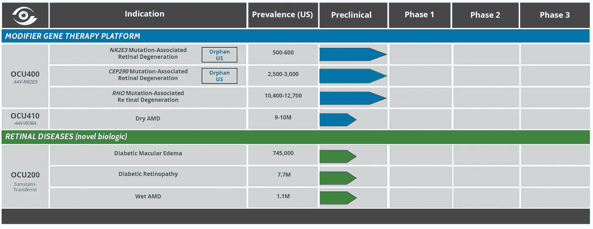

# 进行投机和冒险，以获得巨大的上升空间

> 原文：<https://medium.datadriveninvestor.com/ocugen-a-speculation-and-risk-play-for-huge-upside-9c6155133ad5?source=collection_archive---------5----------------------->

Pipeline of gene therapy and retinal diseases drug candidates.

截至 2020 年 7 月 6 日，股价接近历史低点。

具有 FDA 孤儿认证 OCU400 的扩展基因治疗管道。

最近几个月的内部购买和无报告的销售。

候选药物 OCU300 的停止阶段试验。

6 月 1 日，该公司停止了针对眼部移植物抗宿主病(oGVHD)的“ocu 300”3 期试验。“这是根据预先计划的中期样本量得出的结果，该结果表明该试验不太可能在完成后达到共同主要终点。”尽管如此，Ocugen 的股票在 6 月 5 日收盘时上涨了 11%，这表明该公司的乐观情绪高涨，预期将会复苏。

**ocu gen 的简要背景**

Ocugen Inc. (NASDAQ: OCGN)，原名 Histogenics Corporation，是一家临床阶段生物制药公司，专注于开发治疗整个眼睛的变革性疗法。它专门从事一种独特的改良基因疗法，具有治疗各种视网膜疾病的潜力。Ocugen 提供了一种单一的基因修饰剂来治疗多种眼病。

他们的产品线包括用于治疗湿性 AMD、糖尿病性黄斑水肿和糖尿病性视网膜病变的 OCU200 用于治疗遗传性视网膜疾病的 OCU410 和 OCU400OCU100 用于视网膜色素变性。

**专家们对 Ocugen 有什么看法？**

虽然 Ocugen 的股票具有高度投机性，但市场分析师一直在不断提高对该公司的评级。咤克斯将 Ocugen 的评级上调至第一位(强烈买入)，这表明其盈利预测呈上升趋势。扎克的评级是基于华尔街分析师的评级上调。与大多数评级系统主要受有利推荐的影响不同，Zack 评级系统是基于对 150 多家经纪公司的分析。它主要是由难以看到或衡量的因素驱动的。

该系统对其所有股票保持相同比例的“买入和卖出”评级，而不管市场状况如何，在咤克斯宇宙的 4000 只股票中只有大约 5%排名第一。通常，当咤克斯上调一家公司的收益预期时，该公司的股价在接下来的几个月里往往会上涨。总体而言，咤克斯共识对 Ocugen 的估计在过去几个月中上涨了 58.53%，预计在截至 2020 年 12 月的财年中，它的每股收益为“-0.15”，同比变化为 89.9%Ocugen 还获得了 MarketBeat 分析师的一致评级“买入”。分析师认为，该公司目前的股价为 0.22 美元，有 333.3%的潜在上涨空间。在社区情绪方面，Ocugen 获得了 MarketBeat 社区 67.53%的“跑赢”投票。MarketWatch 的分析师也建议买入并持有 Ocugen 的股票。

**内幕交易的利好**

当董事会和员工等内部人士购买一家公司的股票时，这意味着他们对该公司有信心。哈佛大学的一项研究发现，内部人士购买股票可以获得超过 6%的年回报率。通常，内部人士对公司有更好的了解，当他们觉得公司表现良好时，最有可能投资。

在调查 Ocugen 时，我们发现过去 12 个月内内部人士的最大一笔购买是创始人 Shankar Musunuri，他以每股 0.41 美元的价格购买了价值 108，000 美元的股票。虽然这可能并不意味着创始人认为 0.41 美元的价格不可抗拒，但这表明内部人士对公司有着压倒性的信心。

另一个突显该公司未来乐观的有趣事实是，在过去几个月里买入 Ocugen 股票的内部人士没有一个卖出。数据显示，过去三个月的内幕交易比过去 12 个月内的所有其他时期都多。如上所示，交易历史表明，Ocugen 内部人士对未来相当乐观。虽然这不应该是投资的唯一依据，但它确实给出了一个积极的预测。

【OCGN 的问题

Ocugen 的问题和他们没有得到投资界关注的主要原因是，它为“罕见和服务不足的疾病”开发药物。投资者正在寻找生产高需求或高产量药物的生物技术公司，如胆固醇药物和治疗癌症等多变量疾病的药物。目前，Gilead Sciences (NASDAQ:GILD)上涨近 22%，原因是其药物 Remdesivir 在治疗新型冠状病毒方面的潜力。Novavax(纳斯达克代码:NVAX)和 Moderna(纳斯达克代码:MRNA)也突然成为冠状病毒疫苗的潜在供应商。其他几家致力于开发治疗和检测试剂盒的小型生物技术公司也吸引了投资者。然而，有传言称，Ocugen 可能会与 Advaite 合作，以促进 Advaite 快速抗体试剂盒的上市。

**对于 Ocugen 股票来说，这种回报值得冒险吗？**

在该公司股价接近历史低点的情况下，对 Ocugen 股票的长期投机似乎值得冒险。

这里有一个 Ocugen 网站的链接:【https://ocugen.com/ 