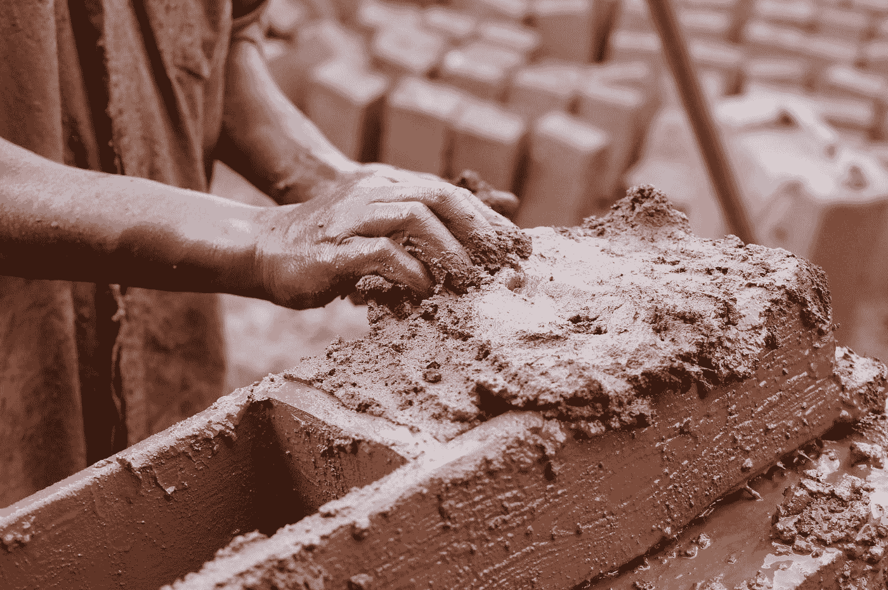

# 劳动力中的商品价格:国富论第五章

> 原文：<https://medium.datadriveninvestor.com/of-commodity-price-in-labour-wealth-of-nations-chapter-5-83f1d2144aa8?source=collection_archive---------13----------------------->

# 要求

***只有劳动才是所有商品的价值在任何时候和任何地方都可以估算和比较的最终的和真正的标准。***

Photo by [Esteban Castle](https://unsplash.com/@estebancastle?utm_source=medium&utm_medium=referral) on [Unsplash](https://unsplash.com?utm_source=medium&utm_medium=referral)

如果你错过了，[第四章在这里](https://medium.com/datadriveninvestor/of-the-origin-and-use-of-money-wealth-of-nations-chapter-4-32764fd4c5c4)。

> 每个人的贫富取决于他享受生活必需品、便利品和娱乐的能力。—亚当·斯密

# 真正的价值

分工一旦确立，我需要的东西几乎都不是我制造的。我需要消费或拥有的大多数东西，不管是必需品还是必需品，都是由他人的劳动创造的。因此，我的富有或贫穷是基于我能支配或从别人那里购买的劳动量。

对我来说，商品的价值，假设我自己不打算消费它，是它允许我支配的劳动量。劳动是所有商品交换价值的真正衡量标准。

对我来说，获得好东西的真正代价是获得它的辛劳和麻烦。同样，我买的东西的价值是它为我省去了辛劳和麻烦。而是强加给另一个人。

劳动是万物付出的第一代价。世界上所有的财富最初都是用劳动力购买的，而不是黄金或白银。

# 财富就是力量

巨大的财富不会带来政治或军事权力。财富也许会给他获得这两者的手段，但仅仅拥有财富并不能赋予他这种权力。

权力在于购买。对劳动力的控制。财富或多或少取决于他能购买的其他人的劳动量。一个富人可以购买更多其他人的劳动产品——相当于购买他们的劳动。

每样东西的可交换价值等于它给予它的所有者的这种力量的程度。

# 评估价值

尽管劳动力是衡量价值的真正标准，但它并不经常被用来估算一件商品的价值。很难比较两种不同的劳动量。

这不是两种不同劳动之间的纯粹时间。每一个人都忍受着不同程度的苦难。

> “一小时的艰苦工作可能比两小时的轻松工作需要更多的劳动；或在一个小时的应用到一个贸易花费十年劳动学习，比一个月的工业在一个普通和明显的就业。”—亚当·斯密

因此，这种比较不是直接的衡量，而是在市场上讨价还价。诚然，这种比较并不准确，但大致足以进行日常生活的事务。

此外，一种商品更多的是用另一种商品交换，而不是用劳动力交换。对我来说，用另一种商品的数量来估计价值更为自然。一个物体的数量是显而易见的，而劳动是一个抽象的概念。

# 为什么不是钱？

用于交换商品的最常见的商品是货币。当物物交换停止时，每一种特定的商品都比任何其他商品更容易兑换成货币。

在这一点上，人们根据他们愿意交换的货币数量来估计商品的价值。

但是，这不能作为真正的价值标准。像其他商品一样，它的价值也各不相同。价值有时更贵，有时更便宜。他们所能支配或购买的劳动力数量，或者说同等数量的劳动力——他们所能交换的商品数量，取决于矿井的肥沃或贫瘠。

黄金、白银或美元的数量和价值各不相同，不能用来准确衡量其他商品的实际价值。

# 劳动的一致性

等量的劳动在任何时候和任何地方对劳动者来说都是同等价值的。他将永远牺牲他的自由和幸福的相同部分(假设他是普通的健康，力量，精神，技能和灵巧)。

他生产的商品可能会换来不同的回报，但他为获得这些商品所支付的价格仍然是一样的。商品的价值是不断变化的，而不是劳动的价值。

无论何时何地，一件珍贵的物品都很难得到，而且需要付出大量的劳动才能获得。廉价商品是指那些很容易或很容易就能得到的东西。

> 因此，只有劳动本身的价值永远不变，只有劳动才是在任何时候和任何地方都可以用来估计和比较所有商品的价值的最终和真正的标准。—亚当·斯密

一个雇主可能会争辩说，“我为劳动力支付的成本确实发生了变化。”在他看来，劳动有时价值更大，有时价值更小。实际上，是他用来购买劳动的商品，通常是货币，而不是劳动本身在变化。

# 时间

劳动力的实际价格是为其提供的生活必需品和便利品的数量，而名义价格是货币的数量。这听起来像是推测，不会对现实世界产生影响。然而，随着时间的推移，我们会发现这是一个真正的区别。

当我拥有永久租金的地产时，我希望租金的价值在租期内保持不变。当看长期租约时，你会发现玉米储备合同比货币更能保值。

英国的大学租约最初写的是玉米租金是整体的三分之一。在几个世纪里，谷物租金变成了货币租金的两倍。也就是说，银可以买到过去四分之一的玉米。

> 在遥远的将来，用等量的谷物——劳动者的生活资料——比用等量的金银或其他任何商品更能买到等量的劳动。—亚当·斯密

然而，玉米价格每年都会根据收成的好坏而大幅波动。金钱的价值在不同年份之间是一致的。

在时间和地点上，只有劳动力是唯一普遍不变的价格。

**进入专家视角—** [**订阅 DDI 英特尔**](https://datadriveninvestor.com/ddi-intel)

对于本章的播客摘要，请听[书呆子刺客金融星期五](https://anchor.fm/thenerdassassin/episodes/Financial-Friday-5---Of-the-Real-and-Nominal-Price-of-Commodities-emnoao)。

**###链接###**

推特:[https://twitter.com/thenerdassassin](https://twitter.com/thenerdassassin)

领英:[https://www.linkedin.com/in/thenerdassassin](https://www.linkedin.com/in/thenerdassassin)

https://www.facebook.com/thenerdassassin/

Instagram:[https://www.instagram.com/thenerdassassin/](https://www.instagram.com/thenerdassassin/)

中:[https://thenerdassassin.medium.com](https://thenerdassassin.medium.com/)

https://www.tiktok.com/@thenerdassassin 抖音

播客:https://anchor.fm/thenerdassassin

**访问专家视图—** [**订阅 DDI 英特尔**](https://datadriveninvestor.com/ddi-intel)