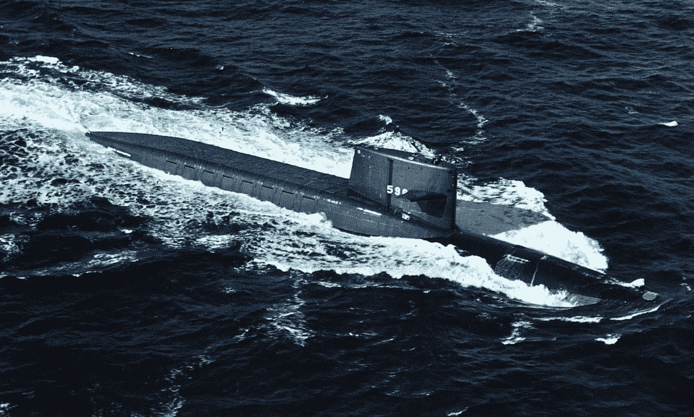
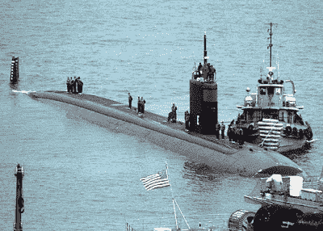
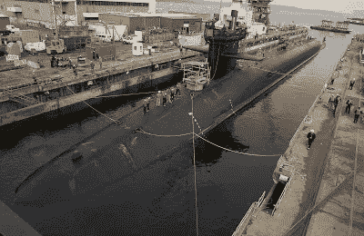
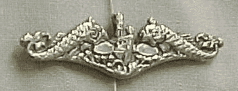

# 敌人和盟友

> 原文：<https://medium.datadriveninvestor.com/of-enemies-and-allies-6eecfe8c5f9d?source=collection_archive---------24----------------------->

## 生活课程

## "**敌人**很微妙，我们怎么会如此受骗."—鲍勃·迪伦

The U.S. Navy ballistic missile submarine USS *George Washington,* circa in the 1970s. Public domain.

成为演讲会会员的好处之一是，我们可以听到许多有趣的故事和演讲，这些故事和演讲涉及的话题超出了我们自身的经验范围。上周四晚上，伯特·赫什做了一个关于“敌人和盟友”的演讲，这真的激发了我的思考。

USS San Juan. Photo by Paul Farley, public domain.

伯特演讲的基础是他在冷战即将结束时在一艘核潜艇上的亲身经历。然而，使这次演讲有影响力的是他将演讲前半部分的见解应用到我们都很熟悉的个人现实生活中的方式。无论是在学校、工作场所还是日常生活中，我们都可能会遇到这些现实。这篇演讲很好地提醒了我们，为什么知道谁是你的敌人，谁是你的盟友是如此重要。

我请求阿什兰学区的教师赫什先生允许我在这里分享他的演讲。

我今天的任务有两个。第一，识别敌人，第二，依靠盟军的支持。

在美国海军服役期间，我经历了许多天的压力。冷战期间，我在潜艇水下服役了 80 天，住在离核反应堆不到 100 英尺的地方，睡在核导弹上方 10 英尺的地方。

沙漠风暴行动期间我在波斯湾。我甚至不得不在肖恩·康纳利和亚历克·鲍德温拍摄《猎杀红色十月》的时候和他们分享屏幕时间。

另外两个任务压力特别大，我不能说。嗯，我可以，但你知道俗话说。我能说的是，我在敌人的领土上呆过一段时间，可以证明被包围在敌对水域中所带来的恐惧和焦虑。

当这种情况发生时，我的工作是在战斗状态下，在一张图表上标出该地区所有船只的相对位置。当你看不到他们中的任何一个时，这是很难做到的。我不得不完全依靠我们的声纳兵，仅仅通过听它们来识别它们。世界上的每艘船都有自己独特的声音，这需要专家来鉴别。任何老兵都会告诉你，知道你的敌人在哪里是非常非常重要的。我们只能通过敌人发出的声音来识别它。

 [## 健身房 10 年的 10 条人生经验|数据驱动的投资者

### 走错一步，他们就会掉下去。两位登山者优雅地回到了地面。他们在那里…

www.datadriveninvestor.com](https://www.datadriveninvestor.com/2020/02/03/10-life-lessons-from-10-years-in-the-gym/) 

我的两个兄弟也是退伍军人，就像我们的父亲一样。我的弟弟罗伯特多次去伊拉克执行任务，他的职责是向当地警察讲授道德规范，并在巴格达执行安全任务。有些情况下，简易爆炸装置和其他令人恐惧的风险相当严峻。他对他的部队的安全负责，一些危险的时刻来到了他身边。后来，甚至是现在，他也不再提起其中的一些时间。他确实谈到了他的盟友，和他在一起的伙伴，他的朋友和家人。

USS Michigan. US Navy photo by Brian Norkell

我们都需要盟友，支持我们的人。这些是其他退伍军人，家庭成员，朋友，邻居…

在我成长的过程中，我有很多敌人。我能认出他们，因为我能听到他们。它们听起来像这样:

—你为什么这么做？

—笨蛋，你就不能做对一件事吗？

—你太蠢了。

—没人在乎。

你想尝尝这个吗？这会让你感觉更好

有时是我自己内心的声音:

—我讨厌这个地方。

—我不需要这个。

—我做不到。

—我不知道我在做什么。

我认识这个敌人，他在骗我。

幸运的是，我有盟友保护我，帮助我。我开始相信上帝在我身边安排了一些人来拯救我。我的祖父母，我的社会学老师兼篮球教练迈克·扬先生，我的科学老师乔治·奥尔森，我教堂里的人们。他们都帮助我识别和征服那些破坏性的敌人。

在座的有些人可能有相同的谎言敌人。

我们内心的敌人不穿制服，是我们最难对抗的敌人。他对你唠叨，告诉你你不够好。他说你做了坏事，所以现在你一文不值，让你对每件事和每个人都生气，你只是不想再处理它了。

我的朋友们，你们有盟友了！我知道这一点，因为我是他们中的一员。

Submarine insignia known as The Dolphins.

环顾四周，(透过 Zoom 看著我们当地的演讲会同仁)我发现我的敌人不在这里。我在这里看到的是盟友。他们是朋友，邻居，队友，兄弟姐妹，学校工作人员。环顾四周。你的敌人不在这里。你的周围都是盟友。

如果我们错误地识别并认为他们对我们有敌意，最坏的事情可能会发生。我没有遭遇过被认为是友军误伤的事故，但我知道任何士兵或水手都会说，给盟友带来伤害是不可想象的悲剧，不可想象。

在海军中，有一种荣誉是无法单独获得的。E 之战。它标志着你的船或单位能够执行有效和优秀的作战计划来对付敌人。这不是一个个人奖项。每个船员都必须尽最大努力来赢得这个奖项。

我们是一个团队的！

成为像我的声纳兵那样的人的盟友。帮助识别看不见的敌人。当作战计划可以执行时，你就可以征服那个敌人。

伯特，谢谢你与我们的演讲会分享这些想法，并允许我在这里复制这些想法，让其他人思考。

演讲会作为一个组织已经有将近 100 年的历史了。它的目的不仅仅是帮助人们成为更好的公众演说家，也是为了培养领导者。我们自己的演讲会 1523 在周四晚上聚会，客人总是受到热烈欢迎。事实上，有了 Zoom，如果你住在海外，你仍然可以参加我们的会议。我们的一些成员参加了世界其他地方的其他团体。

欲了解更多信息， [**请访问我们的俱乐部网站**](https://duluth.toastmastersclubs.org/?fbclid=IwAR3iGWc9QPCSrxB19bR5pjO5vOyDrBRIxW0PW8JOoQziSRkAFOrihBzPSHA) 。

# 相关链接

看看这个关于达拉斯号的故事。
[**在投入战斗之前，我们必须了解 WWAUA**](https://ennyman.medium.com/before-going-into-battle-we-must-know-wwaua-50d3aafe8f91)

*原载于*[*https://pioneerproductions.blogspot.com*](https://pioneerproductions.blogspot.com/2020/10/of-enemies-and-allies.html)*。*

## 获得专家观点— [订阅 DDI 英特尔](https://datadriveninvestor.com/ddi-intel)