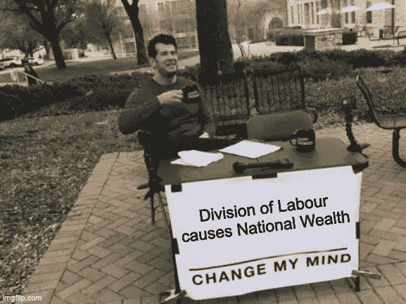

# 《劳动分工:国富论》第一章

> 原文：<https://medium.datadriveninvestor.com/of-the-division-of-labour-wealth-of-nations-chapter-1-d173464feae8?source=collection_archive---------12----------------------->

# 要求

***生产力提高的最大原因是劳动分工。***

# 分工的例子

劳动分工既存在于复杂的大任务中，也存在于简单的任务中。然而，使用简单的例子更容易，因为它们可以在一个工厂中查看。

**制针师**

如果没有劳动分工，一个人可以在未经训练的情况下一天制造一枚针。练习之后，他可能会达到 20 分。制造一枚别针的过程可以分成 18 个步骤。一些工作可能包括:

*   拉电线
*   拉直电线
*   切断电线
*   指向它
*   研磨顶部以制作头部(2-3 次操作)
*   把大头针的头放上去
*   白色别针
*   用纸包起来

通过劳动分工，10 个人一天可以制造 48，000 个别针。

在许多其他领域，产量也有类似的增长。

> “劳动的分工，……在每一种艺术中，都[创造出]生产力的按比例增长”

为了提高产量，劳动开始分工。在一个富裕的国家，劳动分工更为分散。农业是一个很难细分的行业，但当看制造业时，很容易看出区别。

# 改进的原因

*   **技能提升**

> “……把每个人的工作简化为一项简单的操作，必然会大大提高工人的技巧。”

一个熟练的铁匠每天可以制作 800-1000 个钉子，而一个只会做钉子的 20 岁男孩每天可以制作 2300 个钉子。即使两个工人都有金属加工方面的专业知识，这种情况还是会发生。

*   **任务切换减少**

> 从一种工作很快过渡到另一种工作是不可能的，那是在不同的地方，用完全不同的工具进行的。

当任务切换时，与技能无关，工作减少。当一个人开始一项新任务时，他自然会拖拖拉拉，通常开始的几个操作都是粗心的。

*   **机械**

> 人们自然会期望，那些被雇用的人应该很快找到更容易的方法来完成他们自己的工作。

反复做同样简单工作的人会发现更简单的方法。很多时候，做这项工作的人最终发明了机器来代替他们。

# 劳动分工使每个人更加富有

> “这是所有不同艺术作品的最大增殖，创造了延伸到最底层人民的普遍富裕。”

看看一件简单的衣服，即使是最穷的人也买得起，劳动分工创造并改进了它。羊毛外套是粗糙的，由所有日工所有。但这件大衣是由牧羊人、羊毛分拣员、羊毛精梳机、染匠、画匠、纺纱工、织布工、漂布工和服装师制作的。然后加上所有必须被雇佣来运输货物的人。加上所有建造运输船只的人和制造工人们正在使用的工具的人。

总之，没有成千上万人的帮助，即使是最穷的人也穿不上衣服。

> “这可能是真的，一个欧洲王子的住宿并不总是超过一个勤劳节俭的农民，后者(农民)的住宿超过许多非洲国王，一万裸体野蛮人的生活和自由的绝对主人。”

对于本章的播客摘要，请听[书呆子刺客金融星期五](https://anchor.fm/thenerdassassin/episodes/Financial-Friday-1---Of-the-Division-of-Labour-elflhf)。

如果你错过了，[第二章发布](https://medium.com/datadriveninvestor/wealth-of-nations-chapter-2-43e5235f394e)。

###链接##

推特:【https://twitter.com/thenerdassassin 

领英:[https://www.linkedin.com/in/thenerdassassin](https://www.linkedin.com/in/thenerdassassin)

https://www.facebook.com/thenerdassassin/脸书

insta gram:[https://www.instagram.com/thenerdassassin/](https://www.instagram.com/thenerdassassin/)

中:[https://thenerdassassin.medium.com](https://thenerdassassin.medium.com)

https://www.tiktok.com/@thenerdassassin

播客:https://anchor.fm/thenerdassassin