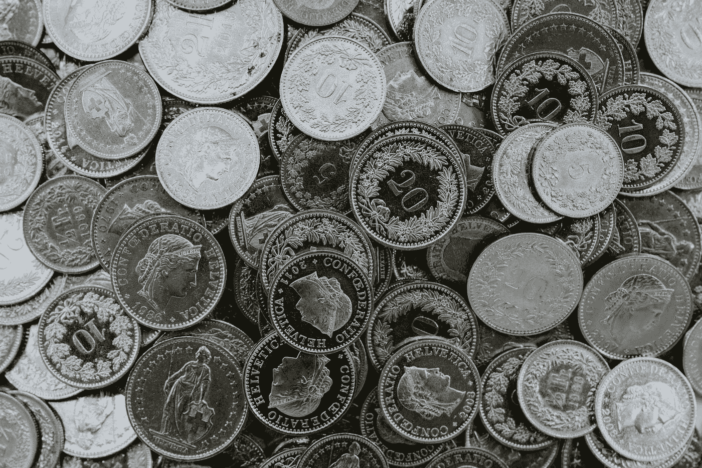
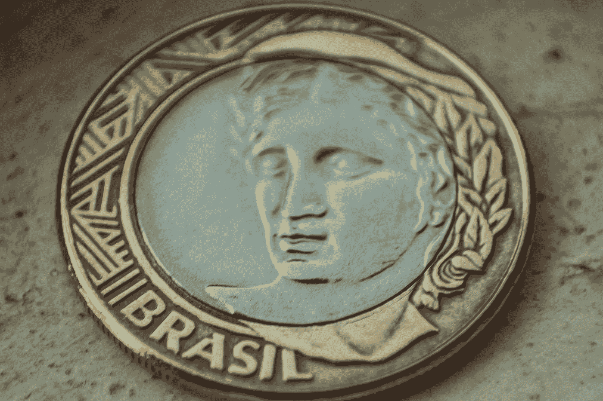

# 货币的起源和使用:国富论第四章

> 原文：<https://medium.datadriveninvestor.com/of-the-origin-and-use-of-money-wealth-of-nations-chapter-4-32764fd4c5c4?source=collection_archive---------9----------------------->

# 要求

货币是商品和服务正常交换的必需品。

Photo by [🇨🇭 Claudio Schwarz | @purzlbaum](https://unsplash.com/@purzlbaum?utm_source=medium&utm_medium=referral) on [Unsplash](https://unsplash.com?utm_source=medium&utm_medium=referral)

如果你错过了，[第三章发布](https://thenerdassassin.medium.com/that-the-division-of-labour-is-limited-by-the-extent-of-the-market-wealth-of-nations-chapter-3-59bbdca82be7)。

# 闭合

一旦劳动被分割，我自己的劳动的很小一部分是由我自己生产的。我用的几乎都是别人做的。

> "每个人都以交换为生，或在某种程度上成为商人，社会本身也就发展了."

然而，在婴儿期，分工是低效的。我可能刚宰了一头牛，肉比我自己需要的还多。自然想把肉换给别人。

如果你是一个饥饿的蜡烛制造商，你需要希望我需要蜡烛。如果我不需要任何蜡烛，你和我对彼此的帮助都会减少。没有什么可以交换的。

# **梦寐以求的商品**

谨慎的人通过储存大多数不会拒绝的商品来解决这个问题。我需要手头有每个人都想要的东西。蜡烛制造商和屠夫都愿意接受这种“中间人”商品，因为他们都知道以后会有人需要它。

历史上有许多不同的商品用于这一目的——牛、盐、贝壳、烟草、鳕鱼、糖、皮革或钉子。最终，所有国家都汇聚到一种不可抗拒的商品上。

# 不可抗拒的商品

金属一直是社会的终极偏好。储存时几乎没有损失，而且几乎可以分割成任何大小。

有钱人不想在商店里花钱，也不想赔钱。想象一下用牛作为交换手段。等我有钱了，我会花很多钱去养牛。或者想象一下有一个烟草仓库。如果它腐烂了，你失去了一半的烟叶。

金银不会腐烂、变质，也不需要太多的维护。同样，它可以被细分为越来越小的数量。你可以把金属削掉或压平成小片。给某人半头牛而不损失整头牛的价值要难得多。

你也许可以把皮革之类的东西分开。但是当我想把一堆碎片组合起来的时候。金属可以熔化并化合。我可以把一袋硬币变成一根银条。

# 更多的金属更多的问题

金属也有一些缺点。首先是确定金额。当进行大宗购买时，例如购买一块土地时，可以很容易地使用秤。

但是想象一下买一根带黄金的口香糖。我们需要一个非常精确的秤来确保我支付了正确的金额。对于每天的交易来说，这个过程变得单调乏味。

第二个问题是确保金子是金子或者银子是银子。这个过程叫做化验——测定金属的含量或质量。

不把一根银条熔化，几乎不可能辨别它是否是纯银。显然，这是一个昂贵而艰难的过程。

通过掺入其他金属或物质来欺骗某人是很容易的。社会最终想出了解决办法。

 [## 对有商业头脑的投资者有用的行为经济学概念|数据驱动的投资者

### 在美国企业界，高斯统计，对我们周围世界的确定性解释，以及理性…

www.datadriveninvestor.com](https://www.datadriveninvestor.com/2020/07/09/helpful-behavioral-economics-concepts-for-the-business-minded/) 

# 邮票

不是邮资而是造币。一个国家将会有一个中央权威机构来批准质量并在银条上加盖印章。这样双方都可以保证酒吧是纯金属。

Photo by [ORLANDO SANT'ANNA](https://unsplash.com/@ojsant?utm_source=medium&utm_medium=referral) on [Unsplash](https://unsplash.com?utm_source=medium&utm_medium=referral)

起初，只有一面的酒吧将被盖章。在这一点上，化验的问题已经解决，但仍需要称出金属来确定数量。

之后，邮票被放在金属的顶部和底部。这就形成了一个硬币而不是酒吧。交易的数量就变成了名义上的——简单的计数。不需要天平或化验。

对于本章的播客摘要，请听[书呆子刺客金融星期五](https://anchor.fm/thenerdassassin)。或者继续阅读[第五章](https://medium.com/datadriveninvestor/of-commodity-price-in-labour-wealth-of-nations-chapter-5-83f1d2144aa8)。

**###链接###**

推特:[https://twitter.com/thenerdassassin](https://twitter.com/thenerdassassin)

领英:[https://www.linkedin.com/in/thenerdassassin](https://www.linkedin.com/in/thenerdassassin)

https://www.facebook.com/thenerdassassin/脸书

insta gram:https://www.instagram.com/thenerdassassin/

中:[https://thenerdassassin.medium.com](https://thenerdassassin.medium.com/)

https://www.tiktok.com/@thenerdassassin

播客:https://anchor.fm/thenerdassassin

## 获得专家观点— [订阅 DDI 英特尔](https://datadriveninvestor.com/ddi-intel)