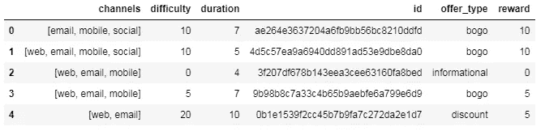
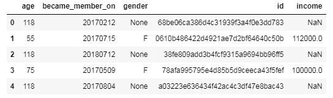
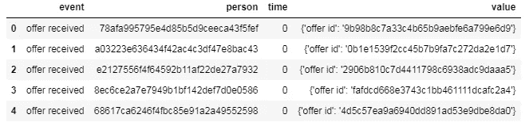
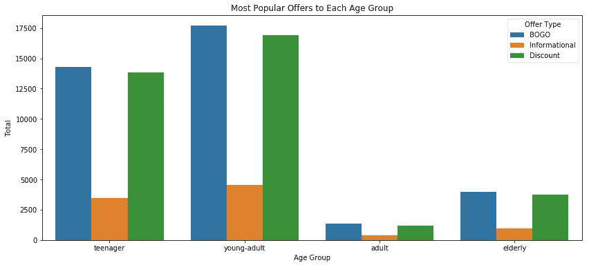
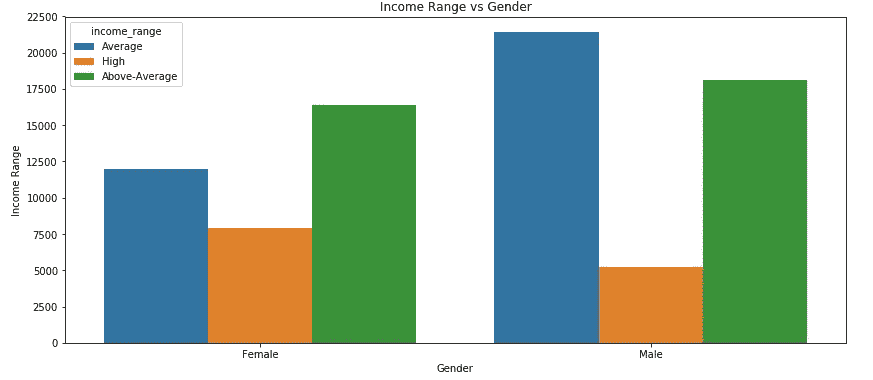
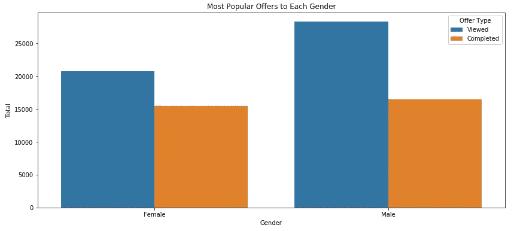
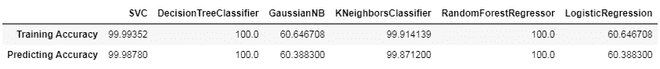

# 使用机器学习提供优化

> 原文：<https://medium.datadriveninvestor.com/offer-optimization-using-machine-learning-46a1f5d1b59b?source=collection_archive---------3----------------------->

## 机器学习

对于青少年… X 将是最好的提议！对成年人来说……Y 将是最好的报价！同样，对于老年人来说，Z 将是最好的选择。

但是谁来决定呢？？？TBH，许多人相信他们的勇气去做这件事。然而，每次相信我们的胆量并不能保证成功。关于这一点，你将被介绍一种新的方式提供给你的客户；用星巴克的数据举例说明。

(Credits: Starbucks official site)

这些小册子通过社交媒体、电子邮件、短信和其他渠道发送。

但公司的增长黑客会有兴趣从报价中获得尽可能高的利润，对吗？要知道如何用机器学习做到这一点，请继续阅读！

*注:您可以在这里* *访问本博客附带的代码* [*。*](https://github.com/prashantjadiya/Starbucks-offer-optimization)

# 插图:星巴克提供优化

> 目标:建立一个模型，预测客户对报价的反应。(他要么完成，要么不完成)

整个例子分为几个部分:
1)简介
2)数据集的探索性数据分析
3)数据预处理
4)数据可视化(带一堆业务相关问题)
5)数据建模
6)结果&结论

## 1)简介

该数据集包含模拟星巴克奖励移动应用程序上的客户行为的模拟数据。每隔几天，星巴克就会向手机应用程序的用户发出一次报价。优惠可以仅仅是饮料的广告，也可以是实际的优惠，如折扣或 BOGO(买一送一)。某些用户可能在特定的几周内收不到任何优惠。

并非所有用户都收到相同的报价，这是这个数据集要解决的挑战。

在要约到期之前，每个要约都有一个有效期。例如，BOGO 的报价可能只有 5 天的有效期。你会在数据集中看到，信息优惠有一个有效期，即使这些广告仅仅是提供关于产品的信息；例如，如果信息性报价有 7 天的有效期，您可以假设客户在收到广告后的 7 天内感受到了报价的影响。

 [## 认知计算——一套被广泛认为是……

### 作为它的用户，我们已经习惯了科技。这些天几乎没有什么是司空见惯的…

www.datadriveninvestor.com](https://www.datadriveninvestor.com/2020/02/19/cognitive-computing-a-skill-set-widely-considered-to-be-the-most-vital-manifestation-of-artificial-intelligence/) 

举个例子，用户可以在周一收到一个买 10 美元减 2 美元的折扣。报价自收到之日起 10 天内有效。如果顾客在有效期内累计购买至少 10 美元，顾客就完成了报价。

数据包含在三个文件中:
·portfolio . JSON—包含要约 id 和关于每个要约的元数据(持续时间、类型等)。)
·profile . json —每个客户的人口统计数据
·抄本. JSON—交易记录、收到的报价、查看的报价和完成的报价

## 2)探索性数据分析

嗯，EDA 对于每个数据集和问题陈述来说都是一项非常普遍的任务。在这里，我们将一步一步来。

*① Portfolio.json:(报价元数据)* 数据集有 6 列 10 行。
该数据集既没有空值也没有重复值。有三种优惠:“BOGO”(买一送一)、“信息”和“折扣”。
数据集中包含 4 个报价，分类为:“BOGO”，4 个报价分类为“折扣”，2 个报价分类为:“信息”。

First five rows of Portfolio data

*② Profile.json:(客户元数据)* 数据集有 5 列 17000 行。
数据集没有重复的行。
数据集在“性别”、“收入”变量上各有 2175 个缺失值。
顾客的年龄范围从 18 岁到 101 岁。尽管这 2175 名顾客的注册年龄是 118 岁；我仍然认为这个特定的年龄是一个异常值，因为数据集中这 2175 行显然有问题。
“性别”和“收入”变量中缺失的值仅与 2175 名 118 岁注册的客户相关。换句话说，118 岁的顾客没有登记的“性别”和“收入”。
客户收入在 3 万到 12 万之间，大部分客户收入在 5 万到 7.5 万之间。
根据可用数据，客户分为三个“性别”类别(M、F 和 O)。记住上面的观察结果，有 2175 个值缺失，男性顾客(8484 名男性)多于女性顾客(6129 名女性)，男性顾客占 57%，女性顾客占 41%。然而，有 212 名顾客选择了“O”作为他们的性别。

First five rows of Profile data

*③ Transcript.json:(客户报价交互数据)* 数据集有 4 列 306534 行。
数据集既没有重复的行，也没有缺失的值。
“价值”栏是一个字典，我们可以在其中应用某种特征工程来提取有用的数据，这些数据肯定会有助于我们未来模型的成功。该数据集中有四种类型的事件:“交易”、“收到报价”、“查看报价”和“报价完成”。
“交易”类别的所有事件在其“值”列中都没有“报价标识”。

First five rows of Transcript data

> 你觉得呢，谁会买更多有优惠的咖啡？男人还是女人？答案就在前面…呆在里面！

## 3)数据预处理:

现在我们知道了数据是什么样子的，我们可以把我们的感知放在这些数据上，以模型所需的形式对其进行处理。

*①portfolio . JSON 上的数据预处理:* 将“id”列重命名为“offer_id”。
“持续时间”栏的单位从天改为小时。
将“持续时间”列重命名为“持续时间 _ 小时”，表示计量单位为“小时”。
·使用最小最大缩放器将“难度”和“奖励”特征标准化。
使用一键编码从“通道”列创建虚拟变量，然后删除“通道”列。
·用更简单的 id 替换“offer_id”。
用代表每个报价类型的整数替换“报价类型”，如下所示:
1:bogo
2:discount
3:informational

*②profile . JSON 上的数据预处理:* 【将‘id’列名重命名为‘customer _ id’。
重新排列列，使“customer_id”列成为数据集中的第一列。
用最简单的数值替换 customer_id 字符串值。
将年龄= 118 替换为 NaN 值。
删除没有“年龄”、“性别”和“收入”的客户(删除行)。
将“年龄”和“收入”列的数据类型更改为“int”。
·创建一个新列“年龄组”,其中包括每个客户所属的年龄组。
将“年龄组”分类标签替换为相应的数字标签，如下所示:
1:青少年
2:青年-成年人
3:成年人
4:老年人
创建一个新列“收入范围”，其中包括客户收入所属的收入范围。
用相应的数字标签替换“收入范围”分类标签，如下所示:
1:平均值(30，000–60，000)
2:高于平均值(60，0001–90，000)
3:高(超过 90，000)
用相应的数字标签替换“性别”分类标签，如下所示:
1: F(女性)
2: M(女性
·向现有数据集中添加一个新列“start_year”，该列将显示客户成为会员的年份(用于进一步分析)。
向现有数据集添加一个新列“membership_days ”,该列将显示自客户成为会员以来的天数(用于进一步分析)。
·创建一个新的“会员类型”列，代表会员的类型:新会员、普通会员或忠诚会员，具体取决于其“会员天数”。
将“会员类型”分类标签替换为相应的数字标签，如下所示:
1:新会员(1200 天或更短时间内的会员)
2:普通会员(1201-2000 天会员)
3:忠诚会员(2000 天以上会员)
【删除“年龄”、“收入”、“成为会员”和“会员天数”列，因为不再需要它们。

*③transcript . JSON 上的数据预处理:* 将“时间”列重命名为“time_h”，表示测量单位为“小时”。
·将“人员”列重命名为“客户 id”。
将“客户 id”列中的分类值替换为与每个客户 id 相对应的新初始化的数值，该数值由“id”功能的先前预处理产生。
将“值”列中的每个键提取到单独的列，而不是删除“值”列。
“offer _ id”栏中的所有 nan 填写“N/A”值(即不适用)。
“值”栏不再需要，因此删除。
·从我们的 clean _ 抄本数据集中排除“交易”或“收到报价”的所有事件。
将“事件”分类标签替换为相应的数字标签，如下所示:
1:报价已完成
2:报价已查看
将“报价 _id”列中的分类值替换为预处理投资组合数据集期间使用的相应数字值

> 你可以在这里访问本博客[附带的代码。](https://github.com/prashantjadiya/Starbucks-offer-optimization)

看这么多看腻了？不要担心…现在我们将玩图表和图形。

## 4)数据可视化:

可视化在数字技术的每个方面都非常重要。我们想知道数据是如何组织的，异常值是什么，等等。

在本例中，我们将讨论与业务相关的问题:

*   **每个年龄组(青少年、年轻人、成年人和老年人)的常见优惠是什么？**

所有年龄组中最常见的优惠类型是 BOGO，其次是折扣优惠。然而，最不常见的提议是信息性提议。我相信 BOGO 的优惠比星巴克的其他优惠更有吸引力。

*   **根据获得最高收入范围的客户的人口统计数据，男性还是女性？**

高收入(9 万以上)的客户多为女性客户。然而，平均收入(30，000-60，000)的客户大多是男性。

*   **星巴克每年有多少新会员？**

就新会员数量而言，2017 年是星巴克最好的一年。

*   **在客户查看的所有报价中，他们完成了多少报价？(剧透预警！！)**

你得到了你一直在寻找的问题的答案…女性似乎比男性更容易被提议说服。

让我们继续将这些数据(合并的数据)放到模型中…

## 5)数据建模:

它来了，ML 管道的关键部分，我们必须选择模型，同时调整超参数和许多并行的事情。

在将数据输入模型之前，我们必须识别数据集的重要特征；即时间、优惠 id、金额、奖励、难度、持续时间、优惠类型、性别、年龄组、收入范围、会员类型和目标变量将是事件。(报价是否完成)

在这种方法中，我尝试了六种模式；
即逻辑回归、支持向量机、K 近邻、朴素贝叶斯、决策树、随机森林。

## 6)结果与结论:

Results summary

我们买了一些过度装配的模型。但我选择了准确率约为 98%的 KNN。

虽然，我相信这样说*“总有改进的余地”*我正计划用诸如 GridSearchCV (sklearn pipeline)和 XGBoost 之类的技术来尝试这些数据。

由于总有改进的空间，我认为改进数据收集或解决与缺失数据或 NaNs 相关的问题的想法将非常有用。在我看来，我认为我们可以从这个数据集中获得很好的见解，也可以建立很好的预测模型来解决与这个数据集相关的问题。

> 谢谢大家！抽出宝贵的时间来阅读这篇博客，我希望你喜欢它。如果有任何疑问，请在下面回复或通过 [LinkedIn](http://www.linkedin.com/in/prashant-jadiya) 联系我。(提醒:为此博客鼓掌😉)

我在这里没有包含任何代码，但是你可以在这个 [GitHub 库](https://github.com/prashantjadiya/Starbucks-offer-optimization)中访问它。