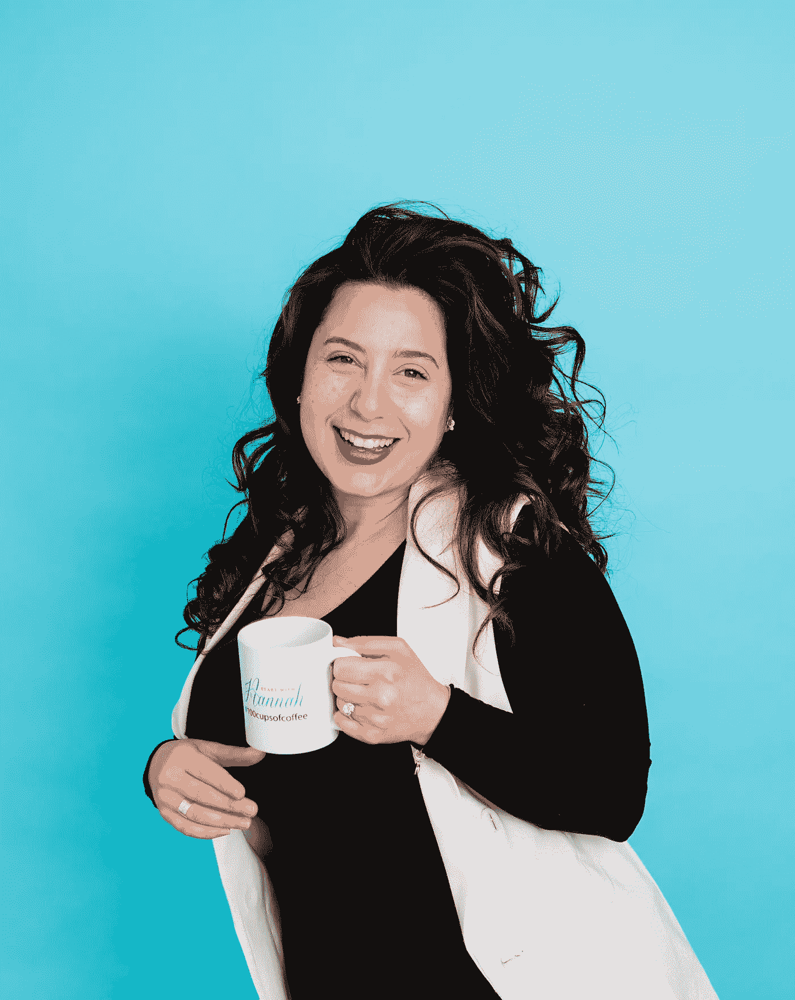
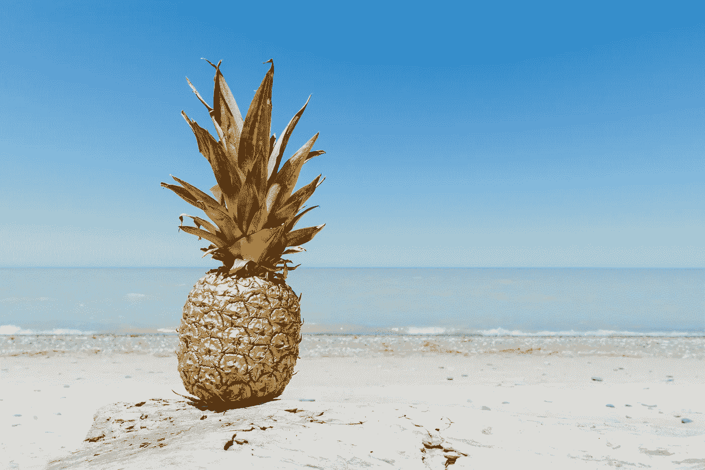

# 哦，我赢得的奖项

> 原文：<https://medium.datadriveninvestor.com/oh-the-awards-i-ve-won-796bfca22ba3?source=collection_archive---------21----------------------->

## 以及我的获奖感言

Photo Credit to the Incredible: [Michele Crockett](https://medium.com/u/cc066e4162e4?source=post_page-----796bfca22ba3--------------------------------)

下一个奖项颁给一位非常特别的人，他也是我们今晚的主题演讲人。她在房地产领域开创了一个新的舞台，以其推动商业发展的想法而闻名，并且是今年…的获奖者

在过去的几年里，我获得了许多奖项，这些奖项让我在商业上成长和壮大，其方式之伟大难以言表。但我会努力的。

## 随着所有的奖项而来的是许许多多的获奖感言。

让我和观众落泪的演讲，赋予力量的演讲，鼓舞人心的演讲，以及关于我的旅程的演讲。

我所有的演讲都有几个共同点，核心基本保持不变，对我来说比任何人都重要。在核心部分，我讲述了我的旅程，以及我在那一刻到达目的地的道路。我是说，详细地说。

我讲述了我所做的让我走到这一刻的事情，包括那些令人难忘的打嗝或路上的路障。我说的是这一切的“如何”。我是怎么做到的，我有没有计划这种事情的发生？在演讲的某个地方，我分享了赋权和灵感的时刻，以保持观众对未来的兴奋和动力。

**我的时刻到了**，我站在场外，主持人看着我，暗示下一个该我了。开始吧，这是我领奖并发表令人难忘的演讲的时间。我不焦虑，我不紧张，我只是兴奋地分享我做的事情，我学到的东西，以及一路上帮助过我的人。

我笑得合不拢嘴，深吸一口气，走向镜子，我最喜欢的观众在那里耐心地等待我找到我的话并开始。

在我们生命的某个时刻，我们变成了自己唯一的拥护者。我们的父母不能再为我们做这些了，不是因为他们不能，而是因为这变得很尴尬。这在我们准备好为自己辩护之前就已经发生了。我们的父母继续尝试了一段时间，但我们当时不明白的是，从他们停止的那一刻起，我们就靠自己了。这是一件好事，我们需要成长，学会为自己辩护。但是我们不知道这意味着什么，也不知道我们现在负责什么。

我们在这里，我们赶走了我们尴尬的拥护者，然后它就停止了。没有培训，没有速成班。继续，为你自己辩护。

我们可能没有培训，没有课程，也没有令人尴尬的家长代言人，但你知道我们有什么吗？

## 我们的获奖感言

Photo by [Liana Mikah](https://unsplash.com/@lianamikah?utm_source=unsplash&utm_medium=referral&utm_content=creditCopyText) on [Unsplash](https://unsplash.com/s/photos/mirror-reflection?utm_source=unsplash&utm_medium=referral&utm_content=creditCopyText)

## 哦，我赢得的奖项。

在镜子前接受奖项让我可以用最好的角度来描述自己。关于我的生意，关于我的旅程，关于我想要的和关于我的未来。在镜子前接受奖项给了我一个理由，让我可以就我是谁和我做什么写出精彩的句子。这让我在那一刻对我的事业有了一个大致的了解，也让我有了更大的梦想！有时候，大多数时候，我会为我还没有开始的事情接受奖励！

这是一个巨大的想法，我会解释。这就像用类固醇来展现你的生命。想象一下你想过的生活或者你想要达到的目标，现在做一个获奖感言，一旦完成，你将获得这个奖项。解释这段旅程，以及为了到达那里和实现这个目标，你必须做些什么。详细说说，分享你的经历，你的缺点，说说一路上帮助过你的人。

记住，你还没做过这件事。但是现在你有了未来的全貌。你可以想象在那里成功，以及赢得那个奖项的感觉！你会对自己的成就感到兴奋、有动力、兴奋！绝对的神奇！

在镜子里接受一个奖项也给了我如何到达那里的观点和想法！我会大声说出我做过或还没做过的事情。它教会我如何介绍自己，如何推销新的业务或想法。这也让我很开心。我真的很兴奋。

这些奖项从来没有计划过，我也从来没有准备好演讲稿。在《此时此刻，现场直播》中，我会给自己一个惊喜，我必须当场弄清楚，我是怎么做到的。

> 如果你不知道某个地方在哪里，你怎么能到达某个地方？为未来的你接受奖励，有助于为你的未来创造一个愿景。

我们应该主动参与对话，去见那个人，去为自己辩护。要求加薪，得到我们渴望的东西。这也意味着你现在是你最好的啦啦队员，这使你成为完美的观众！你知道你应该得到的尊重，也知道你在获得这个奖项的过程中付出的努力。如果你还没猜到的话，这也让你成为你自己的奖项的最佳颁奖人。

是的，你没听错。你最适合做自己的颁奖人、领奖人和观众。你自己令人敬畏的颁奖晚会的三连胜。

我会继续接受镜子里的奖项，继续学习如何为自己辩护。我会享受这个空间和它带给我的难以置信的洞察力。更多的时候，我会在演讲时想出新的想法或新的创造性的方法来让我走得更远。我会笑，我会笑，我会哭。

Photo by [Pineapple Supply Co.](https://unsplash.com/@pineapple?utm_source=unsplash&utm_medium=referral&utm_content=creditCopyText) on [Unsplash](https://unsplash.com/s/photos/award-awards-gold?utm_source=unsplash&utm_medium=referral&utm_content=creditCopyText)

如果你获奖了，会是为了什么？你怎么去的？你想让人们知道什么？

成为你的最佳代言人是一项巨大的事业，我们甚至不知道它已经发生了。你是你的核心人物，你的啦啦队长，你的拥护者。通过接受这些奖项来学习为自己辩护的艺术吧！

记住你是你最伟大的啦啦队长，这使你成为最好的观众。你比任何人都了解和理解你的旅程，这使你成为最佳颁奖人。当然，你是你唯一的支持者，这使你成为接受奖项的合适人选。不要等别人认可了你才认可自己。

所以去接受那瓶洗发水或发刷吧，这是你应得的。拜托了，

## 做个演讲吧，你的听众在等着呢。

Instagram 链接:[从汉娜开始](https://www.instagram.com/startwithhannah/)