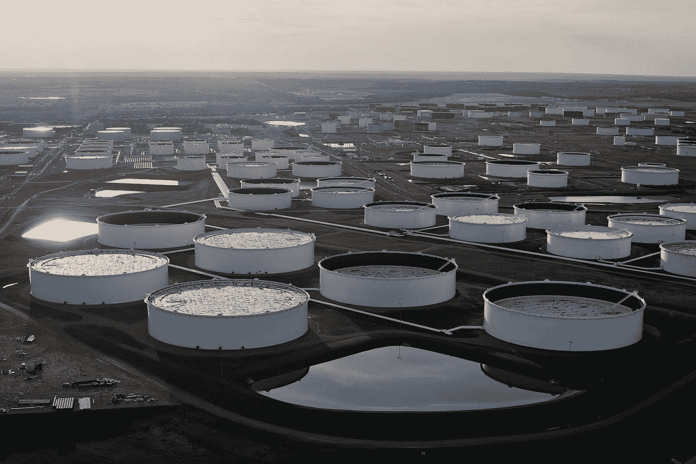

# 石油价格战:这种商品在零度以下是如何交易的？

> 原文：<https://medium.datadriveninvestor.com/oil-price-wars-how-did-this-commodity-trade-at-sub-zero-levels-84a03c8155f7?source=collection_archive---------6----------------------->

Oil Rig

# 作者:塔努什里·维尔马

# 介绍

2020 年 4 月 20 日，WTI 原油交易处于历史最低点。-每桶 37.63 美元。交易 WTI 原油合约的人付钱给买家，让他们解除合约。这到底是怎么发生的？

这种反常的现象是结构性变化的结果，随后是 Covid19 冲击——石油生产来源、需求的变化&三个最大的石油出口国，即美国、沙特阿拉伯和俄罗斯之间的长期石油价格战。

1960 年 9 月，五个石油出口国在巴格达结成联盟。连续几年，越来越多的石油出口国加入了“石油输出国组织”联盟，即石油输出国组织。这个联盟的成立是为了决定石油的价格，并相应地控制石油供应。目前，它是 13 个国家的联盟。

2016 年 12 月 10 日，就在石油输出国组织同意将日产量减少 120 万桶的几天后，由俄罗斯联邦牵头的 11 个非石油输出国组织国家也同意做出贡献，将日产量再减少近 60 万桶。这个新的协议被称为欧佩克+，基本上意味着沙特和俄国之间的联盟。

source: Watt-Logic

正如我们所见，2016 年 1 月后，由于欧佩克+和美国石油减产，油价开始上涨。

欧佩克+ (24 个国家)对全球经济产生了巨大的影响，因为他们控制了世界 55%的石油供应。(美国不是这个联盟的成员。)

# 新冠肺炎冲击

由于冠状病毒的传播，各国实施了封锁——运输缩减，工厂关闭，全球航运下降，所有这些都导致石油需求突然大幅下降。

source: CNBC

# 俄罗斯不服从

2020 年 3 月 5 日，石油输出国组织建议在 2020 年 6 月 30 日之前进一步减少 1.5 百万桶/日，在石油输出国组织(1.0 百万桶/日)和非石油输出国组织生产国以及参与《合作宣言》的欧佩克+成员(0.5 百万桶/日)之间按比例分配。这还不包括去年 12 月达成的每日 170 万桶的产量，不包括自愿减产。

俄罗斯拒绝这样做。事实上，俄罗斯进一步提高了产量。

source: CNBC

俄罗斯的这一举动似乎不太符合逻辑。如果俄罗斯增加供应，油价将进一步下跌，导致包括俄罗斯在内的所有石油出口国蒙受损失。那么俄罗斯为什么要这么做呢？

俄罗斯想要攻击美国的页岩油产业。2010 年前后，美国石油行业发生了一场“页岩油革命”，美国从石油进口国变成了石油出口国。

水力压裂法，或称水力压裂法，于 1949 年首次在美国俄克拉荷马州投入商业使用。这项技术包括将混有沙子和化学物质的水强行注入油井，在页岩中制造裂缝，这样被困在里面的石油或天然气就会逸出。另一项技术——水平钻井——的进步出现在 20 世纪 80 年代初，为深入地下的薄层页岩打开了通道。这些技术在 2010 年后开始被广泛使用。这使得美国成为世界领先的石油生产国，从沙特阿拉伯和俄罗斯手中夺走了市场份额。

source: CNBC

俄国认为它可以根除来自美国私营公司的竞争，就像石油输出国组织在 2014 年试图做的那样(2014 年，石油输出国组织通过过度生产降低了油价。这导致了美国水力压裂行业的大变动。公司摇摇欲坠，石油工人被解雇，投资者下跌。但最终，水力压裂行业出现了整合，最强大的公司幸存下来，收购了竞争对手，并取得了成功。)

如今，由于需求大幅下降，俄国觉得自己能够完成石油输出国组织未能完成的任务。

俄罗斯增加供应以保持低价。如果价格长期保持在低位，美国的私营公司将无法盈利，它们将破产，最终将不得不关闭，而俄罗斯将能够夺回其市场份额。(美国的石油钻探是由私人公司完成的。如果美国的私营公司破产，美国政府不太可能会出手相救。但是在沙特阿拉伯和俄罗斯这样的国家，石油公司是国有化公司。政府直接控制他们。因此，政府可以继续资助这些公司，让它们继续运营。)

美国还因克里米亚/乌克兰问题和北溪 2 项目(北溪 2 是一条穿越波罗的海从俄罗斯到欧洲的新出口天然气管道)对俄罗斯实施了制裁。)

增加石油供应是一种报复的方法。

俄罗斯想要的正在一定程度上发生。小公司面临亏损，甚至已经申请破产，但美国政府已经开始提供援助。

《卫报》和调查研究小组最近的一项审查发现，至少有 5000 万美元由纳税人支持的冠状病毒贷款流向了化石燃料行业。这一数字已经增长到至少 1 . 13 亿美元。

唐纳德·特朗普(Donald Trump)在 4 月初会见了在危机期间寻求政府帮助的油气行业代表，自那以来，援助一直在流动。除了向化石燃料公司发放 PPP 贷款，政府还扩大了美联储的主要街道贷款计划，这可能会帮助负债累累的独立石油和天然气公司，包括西方石油公司，这是与特朗普会面的公司之一。

俄罗斯有足够的资金在短期内承受这些损失，但从长期来看，俄罗斯经济将受到不利影响，因为它在很大程度上依赖石油出口。

# 沙特阿拉伯回应道

作为回应，沙特阿拉伯也增加了产量。

他们想保持自己的市场份额，可以承受一段时间的损失。沙特阿拉伯生产石油非常便宜，并且拥有世界上最大的石油储量。因此，它可以长期承受低油价，而不会对其经济构成任何威胁。他们的想法是，如果美国公司倒闭，俄罗斯公司倒闭，从长远来看，他们会从中受益。

如果这种情况持续下去，沙特阿拉伯可能会占据头把交椅。国有企业 Saudi Aramco 表示，将在 4 月份提供每日 1230 万桶的原油。根据路孚特艾肯的数据，这比 2020 年 3 月的估计高出近 200 万桶/日。

source: CNBC

# 谁受益谁不受益？

供应方的这种非理性行为和需求的空前下降导致了这场完美风暴。

小型产油国将首当其冲，例如伊朗、伊拉克、巴西、阿根廷、科特迪瓦、马来西亚、印度尼西亚、阿塞拜疆和哈萨克斯坦。因为如果油价保持如此之低，他们将承担损失或严重减少收入。他们的整个经济高度依赖石油，他们没有足够的钱在如此微薄的利润上长期维持自己。

在这种情况下，石油进口国将获得最大的利益

例如印度、中国、日本。

在 2019 财年，印度已花费 1120 亿美元进口石油。如果价格保持这种方式，预计在 2020 财年，印度将仅花费约 640 亿美元。

这对印度经济来说是个好消息，但政府并没有将这一好处传递给印度消费者。事实上，它提高了石油税来赚取收入，以弥补经济放缓和新冠肺炎的影响。(政府将汽油和柴油税分别提高了每升 10 卢比和 13 卢比。)

# 石油基准和负价格

由于需求的突然急剧下降和供应的增加，石油价格急剧下跌。所有石油出口国都面临着巨大的收入损失。最后，在 4 月 13 日，大多数产油国达成了一项历史性的协议。

4 月 13 日，唐纳德·特朗普(Donald Trump)与沙特和欧佩克+国家达成协议，他们将每天减少 1000 万桶供应。减少供应将保持价格稳定，他们都可以获得可观的利润。

尽管如此，石油期货价格在 2020 年 4 月 20 日暴跌，并陷入负值。要找出原因，请进一步阅读。

# 石油价格基准

基准原油或标记原油是一种原油，作为原油买家和卖家的参考价格。

从不同地区获得的石油具有不同的质量和性质。来自陆地储备的石油需要管道运输，因此很难运输。油轮可以很容易地用来从海洋储备中运输石油，所以从海洋中获得的石油更容易运输。来自世界各地的原油有不同的基准，基准基本上是比较不同原油价值的参考线。

# 有 3 个主要基准:

# 布伦特原油:

-高含硫量，有利于柴油生产

-从海洋中提取

-三分之二的原油合同使用布伦特原油。它是一个全球基准，这就是它的交易价格高于 WTI 的原因。

# 西德克萨斯中质油:

-硫含量更低，有利于汽油生产

-从土地储备中提取，通过管道运输到俄克拉荷马州，这是获取石油的主要交付点。

# 迪拜和阿曼:

-从阿拉伯国家提取的石油参照本标准。

# 石油期货

因为现货石油价格波动很大，所以存在一个市场，叫做期货市场，为买卖双方消除这种风险。买方和卖方决定石油交付的日期和价格。

只不过，期货市场上的大多数人不是买家和卖家，他们只是交易者。

举个例子，

我是一名交易员，我已于 2019 年 9 月与一名来自美国的石油卖家达成协议。我们已经决定在 2020 年 5 月份以每桶 50 美元的价格交付石油。我必须购买至少 1000 桶，因为 WTI 原油合约中有特定的批量。

因为我是一个商人，而不是一个买家，我不期望接受石油的交付。我现在正在以 50，000 美元购买原油合约，因为我预计现货石油价格将会上涨，然后我可以以更高的价格出售该合约。如果油价开始上涨，会有更多的人想从我、其他交易商、寻求实际交割的炼油厂那里购买这份合约。为了确保销售，我甚至可以以当时市场价格的折扣出售合同。(注意:由于期货是一种衍生品，它们的价值来自基础资产的价格，所以随着现货石油价格的上涨，期货价格也会上涨，因为更多的人会希望这些期货，因为他们预计价格会进一步上涨。所以，你可以以更高的价格卖出你的期货合约，因为人们会愿意以更高的价格购买它。)

然而，我必须在 4 月 20 日之前处理掉这份合同。为这些交易提供便利的纽约商品交易所(NYMEX)设定了一个到期日。所以没有人能在到期日之后交易。在此日期之后，我将不得不进行石油的实物交割。

2020 年 3 月后，由于需求急剧下降，供应增加，油价开始下跌。

4 月份，美国、俄罗斯和沙特阿拉伯达成了减少供应的协议，但石油合同价格仍为负值。这只发生在 WTI 原油合约上，而不是布伦特原油。

**一个典型的场景会在我或其他交易者的脑海中出现:**

对石油的需求急剧下降，而供应却大幅增加。这和我预测的完全相反。没有人想要我的合同，因为油价正在下跌。

已经是 4 月份了，我必须快速思考，我不能接受 1000 桶的交货，因为储存价格太高，我不能在海上储存它，因为其他国家的人已经租了油轮，正在囤积廉价的石油，以便在未来以更高的价格出售，所以没有太多的空间来储存这些石油。

现在是 4 月 20 日。由于人们现在愿意实际上免费出售他们的联系人，因为他们不想提货，合同以 0 美元开始交易，买方无需支付任何费用即可获得合同。几分钟后，它以负数交易，这意味着卖方非常绝望，他们付钱给买方，以摆脱他们手中的合同。你最终卖出你的合同，以每桶 16 美元的价格支付给买方，所以你支付了 16000 美元。几分钟后，油价跌至历史最低水平，每桶-37.63 美元。我遭受了损失，但从过高的存储率和不得不实际提货中拯救了自己。或许在 3 月或 4 月初卖出合约会是一个更好的主意。

那么谁会买下这份合同呢？也许人们拥有或租用了足够的储存设施，他们可以在那里储存石油，并在随后的几个月里以高利润出售。

WTI 原油合约价格仅在 5 月份出现负值。6 月份的合同仍然是积极的，因为人们预计锁定将在 6 月结束，需求开始上升。六月合约的价格也会下跌吗？也许吧。谁知道呢。我们只需要等着看石油的需求情况和储存情况。

**WTI 期货下跌而非布伦特期货下跌的原因:**

WTI 原油通过管道运输到俄克拉荷马州，这是唯一的交货点，而布伦特原油有多个交货点。就 WTI 而言，全部石油都是在俄克拉荷马州的库欣收集的。美国大部分的储油设施都在这里。储存空间有限，但储存需求很高，因为没有人购买石油，储存石油的成本飙升。

Oil Storage Tankers in Cushing

# 以下是印度从这些发展中获益的一些信息:

石油部长达曼德拉·普拉丹告诉美国消费者新闻与商业频道 TV18 新闻频道，“印度正在考虑在那里的设施中储存一些低价的美国石油，因为印度的本地储存已经满了”。

印度的计划与澳大利亚类似，澳大利亚表示将通过购买原油储存在美国战略石油储备中来建立紧急石油储备，以利用低油价。

印度政府决定通过从沙特阿拉伯和阿联酋购买石油来增加自己的战略石油储备。印度目前的 SPR 原油储量约为 3900 万桶，储存在安得拉邦的维萨卡帕特南、卡纳塔克邦的曼加洛尔和帕杜尔。

# 印度可以从这些发展中进一步受益的一些行动:

在我看来，印度应该在现阶段囤积石油，因为 6 月份的原油价格仍远低于疫情之前的水平。由于印度是石油进口国，这是印度囤积廉价石油以备后用的好时机。由于这一较低的成本，印度将保存其外汇储备，这将有利于其国际信用评级。

据新闻报道，石油部计划购买约 2200 万桶石油。由于印度的存储量有限，印度很难囤积超过一定限度的石油。这提供了一个邀请外国公司在印度建设储存设施的机会，以增加战略储备和吸引外国直接投资，而不是试图在美国战略石油储备中储存石油。(可能有两种商业模式:建造的设施由政府租用，或作为全球石油公司的专属资产，充当印度市场的销售点。)

政府不仅减少了石油进口支出，还通过增加石油税保持了消费者的油价不变。

结合我之前关于凯恩斯收入和就业理论的文章，政府可以用增加的收入中的一部分来增加政府支出，以提供就业机会，让我们摆脱这场衰退，他们可以用其中的一部分来弥补财政赤字，这样他们就不必承担更多的债务，从而降低长期通胀的可能性。