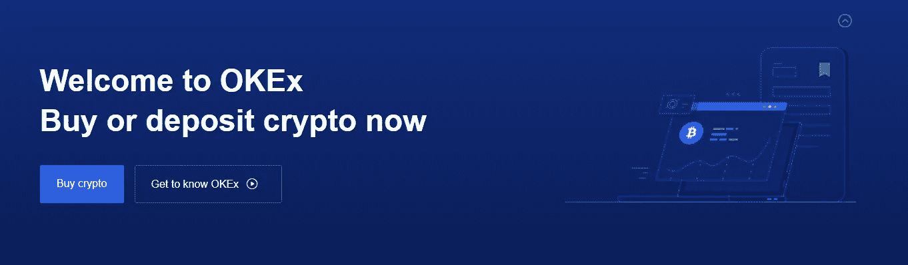
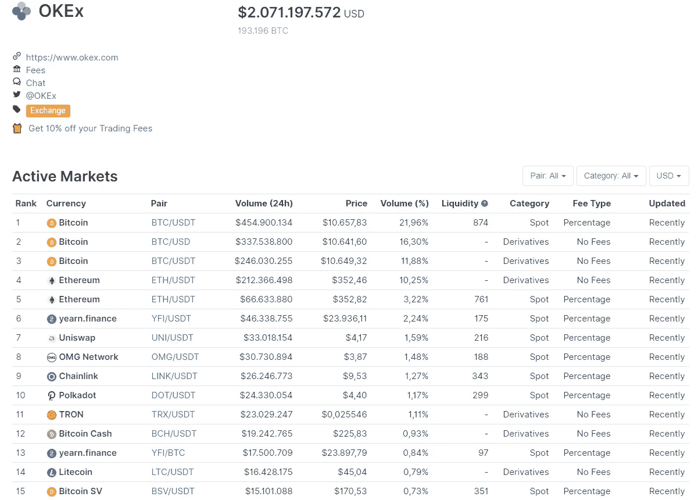
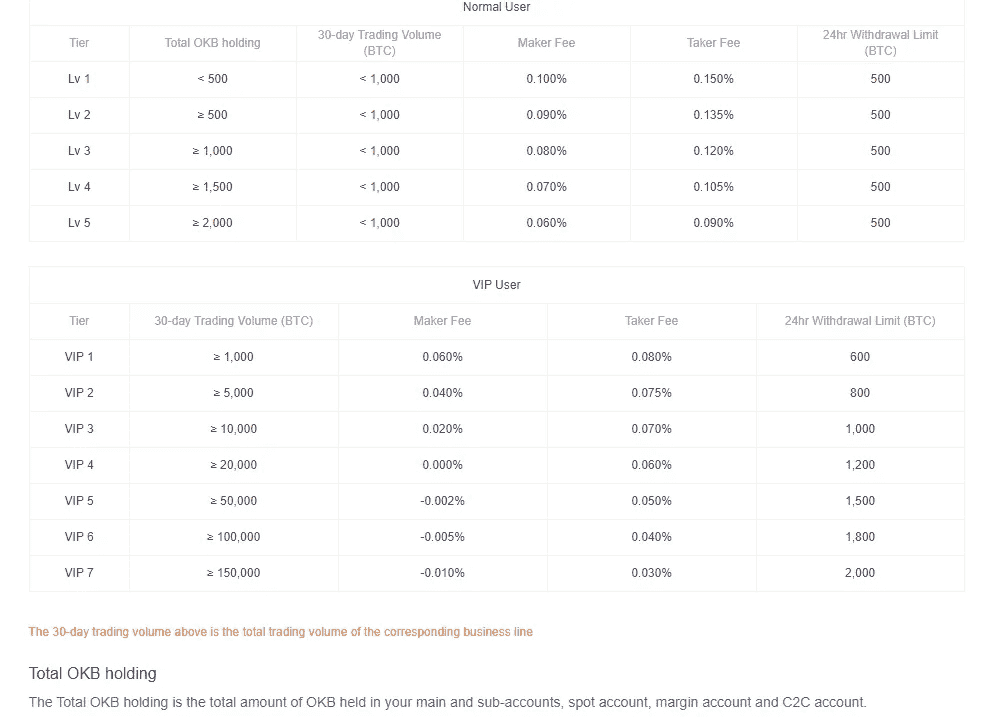
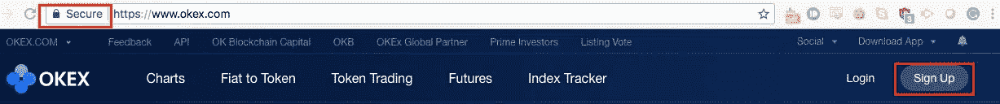
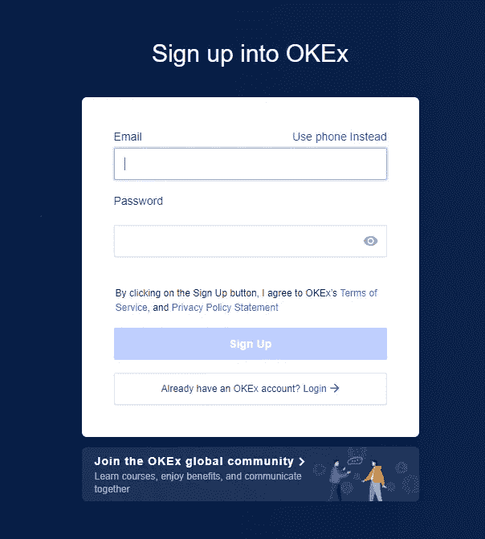
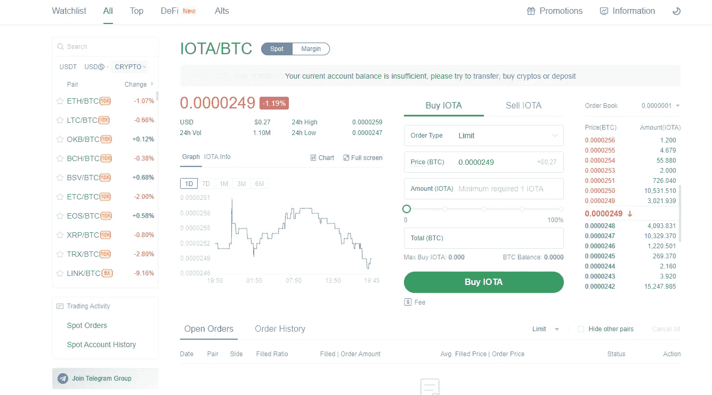
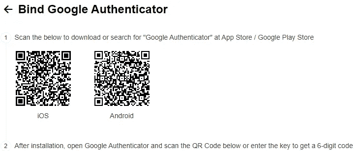

# OKEx 交流经验和指南

> 原文：<https://medium.datadriveninvestor.com/okex-exchange-experiences-guide-61450b993df4?source=collection_archive---------12----------------------->

对于任何加密货币投资者来说，找到合适的加密货币交易所是最重要的任务之一。在我们的 OKEx 交易所评论中，我们为您详细介绍了 OKEx 交易所最重要的事实。在这里，我们将解决一些常见的问题，如“OKEx 交易所安全吗？我们将研究为什么加密货币投资者可能使用加密货币交换，强调任何缺点，并通过简单的演练向您展示如何开始交换。

# OKEx 是谁？

OKEx 交易所是一家领先的加密货币交易所，允许你买卖各种加密货币。该交易所成立于 2014 年，得到了风险投资基金的支持，如巨人网络集团、龙陵资本、策源创投、何谦资本管理公司、鳄龙公司和 VenturesLab(由区块链投资者蒂姆·德雷珀联合创立)的数百万美元投资。

2018 年 4 月 11 日，鉴于其为区块链企业和数字资产交易所提供健全的监管框架的努力，该公司宣布向马耳他扩张。

2018 年 5 月，该交易所成为世界上最大的[加密货币交易所](https://www.okex.com/join/1/2428945)，按报告的成交额计算。

2018 年 6 月，该平台成为推出和提供加密货币交易所白标服务的最大交易所之一，申请人必须拥有丰富的行业经验和 250 万美元的账户

# 2019

2019 年 11 月，香港证券及期货事务监察委员会(证监会)。据路透社(Reuters)报道，OKEx 表示，他们预计不会有很多交易所选择新规定，但表示新规定对该行业是积极的。

2019 年 11 月 19 日加密货币交易所表示，他们之前在开设印度业务的一年前开设了印度电报集团。

2019 年 11 月 25 日，该公司宣布了其全球公用事业令牌“OKB”的四个主要合作伙伴

# 2020

2020 年 2 月， [OKEx](https://www.okex.com/join/1/2428945) 宣布其名为 [OKChain](https://www.okex.com/join/1/2428945) 的区块链将开始测试。总部位于马耳他的加密交易所首次披露，它正在开发一个区块链和分散式交易所(DEX ),并于 2020 年 3 月在其基础上建立。

目前， [OKEx](https://www.okex.com/join/2428945) 拥有全球第二高的加密货币交易量，离与币安争夺第一名不远了。这意味着 OKEx 提供的一些加密货币市场是世界上最大的。随着该交易所在亚洲以外扩大其客户群，我们预计该交易所将继续增长，并增加币安获得市场份额的压力。

coinmarketcap.com

最初，该公司总部设在香港。然而，2018 年 4 月，OKEx 交易所确认将迁至马耳他。OKEx 首席执行官解释说，马耳他不仅是一个对区块链友好的国家，而且在反洗钱标准方面也有更严格的规定。交易所是开放的，并表示这些标准对于保护他们的客户非常重要，这也是此举的一个重要动机。这意味着，如果你正在寻找一家准备对加密货币进行更严格监管的交易所，OKEx 可能是你的正确选择。

# OKEx 交易所评论:重要事实

如果你决定进行加密货币交易，你当然必须知道交易的细节。然后你可以自己决定。我们已经仔细检查了所有的难点，以确保您不会也有这些问题，并在总结中总结了所有要点:

**加密访问:**交易所内有超过 100 种不同的加密货币可供选择。

**第二大交易所:**按交易量计算，OKEx 是全球第二大加密货币交易所。

OKEx 交付到哪些国家？该交易所接受来自亚洲和欧洲的大多数国家。目前，该交易所拥有来自 100 多个不同国家的客户。

**普通货币存款:**与币安等交易所不同，OKEx 允许通过银行转账、Apple Pay 和微信支付进行普通货币存款。

你能在 OKEx 交易所使用信用卡吗？是的，交易所确实支持信用卡支付。

 [## 自白——我绝对不爱比特币|数据驱动投资者

### 这是真的，我已经写了几篇关于比特币和加密货币的文章，它们可能会在明年或…

www.datadriveninvestor.com](https://www.datadriveninvestor.com/2020/09/15/confessions-i-absolutely-dont-love-bitcoin/) 

**高流动性:**小型交易所的问题在于卖单数量可能不足。这意味着，如果投资者想购买价值 500 美元的加密货币，这可能会改变价格。高流动性意味着投资者可以一次性以相同的价格购买他们选择的加密货币。OKEx 拥有世界第二高的流动性，这使得在那里购买加密货币很容易。

**交易杠杆:**OKEx 交易所在加密货币交易中提供高达三倍的杠杆。

# OKEx 交易所交易费用和支付限额

大多数人不会在 30 天内交易价值 600 比特币交易量的 600 比特币以上。这意味着使用该交易所的绝大多数加密货币投资者将保持在 1 级水平。一级交易费用为:

**市场交易:** 0.15%制作费，0.2%参与费。
**期货交易:** 0.03%制作费，0.05%参与费。
**24 小时支付限额:** 100 比特币

这些是详细的费用。

# 为什么要开 OKEx 账户？

OKEx 为加密投资者提供了广泛的加密货币可供选择。它还提供附加功能，如杠杆交易、保证金交易等。我们还喜欢 OKEx 认识到移动应用是一个好主意，迫不及待地等待 iOS 和 Android 应用的适当推出。

与币安等其他加密货币交易所不同， [OKEx](https://www.okex.com/join/2428945) 提供通过银行转账、支付宝或微信支付存放法定货币的能力。这使得参与加密货币市场变得更加容易。

## 登记

登陆 [OKEx](https://www.okex.com/join/2428945) 网站你需要做的第一件事就是检查你是否在官网。不幸的是，许多骗子创建虚假的加密货币网站来模拟真实的交易所。要执行检查，请查看 web 浏览器中的地址栏，并确保看到锁图标和“安全”字样然后你就可以点击注册按钮了。

## 填写登记表

然后，您可以通过电话或电子邮件进行注册。这是由你来决定哪种方法是适合你的。不过，通常我们会很乐意通过电子邮件注册。输入您的电子邮件地址，然后点击“请求代码”这将向您的电子邮件地址发送一个六位数的代码，您可以在“输入代码”字段中输入该代码。然后，您可以输入必要的信息，检查您是否已经阅读了条款和条件，并单击“注册”按钮。

您还将收到一封自动发送的电子邮件，确认您的注册成功。

# 您的首次登录

点击“登录”按钮后，您将首次登录您的 OKEx 账户，并进入“代币交易”屏幕。

# 为您的 OKEx 帐户设置安全性。

一旦你把你的电话号码和你的账户绑定，下一步就是尽可能的保证你的 OKEx 外汇账户的安全。下一步是设置**谷歌认证器**。要做到这一点，打开你的帐户的安全设置，并点击谷歌认证部分的“设置”。

你所需要做的就是扫描屏幕上出现的二维码，并输入在 [OKEx 交易所](https://www.okex.com/join/2428945)中生成的 6 位数代码。要确认在您的帐户中使用 Google Authenticator，您需要点击“获取代码”以通过电子邮件接收额外的代码，并输入该代码以完成 Google Authenticator 设置。

# OKEx 的其他优点

*   获得 100 多种不同的加密货币。
*   就交易量而言，OKEx 仅次于币安，位居第二。
*   该交易所已经获得了许多知名风险投资公司的投资。通常，风险投资家相当聪明，显然认为他们支持了一场伟大的交易所。
*   OKEx 提供特殊的交易功能，比如最高 10 倍的保证金交易，以及最高 100 倍的衍生品交易。
*   该交易所已经经营了四年，历史悠久。
*   简单的界面使交易相对容易。

# 结论

选择加密货币交易所是一个非常个人化的决定。对一个人来说最好的交换对另一个人来说可能是错误的选择。 [**OKEx**](https://www.okex.com/join/2428945) 交易所当然有风险投资家的大力支持，拥有市场上最大的加密货币选择之一。它还为客户提供了比其他交易所更多的功能，使交易所对有经验的密码交易员更具吸引力。

**免责声明:**请注意，本文中提到的加密资产活动是不受监管的。这篇文章不能被理解为投资建议。永远做你自己的研究。

我在每月一期的 [**简讯中分享了更多私密的想法，你可以在这里**](https://mailchi.mp/bf8f8e8ed697/keep-in-touch-with-lukas) 查看。请在评论中告诉我，并在各种社交媒体平台上加入我:

[**推特**](https://twitter.com/WiesfleckerL)●[**insta gram**](https://www.instagram.com/lukaswiesflecker/)●[**脸书**](https://www.facebook.com/lukaswiesfleckerr)●[**Snapchat**](https://www.snapchat.com/add/luggooo)**●[**LinkedIn**](https://www.linkedin.com/in/lukas-wiesflecker-1b11251a5/)**

**无论你做什么，都要带着爱和激情去做！**

## **访问专家视图— [订阅 DDI 英特尔](https://datadriveninvestor.com/ddi-intel)**