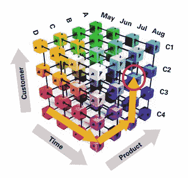
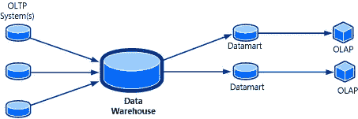
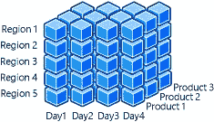

# OLAP 立方体正在改变商业智能

> 原文：<https://medium.datadriveninvestor.com/olap-cubes-are-changing-business-intelligence-b6e0ec91105f?source=collection_archive---------1----------------------->

在研究商业智能工具的过程中，我发现了公司使用“微软魔方”来增强即时分析的趋势。Microsoft 联机分析处理(OLAP)多维数据集是 service manager 中的一项功能，它使用现有的数据仓库基础结构为最终用户提供自助商业智能功能。这种数据结构通过提供快速的数据分析克服了关系数据库的局限性。

配备处理大量数据的设备，同时为用户提供对任何数据点的可搜索访问，以回答各种业务问题。

多维数据集存储在 SQL Server Analysis Services (SSAS)中，可以通过 Excel 和 SQL Server Reporting Services(SSRS)进行访问，以便从多个角度分析数据。一些人将 OLAP 立方体视为数据仓库解决方案的最后一块拼图，以提供数据的即时分析。

# 系统的拓扑结构

OLAP 多维数据集的独特之处在于，多维数据集中的数据可以包含在一个聚合表单中。它还可以即时返回各种问题的答案。这对于用户来说，似乎已经有了答案，因为值是预先计算好的。

服务经理通过以下方式做到这一点:

*   允许您在管理包中定义 OLAP 多维数据集，这些多维数据集将在部署管理包时在 SSAS 自动创建。
*   自动维护多维数据集，无需用户干预，执行处理、分区、翻译和本地化以及模式更改等任务。
*   允许用户使用自助商业智能工具(如 Excel)从多个角度分析数据。
*   保存生成的 Excel 报告以备将来参考。

# 规模

维度相当于管理包类。每个包类都有一个属性列表，而每个维度都包含一个属性列表，每个属性都映射到一个类中的一个属性。它们允许对数据进行过滤、分组和标记。维度还支持层次结构和类别，以便进行更深入的分析。例如，日期具有向下钻取到年、季度、月等的层次结构。

该图显示了一个包含日期、地区和产品维度的 OLAP 多维数据集，提供者:[https://docs . Microsoft . com/en-us/system-center/SCSM/OLAP-cubes-overview？view = sc-sm-2019 #关于服务管理器 olap 多维数据集](https://docs.microsoft.com/en-us/system-center/scsm/olap-cubes-overview?view=sc-sm-2019#about-service-manager-olap-cubes)

# 措施

具有数据仓库基础设施的 OLAP 立方体的基本工具之一是使用度量。度量是用户想要分割、切割、聚合和分析的数值。您可以将计算应用于 for，并以可自定义的格式显示度量。商业智能分析师的大部分时间都花在决定如何计算这些度量上。例如，一个常见的 OLAP 立方体查询对所有正在进行的活动的总时间进行求和。其他常见的聚合函数包括 Min、Max 和 Count。

# 穿透钻取或“向下钻取”

当您想要查看构成 OLAP 多维数据集聚合数据的所有单个事务时，可以使用钻取。对于给定的测量值，可以在最低细节级别检索数据。例如，当您获得一整年和产品类别的销售数据时，您可以钻取该数据以查看该数据单元格中包含的每个表行的列表。向下钻取对预定义的数据层次结构进行操作。

# 关键绩效指标

高层管理人员可以使用关键绩效指标(KPI)来查看组织的健康状况，以及衡量他们实现目标的进展的绩效。您可以创建仪表板来直观地表示 kpu。

# 划分

每个度量值组都被划分为多个分区。分区定义了加载到度量值组中的事实数据的子集。分区对最终用户是透明的，并且对多维数据集的可伸缩性和性能有重大影响。这就是我们如何提高我们的 OLAP 立方体的性能。这部分改进了查询数据的过程。

# 带有可视化工具如 PowerBI 的 OLAP 立方体

OLAP 立方体通过其多维架构对大量数据进行分类。当它收集资源时，不是变慢或浪费时间，一切都已经更新并准备好使用。与此同时，所有的信息都被传输到 Power BI，将两者连接在一起。

Microsoft PowerBI 分析您的数据，并在仪表板中创建可视化效果，以便轻松阅读和解释结果。通过使用多维数据集和可视化改进报告，您的公司将为您的客户提供更好的见解。

大多数数据库都是从“关系”数据库开始的，这是一种基于数据关系模型的数字数据库。如上所述，OLAP 立方体允许多维层的数据。当与微软的 Power BI 结合使用时，这两种工具将相互关联，以创造最佳的用户体验。

例如，假设您正在收集七种不同产品在十年内的月度比较数据。你有一个广泛的因素要审查，并需要从你的来源即时信息，以便立即为您的客户服务。OLAP 立方通过其多维架构筛选大量数据，在收集数据时不会变慢或浪费时间。与此同时，数据被传输到 PowerBI 仪表板，以便可以直观地显示和即时修改。

总的来说，OLAP 立方体允许公司更快、更容易地分析数据，消除了关系数据库的缓慢。多维层改进了商业智能分析师的流程，使他们的工作变得更加容易。

# 资源:

*   [https://docs . Microsoft . com/en-us/system-center/SCSM/OLAP-cubes-overview？view = sc-sm-2019 #关于服务管理器 olap 多维数据集](https://docs.microsoft.com/en-us/system-center/scsm/olap-cubes-overview?view=sc-sm-2019#about-service-manager-olap-cubes)
*   [https://www . clients first-us . com/how-power-bi-and-OLAP-cubes-improve-your-business/](https://www.clientsfirst-us.com/how-power-bi-and-olap-cubes-improve-your-business/)