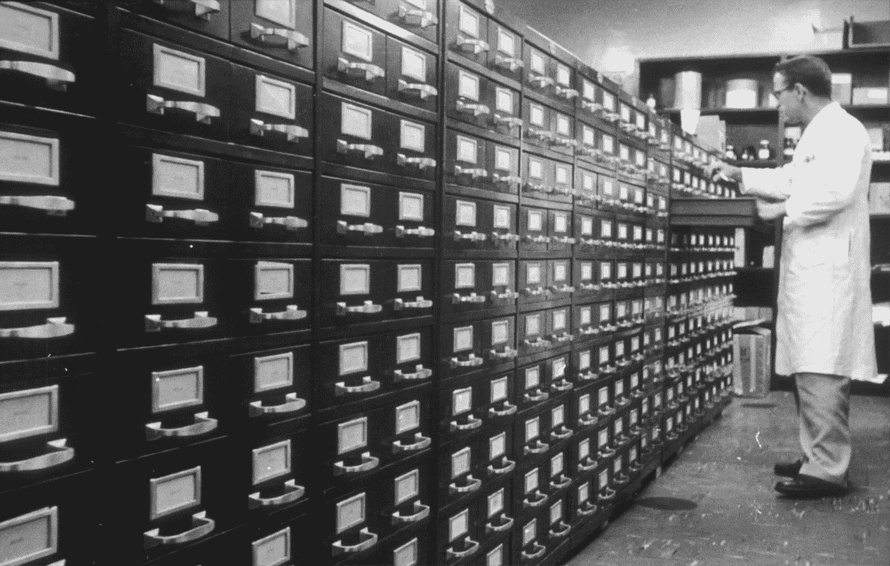
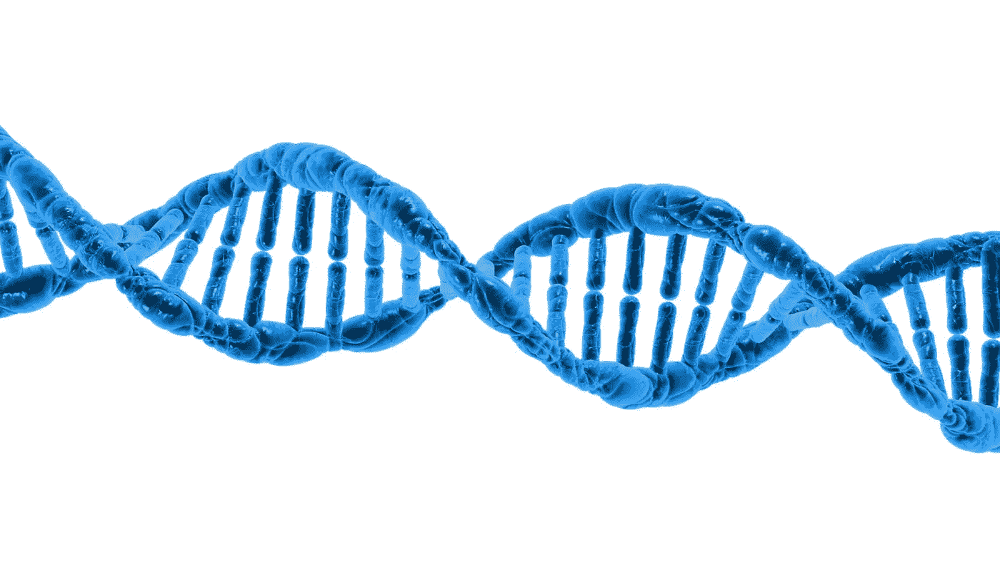
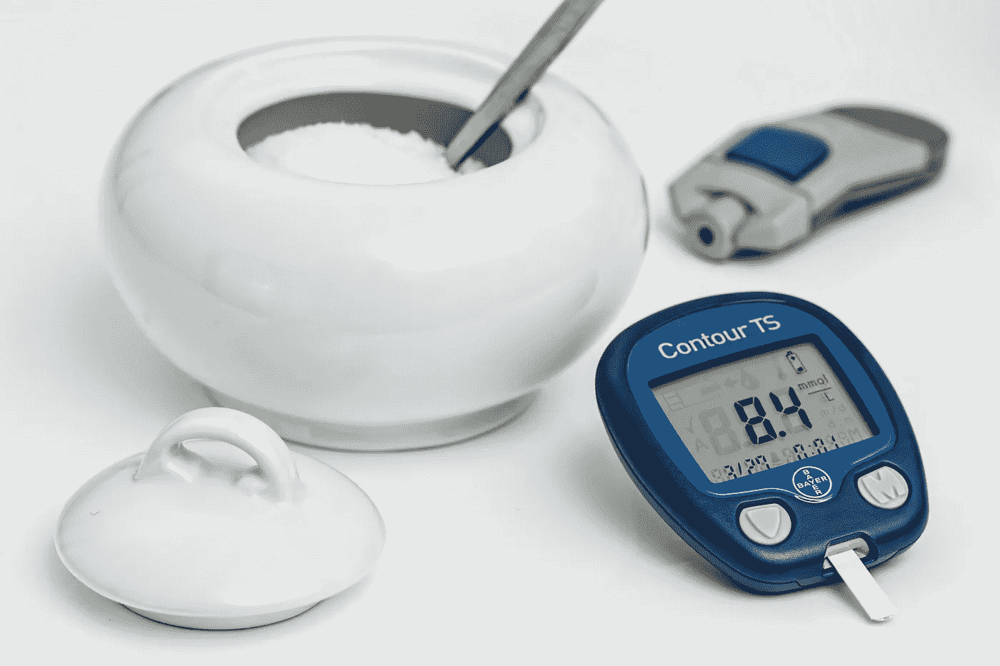

# 陈旧、缓慢、昂贵:这就是制药公司的感受。

> 原文：<https://medium.datadriveninvestor.com/old-small-slow-and-expensive-thats-how-pharma-feels-d0a17901b55?source=collection_archive---------18----------------------->

By [PIRO4D](https://pixabay.com/users/PIRO4D-2707530) from [Pixabay](https://www.pixabay.com/photos/2048252)

# 大量、快速和廉价的数据能帮助发现新药吗？

> “发现新的方法来改善和延长人们的寿命”(诺华)
> 
> “**随时随地，按需改善**人们的生活”(辉瑞)。
> 
> "**通过让人们做得更多、感觉更好、寿命更长来提高人类生活质量(葛兰素史克)**

阅读这些使命声明，最大的制药公司都同意他们希望**改善**我们的生活，尽管他们通过发现新药来做到这一点的可能性很低……除非围绕数据的“大”东西会改变等式。

在 50 年代，制毒是一项伟大的事业。当时，在 R&D 上每花费 10 亿美元，制药公司就能给市场带来 30 种药物。巨额回报、巨大的政治支持和不断扩大的医疗需求造就了我们都知道的制药巨头。

60 年后，没有什么是一成不变的:今天，将一种药物推向市场将花费 30 亿美元，而政治家的支持正在消失，因为医疗费用增加是每个发达国家选举中最棘手的问题之一。

 [## 为什么数据将改变投资管理|数据驱动的投资者

### 有人称之为“新石油”虽然它与黑金没有什么相似之处，但它的不断商品化…

www.datadriveninvestor.com](https://www.datadriveninvestor.com/2019/01/25/why-data-will-transform-investment-management/) 

所以，不管我们在各个领域取得了多大的进步，药物研发已经变得非常缓慢和昂贵。这个观察如此引人入胜，以至于值得起个名字: [**埃罗姆定律**](https://www.nature.com/articles/nrd3681) ，反过来拼就是[摩尔定律](https://en.wikipedia.org/wiki/Moore%27s_law)。

监管和组织障碍、自下而上的科学方法、仿制药竞争导致投资枯竭是这些年来发现的一些原因，尽管对策尚未扭转这一趋势。

Photo by [National Cancer Institute](https://unsplash.com/@nci?utm_source=medium&utm_medium=referral) on [Unsplash](https://unsplash.com?utm_source=medium&utm_medium=referral)

**大数据能帮上忙吗？**

医疗保健领域的大数据预计将在未来几年呈指数级增长，到 2022 年达到 342.7 亿美元[。制药公司被认为是药物发现和开发的希望之地，他们拥有该行业的大部分数据，正在对其进行投资，积累大量的数据储备。](https://www.wiseguyreports.com/reports/795043-global-big-data-in-forecast-to-2022)

持相同观点的大型云服务公司(亚马逊、谷歌和微软)正在通过开发完全合规的服务来投入资金。

到目前为止，还没发生什么事情。

如今，如果我们考虑并包括三个关键因素，就有可能将*临床试验架构*集中在快速、廉价的大量数据电子处理上:

By [PublicDomainPictures](https://pixabay.com/users/PublicDomainPictures-14) from [Pixabay](https://www.pixabay.com/photos/163710)

1.  **更高的模型复杂度**:举个例子“[基因组人类计划](https://web.ornl.gov/sci/techresources/Human_Genome/research/sequencing.shtml)”13 年来的目标是人类基因测序，假设测序将是理解人类生物学和其他领域应用的关键。实际上，该计划证明了对人类基因组中的所有变体进行测序是不够的，问题陈述转移到调查它们与其他信息层的关系，如转录水平，蛋白质水平，代谢物或功能特征。

By [Pixapopz](https://pixabay.com/users/Pixapopz-2873171) from [Pixabay](https://www.pixabay.com/photos/1500720)

**2。更强的偏差**:我们统计使用数据的方式需要改变:尽管大型研究有优势，但大样本量会放大与[采样或研究设计](https://science.sciencemag.org/content/366/6464/447.full)产生的误差相关的偏差。以基因组为例，扩大样本规模不仅需要考虑分子数据的结构，还需要包括和管理所有类型的可用数据(临床、生物样本等)。

By [Pixabay](https://www.pexels.com/@pixabay) from [Pexels](https://www.pexels.com/photo/207381)

**3。新技能稀缺**:临床数据(人口统计、死亡/存活数据、问卷等。)、成像数据(MR、超声波、PET、CT)、生物样本数据(来自血液、尿液等的值)。)、分子数据(基因组学、蛋白质组学等。)，来自可穿戴设备的数据(血压、心率、胰岛素水平等。)，是目前或多或少标准格式可用的数据类型。整合和管理所有这些将需要混合信息技术，统计和医学领域的知识。在这个领域，人工智能和人工智能将会增强，但不会取代人类的智能。

**结论**

对于认真对待这项创新带来的新挑战的组织来说，大数据将是一个绝佳的机会。研究新模型以克服日益增加的复杂性，定义新工具和过程以扩大规模，开发新技能以识别新模式是改进新药发现和开发的积极原则。

___________________________________________________________________

*免责声明:除非明确声明，否则本文中代表的观点或意见是个人的，仅属于文章作者，不代表作者在专业或个人能力方面可能或可能不相关的人、机构或组织的观点或意见。*

___________________________________________________________________