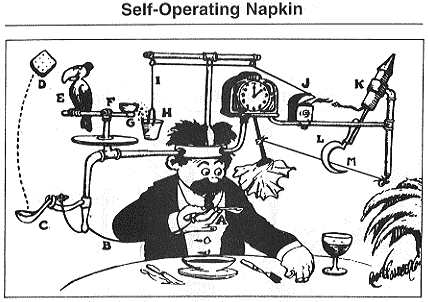
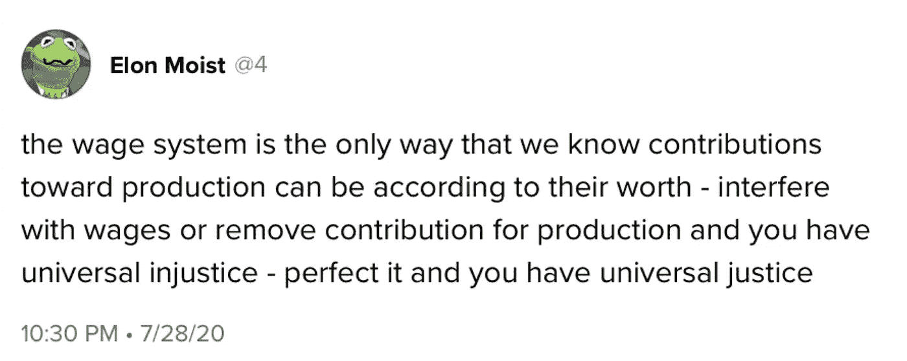

# 业务和利润

> 原文：<https://medium.datadriveninvestor.com/on-business-and-profit-f35c90c3af44?source=collection_archive---------3----------------------->

## 贸易和比特币如何改善社会？

A picture of Henry Ford looking like a boss.

纯粹以赚钱为基础做生意是不安全的。企业和客户之间必须定期自愿交换增值服务。这是做生意的首要衡量标准。创业和贸易始于一个人用自己的头脑为另一个人提供创造性解决方案的美德。目标是让彼此受益，从而提高你周围的生活质量。

> "通过发展和改进而成长的企业不会消亡."—亨利·福特

商业的职能是为消费而生产，而不是投机。虽然一家企业可能会推测客户的未来需求，但这只是作为创造者组织的商业职能的一个子集。一个企业必须为人民服务，而不仅仅是为生产者服务，否则它就会失败(不管它积累了多少资本或欠了多少债)。当一个企业过度投机，榨取价值而不提供价值回报时，客户最终会醒悟过来，离开这项服务，转向竞争对手。

 [## 机器人——商业视角|数据驱动的投资者

### 一个晴朗的日子，你和你的小孩在公园散步，突然你注意到一个身体…

www.datadriveninvestor.com](https://www.datadriveninvestor.com/2020/08/19/robotics-a-business-perspective/) 

单纯以提高股票价格并尽快卖出为目的的股东，在商业上是不可接受的合作伙伴。股东应该通过提供服务和不断将利润再投资到企业中来活跃企业。股息，如果有的话，也应该很少，而且相隔很远。如果你的企业需要调整财务状况——在减薪前取消分红。

尽管现代华尔街和硅谷的趋势是将业务建立在高利贷和 Rube Goldberg 类型的服务产品上，但经营业务的原则非常简单:

*   追求利润是一种道德行为，一个人通过这种行为来提高另一个人的生活质量
*   使用不必要的能源是浪费
*   浪费是一种不能提供最大可能的长期利润的行为
*   以最低的利润将你的产品和服务分发给尽可能多的人
*   总利润是根据销售量计算的
*   分配最高工资，让你的企业与购买力产生自然的共鸣
*   与你和你的企业联系越紧密的人，生存的整体质量就越好

A picture of software made in San Francisco.

一个公司做好事的责任可以定义为提高员工和顾客的生活水平。此外，当顾客也是雇员时，企业可以做最多的好事。这就是为什么你用自己的工作工资制造商店看门人买得起的汽车。这提高了看门人的生活质量，反过来也保证了自己对企业未来成功的兴趣。

Source: [Twetch.com](https://twetch.app/t/c63426a08f0175f93a08f9b718c6b80f48745b9a68db944aee347e224e078cf2)

金钱是进步的衡量标准。收取金钱是必要的，所有那些希望消除金钱概念的人并不是为了对人类的整体进步做出贡献，而是为了控制它。拥有更多钱的最终目标不是退休后坐在游艇上抽雪茄，而是再投资于生产，不断提高生活质量。在商业和自然中，除了死亡之外，没有空闲或退休行为的空间。

我们目前的货币体系不能满足交换和长期财产持有的需要。法定货币在政治上是不稳定的。这是约翰·纳西精心设计并最终为之献身的东西。与以往任何时候相比，政客们争论的不是如何减少债务和政府支出，而是增加多少。无论是民主党还是共和党获胜都没有区别。他们都是抢劫者。他们通过指定他们自己是我们创造的经济的所有者来承担他们对你们的自由和财产的权力。最终，在贸易中寻求法定货币作为记账单位的公司，正把自己作为一种政治工具，屈服于本周的社会正义味道。

好的资金是解决办法。通过持有比特币作为公司财产，并通过交易寻求它，你正在采取措施将这个体系从沙盘转移到石盘。政府实施的法定货币没有一个客观的标准，这使得它容易受到腐败和控制。政府机构，或者更确切地说是执法者，比如国税局或美联储，阻止并榨取个人和企业之间的交易价值。那些最接近印刷法定货币的人拥有囤积货币的优势，并根据他们的政治议程重新分配，以进一步控制普通民众。比特币的工作证明系统解决了这个问题。

比特币是一种优越的货币，因为它允许尽可能多的人在不受干扰的情况下相互交易，并且参与者的总成本较低。普通人拥有的如此之少，商品的成本只会通过税收和国家货币的通货膨胀而增加。

比特币及其以光速进行微交易的能力极大地降低了赚取和交易的障碍，导致每个人的整体收入增加。重要的是，企业家要提前选择做生意的正确记账单位，这样他们才能从上述资金的总体增长中获得最大利益。截至目前，比特币是最合理的选择，因为它提供了最准确、最廉洁的进步衡量标准。

关注我的推特,获取更多精彩文章。

**进入专家视角—** [**订阅 DDI 英特尔**](https://datadriveninvestor.com/ddi-intel)