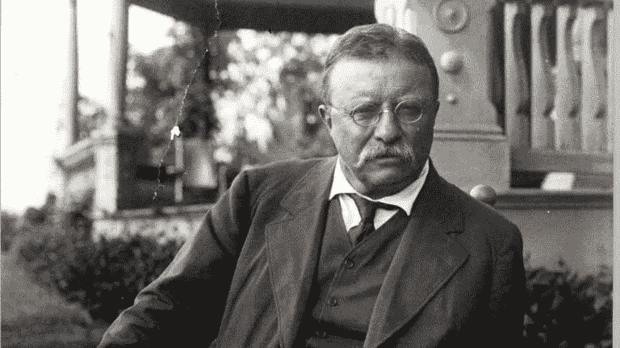

# 关于陈词滥调和信念

> 原文：<https://medium.datadriveninvestor.com/on-clich%C3%A9s-conviction-9ebfd8396591?source=collection_archive---------8----------------------->

西奥多·罗斯福的话，而不是“积极的氛围”，是如何帮助这位自主创业的创意人士熬过 2020 年的。

Theodore Roosevelt

像数百万美国人一样，我拥有并经营着一家小企业。像数百万美国人一样，2020 年让我经历了一场考验。

很多人花时间问我过得怎么样。我是一个健谈的人，甚至是一个过度分享者，所以这是一个很好的指标，表明今年有多艰难，我*不喜欢回答这个问题。我不想用语言来描述我的大脑是如何像一个被踢的蜂巢，每个想法都像一只愤怒而恐慌的大黄蜂一样飞来飞去。*

有时候当我没说什么的时候，人们会更仔细地看着我，然后重复:

*不，真的。你好吗？*

有几次我开始认真发泄并且*真的*回答上面的问题，陈词滥调的回答比比皆是:

*想想你有什么值得感恩的！*

*情况可能会更糟！*

你需要带着感激生活！

但是你有你的健康！

不仅仅是你——每个人都过着糟糕的一年！

甚至:

哦，哇，你发出了一些非常负面的情绪。

每次我都会想，好吧，别胡扯了，然后感到内疚和羞耻。在我最后一次按照这些思路交流后，我丈夫告诉我一个他听到的很棒的比喻，将 2020 年比作海上的一场大风暴。我们都在同一个风暴中，但我们都在不同的船上经历它。

我被告知要记住，我们不是在木筏上度过过去的一年，要感谢我们的独木舟。但是大多数人告诉我，在一些非常适合航海的船的甲板上。

就像我丈夫说的，几个大浪就能让我们的独木舟很快变成木筏。

我想引用一句话，如果这句话被更多人分享，可能会很快变成陈词滥调，让我变成一个伪君子:

> 重要的不是批评家；不是指出强者如何跌倒，或者实干家在哪里可以做得更好的人。荣誉属于真正站在竞技场上的人，他的脸上沾满了灰尘、汗水和鲜血；勇敢奋斗的人；谁犯错，谁一次次功亏一篑，因为没有不犯错误和缺点的努力；但是谁真正努力去做这些事情呢？谁知道伟大的热情，伟大的奉献；他把自己奉献给一个有价值的事业；谁最好知道最终高成就的胜利，谁在最坏的情况下，如果他失败了，至少失败而大胆，所以他的位置永远不会与那些冷漠和胆小的灵魂不知道胜利和失败。西奥多·罗斯福

很少有人问我过得怎么样，似乎很欣赏这个竞技场。我甚至意识到，许多人不仅仅是批评家，而是尽职尽责地让自己平静下来，走向失败。

几年前我读过罗斯福的名言，但在过去的一年里，我痛苦地感受着每一行。我的手臂因为挥舞着传说中的剑而酸痛。我已经跌跌撞撞，崩溃了很多次，疲惫，恐惧，渺小。

有一次，我丈夫担心他不得不卖掉他从 18 岁开始收集的所有工具，每一件都是精心设计的投资，现在为整个制造车间供货。这不是一个抓着自己心爱玩具的小男孩的恐惧。我丈夫的工具是他双手的延伸，是他创造的管道，通过他的工作，他如何提供和保护。反过来，他提供和保护的能力构成了他道德的基石。

以我对他的了解，听到他说出那种恐惧是对马蜂窝最迅速的一击。人们描述你的胃在下降的感觉；我对自己的恐惧是如此的原始，以至于我的胃都沉到了地板上。我变得如此害怕，以至于我敏锐地感觉到了自己鞋底粗糙开裂的纹理。

他简短的坦白让我意识到，他不仅跌倒了，而且他认为没有必要再站起来。

然后鸟巢变得平静了。嗡嗡声停止了。我的恐惧是如此巨大和深刻，以至于一切都变得安静和静止。我向他保证他永远不会卖掉他的工具。我惊讶于我的声音是如此坚定和有控制力，我的信仰是如此绝对。

当我把丈夫从满是灰尘的地上拉起来时，我发现自己还有力气。在举起他的重量时，我能恢复平衡，并阻止对手下一次向我们发起的攻击。

在 2020 年经营一家小企业并不像成为一名角斗士。当然没人会拿剑穿过我们。

但是仅仅因为不接受失败，我们赢得了一场旷日持久的胜利。

大多数问我近况如何的人很少想知道竞技场的*到底是什么样子的。当他们听到我描述如此无情和不可预测的事情时，他们唯一的办法就是提供一些印在他们带到瑜伽课上的水瓶侧面的陈词滥调。*

那些已经进入竞技场的人——或者，有时更痛苦的是，后悔没有继续战斗——的反应与那些建议我列出感恩清单或展示自我肯定的坚固船只的乘客截然不同。

了解竞技场的人告诉我们要勇敢奋斗。努力去做。大着胆子。

他们告诉我们:

*把一只脚放在另一只的前面。*

*不要放弃。*

这很难，但你必须坚持下去。

*坚持下去。*

我花了一段时间思考，在我丈夫担心卖掉他的工具后，我的注意力是如何变得更加集中的。

许多词汇浮现在脑海中，比如爱、绝望、必要性、勇气、毅力和信念。但是，最终，它没有爱情、绝望和需要那么戏剧化。它不那么令人钦佩，公开强硬的勇气和毅力。它不像信仰那样神圣。

信念只不过是一种坚定的信念或观点，而一切都是由这种信念或观点点燃的。这就像决心，但更多的是由你个人的道德和目的所驱动。出于这个原因，定罪更私人，更主观，也更容易出错。

罗斯福谈到竞技场上的人“谁犯错，谁一次又一次地失败。”批评家只看到许多有缺陷的尝试，而没有看到每一次努力背后的驱动力或信念——巨大的热情，巨大的奉献。信念是一种精神上和情感上的挺直下巴和挺起肩膀的行为，不会被任何从外面往里看的人看到。当你做的最难的事情几乎不为其他人所察觉时，就没有虚荣或自负的余地了。

信念只不过是把一只脚放在另一只脚的前面而点燃的一切。

罗斯福的舞台形象——暴力、无情、如此毁灭性的孤独——无疑考验并强化了你的信念。有了足够的信念，你会不断地跌跌撞撞，摇摆前进，即使这意味着一次又一次地失败。

这是一个不浪漫和原始的事实。这不是一个转化为流行的自助口号，或者可以归类为散发积极或消极的氛围。但事实是——坦率而孤立的事实——是信念让你坚持下去。

我不知道新的一年会带来什么。但我对 2021 年充满希望。我甚至有一丝证据证明我悲观的乐观，这种证据既不是隐喻也不是陈词滥调:

我丈夫一件工具都不用卖。他甚至投资了一些新的。

**访问专家视图—** [**订阅 DDI 英特尔**](https://datadriveninvestor.com/ddi-intel)

劳伦·阿玛莉娅·雷丁是生活在佛罗里达州那不勒斯的艺术家和作家。2018 年，她从纽约市搬迁到墨西哥湾沿岸，与丈夫、雕塑家布雷特·f·哈维(Brett f . Harvey)**共同创立了* [*H & R 工作室。你可以通过访问【www.laurenredding.com】*](https://handrstudio.com/)***了解更多关于她的工作。****