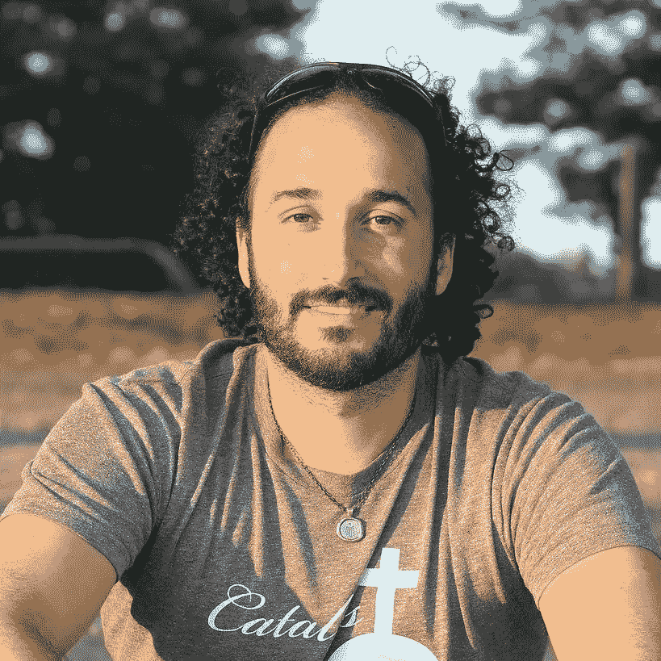

# 斗争是真实的

> 原文：<https://medium.datadriveninvestor.com/on-fighting-the-urge-to-gamble-855f32f166d4?source=collection_archive---------13----------------------->

## *对抗赌博的冲动*

myself

我以为我已经克服了赌博成瘾。几个星期以来，人们几乎没有赌博的欲望。我甚至告诉我的匿名赌徒组织，我认为我不再需要他们了。

> 他们笑了。
> 
> 他们说我愚蠢。

没关系。我会给你看的，我想。

我再也不赌博了。

别管交易了。别管扑克了。刮掉，没门。

我已经想通了。我将致力于我的爱好。我的激情。

我会每天都写。弹我的吉他。

赌博太过时了。

我已经准备好向前看了。

只是，当我感到沮丧或绝望时，我会打个赌。

> 对我来说，这不是钱的问题。而是要行动起来。是关于逃跑的。我不需要下很大的赌注，但你可以打赌，如果我失去了最初的存款，我会再次买入。

我肯定会追我的损失。我已经证明了这一点。

那样的话，损失会很快增加。很快，我几乎不够支付账单。我通常会给自己留足够的空间勉强通过。

## 我会破产的。

我可以把钱花在我自己身上，或者花在我爱的人身上。相反，我赌输了。

那么，现在是怎么回事？

> 我在努力克制自己想玩低注额在线扑克的冲动。你知道，在几周内磨我的帐户，并不断增加赌注，直到我再次与大男孩玩。

再说一次，这不是钱的问题。它是关于行动和逃避。

 [## 保护移动医疗应用的安全:在 COVID 时代，开发者如何保护用户数据的隐私

### 远程医疗和移动医疗空间可以采取简单、基本的步骤来更好地保护用户数据免受攻击。医疗保健…

www.datadriveninvestor.com](https://www.datadriveninvestor.com/2020/12/18/keeping-mhealth-apps-secure-what-developers-can-do-to-keep-user-data-private-in-the-age-of-covid-and-telemedicine/) 

**每当我赢了，总是不够。**

每当我赢了，这只是下一次赌注的更多弹药。

更高的赌注。更高的赌注。直到，我不可避免的失去这一切。

那我就重新开始。

但这一次，我的目标是不再赌博。我不打算继续下去了。我可以。太简单了。

**即时存款。即时行动。**

但我不会。

我会继续写作。我会再次拿起我的吉他。

是的，我很沮丧。但是我以前也抑郁过，我克服了。

> 我知道赌博的结果。它会导致更深的抑郁和自杀的想法。这会导致危险的行为。它导致毁灭。它会导致死亡。

我不会踏进那扇门。

## 我会选择生活。

我会努力享受生活。满足于我所拥有的。

*我写这篇文章是为了理清思路，明确不赌博。如果您已经花时间阅读了 is 的文章，谢谢您，我希望它对您有所帮助。*

如果您有赌博问题，请随时拨打 1-800-赌徒

## 访问专家视图— [订阅 DDI 英特尔](https://datadriveninvestor.com/ddi-intel)