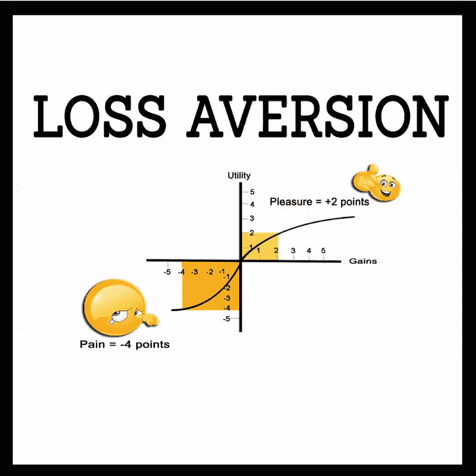
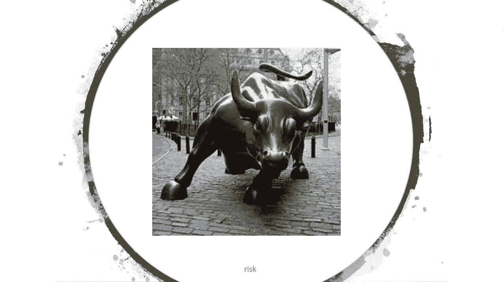

# 论投资风险与投资者心理

> 原文：<https://medium.datadriveninvestor.com/on-investment-risk-investor-psychology-616fe8147cca?source=collection_archive---------11----------------------->

## 作为投资者，我们必须不断更新我们对风险的认知。

在熊市或牛市中，投资者往往会做与他们应该做的完全相反的事情。不幸的是，自新石器时代以来，人类就习惯于尽可能快地逃离危险，对着我们的肺部大喊:“不要去那里！那边有只熊！”

一分钟后，我们所有的朋友都在火上浇油，说:“我不想引起恐慌，但那边的那只熊越来越近了，它露出了它丑陋的大牙齿！大家快跑！”

几分钟后，另一个朋友跑过来对你说，“你听说过那只又大又丑的熊吧？我刚听说他在约翰逊家的厨房翻找士力架！幸运的是，他们不在那里，但他们在他们的安全摄像头上看到了，并广播到他们的手机上。我们得走了，兄弟！”

一个接一个，坏消息像野火一样在社区传播。因此，当市场变得动荡时，散户投资者往往会做得过头，过度补偿他们的损失。换句话说，在风险市场中，我们更有可能做我们知道不应该做的事情。我们低价出售高价买进的东西。这让我们感觉更好。

毕竟，那边有一只大坏熊。👆🏼

这种现象是市场恐慌时发生的典型的“绝望时刻”。低价引发低价的速度比高价引发高价的速度更快。很简单的避险心理。诺贝尔奖得主心理学家和经济学家丹尼尔·卡内曼早在 1979 年就总结道:“一个人失去一笔钱时的痛苦似乎大于得到同样多钱时的快乐。”

他甚至试图在失去或获得相同数量时，对情感上的损失给出一个数字。那个数字？我们对损失的恐慌程度是同等金额的收益的 3.1 倍。这种现象被称为损失厌恶。

Investors must internalize the implications of Daniel Kahneman’s loss aversion theory.

为了成为更好的投资者，我们必须深入了解我们与风险的个人关系，以及我们作为一个物种的原始冲动。[战斗或逃跑反应](https://www.verywellmind.com/what-is-the-fight-or-flight-response-2795194)决定了每个人应对压力的方式。这是没有办法的。所以我们只需要理解它。当我们感知到压力时，我们身体的交感神经系统会启动一系列自动化的生理反应:瞳孔放大、心率加快、皮肤苍白和身体颤抖。

 [## 利用股市相关性的最佳方式|数据驱动的投资者

### 当阿尔弗雷德·温斯洛·琼斯开创了世界上第一个“对冲”基金(后来“d”被去掉了)时，他让其他投资者大吃一惊…

www.datadriveninvestor.com](https://www.datadriveninvestor.com/2020/02/02/the-best-way-to-use-stock-market-correlations/) 

荷尔蒙的大量释放通常会导致这些身体反应。分泌到血液中的主要激素是肾上腺素，它基本上会让人感觉好像喝了一整箱红牛。你感受到的压力越大，你的身体分泌的肾上腺素就越多。为什么？

肾上腺素帮助你的肺部充满空气，并将血液输送到身体的各个部位，这样你就可以逃离这只熊。👇

因此，在熊市中，大多数投资者尽可能快地逃离是有道理的。比特币最近于 3 月 12 日迎来的[“黑色星期四”就是一个卖盘引发卖盘趋势的例子。就变成了盲目的冲出门外，所有的出口都人满为患，让市场找不到底部。](https://www.independent.co.uk/life-style/gadgets-and-tech/news/bitcoin-price-latest-crash-coronavirus-cryptocurrency-why-a9396601.html)

但是在牛市中会发生什么呢？在这种情况下，加密货币在 2017 年下半年经历了所有这一切，散户投资者甚至不会考虑风险。看起来有点像这样:

你看到公牛下面那个小小的四个字母的单词了吗？这就是风险。在一个收益惊人的牛市中，即使是最新的 noob 也获得了 400%的回报，或者当 reddit 上的 [rando dudes 从完全没有商业模式的公司的期权中获得巨额收益](https://www.bloomberg.com/news/articles/2020-02-26/reddit-s-profane-greedy-traders-are-shaking-up-the-stock-market)，这就是风险所在。一个你不敢提及的四个字母的单词。

这就是不幸的部分。在金融市场中，当价格相对较高而没有人谈论风险时，风险实际上是最高的。我们周围的人都在这么做。

好像他们都在说，“进来吧！水没问题！”

然后，以某种方式，狗屎击中风扇。

作为投资者，我们必须让自己做与荷尔蒙要求我们做的完全相反的事情。我们知道我们必须做什么。有史以来最伟大的投资者一遍又一遍地告诉我们该怎么做。罗斯柴尔德勋爵。约翰·洛克菲勒。沃伦·巴菲特。他们说的都差不多。做与你战斗或逃跑反应相反的事情。

在街上有血的时候买。

然而，一次又一次，在牛市中，散户投资者从不获利，几乎总是在牛市最高潮时追加投资……而在熊市中，他们持有亏损的时间太长，最终在市场最低谷的时候卖出。这正是我们在美国有如此不成比例的基尼系数的原因。任何时候，只要工人阶级嗅到一丝改变生活的财富，就像钟表一样，市场就会把他们打回日常生活。

# 我们如何避免战斗或逃跑的陷阱？

投资者必须熟悉自己最私密、最发自内心的情感。学习和思考可以帮助你潜入深渊。当你这样做的时候，你就把上面那个暴牙暴牙的家伙变成了一个可爱的泰迪熊，你可以和它打交道。

反向投资的本质是假设最坏的结果，并为其发生做好准备。我自己对此并不十分擅长，但我可以自豪地说，考虑到这些建议，我对 2020 年市场崩盘的准备远远超过了对 2008 年市场崩盘的准备。

在这些充满风暴和压力的时刻，正是这些小事让我坚持下去。