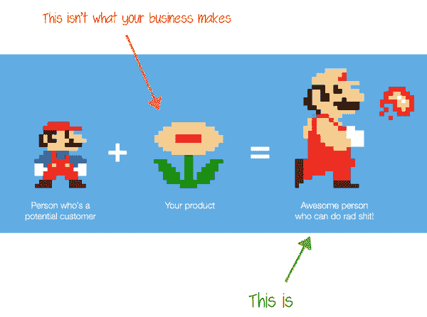
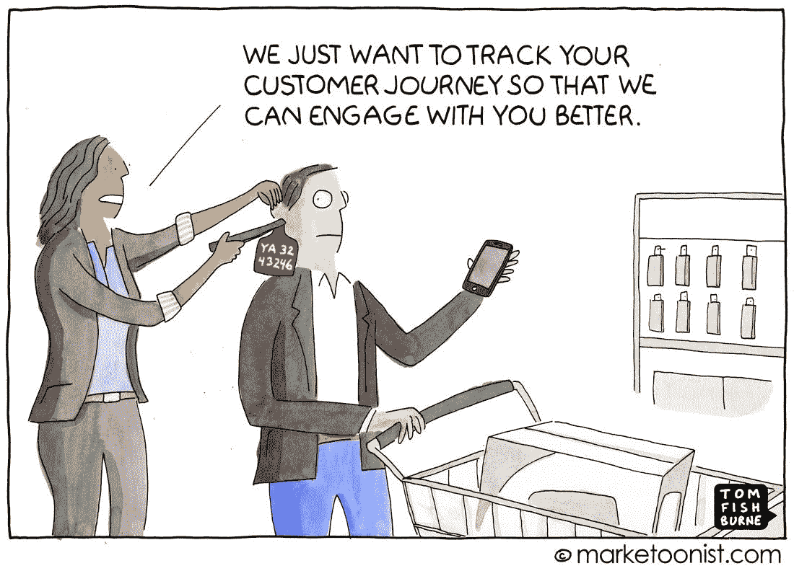
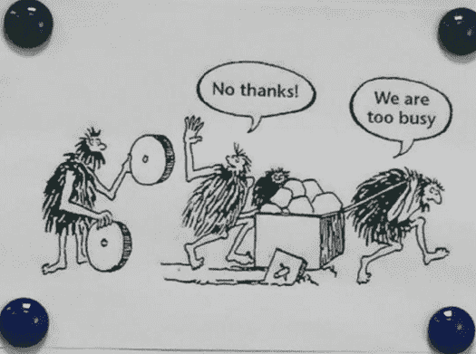

# 通过做不可扩展的事情来扩展

> 原文：<https://medium.datadriveninvestor.com/on-scaling-by-doing-things-that-dont-scale-77ae941bacb6?source=collection_archive---------3----------------------->

## 来自风险投资家的 5 个永恒的教训

[Pixabay](https://pixabay.com/photos/child-tower-building-blocks-blocks-1864718/)

杰夫·贝索斯曾经说过:

> “我经常被问到这样的问题:‘未来 10 年将会发生什么变化？’我几乎从来没有得到过这样的问题:‘未来 10 年什么不会改变？我认为第二个问题实际上是两个问题中更重要的一个。"

我们经常阅读、听到和看到世界是如何变化的。新战略、新技术、新产品和服务……然而，在雷达下飞行的是大多数*下一件大事*本质上作用于*最重要的事情*:几代人保持一致的基本原则。因此，事情越是变化，就越是一成不变。

当 [Sajith Pai](https://www.linkedin.com/in/sajithpai/) 在 [100X 企业家播客](https://www.linkedin.com/redir/general-malware-page?url=https%3A%2F%2F100xentrepreneur%2ecom%2Fpodcasts%2Fsajith-pai-blume-ventures-on-building-personal-brands-being-open-minded-and-unlearning-to-succeed%2F)上发言时，我发现了更多的证据。

Sajith 分享了他走向 VC-dom 的意外旅程的故事，以及对投资 ed-tech 和 agri-tech 等新兴领域的新颖观点。但他为达到现在的位置所做的很多事情，以及他为把自己和 Blume VC 带到他们想去的地方所做的事情，都源于一些不变的基本原则。

在这一块，我就不解剖他对投资的想法了(因为我不是 VC)。相反，我将分享五条永恒的智慧之珠，这五条智慧之珠对我来说很突出，也告诉我无论在哪个领域，任何人都可以应用它们。

## 1.过程>工具或结果

> “与其说是工具，不如说是过程。”

我们都喜欢想象在我们实现目标后会有多好。但是遵循一个过程来实现这个目标会把我们推出舒适区。在一个沉迷于即时满足的世界里，这是我们不想要的。最终，我们放弃了。

当我们发现一个新工具时，我们会再次开始追求目标，通常会有相同的结果。(帮助人们克服即时满足瘾的创业想法听起来如何？)

然而，成功人士强调过程的重要性。

播客中经常出现的两个词之一是*过程*。自 2012 年以来，Sajith 遵循并完善了系统分析和撰写投资机会的流程。他建立了一个收集和检索笔记的过程，当他需要深入思考或写文章时，这被证明是至关重要的。

这些过程使他能够持续不断地生成创造价值的内容，并帮助他实现自己的目标。(作为一个做大量笔记的人，我赞同他的观点，即记笔记和访问是被低估的超能力。)

要点:我们很少能控制结果，但能完全控制过程。不管你的工作是病毒式的还是隐形的，都要关注后者。随着时间的推移，复合效应将产生显著的效果。

## 2.要打造一个强大的品牌，不要卖。

> “如果你持续不断地创造或分享有趣或有用的内容，你就有很好的机会(建立思想领导力)。]"

价值投资者迈克尔·莫布森[认为今天人们之间的绝对技能差距已经模糊。因此，运气在影响结果方面扮演着重要角色。大多数机会都以意想不到的方式出现。如果我们建立了正确的职能技能，当机会出现时，我们就能更好地利用它们。](https://research-doc.credit-suisse.com/docView?language=ENG&format=PDF&source_id=em&document_id=805456950&serialid=LsvBuE4wt3XNGE0V+3ec251NK9soTQqcMVQ9q2QuF2I=)

Sajith 的重点是为意外情况创造条件，最终形成巨大的投资机会，这与此完全吻合。他通过内容创造这样的条件。不是那种捶胸顿足的*、*那种“看上去令人印象深刻”的那种……而是那种提供行业洞察、帮助读者形成深刻世界观的那种。

在一个被糖精淹没的世界里，这种洞察力需要额外的奖励。正是这一点让 Sajith 对 Blume VC 有吸引力，也让企业家和记者对他和公司感兴趣。企业家希望与 Sajith 建立联系并获得他的见解，这也让他能够获得他感兴趣领域 70 %- 80%的投资机会。

(我花了很多个周日下午读他见解深刻的 TL；推特博士。Sajith 还慷慨地分享了他对我的关于建立思想领导力的电子书[的内容创作过程的见解。)](https://content-sutra.com/thought-leadership-guide/)

“真正的颠覆者不仅改变了人们对产品的看法，还改变了他们对自己、行业和世界的看法，”[阿里·梅斯](https://medium.com/u/d43c46db5b92?source=post_page-----77ae941bacb6--------------------------------) [写道](https://medium.com/swlh/to-build-a-business-empire-own-an-opinion-not-a-marketing-budget-5834db08810c)。“他们卖的不是一种产品，而是一种全新的思维方式。”

要点:如果你能改变人们对你所在行业的看法，你就能改变他们对你的看法。你将建立一个强大的声誉，从而与有影响力的人建立更好的关系，并转化为长期收入。

## 3.消费者数据是护城河。

> 如果你对入侵军队的唯一防御是护城河，你不会坚持很久。重要的是创新的速度。这是竞争力的根本决定因素。——埃隆·马斯克

许多企业专注于护城河，希望它们能捍卫自己的市场份额。他们认为他们的功能丰富的产品或聪明的、重新包装的商业框架是护城河。但是任何容易复制的东西，或者客户觉得没用的东西，都不是护城河。

Sajith 给创业公司的建议？不要在早期阶段关注护城河。关注未解决的问题，收集消费者数据，并利用这些数据改进产品。这条建议不仅对初创公司有用，甚至对知名品牌也有用。

当 LinkedIn 的一个团队为招聘人员分析其旗舰产品的数据时，他们意识到，在前 30 天使用该产品的客户继续使用 LinkedIn 的可能性是其他客户的四倍。因此，该团队创建了“入职专家”，他们为客户做一些工作，然后打电话给他们展示产品如何工作。

如果客户想在亚利桑那州雇佣一名软件工程师，入职专家会设计一个搜索来帮助客户找到符合条件的人，并指导她调整搜索参数，等等。两年之内，客户流失率下降了大约一半，年收入激增至数千万美元。([来源](https://www.amazon.in/Upstream-Quest-Problems-Before-Happen/dp/1982134720)

同样，SaaS 公司可以分析数据来吸引客户并提高产品使用率。从长远来看，他们可能会雇佣更少的编码人员，更多的能够发现模式并帮助解决棘手的客户问题的入职专家。这难道不会让产品更有用吗？

*要点:关注顾客。制造他们觉得有用或新颖的产品。久而久之，你的企业就会变成一个强势的品牌，这个品牌本身就变成了一个护城河。*

## 4.解决巨大的消费者摩擦。

> "当你解决一个巨大的消费者摩擦时，你如何令人信服地解决它就成了你的护城河."

COVID-19 是一台时光机，它让某些行业前进了五年，而让其他行业倒退了十年。它改变了我们的很多行为。这些变化有些是暂时的，有些是永久的。

例如，在一线和二线城市，业余爱好活动可能是暂时的，因为人们可能很快就会恢复正常。但是我们可以看到在线兴趣班在小城镇的广泛采用，在那里人们过去不能接触到它们。简而言之，非消费者的访问问题是永久性的，解决起来更有用。

所以在审视一个问题的时候，问问你自己:我们是在解决一个暂时的问题还是一个永久的问题？我们正在解决接触历史非消费者的问题吗？我们正在解决引人注目的消费者摩擦吗？

英特尔为印度农村消费者设计了电池寿命更长、外壳防尘的笔记本电脑。MittiCool 为那些用不上电的人制造家用电器。 [Unacademy 使学生能够不受地理位置或考试成绩的限制，接触到该国最优秀讲师的课程。](https://content-sutra.com/blog/attract-customers/)

*秘诀:解决看似紧迫的问题很容易，甚至有利可图。但重要的是要思考这些问题是否是永久性的。*

## 5.忘掉，忘掉，忘掉。

> “有意思。”

这是 Sajith 在播客中经常使用的第二个词。这让我想起了对丹尼尔·卡内曼的一次采访，每次采访者分享不同的观点时，他都会说:“这很有趣。请继续。”

Sajith 对他微弱的坚定信念毫无歉意。他甚至愿意在两个月后改变自己的信仰。(因此，如果这篇文章中的某些内容与他所说的不一致，请不要让我承担责任。)

但是大多数时候，我们坚持自己坚定的信念，就好像它们是一艘正在下沉的船上的救生衣，而事实上，这些信念就是这艘正在下沉的船。缺乏 30 岁以上的创业者可能表明我们是如何屈服于“这就是现状”的心态。我们拒绝学习和忘却。我们关注多米诺骨牌，而我们应该关注它们之间的空间。这些空间才是真正的机会所在。发现它们需要大量的遗忘。

一个不需要学习的方法是[苏格拉底式的方法来浏览论点](https://en.wikipedia.org/wiki/Socratic_method#:~:text=The%20Socratic%20method%20(also%20known,out%20ideas%20and%20underlying%20presuppositions.)。另一种方法是按照 James Altucher 的建议，用问号代替每个句号(尤其是那些与你的想法相关的句号)。你会收集大量的问题，并更好地为自己思考。

*要点:忘却是学习的一部分。可持续的成长来自心智和情感的成长，而心智和情感的成长来自学习。*

# 总结

我从这个播客中得到的五个要点是:

*   关注过程多于工具或结果。
*   要建立一个强大的品牌，分享见解而不是销售。
*   你的消费者的数据是你最大的护城河。
*   解决巨大的消费者摩擦。
*   忘却。

成功源于正确的事情自然而然地发生，而不是源于个人才华或激情的闪现。

关注那些不重要的事情。在这些坚实的基础上构建有意义的东西变得更容易扩展。