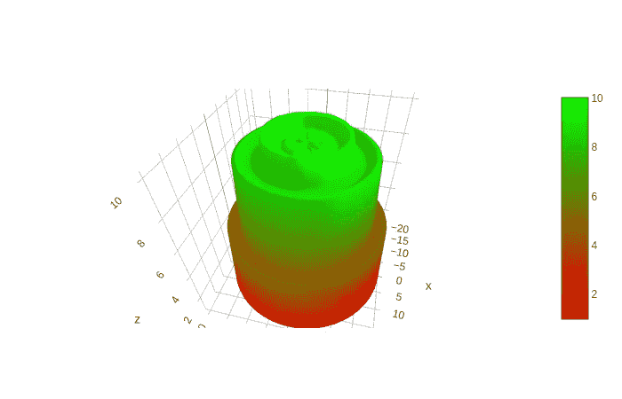

# 论系统健康指标(上)

> 原文：<https://medium.datadriveninvestor.com/on-systemic-health-indicators-part-1-d3acad55da57?source=collection_archive---------22----------------------->

在一个对人们来说变得更加复杂的世界里，判断事情是否“进展顺利”变得更加困难。经济学家和政治家传统上使用“国民生产总值”(英文为 GNP 或 GDP)来表示这一点:毕竟，如果一个经济增长，我们都会从中受益。

近几十年来，很明显，这种经济增长，当然是自工业革命以来的经济增长，也带来了一些相应的损害，特别是在社会领域(例如，日益加剧的不平等)和我们的生活环境(污染、原材料贫瘠、生物多样性减少等)。

 [## 为什么包容性财富指数比 GDP 更能衡量社会进步？|数据驱动…

### 你不需要成为一个经济奇才或金融大师就能知道 GDP 的定义。即使你从未拿过 ECON 奖…

www.datadriveninvestor.com](https://www.datadriveninvestor.com/2019/03/08/why-inclusive-wealth-index-is-a-better-measure-of-societal-progress-than-gdp/) 

我们当然可以很好地衡量许多事情(例如，收入不平等的基尼系数)，但这些指标大多只能衡量非常肤浅的方面。假设这些指标中的一些突然朝着令人担忧的方向发展，这可能表明一些潜在的东西已经发生了变化。我的意思是:我们只测量潜在系统的症状方面。就像体温升高是全身压力导致的症状一样。

## 系统指标

例如，当涉及到寻找包含系统方面的新指标时，很容易想到“循环”链。荷兰标准化研究所 NEN 是发展指标，它应该给出某个业务部门的“循环”程度的指示。这无疑是朝着正确方向迈出的一步。

更多的技术方面着眼于系统中的“连接性”。例如，2008 年金融危机造成的全球损害被归因于全球范围内“连通性”的增强:一切都相当直接地与全球金融市场相连。连通性不一定是好的或坏的，但它确实说明了一些问题。另一个技术方面是“集中”(如“系统性银行”)。这些都是我们或多或少可以衡量的东西。但归根结底，这些也是“症状”或“方面”:连通性的增加不是“疾病”，它只是我们基础设施的变化改变了动态。

我们显然发现很难真正从“系统动力学”的角度来思考。当然，我们也没有完全理解这些(经济、生态……)系统动力学是如何工作的。

## 稳定性景观

这就是为什么我想建议坐在一个更高的抽象层次，看看为什么系统实际上是稳定的或不稳定的。这在技术上是可以做到的，但是通过观察所谓的“稳定性景观”可以直观地理解。

这些是系统“稳定”和“不稳定”位置的图形表示。系统的状态经常从一个稳定的地方移动到另一个稳定的地方(由于位移或能量的增加)。并且一个稳定的地方比另一个稳定的地方更稳定(深入地形)。

一个很好的例子可以在:

[https://cancerres.aacrjournals.org/content/75/13/2607/F2](https://cancerres.aacrjournals.org/content/75/13/2607/F2)

你也看到一个稳定的点不一定是一个愉快的点，但更多的是在后面。

这种稳定的地方(山谷)最深点的紧邻处称为“盆地”。那是一个系统的状态总是想要移动到同一个地方(即那个山谷的最深处)的环境。

在细胞的生命周期中，这种情况会发生变化。这种景观也有其他稳定的地方，在这种情况下，最极端的是死亡状态。

## 分形景观上的大理石

理论上你可以为其他有机系统创造这样的景观，比如为你自己。你可以假设这是一个大的景观，有几个大的山谷，里面有很多小的山丘和山谷。清醒和睡眠状态是两个大山谷的例子，无疑还有许多小山丘和山谷(想想分形)，在它们之间你的身体不断变化(通常你没有注意到这一点！).各种代谢过程以及与环境的相互作用，都会导致你的身体从一种状态滚动到另一种状态(比如上图中的弹珠)。

我们的身体是如此复杂，以至于我们无法确定实际的景观，但我试图做出一个轮廓:

顶部的高原可以被看作是一个正常健康的环境。因此，顶部的山坡景观显示了各种可能的健康/正常状态。围绕它的是一个较低的地势较高的边缘。你可以把这看作是各种各样的疾病。病毒或细菌(或事故)需要相当大的努力才能将身体推过最高的边缘，达到这些“疾病状态”。然后身体会进入一个较低的能量状态。它需要免疫系统，或者医生等等，然后再一次努力推动身体越过最高的边缘到达内环，到达健康！

很明显，再“朝错误的方向”推几下，系统就会变得完全不稳定并死亡。同样:这种景观本身在有机体的生命过程中会发生变化。最后，当然会有更低的边缘，或者说通道。

每个同心环代表一种稳定平台，其中有小的变化。原则上，以下情况适用:系统越复杂，这些平台越高。这些平台的表面以及边缘的高度是反映系统稳定性的因素。

同样:这是一个高度简化的表示。我们无法确定它到底是什么样子。事实上，这张你身体的照片看起来要复杂得多。此外，这只是景观的二维表示(以高度作为系统能量水平)，而实际上这是高维景观。

在第二部分，我将详细阐述这些类型的景观，以及我们如何利用它们来开发一种新型的社会经济和生态领域的健康指标。