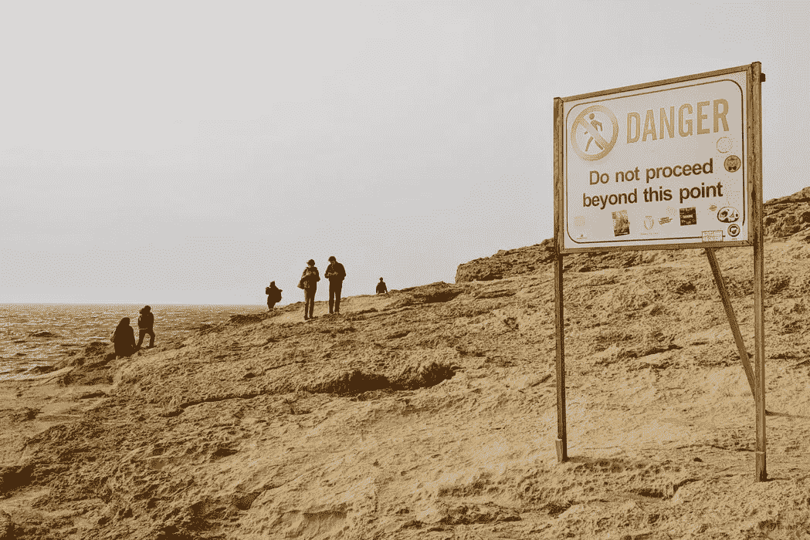

# 处于某种可怕的边缘

> 原文：<https://medium.datadriveninvestor.com/on-the-verge-of-something-terrifying-60ab1226423d?source=collection_archive---------26----------------------->

随着美国的事态似乎失去控制，人们开始问，美国是否正处于某种可怕的边缘？

# 是的。

我们都处在可怕的边缘。

**我们在美国观察到的只是我们都在经历的一个非常深刻和非常消极的发展的症状之一。**

在美国，某些利益集团为了他们自己的利益试图操纵大众，认为他们仍然控制着局面——这是愚蠢的，因为他们正在火药桶里点火。

**但在其他国家，各地区的表现也好不到哪里去。我们都在进入一个漩涡，一个我们找不到出路的死亡螺旋，由于盲目的，本能的自私，个人主义，民族主义的方式，我们试图“解决”日益恶化的地方和全球危机局势。**

# 我们现在的事件，发展几乎一对一地反映了 20 世纪 20-40 年代的事件，伴随着不计后果的增长，投资，建筑泡沫和无尽的债务，直到陷入大萧条(我们现在就开始)，而社会紧张，种族主义，对外国人的仇恨，荒谬的不平等使社会解体，而国家开始为战争而互相衡量，直到最后，战争爆发。

问题是，如果第二次世界大战还不够糟糕，现在的战争会更糟糕，可能是核战争，覆盖全球。

我们在第 11 个年头才明白，我们需要尝试一些前所未有的、全新的东西:改变、修正我们自己，而不是试图改变、修正他人和世界！

除非我们学会如何通过一种非常独特、有目的和实用的教育方法来对抗我们固有的自我中心、个人主义和剥削本性，否则目前的梦游将会持续下去，直到迟早有人扣动扳机，我们人类的集体生存将不再有保障。

另一方面，通过上面提到的教育方法，我们可以最终建立积极的、可持续的、相互负责的、互补的联系，通过这种联系我们可以建立“地球上的天堂”:

# 一个团结的全球人类社会，在大自然完美系统的模板上存在和繁荣。

 [## 危机？风投适应的 3 种方式|数据驱动的投资者

### 当我写这篇文章的时候，一场全球性的危机正在发生。这不是第一次，也不会是最后一次。很多事情已经…

www.datadriveninvestor.com](https://www.datadriveninvestor.com/2020/03/22/crisis-3-ways-vcs-adapt/)