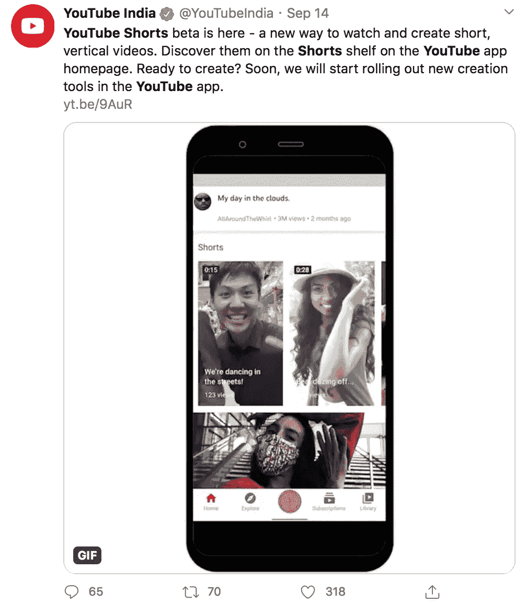

# 关于抖音的收购&新的 YouTube 扣篮

> 原文：<https://medium.datadriveninvestor.com/on-tiktok-acquisition-the-new-youtube-slam-dunk-8b98842db316?source=collection_archive---------21----------------------->

## 谷歌有史以来最聪明的举措:时机就是一切！

natanaelginting / Freepik

Y outube 刚刚在甲骨文的篮子里得分，由[宣布其新诞生的应用程序，和抖音的竞争对手；Youtube 短片](https://blog.youtube/news-and-events/building-youtube-shorts)。

如果你没有听说，唐纳德·特朗普总统的政府威胁要在 2020 年 9 月前禁止抖音，并命令母公司字节跳动出售其美国业务。禁令威胁是在声称因其中国所有权而存在国家安全风险之后发出的。出价已经完成，谈判倾向于微软作为潜在买家，直到周日微软表示拒绝。一天后，甲骨文发言人黛博拉·海灵格(Deborah Hellinger)证实了美国财政部长史蒂文·姆努钦(Steven Mnuchin)关于字节跳动将其提议提交美国政府批准的想法。

Alphabet 收购的公司 youtube 悄悄溜进来，宣布在同一天提供 YouTube 视频的短片，这是对抖音的直接行动，也是明确的宣战，因为这个激烈的竞争对手已经在市场上占据了巨大的份额。

 [## 让你成为更好的营销者的 5 个思维技巧|数据驱动的投资者

### 凭借 20 多年围绕品牌营销的企业和小型企业咨询经验，我逐渐认识到…

www.datadriveninvestor.com](https://www.datadriveninvestor.com/2020/09/02/5-mindset-tips-to-make-you-a-better-marketer/) 

# 三大支柱

Youtube 产品管理副总裁克里斯·贾菲(Chris Jaffe)与该平台的 20 亿用户分享了这一消息。短裤是“在 15 秒或更短时间内表达自己的新方式”，只使用手机。该应用侧重于三大支柱:

> **# 1——富有创造力。**
> 
> **# 2——被发现。**
> 
> **# 3——观看娱乐视频。**

瞧啊。Youtube 以一种整洁、安静和时间敏感的方式爬了出来，在晚餐时间之前吃掉了甲骨文的巨大举动。

# 天才测试计划

为了测试其新生儿的测试版，YouTube 明智地选择了相对较大，但抖音-维珍印度市场。谷歌还能变得更聪明吗？

@ YouTubeIndia / @ Twitter

# 第一步

为了能够使用 Shorts，你需要使用 Shorts 相机，它有一些额外的功能，如播放视频剪辑，调整速度和时间，以及嵌入音乐文件。

> “从我们第一次上传开始，用户生成的短视频在 YouTube 上诞生了，这是一个名为“[我在动物园](https://www.youtube.com/watch?v=jNQXAC9IVRw)的 18 秒短视频。“随着技术的进步，创作者和艺术家现在可以利用智能手机的强大功能，在世界任何地方轻松创作和发布高质量的内容。”— YouTube 官方博客

如果你没有短裤相机，你可以上传 60 秒长的垂直视频，标签为***#短裤*** ，你的视频会在 YouTube 主页上突出显示。

# 欢迎登机！

看起来谷歌凭借*和*进入社交媒体世界的大致过程可能要结束了，因为该公司所有的牌都摆在桌面上。这一明智之举是在低速下酝酿的，在疫情时间里已经酝酿到了极致。

**访问专家视图—** [**订阅 DDI 英特尔**](https://datadriveninvestor.com/ddi-intel)