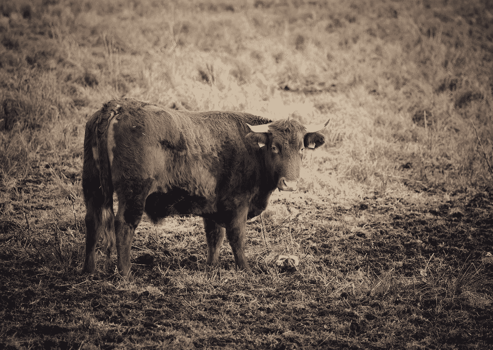
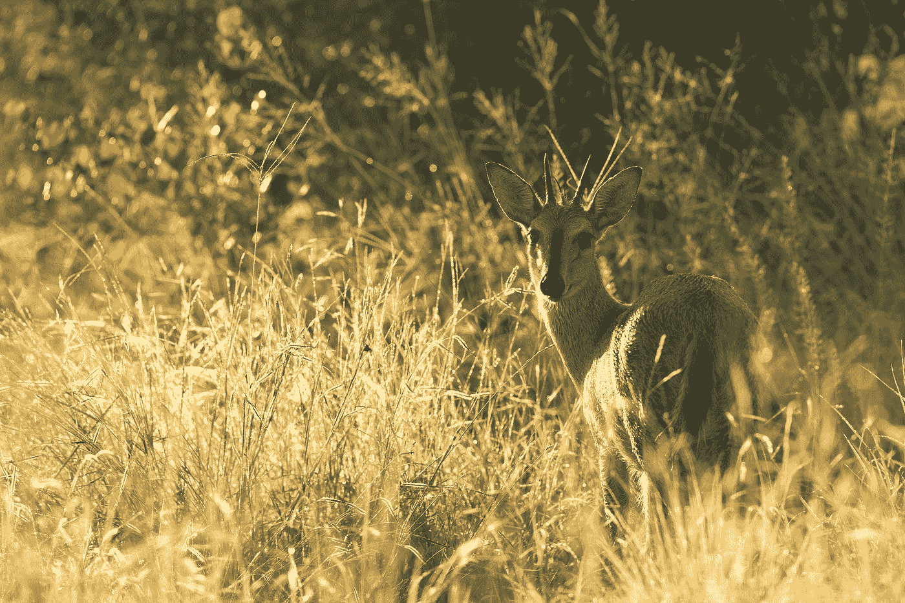
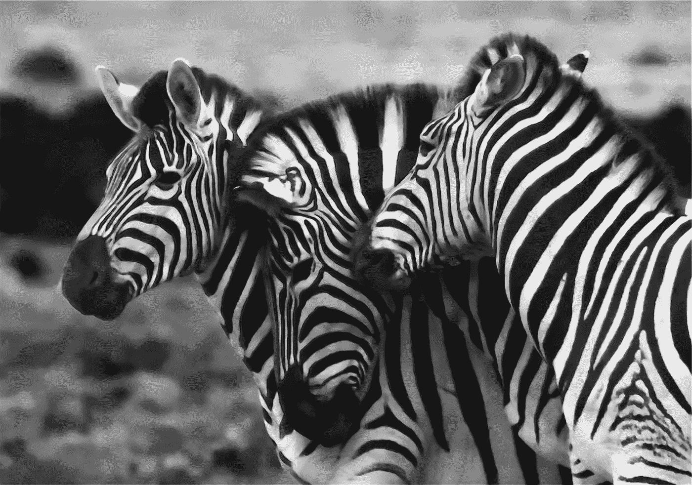

# 再次突破，我的朋友们…

> 原文：<https://medium.datadriveninvestor.com/once-more-unto-the-breach-my-friends-2f70b168261b?source=collection_archive---------12----------------------->

Photo by [Joshua Humpfer](https://unsplash.com/@joshuasphotographyworld?utm_source=medium&utm_medium=referral) on [Unsplash](https://unsplash.com?utm_source=medium&utm_medium=referral) (Kindly, not African cattle, my photos won’t load, stay tuned)

## 他们不懂莎士比亚，但他们知道妈妈去了那里…

牧民们高高举起他们的棍子，偶尔会踢踢年轻人的屁股。小牛向前涌去，太多了，无法同时通过。我站在后面，我的徒步旅行靴上粘满了非洲的牛粪便，沾满了红色的灰尘。在 Ol Pejeta，这是忙碌的一天。大约 200 只或更多的这类动物的生命将受到保护。

纯种的 Boran 往往相当安静，是非洲最理想的牛肉原料。它们在外面吃草比被邀请去一个狭窄的滑道要温顺得多。斜槽在顶部是开放的，动物们必须通过一些低水位，这为它们即将到来的短暂但至关重要的混凝土喷洒棚做准备。当每只动物笨拙地走过时，首先是成年人，包括母亲，然后是孩子，他们被喷洒了蜱传疾病。

最糟糕的是东海岸热。根据为 Ol Pejeta 工作的兽医 Charles Mathenge 的说法，它的潜伏期约为 14 天。在肯尼亚酷热的阳光下，他穿着一件厚外套。我不知道他是怎么做到的。我们偶尔会赶走一只苍蝇，然后查尔斯会转身鼓励更多的动物进入斜槽。

牛群像活水一样涌动着。然而，妈妈们在那边的*，要去妈妈那里，我们必须经过这边的*。冲向缺口，我的朋友们。**

** [## 在创业之旅中，拥抱学习|数据驱动的投资者

### 好像建立一个数百万美元的公司还不够困难，企业家必须额外照顾他们的…

www.datadriveninvestor.com](https://www.datadriveninvestor.com/2018/10/16/on-the-entrepreneurial-trek-embrace-the-learning/) 

当他们从另一边出来时，他们受到保护。对眼睛和呼吸系统没有伤害，而且对博兰牛种群有很大好处。理想情况下，这种保护它们的药物润湿每周进行一次。

在 Ol Pejeta，牲畜是一件严肃的事情。这是伊恩·穆鲁里领导的众多社区部门项目之一，他的责任重大。这是因为社区，仅次于自然保护，是这个巨大的，位于肯尼亚山下的 90，000 多英亩的保护区的第二重要的优先事项。

向 Ol Pejeta 的邻居和客户正确饲养、放牧、宰杀、购买和销售牛和牛产品是至关重要的业务，原因如下:

1.  这是一家盈利性企业。这意味着 Ol Pejeta 的赚钱企业赚的钱的一部分被用来支付保护的费用。从捐助者的角度来看，这一点至关重要。因为捐赠者可以放心，不管捐赠的数额有多大，每一分钱都直接用于保护，不会因为运营成本而减少。
2.  **Ol Pejeta 周围的社区直接从人工授精项目中受益，**Ol PE jeta 在社区中设立了一名兽医用于此目的和其他目的，Ol PE jeta 从自己的经历中学到了什么。Ol Pejeta 销售的所有牛肉都去了内罗毕，那里非常看重肉的甜味和高品质。这里的动物又肥又健康，但在丛林中却不是这样，因为过度放牧，那里的饲料会很少，还会有疾病和食肉动物。
3.  **气候变化正在引发非常现实的问题**。控制蜱的数量变得更具挑战性。今年，无论我去坦桑尼亚和肯尼亚的哪个地方，被夏季高温晒干的通常为稻草色的草都长得又高又茂盛。灌木丛生。虽然这对有蹄类动物和食肉动物来说很好，它们喜欢肥胖的畜群和营养丰富的幼崽，但对这些动物来说却是坏消息。炎热、潮湿和多雨意味着更多的蜱，而更多的蜱意味着更多的蜱传疾病。

把这与美国人联系起来，扁虱和扁虱传播疾病在美国的传播与一个变暖的国家有着千丝万缕的联系。大量的壁虱出现在加拿大东南部，攻击并杀死驼鹿，美国人的饮食被孤星壁虱传播的[阿尔法-加尔综合症](https://www.mayoclinic.org/diseases-conditions/alpha-gal-syndrome/symptoms-causes/syc-20428608)强行改变了方向(这让养牛农民非常沮丧)。随着这些蜱通过它们用来运输的鹿的身体传播，越来越多的美国人被叮咬，突然间他们再也不能忍受红肉了。对奶牛来说是个好消息。对养牛农民来说是个坏消息。气候变化是罪魁祸首，其他国家也看到了这种症状的出现。

这只是为什么定期给它们的大群喷洒农药如此重要的一个原因。控制任何蜱传疾病的传播不仅保护了牛，也有助于保护在同一草原上吃草和穿过茂密灌木丛的野生动物，蜱可能埋伏在那里等待免费的 Lyft 骑行和用餐。

Photo by [Hans Veth](https://unsplash.com/@hans_veth?utm_source=medium&utm_medium=referral) on [Unsplash](https://unsplash.com?utm_source=medium&utm_medium=referral)

我在肯尼亚的一个动物园里看到大蜥蜴的脖子上长着肥大的扁虱，我还在莫希附近的一个动物康复中心看到一只小羚羊的脸颊上吃东西。就像广泛传播、日益蔓延的携带疾病的埃及伊蚊一样，蜱是世界范围内日益危险和致命疾病的无害载体。变暖、潮湿的气候加剧了这一问题，而物种有一个不幸的习惯，那就是寻找方法来适应他们以前可能发现明显不友好的条件。

但是我们正在反击，因为人类健康不是这里唯一的问题。东海岸热可以杀死、削弱和真正损害牧群。控制它对肯尼亚的牲畜主人来说是至关重要的。

Ol Pejeta 自然保护区的负责人 Samuel Mutisya 解释说，他们的一大优势是，他们为社区、当地农民和许多其他共享边界或毗邻的自然保护区树立了榜样。Ol Pejeta 每英亩单位的生产力很高，价值 15，000 肯尼亚先令，与其他地产的平均约 900 先令形成鲜明对比。

这正是 Ol Pejeta 希望改变的。土地的低价值通常意味着农民和其他利益相关者需要越来越多的土地来赚同样多的钱。

如果一个农民可以改善他的牛群的健康和福利，从而提高牛肉质量，他就可以在不需要更多土地的情况下赚更多的钱。这只是拼图中的一个重要部分，它有助于在致力于保护的动物保护组织和需要食物和关键资源的非洲人口之间创造一个合作的未来。

兽医查尔斯也是我接受喷药手术的主人，他已经在 Ol Pejeta 工作了九年。他热爱他的工作。他英俊的圆脸咧开大嘴笑着，炎热的天气让他黝黑的皮肤上布满汗珠。查尔斯的工作拯救了生命，不仅拯救了牛，也拯救了野生动物。它还改善了当地农民的命运，他们直接受益于更健康的牲畜，受益于 Ol Pejeta 不断学习和试验的东西，并与分享其边界和边界以外的人分享。

所有的动物现在都经过了可爱和喷洒，查尔斯已经为这部分操作完成了。他再次穿上厚重的蓝色夹克，掸掉红色的灰尘，戴上头盔，骑上摩托车出发了。更多的工作要做。很多。

在喷药棚的另一边，小牛犊们在寻找妈妈。我们都被攻破了。放松的时间到了。紧急情况结束了，没有人受伤。也就是说，除了蜱虫种群。

这对每个人来说都是好消息。

Photo by [Etienne Steenkamp](https://unsplash.com/@etiennescamera?utm_source=medium&utm_medium=referral) on [Unsplash](https://unsplash.com?utm_source=medium&utm_medium=referral)**