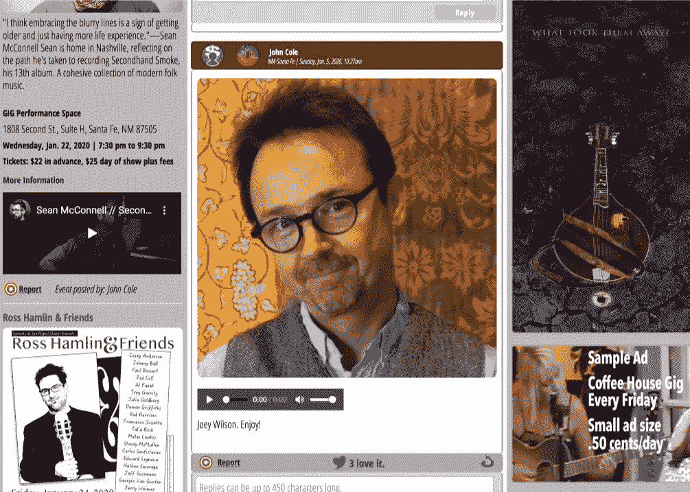

# 一次一场演出

> 原文：<https://medium.datadriveninvestor.com/one-gig-at-a-time-f2b452575f27?source=collection_archive---------11----------------------->

My friend Joey Wilson pinned to the Santa Fe NM Folk/Americana bulletin on [Muezbiz.com](https://muezbiz.com).

## 当口袋里有了新的一角硬币，一切都玩完了，下一步是什么？

我热爱我的音乐。上周，一个第一次来的粉丝告诉我，“你并不懒散。”我回以微笑，握了握他的手，向他道谢，然后继续前行。当美好的时刻到来时，音乐家会停下来，“也许所有的努力都是值得的。”

从一场演出到另一场演出，深夜移动设备…在外面演出是令人兴奋的，也是真正令人疲惫的。我巨大的自我得到了回报。

现实检查:年纪大了，装备越来越重，大量的音量压死耳朵，需要两天才能恢复。

我要问自己，“我能坚持多久”？从很多方面来说，我希望我能早点开始玩，但我现在可能已经聋了。在多年磨砺我的激情后，很遗憾我赚不到一毛钱，除非我把它玩出去。我现场表演的时间有限。

 [## 一个企业在肚子上移动:如何照顾直觉|数据驱动的投资者

### 事实证明，直觉不仅仅是一种感觉。科学很清楚:你的直觉比你知道的更多…

www.datadriveninvestor.com](https://www.datadriveninvestor.com/2018/11/09/a-business-moves-on-its-stomach-how-to-make-allowances-for-gut-feelings/) 

所有花在记录上的时间。所有那些曾经唱过的歌。所有那些我不知道的错过的许可合同或标签。

音乐家梦想用他们的创作赚钱。为什么这么难？

真正赚钱的成功只留给那些达到商业级别的少数人。业界知道人类是如何思考的。它知道我们的局限性，并迎合我们的需求。企业把他们“确定的事情”的赌注放在投资回报上，把许多音乐创作扔进了垃圾箱。一些可能喜欢听音乐的人很可能永远也不会去体验，仅仅因为这个行业说“不”

这让成千上万的天才艺术家何去何从？他们变成医生，成为急停服务员，与糖果爸爸或妈妈住在一起，或以不到一毛钱的价格现场演出直到时间结束。有点压抑，只剩下激情驱使我们前进。

# 下一步是什么？

在网络的能力中有很多希望。因此，无限量的数据正在上传，这推动了改进人工智能(算法)以将数据降至可管理水平的必要性。

游戏系统开启。随着音乐产业开始松动，他们知道下一步该做什么:购买点击量。球一如既往地滚动。

草根音乐人再一次被蒙在鼓里，为了维持生计，他们努力让大众了解他们。

我是一名创始人/编码员/平面设计师/音乐家，但从来不符合这个要求。我总是投票给失败者。当失败者获胜时，通常比已知的结果更有趣。作为一个一心多用的个人主义者，我从来不希望在游戏中看到激烈的竞争。我抵制了诱惑。每次我咬了，我都会落在后座上。我为什么要再试一次？

作为一个有想法的人，我和许多其他人一样，把互联网视为一种爆发的手段。在大玩家统治的同时，数以百万计的小玩家继续保持联系。

我建[**【Muezbiz.com】**](https://muezbiz.com)专注草根音乐。我建立这个网站是为了给草根音乐人一种接触当地粉丝的方式，甚至通过奖励、支付他们一部分会员上传的音乐来激励他们。

这种能力超出了音乐产业的定义范围，在竞争激烈的市场中很难销售。不是没有希望…只是随着成员继续加入网站而转变。我现在把 Muezbiz.com 作为从旧金山到圣达菲和纽约的家乡音乐公告牌。谷歌或必应“‘旧金山或丹佛’等。”音乐公告板" *Muezbiz* 在首页结果上。

# 下一步是什么？信仰…那是什么

我有个笑话:没有小马算什么音乐家？破产了！

在某种程度上，我们每个人都必须认识到:为了成长，我们需要他人与我们一起成长。

互联网就是答案。我们只需要把赌注放在正确的地方。

*约翰·科尔，*创始人/首席开发者[*Muezbiz.com*](https://muezbiz.com)

***通过向邻居代表支付会员出版音乐的份额，努力将音乐出版业从边缘拯救回来。为粉丝提供地区性活动和帮助各地草根音乐人的方式。***

更多流浪:

[*诚实带来美味的蛋糕*](https://medium.com/datadriveninvestor/honesty-inspires-a-fabulous-cake-31318848eede)

区域数字内容代表能赚钱吗？绝对的。

[*启用愿景，鼓励可能性*](https://medium.com/datadriveninvestor/enabling-visions-encouraging-possibility-2171356fd2d7)

[*音乐营销:启用“口碑”*](https://medium.com/@john_cole/music-marketing-enabling-word-of-mouth-7f3451c845da)