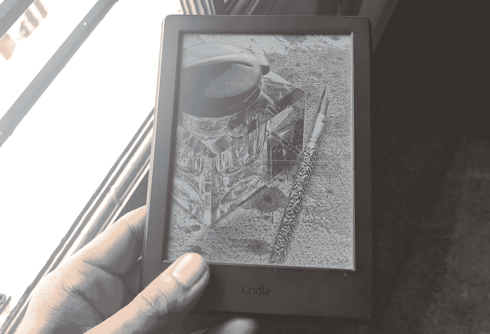

# 我做过的最好的投资之一花费不到 85 美元

> 原文：<https://medium.datadriveninvestor.com/one-of-the-best-investments-i-have-ever-made-cost-less-than-85-dollars-a09201e9af30?source=collection_archive---------5----------------------->

## 剧透提示:是 Kindle。

Photo by [Aaron Burden](https://unsplash.com/@aaronburden?utm_source=medium&utm_medium=referral) on [Unsplash](https://unsplash.com?utm_source=medium&utm_medium=referral)

作为一个孩子和十几岁的少年，我会在图书馆、书店和书展中寻求庇护。在过道里闲逛时，我会挑选那些激起我兴趣的书。在朋友或亲戚家，我有时会偶然发现一本有趣的书并借走。

我没有什么特别的兴趣，什么书都读，主要是幻想小说、侦探小说和节略名著。

随着年龄的增长，我培养了兴趣，阅读量也增加了。购买或借阅实体书不再可行。

当我第一次在电脑上切换到阅读时，我会下载并阅读 pdf 文件。我很快发现了[图书集市阅读器](https://www.microsoft.com/en-us/p/book-bazaar-reader/9wzdncrfjcqv?activetab=pivot:overviewtab)，这给了我更好的阅读体验。

有时我会打开课本假装学习，同时偷偷用我隐藏的智能手机阅读。

> 我就这样完成了整个[传承](https://www.goodreads.com/book/show/10859323-the-inheritance-cycle)四部曲。

长时间的阅读和在电子屏幕上玩游戏损害了我的视力。我不得不开始使用眼镜，我的眼镜处方每隔几个月就会提高一个档次。

当我出现轻微偏头痛时，我最终停止了它。我的阅读习惯逐渐下降。

几周后，我的偏头痛消失了，我第一次听说了 Kindle。这是亚马逊一两年前在印度推出的一款电子墨水阅读器。

我兴奋起来，订购了它，几天后收到它时，我欣喜若狂。这是在 2015 年。

已经将近 5 年了，我信赖的 Kindle 一直陪伴着我，见证了成千上万的页面滚动和单词查找。

Image Source: Author’s Camera.

阅读是一种习惯，我可以将我的大部分观点发展、语言发展、知识、学习和整体个人成长归功于它。

如果没有 Kindle，我怀疑我可能连一半的阅读量都达不到。我甚至开始喜欢它胜过实体书。

 [## 将数据隐私转化为你的优势，重建消费者的信任:下一个投资前沿

### 抖音的使用在疫情期间激增，全球大约有 8 亿用户使用该平台…

www.datadriveninvestor.com](https://www.datadriveninvestor.com/2020/09/18/turn-data-privacy-to-your-advantage-and-rebuild-consumers-trust-the-next-investment-frontier/) 

# 为什么我觉得 Kindle 更好？

## **1。内置字典:**

如今，我读的大多是英语名著，其中有大量的古旧词汇和新词汇。有时我会遇到一些熟悉的词，但我似乎就是想不起它们的意思。漂亮的内置词典让我可以随时查找单词及其发音。

不管你读什么，除非你有与沙希·塔鲁尔的词汇相匹配的词汇，否则你*将*需要一本字典。

## **2。不贵:**

即使有购买 Kindle 的初始成本，从长远来看，这种方式也要便宜得多，因为每本电子书都比实体书便宜。

此外，除非你正在寻找新发行的书籍，如果你挖得足够多，你几乎肯定会在互联网上找到免费的副本。

> 我不支持盗版，你也不应该支持。除非你真的买不起书，否则不要去买盗版。

## 3.内置灯:

我的 Kindle 版本没有内置灯，但你可以以比我略高的价格买到一个有内置灯的版本。这种光是一种环境黄光，而不是电子屏幕上刺目的蓝光。

作为一个喜欢睡前阅读的人，能够在没有刺眼的 LED 灯照射的情况下阅读将是一个福音。我打算很快升级。

## 4.便携性:

在你反驳之前，*“即使一本真正的书也是便携的”，*听我说完。一两本书可能是便携的，但成千上万本却不是。Kindle 可以存储 1000 多本书，你可以把它放在口袋里随身携带。

## 5.可自定义字体:

有些书的字体很小，你不得不费力地阅读，而有些书的字体很大，每一页都过得很快。有了 Kindle，我可以根据自己的方便调整字体大小。像字体风格、行距等等。也可以定制。

## 6.你拯救树木:

仅在美国，每年就有 3200 万棵树被砍伐用来制作书籍。通过改用电子阅读器，你可以拯救树木。

# 不利的一面。

照片是黑白的，这使得阅读漫画或带有图片的书籍变得不那么有趣。最初，我讨厌每次翻页时屏幕闪烁，但现在我已经习惯了。

如果你喜欢纸的感觉，翻页的沙沙声，以及把书拿在手中的整体感觉，那么 Kindle 可能不适合你。

# 结尾词。

不管你是选择购买 Kindle 还是其他电子阅读器，都要培养阅读的习惯。

你读的每一本好书都会带你踏上一段旅程，带给你新鲜的见解、美好的感觉、新的想法、更多的知识和更广阔的人生视角。

Photo by [Nong Vang](https://unsplash.com/@californong?utm_source=medium&utm_medium=referral) on [Unsplash](https://unsplash.com?utm_source=medium&utm_medium=referral)

> “一个读者在死前经历了一千次生命。。。从不读书的人只活一个。”—乔治·R·R·马丁

**感谢阅读，如果你喜欢这个故事，你可能也会喜欢:**

 [## 改变我生活的 6 个习惯

### #3 自省

medium.com](https://medium.com/the-ascent/6-habits-that-have-changed-my-life-55e9efc176dc) 

## 访问专家视图— [订阅 DDI 英特尔](https://datadriveninvestor.com/ddi-intel)