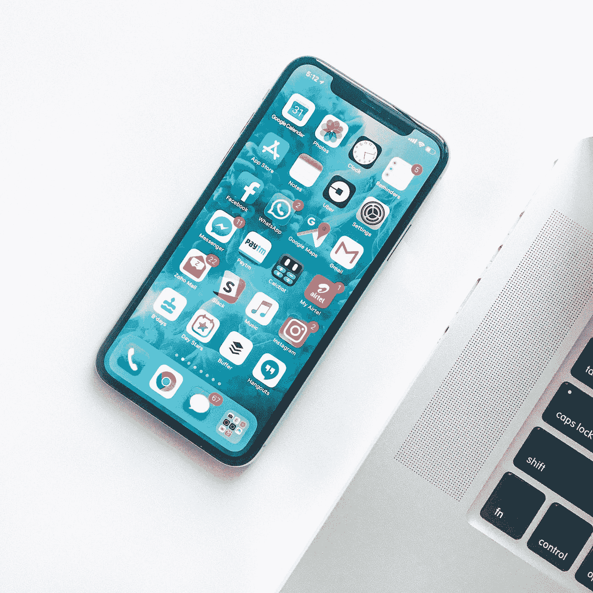

# 我用来保持专注的一个技巧

> 原文：<https://medium.datadriveninvestor.com/one-technique-i-used-to-help-me-stay-focused-abbf7f453c0b?source=collection_archive---------22----------------------->

## 有一种方法可以阻止我们不断查看手机

Photo by [Rahul Chakraborty](https://unsplash.com/@hckmstrrahul?utm_source=medium&utm_medium=referral) on [Unsplash](https://unsplash.com?utm_source=medium&utm_medium=referral)

一天中有太多令人分心的事情。我们的手机总是在附近。

我注意到，拿起手机，滑动到下一个屏幕来访问我所有的社交媒体应用程序已经成为一种习惯。

当我在等待我的工作电脑加载时，我会扫过去打开一个。

如果我几秒钟前检查了所有的东西，那也没关系。我发现自己检查了一遍又一遍。

 [## 跑步摆脱疯狂:锻炼如何提高你的生产力|数据驱动的投资者

### 没有比锻炼更好的方式来开始一天的工作了。我试着一周至少做四天，在…

www.datadriveninvestor.com](https://www.datadriveninvestor.com/2018/10/23/running-to-get-rid-of-the-crazy-how-working-out-increases-your-productivity/) 

有时我觉得自己不得不克制查看手机的冲动。我真的觉得我必须控制住自己。

我们怎样才能完成任何事情？

# 把所有让你分心的应用放在文件夹里。

这听起来可能很蠢，但对我很有效。

一旦应用程序被移动到文件夹中，你仍然会有检查的冲动。

然而，你已经改掉了你的坏习惯。

现在，访问您的应用程序需要更多的工作。你需要滑动，找到正确的文件夹，打开它，打开应用程序。

仅仅这小小的改变就能带来巨大的不同。

在我们的世界里，我们希望尽可能快地访问一切。我们没有耐心。如果我们被迫等待加载屏幕，我们很快就会变得烦躁。

这就是为什么将应用程序隐藏在文件夹中是可行的。

您添加了额外的步骤，这增加了访问您的应用程序所需的时间。

你的大脑没有耐心等待，所以你放弃了，回到你正在做的事情。或者你根本就没有尝试去接触它们。

很快，你会发现自己在任务上停留的时间更长了。你将更有效率地工作，同时减少花在手机上的时间，这总是一件好事。

一旦我把应用程序放好，我发现我专注于写作的能力显著提高了。这是最奇怪的经历。

这就像是我大脑中的一个开关被关掉了，阻止我每两秒钟检查一次手机。

这是一种很棒的感觉。我感到自由。

我有过几次不成功的时候，我又检查了太多。但我确实比以前做得更好了。

如果你不喜欢把你的应用程序组织到文件夹中，我有一个成功的技巧，那就是把我的手机面朝下。

当屏幕被隐藏时，你的眼睛不会每次收到通知时都被它吸引。

有时，当我的屏幕被隐藏时，我完全忘记我的手机在那里。

我们正处在一个被设备束缚的时刻，但这并不意味着我们必须如此。每周 7 天每天 24 小时不看手机是非常好和健康的。

我们不会整天查看我们的应用程序，因为我们认为有什么新东西可以看。

**我们检查是因为这已经成为一种习惯。**

这是很难打破的。试着把最容易分散注意力的应用程序放到文件夹里，看看这是否有助于减少你在手机上的时间。

值得一试吗？