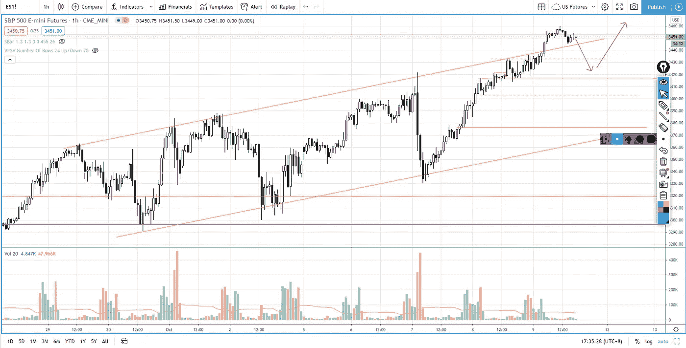

# 当交易回调时，每个交易者都应该做的一件事

> 原文：<https://medium.datadriveninvestor.com/one-thing-that-every-trader-should-do-when-trading-pullback-cf030b1da6de?source=collection_archive---------20----------------------->

在交易回顾部分，你会发现每个交易者在交易回调时应该做的一件事，以增加胜率。

观看视频，了解 2020 年 10 月 9 日交易时段标准普尔 500 指数期货的**每日市场分析。在这段视频中，我将向大家展示上一个交易日的市场回顾和三分钟内的交易回顾(包括进场、出场和背后的原理)。展望未来，我将涵盖偏见，要注意的关键水平，我稍后的交易计划。**

## 时间戳

*   [0:58](https://www.youtube.com/watch?v=5WnNJOJorLQ&t=58s) 市场回顾
*   [4:35](https://www.youtube.com/watch?v=5WnNJOJorLQ&t=275s) 贸易回顾
*   [7:50](https://www.youtube.com/watch?v=5WnNJOJorLQ&t=470s) 拉回设置的背景
*   [8:20](https://www.youtube.com/watch?v=5WnNJOJorLQ&t=500s) 什么是回调
*   [10:10](https://www.youtube.com/watch?v=5WnNJOJorLQ&t=610s) 一件事
*   [12:48](https://www.youtube.com/watch?v=5WnNJOJorLQ&t=768s) 回拉进场前分析
*   [15:40](https://www.youtube.com/watch?v=5WnNJOJorLQ&t=940s) 成交量价差分析
*   [16:33](https://www.youtube.com/watch?v=5WnNJOJorLQ&t=993s) 当前市场前景
*   [16:53](https://www.youtube.com/watch?v=5WnNJOJorLQ&t=1013s) 通道超买

如果你还没有看我在上一次会议中的[每日市场分析视频](https://www.youtube.com/watch?v=4xgk6VKtg4U)，以便更好地了解市场回顾和交易回顾。

**偏向** —中性(日内交易)；看涨(长期)

**关键水平** —阻力:3450–3480；支持:3420–3430、3400、3300–3320

**潜在设置** —在关键级别寻找潜在反转。

# 资源

**每周市场展望&最佳交易建议**直达您的收件箱:[https://www.tradeprecise.com/](https://www.tradeprecise.com/)

**专业免费**制图平台:创建账户→【www.TradingView.com 

**非美国居民？** ( **马来西亚、新加坡**、澳大利亚、新西兰、欧洲等……):[点击此处，存款 2000 新加坡元](https://ji.hn/sgtiger)即可获得**免费股票(价值 100 美元++ &老虎经纪**的欢迎礼物)

美国居民？[点击此处，当您存入 1500 美元](https://ji.hn/ustradeup)时，就有机会在 TradeUP 上获得一份**免费的 AMZN 股票(价值 3000++美元** ) & **欢迎礼物**

**无限制访问媒体文章** —加入以下:[https://priceactiontrading.medium.com/membership](https://priceactiontrading.medium.com/membership)

# 进一步阅读

 [## ARK Invest 的 Cathie Wood 预测基因组股表现优于特斯拉？

### 方舟投资公司的首席执行官凯西·伍德预测，最大的上涨惊喜可能来自基因组股票，尤其是…

medium.datadriveninvestor.com](/ark-invests-cathie-wood-predicts-genomic-stocks-outperform-tesla-b67f3c4bbc68)  [## 凯西·伍德警告市场即将调整——标准普尔 500 价格走势分析

### 在 2020 年 12 月 18 日对彭博的采访中，方舟投资公司的首席执行官兼首席信息官凯西·伍德警告说…

medium.datadriveninvestor.com](/cathie-wood-warns-market-correction-soon-price-action-analysis-on-s-p-500-7e621e013310)  [## 市场修正，泡沫还是崩盘？标准普尔 500 价格行为分析

### 标准普尔 500 期货(es)昨日因供应激增下跌 2.5%，跌破上行通道。这是正常的…

medium.datadriveninvestor.com](/market-correction-bubble-or-crash-s-p-500-price-action-analysis-6f26e6698dbc) 

Photo by Author — Ming Jong Tey

Photo by Author — Ming Jong Tey

披露:如果您点击本文中的链接进行购买或开立账户，并将所需金额存入推荐的经纪人账户，我们将免费为您赚取佣金。

免责声明:本演示中的信息仅用于教育目的，不应作为投资建议。