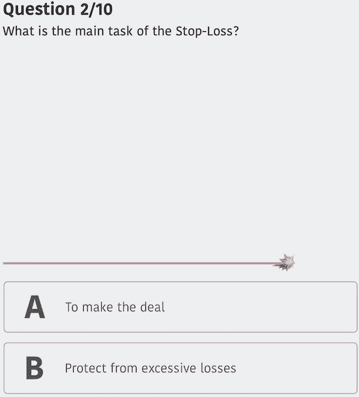

# 一个小小的建议导致巨大的交易结果

> 原文：<https://medium.datadriveninvestor.com/one-tiny-advice-that-leads-to-massive-trading-results-874b5c351ce4?source=collection_archive---------17----------------------->

## 要点很容易忘记，幸运的是交易游戏在这里。

Photo by [Toni Koraza](https://unsplash.com/@tonikoraza?utm_source=unsplash&utm_medium=referral&utm_content=creditCopyText) on [Unsplash](https://unsplash.com/@tonikoraza?utm_source=unsplash&utm_medium=referral&utm_content=creditCopyText)

当我 24 岁的时候，我做外汇交易的第一个月就赚了 24000 美元。

这种突如其来的力量和兴奋很难用语言来解释。只要点击几下鼠标，我就能赢得改变人生的一大笔钱，这个想法让我感到不可阻挡和骄傲。现实中，我正准备全速撞上一堵砖墙，没有破碎的痕迹。

我在孤注一掷，以为风险越大回报越多。

# 接下来发生的事情和碰撞测试假人如果活着的感觉一模一样。

我飞得太高了，对我自己没有好处。

我和远远超出我能力范围的女孩约会，幻想着从我的硕士学位退学。梦想在靠近沃伦·巴菲特度假屋的蓬塔卡纳别墅里生活和交易是一种新的幻想。

然后，一双安全鞋，那双本应该在接下来的几分钟内让我再赚 1000 美元的鞋，花了我最初的 15403 美元。

我买了处于超卖区的澳元/美元对。甚至新闻主播和彭博的金融大师也歪曲了整个故事。澳元的价值急剧下降，并继续下降，直到它抹去了我的整个帐户。

止损单？不把所有的钱都押在一个有风险的交易上的常识？我想我没那么聪明。更糟糕的是，我又花了 5000 美元来摆脱这种情况，然后当我输了的时候，我又花了 4000 美元，以同样的方式输了。

The Trading Game

# 我不是一个好的交易者，因为我忘记了本质。

在八月之前，我失去了所有的钱。

8 月 6 日，我生日，我当时约会的一个女生带我出去吃饭，要自己付全部费用。那晚之后我再也没见过她。这个夏天剩下的时间都被毁了。

我不得不承认自己的行为，承认自己的错误。

# 我被疯狂的市场波动和杠杆头寸冲昏了头脑。

那年夏天，我用美元兑日元在 19 秒内赚了 2107 美元。

我的经纪人对每笔交易都提出了很高的杠杆比率。我可以先投入一点钱，他们会增加 100 倍的原始金额。我可以用光速获得 100 倍的利润，但也会以同样快的速度损失 100 倍。有时你可以在几秒钟内赢得大量金钱，有时你可能会失去你的车。

这就是投资者使用止损单的原因。你可以告诉你的经纪人在交易对你的账户造成实质性损害之前停止交易。这些我都知道，但是在这个过程中的某个地方，我忘记了提醒自己在交易货币和股票时可能发生的非常基本但代价高昂的错误。

即使是那些掌握金融市场*诀窍*的人也经常会对基本错误祈祷。

无论发生什么，总是使用止损单。赢大了，输小了。

# 交易游戏是你需要开始的一切，甚至更多。

现在，你可以[下载应用程序](https://tradinggame.com/)，它提供所有无价的建议，让你像专业人士一样开始交易。

[交易游戏](https://www.facebook.com/TheTradingGame/)带来了有趣的挑战、交易环节和模拟市场。不断有人提醒您业内的最佳实践:

*   交易的最佳时机。
*   挑选对子的建议。
*   如何执行每个订单。
*   信号和社会交易。
*   关于新闻如何影响市场的提示？
*   唤起你的记忆和决心的测验。
*   值得信赖的经纪人和专业交易者名单，如果你决定尝试真正的市场。

你可以在一周的市场交易中轻松赢得 10，000 美元。

然而，有些人也中了彩票。如果你不知道你在做什么，你就冒着把所有的钱都还给市场的风险。聪明的人可以保留这些钱，而愚蠢的人会以他们赚来的方式归还所有的钱。

交易游戏是一个简单的细节，教你如何赚到并保住你赚到的钱。