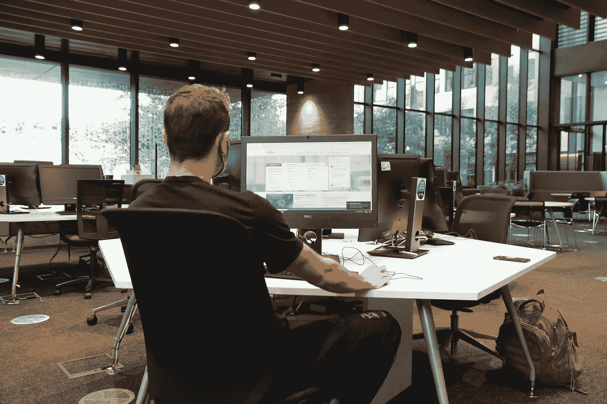
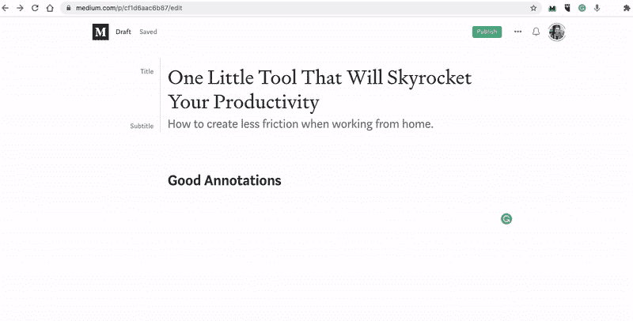

# 一个小小的工具将会让你的工作效率暴涨

> 原文：<https://medium.datadriveninvestor.com/one-tiny-tool-that-will-skyrocket-your-productivity-cf1d6aac6b87?source=collection_archive---------9----------------------->

## 杰夫·贝索斯对实现目标的建议。

Photo by [Toni Koraza](https://unsplash.com/@tonikoraza?utm_source=unsplash&utm_medium=referral&utm_content=creditCopyText) on [Unsplash](https://unsplash.com/@tonikoraza/stats?utm_source=unsplash&utm_medium=referral&utm_content=creditCopyText)

[好的注释](https://www.goodannotations.com/)是一个你不知道你需要的工具，直到你尝试过。

当冠状病毒席卷全球时，我加倍了我的热情项目。我在媒体上发表了 [300 多个故事](http://tonikoraza.com)，创办了 [2 分钟疯狂](http://2madness.com)，并为我的数字营销服务雇佣了 6 名全职客户。我还尝试在 Unsplash 上储存照片，测试播客和其他类型的在线内容。

我的工作范围很广，整理我的桌面变成了一场噩梦。

我必须每隔一天删除一个满满的随机截图，而且我根本不知道为什么那些屏幕会在那里。

# 如果你想把你的想法变成现实，就要减少生活中的摩擦。

然后，我看了看杰夫·贝索斯的采访，他解释了亚马逊如何成为如此庞大的公司，这一切都围绕着一个简单的想法。

> 如果你想让事情发生，就少制造点摩擦，如果你不想让事情发生，就多制造点摩擦。

摩擦的大小对你的目标至关重要。

重点是摩擦力。

如果你想少吃糖，就把饼干放在架子顶上。如果你想读更多的书，买一个 kindle，让图书馆充满令人兴奋的书籍。如果你想远离社交媒体，那就设定一个每日使用限额。晨练？把瑜伽垫放在你的床边。

# 如果你想在电脑上完成更多的工作，那就简化你的工作流程。

没有什么比为了开始工作而浪费一个小时更让人不满意的了。

一个作家有多少次不得不处理与写作无关的问题？选择图像？留纸条？破损的在线表格？凌乱的文件和桌面？

> 不必要的长路线会产生不令人满意的结果。

更多的摩擦会让你通向目标的路更长。更少的摩擦创造了更多的空间来专注于实现你的目标。这个概念听起来很简单，但是大多数人从来没有这样想过。

让你想完成的事情变得更容易，让你想减轻的事情变得更难。

我发现了遵循这种思维模式的好注释。

Source: Good Annotations

# 好的注释给你一个无摩擦的方式来标记、编辑和添加文本到你的截图中。

对大多数用户来说，在手机上截图很容易，但在电脑上做同样的事情就完全不同了。

*ALT+PrtScn* 和 *CMD+Shift+3* 只够把截图放在你电脑的某个地方。然后，你需要单独的软件来编辑图像，突然，这是一个 20 分钟的任务，你可以感觉到挫折顺着你的脊椎流下来。

*我只是想给截图加个简单的说明，为什么要这么久？*

偏离目标会毁掉你的整个经历。如何在扑灭电脑技术火的同时，达到[心流状态](https://en.wikipedia.org/wiki/Flow_(psychology))？我做不到，可能其他大多数人也做不到。花在弯路和不重要的任务上的时间是建立你的目标、梦想和生活所损失的时间。

如果你不知道如何在生活中减少摩擦，你就无法经营企业。

*   工作流程越有条理，你完成工作的速度就越快。
*   你花在写作上的时间越多，你创作的作品就越多。
*   你花在阅读上的时间越多，你要读的书就越多。
*   你创建的创业公司越多，你拥有的商业风险就越多。

有了[好的注释](https://www.goodannotations.com/)，你可以创建组织良好的截图，添加注释，并包括你想与你的团队分享的所有提示。

工作流程组织得越好，成功的机会就越大。

## 访问专家视图— [订阅 DDI 英特尔](https://datadriveninvestor.com/ddi-intel)