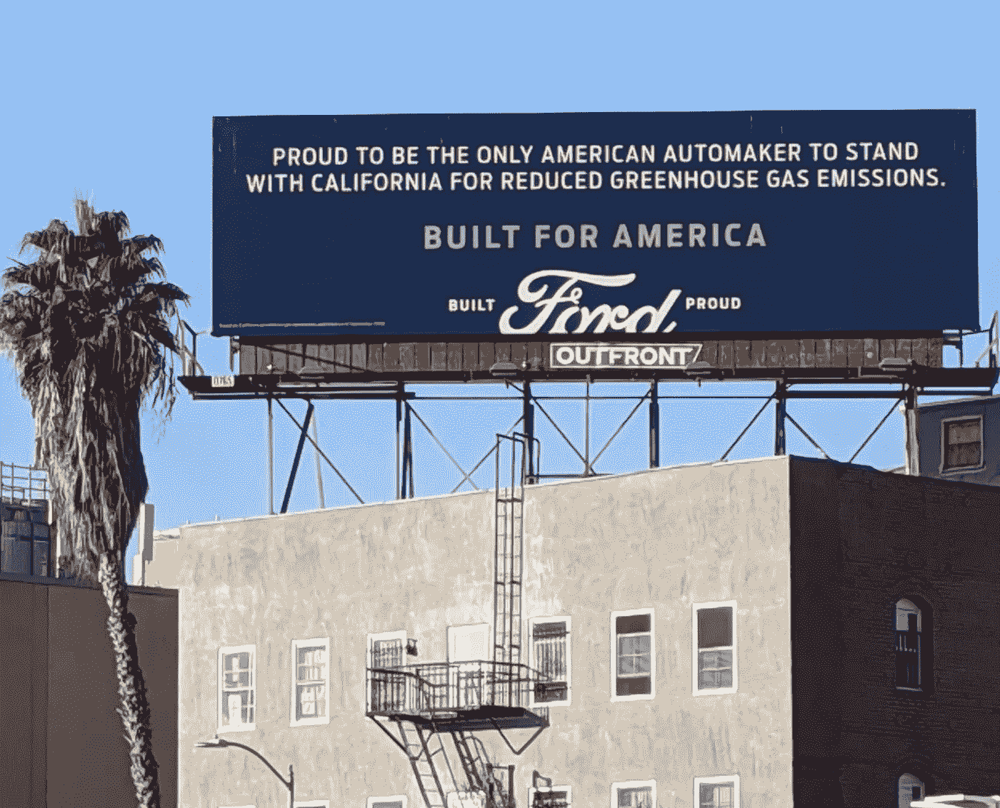
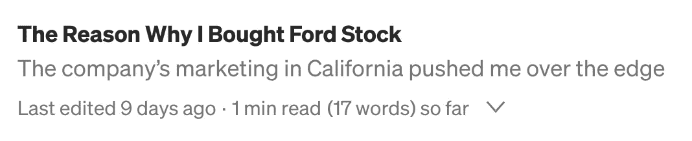
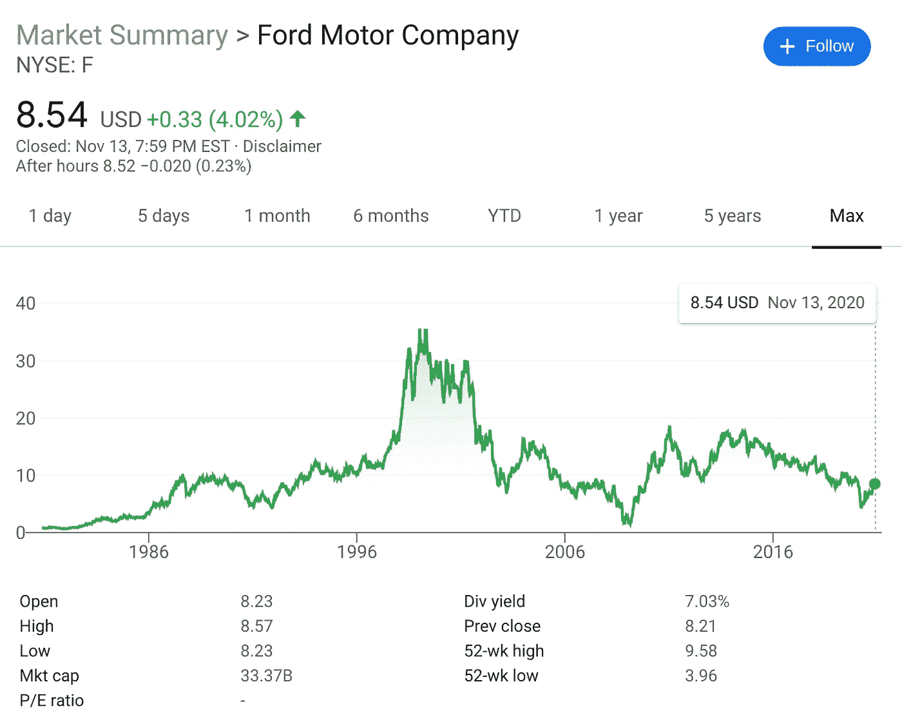
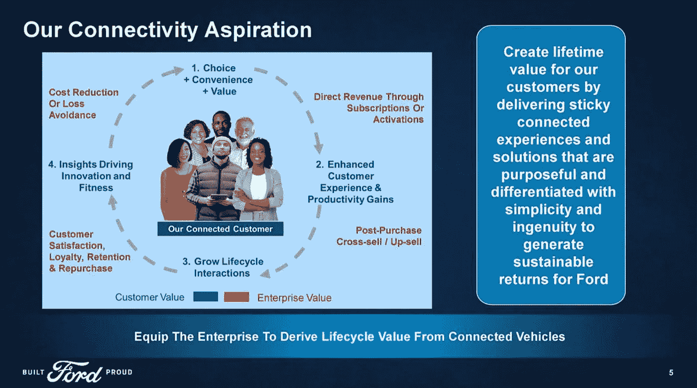

# 识别即将突破的股票的一种方法

> 原文：<https://medium.datadriveninvestor.com/one-way-to-identify-a-stock-thats-about-to-breakout-a0413d5df9d4?source=collection_archive---------7----------------------->

## 有时候，你不能忽视故事的同步性

**Source: Author**

大约 11 天前，我开始写这篇文章，主要关注福特的股票。我把它搁置了。我很高兴我做到了。这期间发生的事件增强了我对福特的信心。与此同时，围绕公司和股票形成的叙述表明现在是买入的时候了，并支持选股的定性方法。

在这篇文章中，我用福特作为一只即将突破的股票的最新例子，来说明我对*故事股票*的部分思考。

**Source: Author’s Medium stories dashboard / Original Iteration of This Article**

这一切都是从最近几个月开始的，当时我每天步行或乘坐私人汽车穿越洛杉矶。这些广告牌(见本文图片)不断在各地出现:

> 自豪地成为唯一一家支持加州减少温室气体排放的美国汽车制造商。

这引起了我的共鸣，原因有几个。为了避免过多的政治讨论，我将尽量缩短这一部分。

首先，我为生活在加利福尼亚而自豪，在那里我们在许多社会政治和环境问题上处于领先地位。

第二，令我震惊的是，美国其他大部分地区——可悲的是，在联邦政府的鼓励下——指责加州的进步方式。从好莱坞到科技到食品，我们出口了如此多让世界运转的东西。我们知道自己在民族国家做什么。

第三，将我们经济的很大一部分放在绿色倡议周围，应该会有更少的阻力。福特似乎认识到了这一点。该公司继续确立自己在绿色技术领域的领先地位。这意味着有足够的勇气公开站在加州一边。这在这个国家是不受欢迎的。在那些将环保主义视为对以化石燃料为基础的经济构成威胁的地区，这种观点往往不太受欢迎。

这就是我对福特的一些信念的简单版本。*这是故事的一部分。*

**Source:** [**Google Finance**](https://www.google.com/finance/quote/F:NYSE?sa=X&ved=2ahUKEwi56ouIyYLtAhVIuZ4KHebdC8cQ3ecFMAB6BAgBEBk)

在最近的记忆中，福特的股票除了下跌，实际上是萎靡不振。我已经跟踪它好几年了。我总是犹豫买不买，因为没有令人信服的故事，而且最近，该公司停止支付股息。现在我拥有了福特，[，我打破了自己的规则](https://medium.com/the-innovation/i-only-invest-in-one-type-of-stock-d3acb0d7ec0b)——这是我拥有的唯一一只不支付股息的股票。

现在，故事发生了变化，股息可能即将。

以下是加拿大皇家银行(RBC)分析师约瑟夫·斯帕克(Joseph Spak)与福特总裁兼首席执行官吉姆·法利在公司最近的[收益电话会议](https://seekingalpha.com/article/4382475-ford-motor-company-f-ceo-jim-farley-on-q3-2020-results-earnings-call-transcript)上的对话:

> **约瑟夫·斯帕克**
> 
> 最后，约翰，我在媒体上看到他的评论，说现在谈论恢复股息还为时过早。我意识到这最终是董事会的决定，但我会向 Jim 和 John 详细说明，鉴于你们谈到的转型，你们认为福特应该在未来几年发放股息吗？如果应该，你们希望恢复这种做法的真正参数是什么？
> 
> **吉姆·法利**
> 
> 谢谢你的问题。我认为现在不是讨论这个的时候。我认为我们需要在我们的总资本战略和资本需求以及我们作为一家企业的发展方向中制定这一框架，我认为明年春天将是这样做的时候。

福特明年可能会恢复派息。我想在股价低于 10 美元之前建仓。

回到故事，这最终成为本文的动力。

福特不仅在环境问题上与加州站在一起，它的思维和行为都像一家科技公司。在引人注目的股票故事中，这总是一个很好的标志。

**Source:** [**Ford Presentation**](https://seekingalpha.com/article/4388545-ford-motor-company-f-presents-deutsche-bank-autotech-conference-slideshow) **@ The Deutsche Bank AutoTech Conference**

像科技公司一样思考和行动。这一直是我对股票的信念的一个关键组成部分，我感觉这些股票将会突破，并在长期内大幅突破。

想想[我在 2012 年 4 月写的](https://seekingalpha.com/article/542141-dominos-pizza-a-very-social-company)关于达美乐比萨的文章:

> 达美乐找到了一种方法来改变大部分人点披萨的方式。这个数字应该继续增长。随着它的发展，公司变得越来越有效率，如果我的经验可以作为一个指标的话，它建立了一个更大、更忠诚的客户群。

达美乐“发现”的“方法”是利用数字和移动平台，在大多数食品和饮料——甚至更广泛的零售商——这样做之前吸引消费者。

**自从我写了那篇文章后，达美乐的股票上涨了 1000%以上。**

想想我在 2013 年 2 月写的关于星巴克(和达美乐)的文章:

> 借助移动和数字平台，星巴克和达美乐创造了引人入胜和令人上瘾的体验。
> 
> 无论是从规模(放眼国际)还是功能来看，它们都只是刚刚开始。**很快，你可能会走进一家星巴克，如果你没有和咖啡师直呼其名的话，在你走进门的那一瞬间，你的饮料就已经付款并准备好了。**这就是创新。这是目前最好的技术之一。

自从 2011 年 7 月我 [**第一次写下关于星巴克的**](https://seekingalpha.com/article/282505-teavana-needs-to-penetrate-urban-areas-to-become-a-buy) **以来，它的股价已经上涨了大约 460%。**近十年后，我们会毫不犹豫地通过星巴克手机应用程序为您的饮料预付费用。

最近，我将 CVS Health 归类为一家构建综合生态系统的科技公司:

> 访问你当地的简历可以带来多方面、多层次的关系。CVS 可以成为你的医疗保健提供者之一，远不止是拿一张处方。在商店内外，CVS 似乎都有一个策略，那就是在你面前，无处不在，在所有的时间里，把你作为它开展业务的许多领域的客户。

推动 CVS 战略的是一种技术方法——通过实践和思维方式。

自从我几周前写了那篇文章以来，CVS 的股价已经上涨了 26%以上。

你可以看到图案在发展。

福特在相似的程度上也在追随达美乐、星巴克和 CVS 的脚步。在我把这篇文章放在一边的 11 天里，我们看到福特的故事越来越有说服力。

就在几天前，美国消费者新闻与商业频道的吉姆·克莱默继续为福特股票拍桌子。此后不久，福特[证实](https://seekingalpha.com/news/3636384-ford-eyes-making-own-electric-batteries)它可能开始生产自己的电池，作为其电动汽车计划的一部分:

> 福特将很快发布全电动野马 Mach-E，明年将推出电动全顺商用货车，2022 年推出旗舰车型 F-150 皮卡的全电动版本。

如今，如果不挖掘福特作为一家[公司](https://www.wsj.com/articles/for-fords-go-fast-ceo-a-humble-van-looms-large-11605189833)和[投资](https://investorplace.com/2020/11/ford-stock-could-pull-off-an-electric-shocker/)背后的故事，一般很难翻阅。

一些投资者会嗤之以鼻。他们不喜欢我定性和有点轶事的方法。这没问题。我已经习惯了。我在大学期间用定量和定性的方法进行研究。我喜欢、使用、欣赏和重视这两种看世界的方式。

对于股票，特别是像福特这样的被击败的股票，这些数字就不存在了(然而，福特的事情似乎正朝着积极的量化方向发展】。在我从这个角度写作的时候，相当多的投资者很难理解我在这篇文章中讲述的故事:

*   他们很难将非科技公司视为科技公司。
*   在看到确凿的定量证实之前，他们拒绝让消息灵通的、尽管是推测性的定性报道领先。

但这不正是选股的核心吗？对重大突破的预期。一旦数据出来，我不会说为时已晚，但突破的早期部分——至少——正在进行中。

我的目标是找到做两件事的股票:

*   他们不参加广泛的集会。
*   投资者似乎不愿意或无法看到和联系总体战略和故事中更具概念性、理论性和前瞻性的部分。

CVS Health 没有参与疫情股市的大部分上涨。直到最近，它才开始强劲上行。福特也一样。因此，我做多股票，并逐步增加我的立场。声明一下，我也拥有星巴克。我没有达美乐比萨的股票。

综上所述，我倾向于不推荐个股。我只能给我，我自己，我推荐股票，因为我对我个人的财务状况了如指掌。我对你的不太熟悉。

*也就是说*，重点是粗略勾勒出一只股票的故事的多种工艺和考虑方式之一。这不仅仅是一种预感、直觉或直觉。这不仅仅是纯粹的猜测。这是来自公司本身和媒体的零星数据的积累。作为选股人，我们的工作就是获取这些数据和零碎信息，并将它们整合成一个连贯的故事，以支持一个强大的、长期的信念。