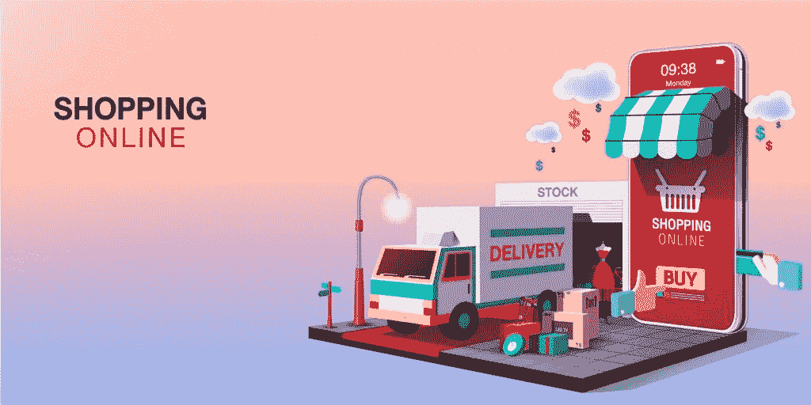

# 网上购物和店内购物——哪个对零售商更有利

> 原文：<https://medium.datadriveninvestor.com/online-shopping-vs-in-store-shopping-which-is-better-for-retailers-d5dd0eb5b482?source=collection_archive---------18----------------------->

零售商需要从当前的经济形势中吸取的主要教训之一是拥有一个在线商店的重要性。在最近的封锁期间，能够在网上销售产品和服务的公司比那些不能这样做的公司表现得好得多。电子商务的重要性将持续到明年及以后，预计到 2021 年全球在线销售额将达到近 5 万亿美元。此外，到 2040 年，多达 95%的购物将在网上完成。既然已经确立了电子商务的重要性，那就来看看各自的优势吧。

# 网上购物与店内购物的利弊

两者——网上购物和地面商店各有优势，对零售商和买家都有用。让我们来看看其中的一些。

# 网上商店的好处:

1.  24/7 可用性—虽然实体店有营业时间，但电子商务网站可以在任何时间、任何地点访问。顾客可以立即购买，并在第二天送货上门。
2.  便利性——顾客可以在自己舒适的家中购物，而不必开车到实际地点，也不必在收银台应对拥挤的人群和长长的队伍。
3.  节省时间——客户可以比较和对比来自多个网站的产品，并购买他们认为最好的产品。这可以立即完成，而不必从一个商店到另一个商店。
4.  扩大覆盖范围——零售商可以接触到其地理区域附近以外的客户。事实上，到 2021 年将有 21.4 亿网购者，如果你有一个电子商务网站，你将能够获得更大的市场份额。
5.  降低成本——对于实体店，您有大量的间接成本，如租金、员工工资、采购供应品等。有了网上商店，你可以避免这些费用。

# 实体店的好处包括:

1.  有形元素——顾客可以亲身感受和试穿商品，从而增强购买信心。
2.  立即供货——顾客一付款，就可以立即开始享用。
3.  体验——很多人喜欢从一家商店逛到另一家商店，看一件特定的商品。这给他们提供了愉快的体验。
4.  运输成本——虽然一些在线零售商提供免费运输，但也有一些不提供，客户不想支付额外费用。
5.  退货的可能性更小——某些商品，比如衣服和化妆品，需要完全合身，不试穿很难做出正确的选择。

既然我们已经了解了网上购物和线下购物的优势，让我们来看看商家如何将两种体验结合起来，以利用这两种趋势。

# 两全其美

如今，几乎所有的实体店都有网上商店，但对于较小的商店来说，转向电子商务的优势并不明显。事实上，根据福布斯最近的一项研究，只有 28%的小企业进行网上销售。然而，你不必马上建立一个成熟的电子商务网站。你可以先在易贝开一家店面，或者作为第三方在亚马逊上销售，尝试一下。至少，这将为你提供一个可以用来吸引新客户的在线平台。

说到带来新客户，你还需要让他们回来买更多的东西。换句话说，你需要开始与他们建立长久的关系。在实体店，这是通过提供广泛的产品选择、优质的客户服务和奖励顾客在你的商店购物来实现的。所有这些都可以通过为你的企业开发一个[电子商务软件解决方案在线完成。](https://skywell.software/retail-software-development/)你还将获得额外的奖励，即接触到那些可能从未听说过你的商店或生活在其他国家的顾客。

# 在线与实体的盈利能力

当我们看一看网上购物与店内购物的统计数据时，我们会发现电子商务显然是赢家。首先，预计到 2023 年，在线销售额每年将增长 14.8%，而实体销售的增长仅增长 1.9%。如果我们扩大视野，看看全世界的零售额，电子商务的货币优势就更加明显了。去年，全球零售电子商务总额为 3.53 万亿美元，预计这一数字在未来两年内将翻一番，达到 6.54 万亿美元。

# 利用技术增强网上购物

当我们在前面比较电子商务与实体店的优势时，我们看到实体店仍然具有一定的优势。然而，电子商务网站可以在技术的帮助下提供同样的体验。例如，如果我们看看化妆品零售商科斯米娅，他们可以在 AR 应用程序的帮助下在线销售产品。顾客可以打开手机，浏览目录，试穿单品或现成的外观。该应用程序使用前置摄像头将化妆品涂抹到人的脸上，就像他们在商店里一样。

# 现在是开网店的最佳时机

对于很多公司来说，没有必要在网上购物和传统购物之间做出选择。您可以从这两者中获得收入，同时为您的客户提供最佳体验。虽然有些人可能对进入电子商务持观望态度，并正在考虑网上购物的利弊，但从上述所有统计数据来看，我们清楚地知道，这种方法预计将在未来几年甚至更长时间内得到发展，与只有实体店相比，你会获得更多的好处。Skywell 软件可以为您的企业创建一个高质量的商店，就像我们为[欧尚](https://skywell.software/portfolio/auchan-online-store/)和其他市场领导者所做的那样。我们知道如今顾客在网上平台寻找什么，我们会为你开发一个能让顾客一次又一次回来的平台。

*原载于*[*https://sky well . software*](https://skywell.software/blog/online-shopping-vs-in-store-shopping/)*。*