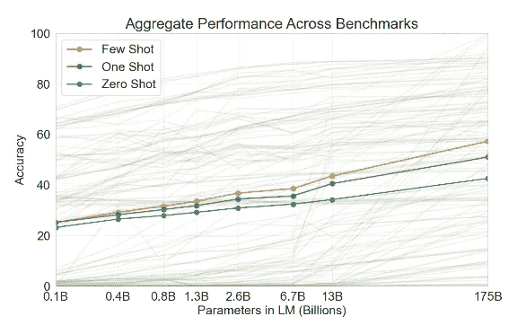

# 开放人工智能的 GPT-3:对我们的未来意味着什么

> 原文：<https://medium.datadriveninvestor.com/open-ais-gpt-3-what-it-means-for-our-future-ecaac29f6895?source=collection_archive---------6----------------------->

## 人工智能和 GPT-3 将如何塑造我们的未来，以及它在未来的位置。

Photo by [Andy Kelly](https://unsplash.com/@askkell?utm_source=medium&utm_medium=referral) on [Unsplash](https://unsplash.com?utm_source=medium&utm_medium=referral)

> GPT 三号？！那是什么？

OpenAI 打造的第三代 GPT 代表着“生成式预训练变压器”，自发布以来就引起了轰动。这家由埃隆·马斯克、萨姆·奥特曼、彼得·泰尔和其他许多人支持的非营利性人工智能研究公司开发了一种语言模型的升级版，允许计算机从一系列给它的令牌中预测或生成新的令牌(文本)。他们最近提供了一个与 GPT-3 模型接口的 API。

人工智能的目标是将人类智能应用于机器，同时创建展示智能行为、学习、演示、解释和建议用户的系统。GPT-3 是迄今为止我们看到的人工智能领域最大的飞跃之一。它的前身 GPT-2 在一个拥有超过 40*千兆字节*互联网智慧的文本语料库上用大约 15*亿*个参数进行了训练，这一新的自回归语言模型用 1750 亿个参数进行了训练，这大约是 350*千兆字节*互联网智慧，使 GPT-3 能够通过几次尝试达到相当高的准确度。

> 少量学习是指在给出任何指令之前，向模型显示尽可能多的演示，以适应模型的上下文窗口(通常为 10 到 100 个)。

GPT-3 在许多 NLP 数据集上取得了很好的性能，包括翻译、问答和完形填空任务。此外，它在一些需要即时推理或领域适应的任务上表现很好，如解读单词、在句子中使用新单词或执行 3 位数字运算。它还能够在其他用例中表现良好。

> 由于只有一个测试版本，这项技术已经在早期用户所做的一系列实验中显示出了它的辉煌。Debuild 的创始人，[**Sharif shame em**](https://twitter.com/sharifshameem)**，**与他的 Twitter 关注者分享了他是如何让 GPT-3 在几秒钟内生成代码并在 React 和 JSX 中构建多个全功能应用程序的。

API 被分发到语义搜索的服务案例中，语义搜索是在向 web 上的用户提供内容时考虑搜索短语的意图和上下文含义的能力。它还用作聊天和客户服务的会话代理，以及生成、帮助理解和翻译内容。

 [## 资本主义中的人类和人工智能|数据驱动的投资者

### 变老的令人惊讶的好处是发现那些引起年轻一代兴趣并经常吓到他们的问题…

www.datadriveninvestor.com](https://www.datadriveninvestor.com/2020/04/16/human-and-artificial-intelligence-in-capitalism/) 

这项技术将改变许多任务的完成方式，并尽可能减少人为干预。凭借其复制诗歌、设计、代码、文本和翻译的能力，GPT-3 在最近的试验中展示了如此大的潜力，扩展了我们对该模型应用领域的想象。滑铁卢大学(University of Waterloo)的学生 Yash Dani 证明，该 API 创建了一个资产负债表，并证明可以用来为没有会计知识的人生成财务报表。

OpenAI 指出，人类评估者很难区分使用 GPT-3 生成的新闻文章样本和人类撰写的文章。GPT-3 模型在基准测试中得分超过 40%,这看起来有点希望实现零迁移学习。零镜头是指不允许任何演示，只对模型进行自然语言的指导。由于 OpenAI 的任务无关性能方法，GPT-3 模型没有进行微调，但该模型可以进行微调，这将产生更有希望的结果。

该技术的进步速度证明了人工智能的应用具有巨大的优势，并迅速提高其准确性。我们只能想象，下一个版本的生成式预训练变压器在没有向模型显示任何演示的情况下，精度飙升到 50%以上。

Language Models are Few-Shot Learners, [https://arxiv.org/pdf/2005.14165.pdf](https://arxiv.org/pdf/2005.14165.pdf)

# 我们的工作会怎么样？

人工智能领域的趋势和进展只会让我们质疑大多数工作何时会变得自主。虽然这项技术可能不会很快取代我们的工作，但它可能会在未来几年内影响大多数活动的进行方式。使用 GPT-3 进行的实验展示了它如何支持软件开发、新闻、会计工作、创意写作、法律甚至设计等职业。Twitter 用户 Jordan Singer 演示了给 GPT 3 号引擎下达简单指令如何促使它使用 Figma 自行创建设计原型。

GPT-3 是一个强大而令人兴奋的工具，但远非完美。该技术受到仔细观察，以减少和避免有害的用例，如骚扰、垃圾邮件、激进化或 astroturfing，这些都可能是非常有害的，因为知道该 API 的优势。偏见的存在是 OpenAI 决定推出私人测试版而不是向公众提供的另一个原因。他们乐于构建工具来帮助用户更好地控制他们的 API 返回的内容，并研究语言技术的安全相关方面(例如分析、减轻和干预有害的偏见)。该模型在训练期间显示了一些有偏见的特征，这可能导致生成刻板印象或有偏见的内容。

> 这项技术显示出偏见的一些领域包括性别、种族、宗教。

[https://media.giphy.com/media/L4HWjj0sIXYty/giphy.gif](https://media.giphy.com/media/L4HWjj0sIXYty/giphy.gif)

即使与它的前任 GPT 2 号相比，GPT 3 号也显示出一些弱点。它在文本合成和一些 NLP 任务中有一些明显的局限性。它也有一些结构和算法的限制。训练过程中样本效率低下是包括 GPT-3 在内的语言模型共有的问题。该公司致力于提高样品效率和模型显示的局限性。

总的来说，随着 GPT-3 朝着测试时间样本效率和准确性更接近人类迈出了一步，它仍然有一些改进的空间，以改善和减少限制和偏见。随着 API 的商业化，我们只能希望在未来几个月内有更多的改进。

在 GPT-3 取代一些主要工作的情况下，我相信我们离它还有一点距离，因为技术仍然是新的和改进的。然而，我们将会看到它在许多职业中的一些应用。如果不是 GPT 3 号，那就是其他人工智能模型。

> 更多参考:

[1]开放 AI，开放 AI API (2020)，【https://openai.com/blog/openai-api/ 

[2]汤姆·b·布朗，本杰明·曼，尼克·赖德，梅拉妮·苏比亚等*等人，*语言模型是很少出手的学习者(2020)，[https://arxiv.org/pdf/2005.14165.pdf](https://arxiv.org/pdf/2005.14165.pdf)

**访问专家视图—** [**订阅 DDI 英特尔**](https://datadriveninvestor.com/ddi-intel)