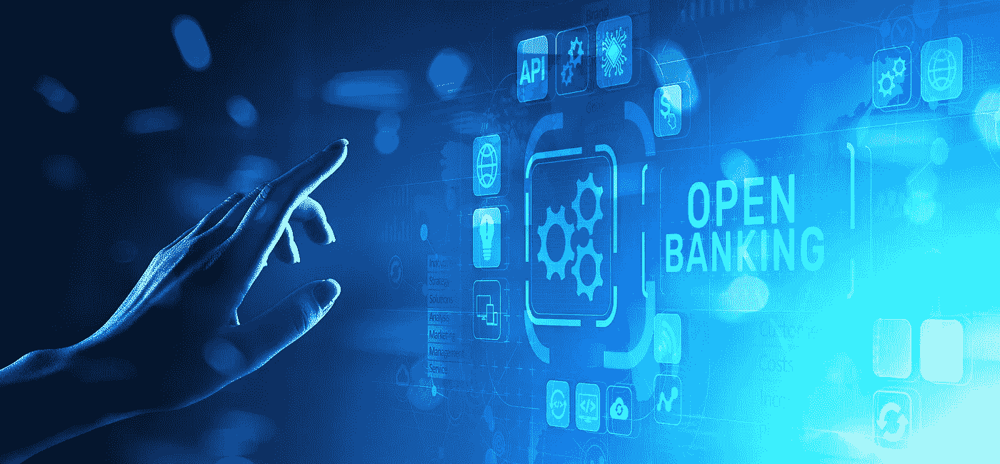

# 开放银行业:美国监管准备好了吗？

> 原文：<https://medium.datadriveninvestor.com/open-banking-is-the-us-regulation-ready-818548386a5?source=collection_archive---------12----------------------->

兴奋起来。一篇不是关于新冠肺炎或“谋杀黄蜂”的文章嗯，我可能稍微捏造了新冠肺炎的部分。我不是在直接讨论人类冠状病毒*，但这个话题是疫情邻近的。*

*随着我们继续阅读和参与围绕创新的讨论，以及疫情如何推动许多行业的数字化需求，一个不同的问题经常被带到前台和中心。*

*我们生活在数据时代，一场战争正在酝酿之中。为什么？*

*因为缺乏明确的数据所有权。像亚马逊和脸书这样的数据和科技巨头声称拥有他们可以得到的所有个人数据，并利用这些数据产生数十亿美元的收入。甚至提供“免费增值”服务的小公司也在挖掘、收集、筛选和出售个人信息，以获取高额利润。我们不要忘记政府机构拥有的大量个人数据。*

* [## 银行和金融科技初创公司的未来|数据驱动的投资者

### 银行的概念没有太大变化，但随着技术的发展，旧的概念也在更新。不相信我？拿一个…

www.datadriveninvestor.com](https://www.datadriveninvestor.com/2019/10/22/the-future-of-banks-and-fintech-startups/) 

与此同时，与数据相关的人对数据的收集、使用和出售束手无策(大部分情况下，*加州的人除外-* 谢谢，CCPA)。他们也无力保护这些数据，也无权决定如何保护和移植这些数据。当我们观察金融机构和金融科技如何发展时，这种影响是很重要的。在国外，这一问题正开始由开放银行运动(Open Banking movement)引发，该运动旨在为消费者提供更广泛、更透明的数据选择，同时刺激急需创新的行业进行创新。

在 Tech on Reg 播客的 [**最近一集**](https://provoke.fm/open-banking-is-the-u-s-regulation-ready/) 中，我与[**Envestnet | Yodlee**](https://www.yodlee.com/)的数据战略&战略解决方案副总裁 Brian Costello 进行了交谈，以揭示阻碍开放银行业务在美国完全扎根的一些因素。Brian 在 Yodlee 的经历使他能够为我们提供关于行业和消费者隐私及许可的独特见解。Yodlee 是消费者许可聚合服务的全球市场领导者。在过去的 20 年里——在目前的开放银行倡议之前——Yodlee 为商业市场提供了管道，允许消费者访问他们在金融机构的数据，并允许第三方接收商品和服务。

# 什么是开放式银行？

Brian 很早就将“开放式银行业务”(small“o”，small“b”)定义为消费者或小型企业访问其金融机构数据的权利和能力。这也意味着持有数据的金融机构应该有一些保护数据的要求。

一些背景:开放银行实际上是开放数据原则的一种实现，它始于政府。潜台词是，作为公民，我们应该能够知道和访问我们的政府机构拥有的关于我们的所有数据，并使用它…纠正它。机构有责任保护它。开放的*银行业*正在将这一原则应用于金融服务。听起来很简单，对吧？

英国似乎是这样认为的。在国外，法规要求银行与授权的第三方合作。然后，这些第三方可以使用开放 API 在金融机构内围绕数据构建应用程序或其他服务。虽然国外的开放银行业务包括第三方，但在美国，没有法律要求金融机构必须向第三方提供客户的财务数据，即使消费者提供了肯定的同意。再次为后排的便宜座位:*即使消费者提供肯定的同意。*

如果这听起来很落后，那是因为它确实如此。在 [**播客**](https://provoke.fm/open-banking-is-the-us-regulation-ready-2/) 中，Brian 很快指出，在消费者同意的情况下共享数据甚至存在一些监管摩擦。他通过让我们经历一个假设的场景来巩固这一点。想想你最后一次开银行账户是什么时候。你必须签署披露并回答一些问题。您基本上同意银行可以使用您的数据提供金融服务，您也同意银行可以使用您的数据来满足某些监管要求，包括反洗钱(AML)和欺诈检测以及《银行保密法》。银行还询问他们是否可以与愿意为您提供商品和服务的附属第三方共享您的数据。很有可能，你回答不，因为你讨厌被卖给别人。很公平。

然而，快进到几个星期后，当你的同事告诉你一个"*奇妙的*"财务管理应用程序，你必须"*尝试一下*"您对此很感兴趣，于是您下载了该应用程序或访问了该网站，并完成了整个在线流程，在此过程中，您将链接您的银行账户并将您的凭据委托给该组织。然后，该服务提供商获得您授予您的银行的许可，并基本上说“我们代表约翰·史密斯来此，他提供了他的凭据。请给我们这些数据。”

这是一个问题。该银行面临一个难题。当您与银行签约时，您告诉他们不允许第三方提供商访问。现在他们被要求提供这种访问。银行能做什么？在大多数情况下，他们宁可选择良好的客户服务，也要容忍第三方的访问。他们*容忍*而不是*允许*，因为他们知道如果有不好的事情发生，他们会受到牵连。这个问题是一个支离破碎的生态系统的直接结果——一个开放银行业试图解决的支离破碎的生态系统。

布莱恩还强调了我们在美国的情况与我们在大洋彼岸的朋友之间的重要差异。在英国，开放银行(大写“O”，大写“B”)是一种受监管支持的制度，有利于建立一个互联的生态系统。开放银行使中央机构能够将可追溯性和保护纳入管理生态系统的责任框架。这样，如果(当)不好的事情发生时，消费者受到保护，他们由对伤害负责的一方赔偿。最终，这是美国开放银行业的目标，但我们正面临着可能难以推进的强大阻力。

# 开放银行业解决了什么问题

开放式银行解决了许多来自分散的生态系统的问题。我们现在也处在一个转折点。监管支持正在全球范围内建立，使得监管之间能够协调一致，并为消费者提供强有力的保护。计算能力和可以无缝分析消费者数据的算法是现成的。这是做出飞跃的最佳时机。

布莱恩和我一致认为这个结果将会带来无穷的益处。它将使金融服务提供商能够提供非常个性化的建议和快速决策。所有这些因素结合起来相当于为个人定制金融服务——无论是建议还是产品或产品推荐——都基于每个消费者的个人数据库。想想看:我们的个体数据是*难以置信的*稳健。它不仅包括财务数据和财务行为，还包括可以跨人生阶段和人生目标映射的数据。然后，我们收到的建议可以以有意义的方式进行定制，这取决于我们是千禧一代还是 X 世代，或者我们是否觉得游戏有吸引力，或者我们是否对数字推动反应良好。最大的问题之一是“为什么我们还没有这样做？”尤其是当这些都是消费者一直大声明确提倡的事情时。

# 消费者对集中监管权力心存疑虑

虽然美国消费者表达了想要更多个性化金融工具的愿望，但他们也对中央驱动的监管持怀疑态度。来自中央的监管往往会让人们坐立不安，尽管最终结果是它往往会推动更大更好的市场。在几乎所有的海外开放银行计划中，关键驱动力都是鼓励创新、避免垄断和加强消费者保护。

底线是，美国金融服务框架归结为州与联邦监管制度，这影响了开放银行以外的许多金融问题。你可以在加州消费者隐私法案(CCPA)中看到这一点，该法案的基础是消费者有权使用他们的数据…以及这些数据会发生什么。

问题在于这些隐私条例中的一些是如何向群众宣传的。在大多数情况下，标题集中在“保护”元素上，而可移植性元素仍然是一个被埋没的 led。布莱恩强调说，为了消费者隐私法规的繁荣和促进开放银行业务，“便携性必须与保护同等重要。”没有可移植性，允许合格的、授权的、适当许可的第三方访问数据变得极其困难。

# 为什么耽搁了？

多德-弗兰克法案第 1033 条规定，美国公民应该有权访问他们的财务数据。甚至有人认为，这是来自消费者金融保护局(CFPB)的法律(以及文件和立场)的一部分，那里鼓励开放银行业务。但是 CFPB 小心翼翼。

我们所知道的(也是 CFPB 试图陈述的)是消费者有权获取他们的信息。但该局发布的指导意见被限定为“根据该局规定的规则”一句话——该局尚未行使其制定规则的权力来真正定义*消费者如何访问他们的信息。*

*正如布莱恩所指出的，缺乏规则意味着其他已经存在的规则和法律必须优先考虑。让银行对损失负责的法规 E，是影响创新和获得依赖消费者数据的工具和服务的因素。*

# *为什么 CFPB 表现得很酷*

*这是一个复杂的问题。各方都有热情的利益相关者。要进行的对话是困难的。布莱恩提供了一个清晰的例子来说明这种趋势是如何发展的。让我们假设有一条法律规定，消费者可以在银行访问他们的数据，银行必须以电子格式提供这些信息。很简单，对吧？*

*它是——直到有人问下一个最明显的问题: ***哪种*** 电子格式？现在我们看到的是非标准化的情况。如果政府试图制定一个行业标准，几乎每个行业参与者都会沮丧地放弃。这其中的创新在哪里？现任者会叫嚣犯规，因为他们必须考虑对股东的回报，以及他们正在一个充斥着不受监管或监管较少的竞争者的市场中竞争的现实。*

*这仅仅是 CFPB 考虑制定规则时各种意见涌入华盛顿的开始。此外，还要考虑实施更大的授权方案。还有人担心联邦银行监管机构如何根据《银行服务公司法》检查市场上的大规模技术服务提供商。长话短说:每个人都吓坏了。*

*因此，CFPB 试图通过在制定规则时保持冷静，来平静一个支离破碎的市场已经波涛汹涌的水面，这是有道理的。相反，他们试图利用他们的影响力，试图让所有利益相关者在沙盒中友好相处——或者至少不要扔沙子。*

*我明白，但我也知道制定规则是必要的。CFPB 只能保持冷静这么久。最终，他们将需要让每个人都在同一页上——并且在必要的舒适水平上——以便制定规则。没有人会 100%满意，但我们可以“足够接近”来推动事情向前发展，避免诉讼、延期和禁令(并不是说这些曾经阻止过联邦监管机构发布一套规则和条例)。*

*达到这一点的一部分是建立一个行业联盟模型，很像[金融数据交易所](https://financialdataexchange.org/) (FDX)，其中包括许多大银行，如摩根大通、美洲银行和富国银行，以及其他数据聚合器、许可方和金融科技公司。FDX 的目标是为消费者许可数据的安全交换创建一个免版税的互操作性标准。目标是开发一套数据交换协议(API ),以便各种规模的金融机构都可以向第三方提供数据，而这些第三方可以是聚合器，为较小的客户服务，如 fintechs。*

*另一个要素是创建一个授权方案，不要求最终用户将他们的网上银行凭证委托给第三方。这两项举措都带来了更可靠的数据交换，消费者不必担心将他们的网上银行凭证委托给多方。它们还大大有助于帮助政策制定者和监管者对在系统中制定规则感觉更好。你必须两者兼得:公平的竞争和创新环境 ***和*** 批发消费者保护。后者需要一个基于出色的可追溯性和规范标准的责任框架。*

# *数据是新的石油吗？*

*许多行业领袖评论说，数据是新的石油。罗恩·舍夫林在[福布斯](https://www.forbes.com/sites/ronshevlin/2019/04/15/open-banking-wont-work-in-us/#1c97cc491e52)的一篇文章中指出，石油是“一种在拥有者和想要者之间轻易自由分享的资源吗？当然不是。那么，在这种情况下，为什么*应该* we 和*将* we 拥有的数据轻松自由地共享呢？”*

*根据 Brian 的说法，一个更恰当的比喻是数据是新的空气。消费者通过他们所做的每一件事产生关于他们自己和他们行为的数据。能够将这些数据用于自己的目的——与我们认为最适合帮助我们取得积极成果的第三方分享这些数据——是绝对必要的。*

*在短期内，我们可能会听到生态系统中更多的团体开始以这种方式来组织讨论。我们会听到像“宪法规定的隐私权”和“数据是一项人权”这样的术语最终，我们需要建立一种清晰的方法，让人们能够控制他们的数据，并让第三方对使用这些数据的要求负责，并尊重我们对这些数据的权利。**