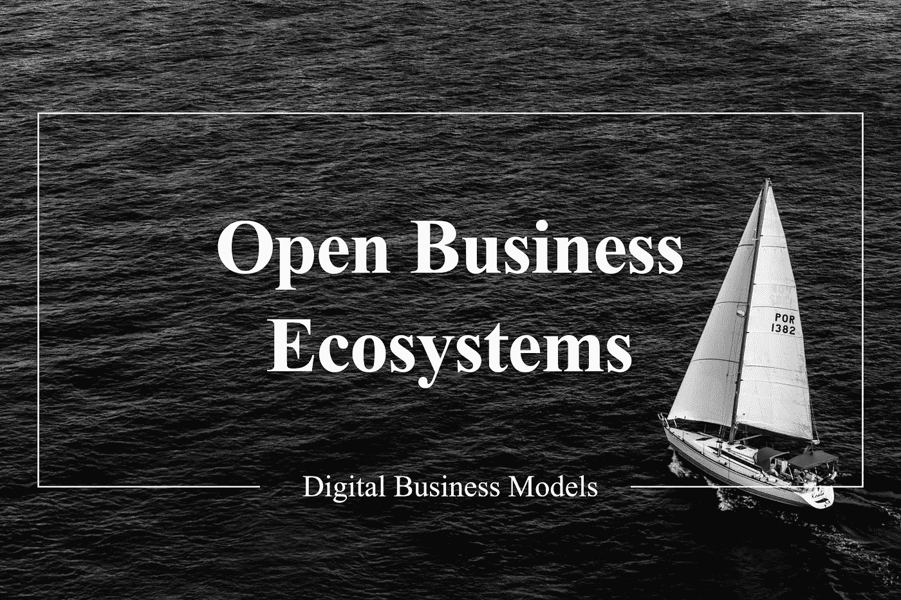
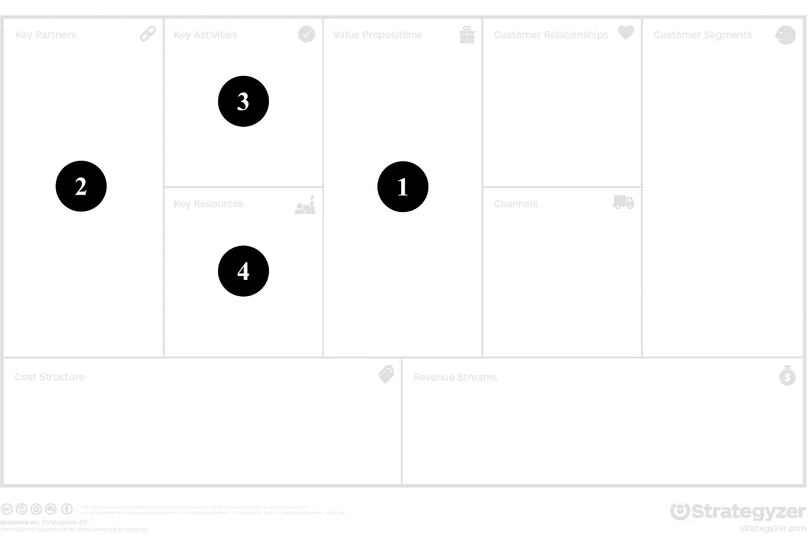

# 开放的商业生态系统

> 原文：<https://medium.datadriveninvestor.com/open-business-ecosystems-1aadb586d6e3?source=collection_archive---------5----------------------->

Open business ecosystems — a new digital business model

数字化转型推动组织将其业务扩展到更大的生态系统，但这种演变的原因是什么？商业生态系统是应对全球化和数字化带来的快速增长的竞争的关键，并使组织能够在数字化、快速变化的商业模式时代生存。成功的商业生态系统的例子时有发生，而且种类繁多。以戴姆勒和宝马在 2019 年成立的合资企业为例，该企业旨在探索未来的移动服务和技术。两家汽车制造商都希望通过将其移动服务合并为联合服务来评估客户需求并与其他汽车制造商对抗，从而从合资企业中获利。许多高管希望以一体化解决方案的形式进入商业生态系统，担心错过趋势和不断变化的客户需求。与这种进入商业生态系统的天真方法相反，这种联盟的焦点应该是具体的商业问题——否则，生态系统将缺乏清晰性、开放性和可实现性。让我们来看看开放商业生态系统的不同方面，以及它们将如何与企业的商业模式互动。此外，自动驾驶领域为生态系统带来了巨大的潜力，因为许多企业正在投入时间和精力探索移动趋势。

# 商业生态系统

商业生态系统这个术语被广泛使用。在本文的上下文中，商业生态系统是独立经济参与者的联盟，它们组合产品或服务以遵循一致的目标。经济参与者可以是拥有共同价值主张的企业、组织或公共机构。早期的商业生态系统可以从纺织工业化中找到，独立的专业工匠在贸易中心交换关键服务。我们对商业生态系统的理解中不包括像供应商伙伴关系这样的基于从属关系的基本生态系统，因为它们不涉及具体的商业问题。创建商业生态系统并不是一个新概念。商业生态系统与其他生态系统的区别在于以下特征:

1.  **模块化:**集成生态系统各方的产品或服务组件是独立提供的，由客户从一系列组件中选择，这些组件可以进行组合，因为它们是互补的。
2.  **定制:**生态系统各方的贡献是根据生态系统的需求定制的，以服务于一致的目标，因此可能包括使独立服务适合生态系统的努力。
3.  **相互依赖:**生态系统由影响约定契约的相关方之间的相互依赖的交互组成。
4.  **协调:**为了成功地治理商业生态系统，协调努力对于控制交互是必要的。这种协调可以通过定义的标准和过程来保证。

在实践中，各种不同的商业生态系统可以分为两类。一方面，解决方案生态系统通过协调价值链上的参与者来创造产品或服务，另一方面，通过数字平台匹配双边市场的交易生态系统。通过生态系统进行整合的好处是获得更广泛的功能、可扩展性、缩短上市时间、灵活性和弹性。

# 开放式商业模式

根据 Gassmann 等人([链接](https://amzn.to/3cVP9Rq))的说法，开放式商业模式代表了与合作伙伴的协作，这是价值创造的核心组成部分。虽然与供应商的互动是最明显的合作伙伴，但客户和竞争对手也可能是生态系统的一部分。一个例子可能是苹果、Fitbit 和 Garmin 创造的竞争生态系统。在健康跟踪领域，三家智能手表提供商与不同的软件提供商建立了生态系统，例如 Fitbit 与谷歌结盟，将 Fitbit 更深入地集成到电子医疗保健系统中。

开放式商业模式可以在不同的行业中找到，其中包括零售、时尚和信息技术。在零售和时尚领域，生态系统通常旨在降低在快速变化的市场中错过时尚潮流的风险。除此之外，这个行业的生态系统有利于分摊营销和品牌的高成本。在信息技术行业，联盟最有利于实现可扩展性，例如销售软件产品。

# 开放的商业生态系统

定义开放的商业生态系统允许几个战略维度的规范。根据 Gartner ( [链接](https://www.gartner.com/smarterwithgartner/8-dimensions-of-business-ecosystems/))，在决定开放的商业生态系统时，应考虑以下方面:

*   **生态系统战略**:组织可以扮演不同的角色，例如领导、破坏或协调商业生态系统。此外，成为多个商业生态系统的一部分允许单一战略的一致性。
*   **开放程度**:商业生态系统可以根据组织进入的可能性分为公共、私有或混合生态系统。
*   **不同参与者的参与**:根据生态系统的目标，其参与者可能具有不同的特征，例如专注于销售或技术参与。
*   **关系类型**:随着生态系统参与者数量的增加，关系管理变得更加困难。减少这些关系工作的一个解决方案是利用易于提供关系管理的数字平台。
*   **价值交换的形式**:生态系统有一个共同的交换价值的目标。价值的定义非常宽泛，有些组织以金钱为目标，有些则以信息、声誉或其他形式的非金钱利益为目标。
*   **行业多样性**:商业生态系统不局限于特定行业，参与者可能不属于某个单一行业。参与者的异质性可能是交流最佳实践的关键。
*   **多重生态系统的复杂性** : 作为多重生态系统的一部分，需要了解如何充分利用它们的潜力。
*   **技术**:技术将通过提供接口数据、分析商业行为和交换信息的选项来实现商业生态系统。

有了这些战略方面，组织就可以在一个变化是新现状的数字时代对不断变化的需求做出响应。

# 开放的商业生态系统模式

既然已经解释了商业生态系统及其战略维度，我们想看看商业生态系统模式对商业模式蓝图的影响:

1.  **价值主张:**在成本平均效应或加强客户关系等其他方面，客户价值主张的改善是进入商业生态系统的主要原因。
2.  **关键合作伙伴:**商业生态系统在很大程度上依赖于与被视为关键合作伙伴的组织的联盟。
3.  **关键活动:**商业生态系统的主要活动是与生态系统合作伙伴的交流、结盟以及对所获见解的改编。
4.  **关键资源:**作为主要资源，可以突出与生态系统的整合，如满足技术要求和通用标准。

根据 Osterwalder 和 Pigneur ( [链接](https://amzn.to/2xQabSX))，模式的上述特征在下面的商业模型画布上被可视化。

Open business ecosystems pattern in the BMC

# 解决方案和交易生态系统

根据 BCG ( [链接](https://www.bcg.com/de-de/publications/2019/do-you-need-business-ecosystem))的说法，在实践中发现了两种类型的生态系统。一方面，解决方案生态系统专注于沿着几个组织的链创建产品或服务，另一方面，交易生态系统作为双边平台，将供应和需求结合在一起。

解决方案生态系统可能是开放商业生态系统中最常见的形式，它拥有一个主要的组织，该组织协调一个由几个贡献者组成的网络。在建立新解决方案之初，生态系统贡献者积极参与创建解决方案，当解决方案成为标准产品的一部分时，贡献者将成为整体解决方案的供应商。解决方案生态系统的客户通常不是生态系统本身的一部分，但会消费生态系统提供的产品或服务。解决方案生态系统的成功例子包括外包全球服务的组织。外包此类服务的主要原因是小规模维护这些服务的成本很高。以一个合适的研发部门为例。可能成为外包全球服务解决方案生态系统一部分的公司可能是外包研发公司 Motius、大众接受度测试公司 Testbirds 或人力资源管理公司 Personio。

交易生态系统依赖于一个数字平台，该平台将产品生产商或服务提供商及其客户聚集在一起。与解决方案生态系统相反，交易生态系统直接包括客户。这就是为什么在客户关系上投入了大量精力的原因。双边市场将有助于获得大量客户，因为它可能包括免费的服务提供商。交易生态系统的一个例子是 Twitch。流媒体服务提供商将内容提供商与感兴趣的娱乐团体联系起来。在这个例子中，客户甚至可以转换他们自己作为服务生产者的角色。

# 示例:软件定义的计算系统

让我们来看看自动驾驶最有前景的生态系统之一:戴姆勒和英伟达的合作关系([链接](https://www.daimler.com/innovation/product-innovation/autonomous-driving/mercedes-benz-and-nvidia-plan-cooperation.html))。与计算基础设施领域的全球领导者合作，戴姆勒的目标是在 2024 年推出用于自动驾驶的革命性软件定义车辆系统。软件定义的架构的基础将是 NVIDIA 的驱动平台，用于开发最复杂的自动驾驶功能。以下组件应为联合开发的一部分:

*   2-3 级自动驾驶
*   用于升级的可编程车辆软件
*   空中更新
*   安全和便利的应用

联手将有助于戴姆勒在自动驾驶方面赶上特斯拉和其他汽车制造商，并将英伟达定位为数据驱动和深度神经网络开发的主要基础设施提供商。

# 最佳实践

将以下最佳实践纳入您的开放式业务生态系统将有助于加强您的业务模式战略:

*   就责任达成一致:开放的商业生态系统可能会产生不明确的责任和要求。缔结协议将有助于理解每个生态系统贡献者的责任。
*   多战略生态系统:尝试遵循多战略，成为横向和纵向价值链中几个生态系统的一部分。
*   定义退出场景:“高调结束”这句话可以被视为等同于联合商业生态系统的退出场景。确定积极和消极结果的退出策略。

# 相关模式

开放商业生态系统模式可以与电子商务商业模型模式相关联([链接](https://amzn.to/3cVP9Rq))。在电子商务中，许多服务可以结合在共同的产品和服务中，例如物流、支付、营销服务等的外包。零售业的开放示例是开放商业生态系统有利于电子商务并为中小型企业提供大量潜力的示例之一。

# 结论和最终想法

向合作伙伴、客户和竞争对手开放服务和产品开发业务带来了许多变化，但也带来了保护知识产权的挑战。虽然已经存在各种各样的商业生态系统，但如果已经存在的生态系统不能满足你加入联盟的目标，你也可以开始创建自己的生态系统。根据经验，加入一个已经存在的生态系统要容易得多，但是灵活性差，要求也高得多。

解决方案生态系统为整个合作伙伴链提供价值，并且往往非常具体地针对业务挑战，而交易生态系统包括开放的数字平台。戴姆勒和英伟达在自动驾驶未来方面的合作是开放商业模式和战略合作的一个很好的例子。

# 进一步阅读

考虑以下阅读材料，了解更多关于数字商业模式以及如何为您的业务采用人工智能的信息。

> **数字时代的商业模式** ( [链接](https://medium.com/@marcelpaulboer/business-models-of-a-digital-era-5a530ccbd52f) )
> 不要错过这篇关于数字转型和数字原生者如何改变商业的文章。随着新兴技术和客户行为的采用，企业呈现出各种新的商业模式，模式面临数字化时代的特征。

> **关键优势:商业生态系统的新动态对战略、创新和可持续性意味着什么** ( [链接](https://amzn.to/34qaOAl) )
> 如今，企业的成功越来越依赖于合作网络。单个公司之间的战斗正在转变为交换资产、资源和信息的生态系统之间的战斗。Marco Iansiti 和 Roy Levien 详细阐述了如何利用生态系统实现长期商业成功。如今，一个公司的生存取决于其网络的保护和成功。