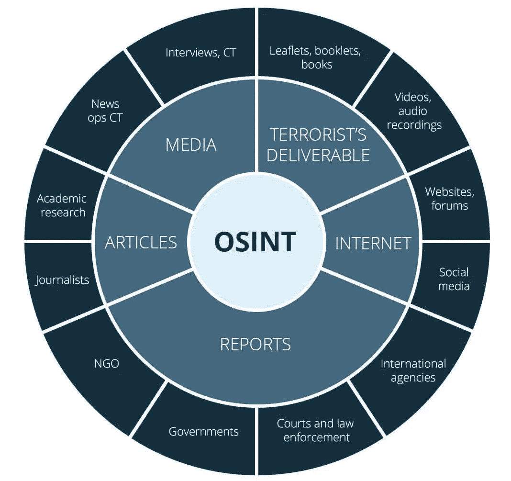
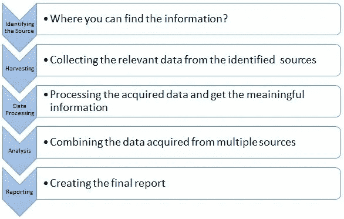
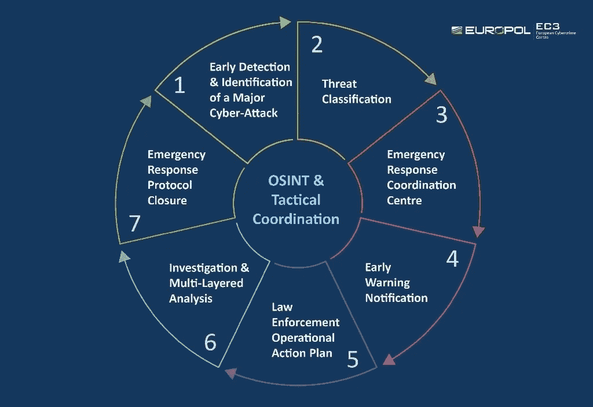

# 开源智能(OSINT) 101

> 原文：<https://medium.datadriveninvestor.com/open-source-intelligence-osint-101-d96f47ff2ff1?source=collection_archive---------0----------------------->

## 为网络安全调查收集相关信息是一项艰巨的任务，尤其是在对手信息有限的情况下。OSINT 是非敏感情报，分析师使用它来回答以前情报学科中的机密、非机密和专有情报要求。

开源情报，更好地称为 OSINT，是一种技术，指的是与情报相关的公开可用和开放的信息来源(相对于秘密或秘密来源)。OSINT 是来自公共和公开来源的信息。大量可操作和可预测的情报来自公共和非机密来源。这意味着收集的信息不仅可供公众消费，也可供整个情报界使用。

开源情报的使用可以追溯到第二次世界大战，但自从美国政府认识到使用来自广播和新闻等开源信息的重要性以来，这一过程一直被正式使用。中央情报局(CIA)建立了一个开源中心，以其前身战略服务办公室(OSS)的成熟专业知识为基础。主要目标是理解、翻译和分析外国广播和新闻，以及获取有关外国政府和组织的信息。

开源信息以资源和网站的形式提供给公众，可以通过在线搜索引擎定位和找到，这极大地方便了开源信息的收集。开源被认为比传统的信息收集方法更容易获取，因为它不需要特定的技术、工具或技能来获取信息。

这就是为什么使用开源智能如此重要。它使您能够查找和修复组织网络中的漏洞，修复它们，并在威胁者使用相同的工具和技术利用它们之前删除敏感信息。成功是 OSINT 分析师的一个关键组成部分，因为没有成功，研究人员可能会因无意中警告他们的目标、不当收集数据或在交付给客户时降低数据的有用性而陷入严重的麻烦。

虽然 OSINT 的定义变得越来越复杂，但在当今世界，人们越来越多地利用开源智能。有很多人承担着在互联网上挖掘并把他们愿意发布的所有数据和信息放到网上的任务。

GDPR 等数据保护法只是加强了适当的 OSINT 系统的使用。搜查过程中收集的所有信息都是公开的，无需搜查令或传票。这些信息可以通过合法和受版权保护的方式检索。

虽然类似的智能技术已经存在了数百年，但由于互联网的兴起和开源的扩散，OSINT 近年来获得了发展势头。

与使用地面人力资源(尤其是在敌对国家)或使用间谍卫星相比，使用公开信息收集信息具有风险。OSINT 可用于多种情况，如网络攻击、网络间谍和网络行动。

收集情报通常比其他情报来源便宜。虽然有许多开源工具可以在情报界使用，但其中之一是搜索引擎，大多数人称之为 Google。对目标进行社会工程攻击也被视为一种主动信息收集的形式。

安全专家面临的最大问题之一是用户在互联网上意外泄露敏感资产和信息。这就是为什么出于安全目的使用开源智能如此重要的原因，因为它使您能够使用威胁者利用的相同工具和技术来查找、修复和删除敏感信息。

无论您是在寻找有关恐怖袭击、贩毒或刑事调查的信息，了解开源情报服务的真正含义及其工作方式都很重要，包括其收集、使用和使用，以及可用于捕获和分析它的工具和技术。

为网络安全调查收集相关信息是一项艰巨的任务，尤其是在对手信息有限的情况下。OSINT 是非敏感情报，分析师使用它来回答以前情报学科中的机密、非机密和专有情报要求。

## **OSINT 进程**

首先，您需要很好地理解获取和使用开源智能的过程，以及您组织的安全策略和程序。

OSINT 分析师通常遵循如下所示的 OSINT 流程。

OSINT Process

**新的资源和技术**

黑客和渗透测试人员广泛使用 OSINT 来在线收集特定目标的信息。安全专家面临的最大问题之一是，正常的用户经常会在互联网上意外发布敏感资产和信息。o 防止数据泄露，了解导致未来网络威胁的原因，并通过分析组织内的 OSINT 来源并将此信息与其他信息相结合来制定组织的威胁策略，以实现有效的网络风险管理策略，帮助组织保护自己免受勒索软件、网络钓鱼和其他网络攻击等网络威胁。

通常，OSINT 分析师有一个合适的策略和框架，他们基于这个策略和框架设置他们的工具和技术。他们没有收集互联网上的所有信息。

OSINT and Tactical Coordination

主动收集可以分为两类:被动收集和主动收集。主动收集使用各种技术来收集数据，而被动收集则涉及威胁情报平台(TIPs)的使用。

最常见的 OSINT 资源如下:

元数据搜索

搜索引擎

社会化媒体

在线社区

电子邮件地址

用户名

人民搜索引擎

电话号码

在线地图

代码搜索

文档

形象

录像

域名

IP 地址

政府和商业记录

虚拟货币

高级 Linux 工具

地理空间研究

数据泄露和泄漏

从技术上讲，任何知道如何使用这些工具和技术来获取信息的人都被认为使用了这个过程。但是，因为这些技术由于技术的变化而具有流动性，所以它们中的很大一部分不是任何有知识的人都能够进行的。

**o 新工具**

通过使用 OSINT 工具，分析师能够理解大量公开可用的数据，并将其转化为有用的信息。工具在信息搜索中起着重要的作用，但是它们不会对所有用户都有帮助，除非你知道这些工具的使用有多重要。

假设你的工作是找出不同网站上的用户名，比如脸书、Twitter、LinkedIn 和其他社交媒体网站。您可以运行多种工具来收集目标和相关信息，以便日后关联和使用。相反，通过使用连接到不同网站的开源工具(我不记得有多少了)并一次检查网站上的所有用户名和存在，这是可能的。

虽然 OSINT 有很多工具，但我不建议将开源智能仅仅作为工具的使用来寻找任何有趣或有用的东西。

以下是最常用的 OSINT 工具:

***谷歌呆子***

谷歌 Dorking，也称为“谷歌黑客”-可以返回用简单的搜索查询很难找到的信息。这是一个搜索字符串，高级搜索引擎操作员使用它来查找网站上不容易找到的信息。Google-y，有时简称为 dorks，是一个高级搜索词运算符，它使用高级搜索运算符来查找网站上不容易访问的信息。它是 Google 的扩展运算符的扩展，但也是 Google hacking 的口语术语。

它使用带有高级搜索操作符的搜索字符串来查找网站信息，如网站名称、位置、日期和时间。

[***OSINT 框架***](http://osintframework.com/)

o 建立评估公众看法和支持决策的框架，并支持数据收集和分析。

[***检查用户名***](http://checkusernames.com/)

CheckUserNames 是一个互联网工具，可以帮助你发现超过 170 个社交媒体平台上的用户名。

*HaveIbeenPwned 是一个工具，可以告诉你，如果你的帐户已被破坏或没有在过去。*

*[***已核实***](https://www.beenverified.com/)*

*BeenVerified 是另一个在互联网上搜索人们公共记录的工具。*

*[***Censys***](https://censys.io/)*

*Censys 是一个搜索引擎，用于收集任何连接到互联网的设备的数据。*

*[***内置***](https://builtwith.com/)*

*BuiltWith 提供了关于所用 CMS 的详细信息，如 WordPress、Joomla、Drupal 等，以及全深度 Javascript 和 CSS 库，如 jquery、bootstrap/foundation、外部字体、web 服务器类型(Nginx、Apache、IIS 等)、SSL 提供程序以及所用的 web 托管提供程序。*

**

**Maltego 为开源智能和可视化链接分析提供解决方案。**

****

***Recon-ng 是一个全功能的侦察框架，旨在提供一个强大的环境来快速彻底地进行开源的基于 web 的侦察。***

******

***收割机是一个非常容易使用，但强大而有效的工具，设计用于渗透测试或红队参与的早期阶段。将其用于开源情报(OSINT)收集，以帮助确定公司在互联网上的外部威胁形势。该工具使用多个公共数据源收集电子邮件、名称、子域、IP 和 URL。***

***[***庄丹***](https://www.shodan.io/)***

**Shodan 在世界各地都有服务器，通过抓取互联网来提供最新的互联网情报。**

**[***拼图***](https://www.jigsawsecurityenterprise.com/)**

**jigsaw 是一种新工具，可以让你收集任何公司员工的信息。**

**[***蜘蛛脚***](http://www.spiderfoot.net/)**

**SpiderFoot 是一个侦察工具，可以对 100 多个公共数据源进行查询，以收集关于通用名称、域名、电子邮件地址和 IP 地址的情报。**

**[***令人毛骨悚然***](https://www.geocreepy.com/)**

**Creepy 是一个地理定位工具，通过社交网络平台提供地理定位信息收集。**

**[***Nmap***](https://nmap.org/)**

**Nmap 是安全专业人员用于网络发现和安全审计的最流行和最广泛使用的工具之一。**

**[***web shag***](https://github.com/wereallfeds/webshag)**

**Webshag 是一个多线程、多平台的 web 服务器审计工具，它让您收集 web 服务器审计的常用功能，如网站抓取、URL 扫描或文件模糊。**

**[***open vas***](http://www.openvas.org/)**

**OpenVAS(开放漏洞评估系统)是一个带有 OpenVAS Scanner 的安全框架，Open vas Scanner 是一个高效的代理，可在目标机器上执行所有网络漏洞测试。**

****

***激烈的是一个半轻量级的扫描器，有助于定位非连续的 IP 空间和特定领域的主机名。它实际上是 nmap、unicornscan、nessus、nikto 等的前身，因为所有这些都要求您已经知道您正在寻找什么样的 IP 空间。***

***[***独角兽扫描***](https://github.com/dneufeld/unicornscan)***

**Unicornscan 是一个 OSINT 工具，可以扫描 TCP/IP 设备/网络、UDP 协议、识别 A/P OS、检测应用程序和组件并支持 SQL 关系输出。**

****

***FOCA(收集档案的组织的指纹)是一种工具，主要用于在扫描的文档中查找元数据和隐藏信息。这些文件可能在网页上，可以下载和分析 FOCA。***

******

***ZoomEye 是一个物联网搜索引擎，它使用 Wmap 和 Xmap 来建立数据库。***

***[***Spyse***](https://spyse.com/)***

**Spyse 拥有同类数据库中最大的数据库，其中包含大量便于侦察的 OSINT 数据。**

****

***IVRE(法语:Instrument de veille sur les réseaux extérieurs)或 dured(未知网络的动态侦察)是一个网络侦察的开源框架，用 Python 编写。它依靠强大的开源工具主动或被动地从网络上收集情报。***

******

***Metagoofil 是一个信息收集工具，用于提取属于目标公司的公共文档(pdf、doc、xls、ppt、docx、pptx、xlsx)的元数据。***

***[***EXIF tool***](https://exiftool.org/)***

**ExifTool 是一个独立于平台的 Perl 库和一个命令行应用程序，用于读取、写入和编辑各种文件中的元信息。ExifTool 支持许多不同的元数据格式，包括 EXIF、GPS、IPTC、XMP、JFIF、GeoTIFF、ICC Profile、Photoshop IRB、FlashPix、AFCP 和 ID3，以及佳能、卡西欧、DJI、FLIR、富士胶片、GE、GoPro、惠普、JVC/Victor、柯达、Leaf、美能达/柯尼卡-美能达、摩托罗拉、尼康、任天堂、奥林巴斯/爱普生、松下/徕卡、宾得/朝日、Phase One、Reconyx、理光、三星的许多数码相机的制造商笔记**

**除了这些工具，在人工智能的帮助下，OSINT 分析师能够有意义地捕捉公开可用的数据流，并将它们转化为可用的开源情报。**

**总之，在线工具在信息搜索中起着重要的作用，它们不仅有助于用户了解使用这些工具的重要性，而且有助于了解市场上有哪些可用的工具。关注开源信息——从分析师或研究人员的角度来看，这是一个令人信服的观点。**

****引用来源****

*   **https://geekflare.com/osint-tools/**
*   **[https://www . recorded future . com/open-source-intelligence-definition/](https://www.recordedfuture.com/open-source-intelligence-definition/)**
*   **[https://www.knowledgenile.com/blogs/osint-challenges/](https://www.knowledgenile.com/blogs/osint-challenges/)**
*   **[https://www . sec juice . com/introduction-to-open-source-intelligence-osint/](https://www.secjuice.com/introduction-to-open-source-intelligence-osint/)**
*   **[https://cy ware . com/educational-guides/cyber-threat-intelligence/what-is-open-source-intelligence-osint-b81f](https://cyware.com/educational-guides/cyber-threat-intelligence/what-is-open-source-intelligence-osint-b81f)**
*   **[https://securitytrails.com/blog/osint-tools](https://securitytrails.com/blog/osint-tools)**
*   **[https://www.campusce.net/iptm/course/course.aspx?C=407](https://www.campusce.net/iptm/course/course.aspx?C=407)**
*   **[https://en.wikipedia.org/wiki/Open-source_intelligence](https://en.wikipedia.org/wiki/Open-source_intelligence)**