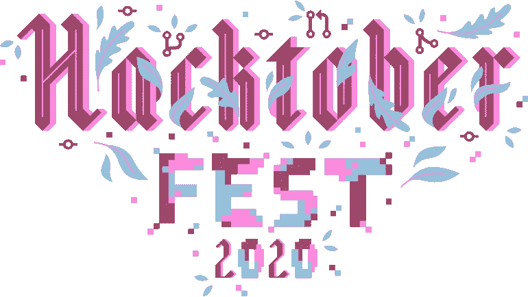

# 开源软件:Hacktober Fest

> 原文：<https://medium.datadriveninvestor.com/open-source-software-hacktober-fest-420f0a8713ae?source=collection_archive---------20----------------------->

十月对于编程来说是一个重要的月份。这是一个社区——作为一个整体——团结起来庆祝 [**开源软件**](https://en.wikipedia.org/wiki/Open-source_software) 的时刻。开源项目是在特定许可协议下公开发布的源代码库，允许开发人员有机会做出贡献。2014 年，[**digital ocean**](https://www.digitalocean.com/)**平台组织了有史以来第一次为期一个月的活动——*hack tober Fest——*来帮助激励人们参与进来。**

**支持开源项目在很多方面都很重要。对于希望参与现场制作并积累经验的新开发人员来说，这可能是一种有益的方法。对于公司来说，公开他们的代码库作为一种全球社区之间的交互手段，以帮助解决当前的软件问题并帮助提高产品质量也是很有用的。**

**开始将取决于你的能力水平，但是所有参与的技能都有贡献。不管精通与否，你的切入点都是从 [**Github**](https://github.com/) 开始的。这是开源社区聚集的最受欢迎的地方之一。它还拥有数百万的开源代码，包括可供开发人员贡献的存储库。**

# **从这里开始**

**登录 Github，然后访问 Hacktoberfest [**主页**](https://hacktoberfest.digitalocean.com/) 报名参加活动。从那里，你可以访问许多关于如何开始的各种资源，包括需要贡献者的库的链接——你也可以通过 Github 搜索项目。**

# **规章制度**

**这就是好人不能拥有美好事物的原因，而要获得最佳体验，需要一定程度的成就。您必须在 10 月 1 日至 31 日之间提交四(4)个拉取请求，才有资格获得资格。**

**pull 请求必须提交给一个标记有`**hacktoberfest**`主题的存储库。此外，提交给标有`**hacktoberfest-accepted**`的上述主题之外的项目的任何拉请求都将被视为有效贡献。**

**这个阶梯对于那些担心对更大的代码库做出贡献的人来说是有用的。因此，拉请求必须包含您自己提交的提交。无论维护者是谁，提交的内容都必须合并，才能成为四个拉请求之一。**

**我建议不要提交任何与垃圾邮件相关或违反行为准则的内容。两者之一的维护者的报告可能使参与者不合格。低质量贡献的例子包括自动拉取请求、破坏性提交和任何缺乏深度。**

** [## 软件工程就是分享|数据驱动的投资者

### 当我开始我作为软件工程师的第一份工作时，我从来没有意识到我对技术的世界观有多么狭隘…

www.datadriveninvestor.com](https://www.datadriveninvestor.com/2020/09/11/software-engineering-is-all-about-sharing/) 

# 创建拉取请求

## 1.[派生并克隆一个回购](https://docs.github.com/en/enterprise-server@2.20/github/getting-started-with-github/fork-a-repo)

一旦你找到了一个你感兴趣的 repo，就把它放到你的 Github 账户上。从那里，您可以将它复制并下载到您的本地机器上，并开始编码。在`main`上工作并不理想，建议[创建一个分支](https://git-scm.com/book/en/v2/Git-Branching-Basic-Branching-and-Merging)。

## 2.提交并推送到 Github

一旦完成了呈现的任务，就必须将代码提交到链接到 Github 帐户的分叉库。git 提交主要由以下命令组成:

`git add github-repo/contribution.ext`

`git commit -m "my first contribution hacktoberfest-accepted"`

`git push origin branch`

`git checkout main`

`git merge branch`

`git push origin main`

## 3.[创建一个拉取请求](https://www.wikihow.com/Create-a-Pull-Request-on-Github)

要打开一个 pull 请求，请访问您从 Github 派生和克隆的存储库的主页。然后，您的“拉”请求将被发送给负责管理存储库的人，以查看提交的代码。如果它遵循指定问题的指导原则，请求将被接受，您的代码将被推入生产环境。

你的拉取请求应该包括对你的贡献的描述。一个好的概括是描述你做了什么，你是如何做的，以及你为什么这样做的思考过程。

# 赢得奖品

完成四(4)个拉式请求，您将获得由赞助商提供的年度最佳收藏家球座之一。

也有其他公司会按照存储库的`README.md`中概述的特定指导方针向您发送各种 merch。

## [devSwag.io](https://devswag.io/)

Hacktober Fest 存储库列表，为对其存储库做出贡献的人提供从容易到困难的促销礼品。

## [Hacktober Fest 赠品清单](https://hacktoberfestswaglist.com/)

一个广泛的列表，致力于寻找有效的 Hacktober Fest 公司库，这些公司为他们的项目提供额外的激励。

# 结论

为开源软件做贡献可以让你有机会通过思想和/或架构的方式参与到你的社区中。我鼓励你通读一下 [Hacktober Fest](https://hacktoberfest.digitalocean.com/) 网站，并且在做任何事情之前先访问一下提供的资源。在那里，你会对它的目的有更好的认识，并对如何留下你的印记有更深的理解。我希望这对于让你适应开源代码是有益的，对于你作为贡献者的成长也是有价值的。

让我们在 [**推特**](https://twitter.com/ch2isk4kos) 上讨论。

## 访问专家视图— [订阅 DDI 英特尔](https://datadriveninvestor.com/ddi-intel)**