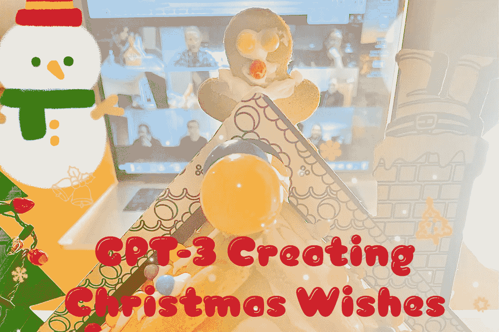
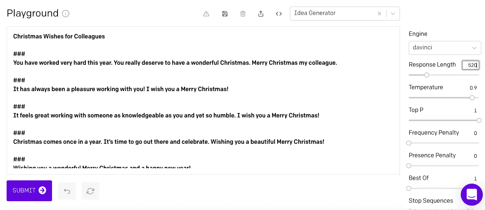

# OpenAI 的 GPT-3 模型为同事创造了圣诞愿望

> 原文：<https://medium.datadriveninvestor.com/openais-gpt-3-model-creates-christmas-wishes-for-colleagues-520dba89dd7a?source=collection_archive---------9----------------------->

## GPT-3 在生成内容方面的实验

All images in this article created by Author

GPT-3 是 OpenAI 的新语言生成器，它在推理、总结、分类、转换等方面的能力令我惊叹不已。GPT-3 生成文本的能力如何？

因为现在是假期，你可能想给你的同事写一些贺卡。问题是，如果我们直接复制网上找到的圣诞祝福，潜在地，你的同事可能会从你和其他人那里收到同样的祝福。

你好奇 GPT 3 号会创造什么愿望吗？目前世界上不存在的愿望？这篇文章介绍了我在 GPT 3 号操场上做的一个实验，为同事们制作圣诞祝福。

输入或提示(OpenAI 的官方术语)是一些圣诞愿望，作为模型的示例或教程。用于训练模型的内容的细节可以在以下要点中找到:

GPT 3 号的仪表盘或称游乐场如下:

右侧边栏是一个小部件，您可以调整超参数的值。我使用的发动机是默认的: ***达芬奇*** 这是最有能力的型号，但相对于其他型号来说速度较慢。我设置**的*温度*的**等于 0.9。通常情况下， ***温度*** 的范围在 0.7 到 0.9 之间，这取决于您希望模型执行的随机程度。

根据我们提供的示例，GPT-3 生成的输出或完成是什么？生成的文本的长度被设置为 520。GPT-3 创造的所有圣诞愿望是:

我的前三名是:

> “你总是在我身边。我无法告诉你我有多感激这一切。谢谢你我的朋友。我祝你圣诞快乐。向同事和朋友致以圣诞问候”
> 
> “愿新的一年给你带来爱和幸福。祝你圣诞快乐！”
> 
> “我们肯定已经走了很长的路！我的朋友，圣诞快乐。”

**你最喜欢的是哪一款？**在这里，你可以随意使用 GPT-3 创造的任何愿望来问候你的同事。

当 ***温度*** 降低或升高时，GPT-3 产生了什么样的愿望？超参数的调整过程可以在下面的 Youtube 视频中找到。玩得开心🎄