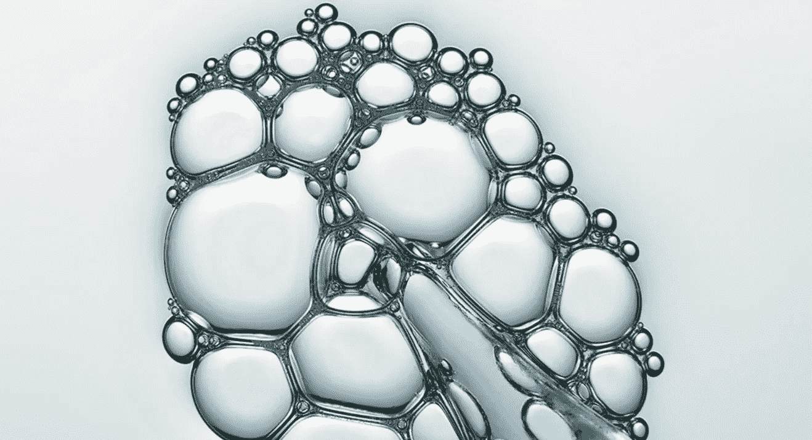

# OpenCV 是为检测而设计的，不是为了定量。

> 原文：<https://medium.datadriveninvestor.com/opencv-is-designed-for-detecting-it-is-not-meant-for-quantification-17c58e5b45c1?source=collection_archive---------1----------------------->

Data is a chaos and perhaps in this chaos you would find most wonderful patterns.

> 数据是混乱的，也许在混乱中你会发现最奇妙的模式。
> —维纳利·索诺内

天啊。我，一个懒惰的家伙，抓住了疫情的黄金机会，在职业上、个人上以及两者之间放松了一整年。假设在休假 7 个月后，我回到了这个领域，大家会继续关注几篇文章。

这个博客是随机而简单的机器视觉的一个小小的热身。

## 先说我们知道的！

我们喜欢用机器视觉工作。我们可能在孩提时代就知道以下准则。

图像分析的初始步骤是从图像中提取图元，如直线、边缘、曲线或简单纹理。我们很清楚，对我们来说，最常见和最标准的就是转向 OpenCV。最近，当我被要求以 0.000001 毫米的精度完成一项任务时，我的信念动摇了，因为我知道我做不到。唧唧！OpenCV 是为*检测而设计的，* it 不是为*量化*而设计的。

作为数据科学家，我们是问题解决者。我今天参观了 DIPlib，了解了如何以预期的精度拟合一个笛卡尔盒子，这是我非常需要的。这篇文章解释了几个很好的探索，足以让你戴着眼镜开始一个新的机器视觉任务。

## 关于安装 PyDIP 的简短说明，PyDIP 是 DIPlib 上的一个包装器。

*   pip 安装程序库
*   pip 安装 pydip
*   python -m diplib 下载 _ 生物格式

## 图像对象

图像不过是图像大小(宽度，高度)的第一个元组，第二个重要参数是张量的数量，即每个像素的元素。

一旦我们弄清楚了这一点，我们就可以索引一个图像对象，它就像在 Python 中为其他数组类型做的那样工作

让我们开始研究笔记本，不要再浪费时间了。笔记本解释道:

1.  使用 PyDIP 加载图像，PyDIP 可以识别数百种文件类型。
2.  学习图像通道并过滤它们。
3.  测量工具包一览。

我的错！

如果你是图像和张量的一年级新生，你可能会感到有点失落。不要担心，下一个笔记本将为你熟悉需要做的任何任务打下基础。

# 张量图像

图像是像素。这些像素具有与每个像素相关联的任意数量的值。

每个像素只有一个值的图像是标量图像。

多个值可以在一维或二维中排列，如矢量图像或矩阵图像。

彩色图像是矢量图像的一个例子，例如在 RGB 颜色空间中，每个像素的矢量有 3 个值，它是 3D 矢量。

向量和矩阵的推广是张量。秩 0 张量是标量，秩 1 张量是向量，秩 2 张量是矩阵。

让我们深入了解笔记本电脑:

1.  计算梯度
2.  应用低通滤波器
3.  特征值分解
4.  窥视海森矩阵

现在，由于上述两个足以奠定基础。

下一个笔记本是专门为我将来需要执行的一些“hello world”个人任务准备的。希望“hello world”片段可以帮助您

该笔记本提供了阅读和转换图像为二进制图像的基础片段。

检测二值图像中的对象，然后以 0.000001 毫米的精度测量几个属性，如面积、直径、笛卡尔盒等。所以投入吧:)祝你好运！

# 关于作者

我是 venali sonone，职业是数据科学家，也是金融专家。

虽然每个人都生活在未知的奋斗和目标的发现之中，但我个人认为，偷偷微笑片刻，对在各种情况下做出的所有正确或错误的生活选择表示感谢是可以的，因为否则你就不可能做出更好的选择。