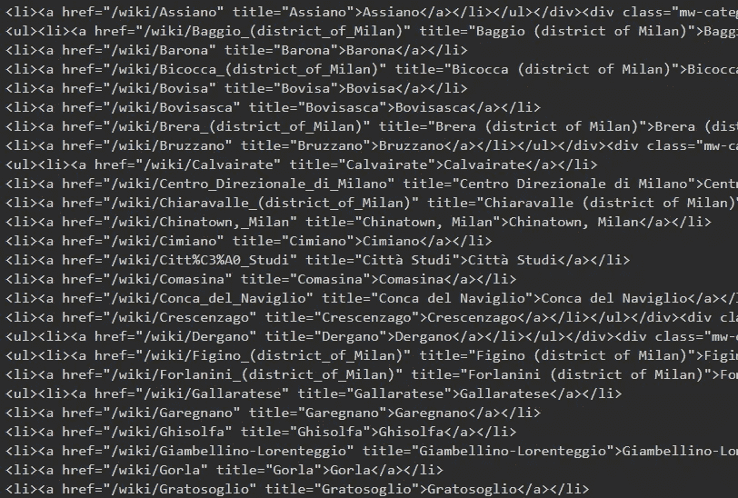
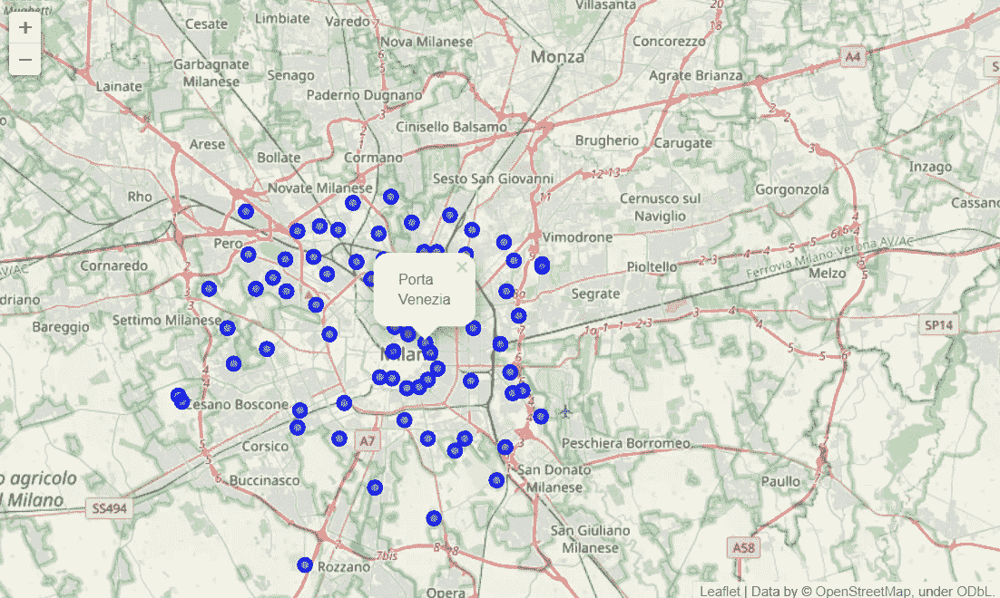
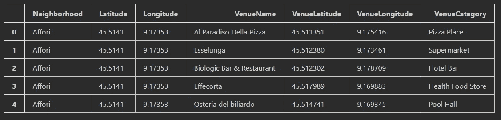
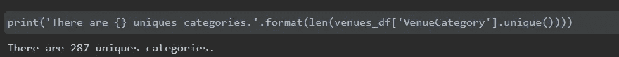
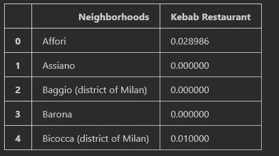
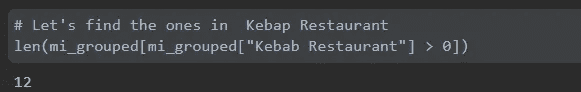
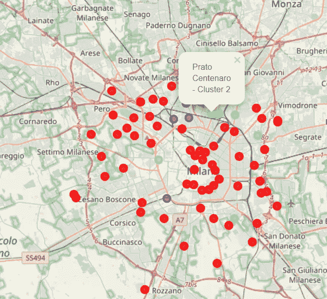

# 在米兰开一家烤肉串餐厅，用数据分析

> 原文：<https://medium.datadriveninvestor.com/opening-a-kebab-restaurant-in-milan-with-data-analysis-2dcca8f45ad1?source=collection_archive---------6----------------------->


在这个项目中，我将尝试以不同的方式处理数据分析，如果我要在我居住的米兰开一家餐厅吃一顿美味的土耳其餐，我会考虑应该在哪里开。

## *1。将维基百科页面上的数据剪切成一个数据帧*

首先，因为我没有数据，我研究了哪里可以了解米兰地区，我可以在[维基百科](https://en.wikipedia.org/wiki/Category:Districts_of_Milan)上访问米兰的信息。首先，我制作了这些信息，以便我可以通过 BeautifulSoup 检索这些信息。

```
# Getting information about Milan
data = requests.get("https://en.wikipedia.org/wiki/Category:Districts_of_Milan").text

# creating beautifulsoup object from html
soup = BeautifulSoup(data, 'html.parser')
```

属于 BeautifulSoup 的 html.parser 完全按照我的要求完成了它的任务，为了从这里获得区域，我添加了一个过程，即选择并添加列表中的所有文章到我的空列表 NeighborhoodList 中，这个空列表名为 NeighborhoodList，带有 for 循环。然后我把它变成了一个 DataFrame，让它更容易在这个列表上操作。



## *2。获取地理坐标*

由于我需要可视化一个覆盖所有米兰地区的数据帧，我需要获得这些地区的地理坐标，在地理编码器库的帮助下，我们可以很容易地找到坐标。所以我创建了一个函数，我称之为“get_latlng”。有了这个功能，我们将能够访问我们输入的每个 neighborhoodList 成员的位置数据。

```
# Function to obtain the locations of the neighborhood in Milan.
def get_latlng(neighborhood):
    lat_lng_coords = None
    while(lat_lng_coords is None):
        g = geocoder.arcgis('{}, Milan, Italy'.format(neighborhood))
        lat_lng_coords = g.latlng
    return lat_lng_coords
```

用我命名为“坐标”的新列表，我在邻居列表中记录了所有区域的位置。我把在这里获得的经纬度信息保存到之前准备好的 mi_df 数据帧中。

```
# call the previous function to get the coordinates, store in a coords list
coords = [ get_latlng(neighborhood) for neighborhood in mi_df["Neighborhood"].tolist()]
```

## 3.创建一张米兰附近的地图

```
# get the coordinates of Milano
address = 'Milan, Italy'

geolocator = Nominatim(user_agent="my-application")
location = geolocator.geocode(address)
latitude = location.latitude
longitude = location.longitude
print('The geograpical coordinate of Milan,Italy {}, {}.'.format(latitude, longitude))
```

现在我们有了区域名称和坐标信息，我们可以进行可视化了。使用地理定位器，我们首先将地图与米兰的经纬度数据对齐。

```
# create a map
map_mi = folium.Map(location=[latitude, longitude], zoom_start=11)

# add markers 
for lat, lng, neighborhood in zip(mi_df['Latitude'], mi_df['Longitude'], mi_df['Neighborhood']):
    label = '{}'.format(neighborhood)
    label = folium.Popup(label, parse_html=True)
    folium.CircleMarker(
        [lat, lng],
        radius=5,
        popup=label,
        color='blue',
        fill=True,
        fill_color='#3186cc',
        fill_opacity=0.7).add_to(map_mi)  

map_mi
```

然后，我们通过 leav 创建名为 map_mi 的地图。在这里，我们通过使用 mi_df 中的邻域、纬度和经度变量为每个区域添加一个标记。



现在我们有了一张漂亮的米兰地图和代表各个地区的标记。

## *4。使用 Foursquare API 探索邻居*

```
CLIENT_ID = 'xXx'
CLIENT_SECRET = 'xXx'
VERSION = 'xXx'

print('Your credentails:')
print('CLIENT_ID: ' + CLIENT_ID)
print('CLIENT_SECRET:' + CLIENT_SECRET)
```

我们需要使用 Foursquare API 探索区域的内容并了解餐馆的类型。在输入 API 信息(如 client_id、client_secret 和版本)后，我们访问 API，让我们看看半径为 2000 米的前 200 个场馆。

```
radius = 2000
LIMIT = 200

venues = []

for lat, long, neighborhood in zip(mi_df['Latitude'], mi_df['Longitude'], mi_df['Neighborhood']):

    # create API request 
    url = "https://api.foursquare.com/v2/venues/explore?client_id={}&client_secret={}&v={}&ll={},{}&radius={}&limit={}".format(
        CLIENT_ID,
        CLIENT_SECRET,
        VERSION,
        lat,
        long,
        radius, 
        LIMIT)

    # make the GET request
    results = requests.get(url).json()["response"]['groups'][0]['items']

    # return only relevant information
    for venue in results:
        venues.append((
            neighborhood,
            lat, 
            long, 
            venue['venue']['name'], 
            venue['venue']['location']['lat'], 
            venue['venue']['location']['lng'],  
            venue['venue']['categories'][0]['name']))
```

让我们检查一下每个街区返回了多少个场馆



现在我们来考虑如何覆盖所有地区，有多少独特的地方。再来看看每个地区有多少独特的地方。

```
print('There are {} uniques categories.'.format(len(venues_df['VenueCategory'].unique())))
```



## *5。分析每个邻域*

让我们走到一步，在这一步，我们会感到我们正在接近终点。现在让我们用 one-hot-encoder 来区分各个地区的餐馆类型。

```
# one hot encoding
mi_onehot = pd.get_dummies(venues_df[['VenueCategory']], prefix="", prefix_sep="")

# add neighborhood column back to dataframe
mi_onehot['Neighborhoods'] = venues_df['Neighborhood'] 

# move neighborhood column to the first column
fixed_columns = [mi_onehot.columns[-1]] + list(mi_onehot.columns[:-1])
mi_onehot = mi_onehot[fixed_columns]

print(mi_onehot.shape)
mi_onehot.head()
```

让我们将此数据保存为 mi_grouped，并使用 groupby 操作根据邻域排列保存的数据帧，并通过为这些数字的平均值(频率)赋值，以 mi_grouped 的名称再次保存它。



让我们检查在 mi_grouped 数据集中拥有超过 0 个“Kebap 餐馆”的地区的数量。然后，让我们创建一个名为 mi _ kebap 的新数据框架，其中只包含地区和烤肉店频率。



## *6。聚类邻域*

感谢 k-means，我用 mi _ kebap 数据帧创建了 3 个聚类。我将这里创建的集群添加到我的数据框架中，命名为集群标签。

```
kclusters = 3

mi_clustering = mi_kebap.drop(["Neighborhoods"], 1)

# run k-means clustering
kmeans = KMeans(n_clusters=kclusters, random_state=0).fit(mi_clustering)
kmeans.labels_[0:10]mi_merged = mi_kebap.copy()

mi_merged["Cluster Labels"] = kmeans.labels_
```

在我创建的最后一个数据框中，我有 Neighborhood、Kebap Restaurant、聚类标签、纬度和经度变量，因此我将为每个聚类分配一个聚类标签，并且我可以在地图上显示不同的颜色及其坐标。通过 leav，我创建了一个带有标记的地图，每个聚类都有不同的颜色。



## *7。观察结果*

> 大多数烤肉串餐厅都集中在稍微远离米兰市中心的区域，第 1 组(紫色的)的比率最高，第 2 组的比率中等。
> 
> 这代表着开设新烤肉串餐厅的巨大机会和巨大潜力，因为现有烤肉串餐厅几乎没有竞争。与此同时，由于供应过剩和烤肉串餐馆密度高，集群 1 附近的烤肉串餐馆面临激烈的竞争。从另一个角度来看，这表明过度供应的烤肉店大多发生在城市的中心地区，仍然很少有烤肉店在郊区和市中心。因此，该项目建议房地产开发商利用这些发现，在 0 区附近新开一家烤肉串餐馆。拥有独特销售方案以在竞争中脱颖而出的房地产开发商，也可以在竞争适度的第二组团的社区中开设新的烤肉店。最后，建议房地产开发商避开集群 1 中的社区，这里已经是一个高度集中的烤肉串餐厅，竞争激烈。

如果您想继续阅读，与本文相关的笔记本在 [Github](https://github.com/ogulcanertunc/Data-Science-Projects/tree/main/Python/Finding%20the%20restaurant%20location%20to%20be%20opened%20with%20data%20analysis) 上。