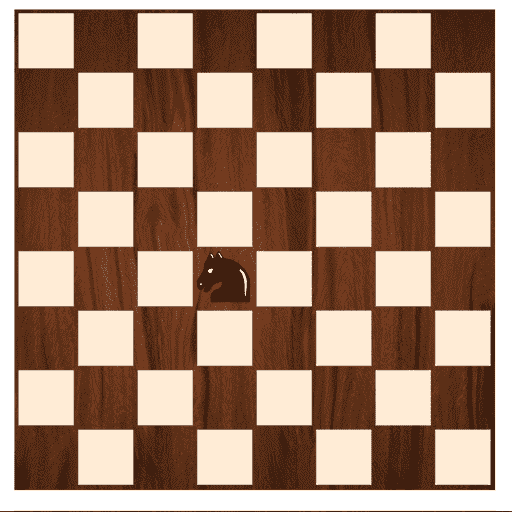

# 开场动作

> 原文：<https://medium.datadriveninvestor.com/opening-moves-72aba0894709?source=collection_archive---------6----------------------->

Image by Alma Cebrian / CC BY-SA ([https://creativecommons.org/licenses/by-sa/3.0](https://creativecommons.org/licenses/by-sa/3.0))

一个开场动作能产生如此大的影响真是令人惊讶。不仅仅是象棋，生活的很多方面都是如此。操作的顺序会对结果产生重大影响。在某些情况下，它没有任何。我可以理解为什么许多生活黑客关注早晨和晚上的日常事务。

对我来说，更多的是刷牙和卫生间清洁。

我记得在某处读到或看到过，如果一个人学会像专业人士一样清洁，一生中可以节省多少时间。例如，对于浴室，你从下往上喷，然后从上往下擦。喷洒马桶底部、马桶座圈、马桶顶部、水槽、柜台、水龙头周围的区域，然后以相反的顺序擦拭。这个想法是，当你穿的衣服接触到较干净的表面时，就不会那么恶心了，而且较脏的表面会浸泡更长时间。

对于刷牙，我的保健师说先从有问题的地方开始，因为你开始刷牙的地方是你花时间最多的地方。这有助于减少探视的痛苦。

当我在 Kaplan 教授备考课程时，我记得一些考试中某些问题的一些方法涉及到以某些方式处理多项选择答案。你可以从消除明显的错误答案开始，你可以插入答案中的数字，看看它们是否使公式有效，等等。有一个取决于测试、部分和问题类型的操作顺序，以增加正确答案的可能性。

如果我们改变处理事情的顺序，我们做的很多事情都可以变得不那么有压力，或者变得更有效率。有些任务可能需要简化成你先做最不愉快的事情(例如，先把餐具从干净的洗碗机里拿出来)。然后，任务变得更加自动化，为更高阶的问题释放更多的计算。