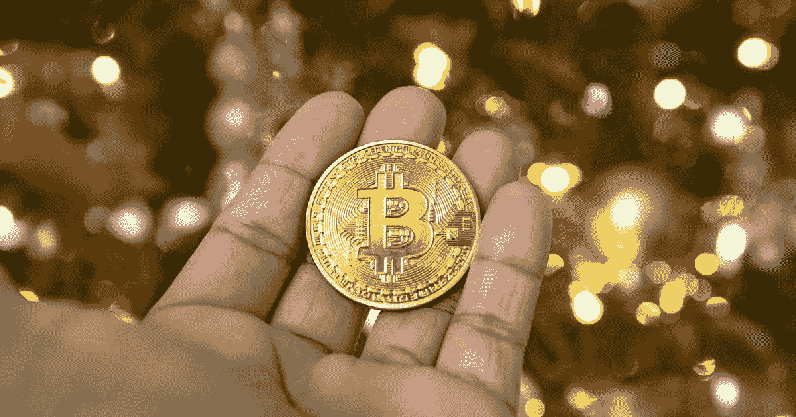

# 观点:比特币可以日常使用了吗？我父母能想出来吗？

> 原文：<https://medium.datadriveninvestor.com/opinion-is-bitcoin-ready-for-day-to-day-use-could-my-parents-figure-it-out-81f2b75435ba?source=collection_archive---------7----------------------->



对我来说，很简单，答案是否定的。

我的父母已经六十多岁了，我的妈妈是一个家庭主妇，我的爸爸从事一份普通的朝九晚五的工作，不需要任何特殊技能、大学学位或任何主要技术的使用。对于我的父母来说，比特币不是今天、明天或者接下来的几个月就要被他们使用的。

**比特币需要使用技术**

比特币依靠技术平台运行。对于年轻得多的智能手机出生一代用户来说，这没有什么大问题，但是，当你考虑到老一代人，我们的祖父母，我们年长的父母，这就变得非常非常困难了。

[](https://www.datadriveninvestor.com/2019/02/13/5-real-world-blockchain-applications/) [## 5 行业转型区块链应用

### 除非你一直生活在岩石下，否则我相信你现在已经听说过区块链了。而区块链…

www.datadriveninvestor.com](https://www.datadriveninvestor.com/2019/02/13/5-real-world-blockchain-applications/) 

我的妈妈和爸爸给我发电子邮件有困难。我妈妈可以，但这将是简单的，通常都是错误的大写字母，添加附件或模板是根本不可能的。我妈妈并不笨，但是谁来教她怎么做呢？我们爱我们的家人，但是谁有时间呢？

进一步放大这一点，考虑比特币，开始消费和交易的最低要求是:

1.  使用比特币存储设备(设置和维护)
2.  使用应用程序发送或接收比特币(能够使用金融应用程序)
3.  对区块链的安全和隐私有足够的了解(从书本和可靠来源获得的教育)

不幸的是，这些基本需求，第一步到第三步，足以让我的父母无法在区块链拥有和使用比特币或任何其他加密货币。他们将不会保留硬件钱包或移动钱包、安装更新、查看每日价格波动，也无法扫描二维码和创建新地址来保护自己的账户隐私。

一半的人口年龄较大，因此教育和技术立即成为如此重要的需求，以至于花时间和精力来帮助世界上一半的人适应这种需求似乎根本不可行。就连 T2 的巴菲特 T3 也不用智能手机。

**比特币需要控制你的财务**

我爱我的父母，他们并不愚蠢，但是想到我的妈妈检查区块链来寻找一个交易 id 似乎是不太可能的。对我父亲来说，比特币明天更有可能跃升至 100 万美元，而不是他使用任何类型的互联网服务。我肯定我爸爸以前没碰过电脑。两者都不是不可能发生，但非常不现实。

**控制伴随着责任**

在我们目前的系统中，我们有客户服务，1000 种经过测试的措施来帮助防止盗窃以及意外丢失或错误。一切都是经过长时间发展起来的。比特币和其他加密货币没有任何安全措施，至少今天没有。你可能听说一些应用程序可以，但一旦你进行交易，一旦你将比特币(BTC)发送到你选择的地址，BTC 就消失了。如果您错误地将交易 ID 从 ABCD1 更改为 ABCC1，则无法取消。帐户持有人 ABCC1 现在拥有，没有法律或法规要担心，把这个还给你。预防事故的系统并不存在。

区块链上的二维码和地址很长，需要反复检查，以避免诈骗和安全漏洞，并确保金额和地址匹配。

使用这项技术需要非常注意。

如果比特币只能为新一代人存在，那么在接下来的几年里被采用似乎更加可行。孩子们在科技的掌握中成长，能够很容易地适应周围不断发展的新世界。教老狗新把戏要困难得多，考虑到即使像沃伦巴菲特这样最富有的人也不拥有智能手机，这真的描绘了一幅我们应该从我们的老年家庭成员那里期待的画面。

在互联网、智能手机和平板电脑用户等主要领域，老一代人的使用正在增长，但这是一个漫长且有些困难的过程。在美国，10 个老年人中只有 4 个拥有智能手机，确切地说是 42%，这意味着 58%，也就是大多数人，没有智能手机。

拥有一部智能手机是开始在日常生活中使用比特币的第一个真正方式。没有应用程序和钱包可以方便地在不同地方使用，使用任何加密货币都变得越来越困难。十分之六的老年人不使用智能手机，但深入思考这个问题，一个更好的问题可能是，十分之四的老年人使用智能手机表现如何？

用我的父母作为一个小案例研究，答案不是很好。

就我个人而言，我希望看到技术的发展和变得更容易使用，但考虑到真正的应用程序开发只是在过去几年中发生的，确实有必要进行进一步的测试和用户反馈，以改善围绕该行业的所有服务。

[潜入区块链](https://medium.com/datadriveninvestor/where-did-the-first-bitcoin-come-from-74384df2afa)和加密货币需要大量的研究和工作，更不用说它的不断变化和发展。

你的家人呢，你能看到他们在技术上的飞跃吗？

```
*Image by André François McKenzie via Unsplash*
```

*最初发布于*[*https://block chain . news*](https://blockchain.news/opinion/opinion-is-bitcoin-ready-for-day-to-day-use-could-my-parents-figure-it-out)*。*