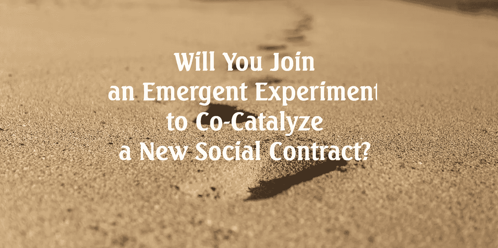
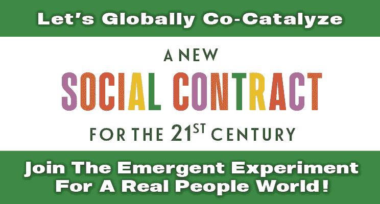

# 真实人类世界的机遇

> 原文：<https://medium.datadriveninvestor.com/opportunities-for-a-real-people-world-3163e6e3ef31?source=collection_archive---------23----------------------->

Photo by [Tayler Lyons](https://unsplash.com/@midnightflash36?utm_source=unsplash&utm_medium=referral&utm_content=creditCopyText) on [Unsplash](https://unsplash.com/s/photos/footprints?utm_source=unsplash&utm_medium=referral&utm_content=creditCopyText)

Abundantly Grateful to the kind and multi-talented Sean Carney for his tremendous support, including designing the banner image and doing the edit.

***“占主导地位的意识形态总是无形的，尤其是对持有它的人。这就是它的工作方式——这就是意识形态。”*** [迈克尔·里奇蒙](https://bit.ly/344N1ot)

就像一条鱼看不到它游泳的水一样，最明显和最重要的现实往往也是最难看到的(因此，没有被提及)。所以，生在一个我们需要金钱才能生存的世界，你有没有想过“从摇篮到坟墓”的商业计划 *—* 我们所有人为了生存而共同创造的社会契约 *—* ？还是你的默认设置*“盲目的确定性，一种相当于监禁的狭隘思维，以至于囚犯甚至不知道自己被关了起来？”*

**你作为你宇宙的中心**

在他对凯尼恩学院 2005 届的毕业演讲中，戴维·福斯特·华莱士分享了:

*“我自己的切身体验中的一切都支持我的深刻信念，即我是宇宙的绝对中心；现存的最真实、最生动、最重要的人……自动的、无意识的相信我是世界的中心，我的直接需求和感受应该决定世界的优先次序。”*

这种基本的自我中心是普遍存在的。

范式是一种思考和行动的方式，套用厄普顿·辛克莱的话:*“当一个人的生活依赖于对任何事情的不理解时，不要指望他能理解任何事情。”*

这不就是为什么我们经常觉得我们的头脑中有一个战区吗，尤其是在涉及到商业的时候？还是既得利益？

尽管 Wallace 敏锐地观察到: ***“我倾向于自动确定的东西中有很大一部分是……完全错误和被蒙蔽的*** *”*

他意识到:

> “学术教育最危险的一点是……它让我倾向于过度理性化，迷失在我头脑中的抽象争论中，而不是简单地关注我面前发生的事情，关注我内心发生的事情。”

因为习惯于通过自我的这种狭隘视角来看待和解释生活，你不太可能看到:

> ***“首要原则是，你一定不能愚弄自己，你是最容易被愚弄的人。”*** *理查德·费曼*

因此，即使有人有最好的意图，你也可能把任何挑战你的人视为敌人，因为你的默认设置是你反对所有人。

**简化复杂性**

> 每当一个理论对你来说是唯一可能的，就把它当作一个信号，表明你既没有理解这个理论，也没有理解它要解决的问题 *卡尔·波普*

说到处理问题，波普尔进一步将世界分为两种类型的人/方法: ***“所有的问题要么是钟，要么是云。”***

摘自 [*驱动货币未来的社会运动*](https://amzn.to/2zihVxM) *:*

时钟整洁有序，它们的部件以理论上可预测的方式相互作用。突然出现的问题通常可以通过将问题分解成单个的部分，然后解决这些部分的方法来快速解决。这种源自工厂流水线时代的“时钟”思维模式占主导地位，也是科学最擅长的。

另一方面，云是高度不规则、无序、不可预测的。要解决云的挑战，首先要观察模式是如何形成的，而不是为了赶时间把它们塞进鸽子洞。

*例如，你能通过在某个日期前四处奔波寻找准确合适的工具切割其关节来理解自然吗？在某种程度上，这就是“一切照旧”(BAU)渗透到你整个生活中的方式，它崇高地规定了你的角色，让你每个季度(如果不是每天)都专注于股东价值最大化。”*

非常广泛地说，如果你认为无家可归的人是一个问题，你可能会在主流意识形态中出现，以至于你看不到“这是水”。如果你认为它们是我们所依赖的系统的结果，你可能是一个云思想家。

二元思维，或者辛西娅·布尔吉奥特所说的“*自我操作系统*，是我们从*的立场解读现实的普遍方式，“这对我有什么好处？”又名我们所依赖的系统如何塑造我们不自然的行为。*

从自我的角度来看，过度简化也会让我们倾向于把事情看得太个人化。

二元思维本质上是二元的。非此即彼的立场通过比较、对立和区分得以简化，而无需考虑其间的任何细微差别。二元极性往往是非黑即白，例子包括善/恶、真/假、聪明/愚蠢、社会主义/资本主义。这种支持/反对系统思考的观点也延伸到国家、工作、种族、宗教、性别、年龄、既得利益、地位和其他人口统计数据。

因此，考虑一下世界大战从未真正结束，因为 BAU 灌输了这样的习惯:

***“我们被教导的典型管理方式是……把一个复杂的系统分成几个部分，然后尽可能好地管理每个部分。如果做到了这一点，整个系统就会运行良好。这是绝对错误的，因为它可以提高每个单独部分的性能，同时破坏系统。”*** 罗素·L·艾可夫

然后当恐惧和不安全感使你处于自我保护的状态时，你会不惜一切代价想要赢。在这个 BAU 范式中，一旦你把任何事情都看作是为了你的利益而可以货币化的东西，你就会忽略其他的一切。这不就是众多的[自发组织](https://bit.ly/2J3m7Uo)来帮助公司人员(尤其是大企业)建立他们“大到不能倒”的帝国吗？

 [## 规划和建立您的房地产业务|数据驱动的投资者

### 房地产行业是有史以来最受欢迎的五大职业之一。原因很简单。它确实…

www.datadriveninvestor.com](https://www.datadriveninvestor.com/2020/12/14/plan-and-build-your-real-estate-business/) 

同一本书的另一段摘录:

*“2011 年，* [*瑞士联邦理工学院*](http://arxiv.org/pdf/1107.5728v2) *的三位系统理论家发布了一份报告，总结道:“我们发现跨国公司形成了一个巨大的领结结构，并且很大一部分控制权流向了一个紧密联系的小型核心金融机构。这个核心可以被视为一个经济“超级实体”,为研究人员和政策制定者提出了新的重要问题。”*

*排除政府支持的企业和私营公司，他们研究了一个列出全球 3700 万家公司和投资者的数据库，分析了所有 43，060 家跨国公司和股权，以* [*建立一个谁拥有什么*](http://bit.ly/2stpidh) *及其收入模式的模型。*

[*James b . Glattfelder*](http://bit.ly/2piHUfw)*股票，即* [*737 位大股东*](http://bit.ly/2FVGVZw) *(约占 0.1%的玩家/股东)共同控制着跨国公司 80%的价值。核心的 147 个玩家共同控制一半(40%)。大多数是美国和英国的金融机构。在前 50 名中，有 45 家是金融公司，如美国银行、巴克莱、花旗集团、瑞士瑞信银行、德意志银行、高盛、摩根大通、摩根士丹利和瑞银集团*

***一切照旧——尤其是在公司拥有公司的地方，无限拥有公司的公司已经将财富、收入和权力集中到越来越少的人手里*** *。”*

今天，我们的世界在法律上更适合这种人工实体，而不是真正的人，他们没有比增长更伟大的上帝。受到我们相互竞争的自身利益的磨砺，一切照旧 *—* 我们生活的社会契约 *—* 是占主导地位的意识形态。通过金钱和资源的稀缺来控制，“这是水”增加了人为的“稀缺”思维和行为，成为我们默认的生活方式。

我们对 BAU 教的痴迷是我们默认的“稀缺”环境吗？

华莱士认为:

> *“人人崇拜。我们唯一的选择是崇拜什么。令人信服的原因是…你崇拜的几乎任何东西都会把你生吞活剥。*

*如果你崇拜金钱和事物，如果它们是你挖掘人生真正意义的地方，那么* ***你永远不会拥有足够的东西，永远不会觉得自己拥有足够的东西*** *。这是事实。崇拜你的身体、美丽和性诱惑，你将永远感到丑陋。当时间和年龄开始显现时，你会在他们最终使你悲伤之前死去一百万次。在某种程度上，我们都已经知道这些东西了。它被编纂成神话、谚语、陈词滥调、警句、寓言；每个伟大故事的梗概。*

整个诀窍是在日常意识中保持真相在前面。

崇拜权力，你最终会感到软弱和害怕，你需要比别人更大的力量来麻木你自己的恐惧。崇拜你的智力，被视为聪明，你最终会觉得愚蠢，一个骗子，总是处于被发现的边缘。但是这些崇拜形式的阴险之处不在于它们是邪恶或有罪的，而在于它们是无意识的。它们是默认设置。

他们是你日复一日逐渐陷入的那种崇拜，对你看到的东西和你衡量价值的方式越来越挑剔，却从未完全意识到你在做什么。

所谓的现实世界不会阻止你在默认设置下操作，因为所谓的现实世界是由人、金钱和权力组成的，在恐惧、愤怒、沮丧、渴望和自我崇拜的池子里快乐地流淌。”

根据华莱士的说法，真正教育的真正价值在于拥有简单的意识；意识到什么是如此真实和重要，隐藏在我们周围，无时无刻不在，以至于我们会一遍又一遍地提醒自己:“这是水。”

他承认:

“要做到这一点，日复一日地在成人世界中保持清醒和活力，是难以想象的困难。这意味着又一句陈词滥调被证明是正确的:你的教育真的是一生的工作。”

我们所依赖的系统建立在我们默认的思维之上，即世界围绕着“我”旋转。这就是系统如何根据感知的稀缺性塑造我们。难道这不是为什么尽管互联网可以直接连接我们，但它现在被*[自然垄断](https://en.wikipedia.org/wiki/Natural_monopoly)*(经济学家如何描述微软、亚马逊、苹果、脸书和 Alphabet 的谷歌等公司)所控制。“自然垄断”利用一个行业的高进入壁垒，在其业务周围建立一个“护城河”或保护墙。**

**在 BAU 范式中，企业人士(尤其是大企业)的基准是增长是至高无上的，这个(不)圣杯是以牺牲其他一切为代价的。**

****一个真实的人的世界，有人吗？****

**对于从“我”到“我们”以及从“控制”到“授权”的范式转换，方向的改变 *—* 通过做 *—* 来重新启动*—*思维模式是必要的。**

**在 21 世纪初，我与当时已退休的 EY 亚洲主席 Thomas Brian Stevenson 分享了以下观点:**

> ***“我们每个人都有完美的礼物可以奉献给这个世界……如果我们每个人都能奉献出独一无二的东西，难道我们就不能为彼此创造奇迹吗？”***

**令我非常惊讶的是，我的前老板告诉我，我正在努力扭转泰坦尼克号。但是为什么你和我还不够呢？**

**近 10 次迷你 Facebook 设计经历(在脸书之前开发了两次)和几次失败的实验之后，在遭遇大量认知失调的情况下，我艰难地认识到，我们无法用用来创造系统性挑战的 BAU 逻辑来解决这些挑战。**

**尽管没有人知道所有的事情，BAU 倾向于把“时钟”症状当作一只海星放回大海。**

**范式转变确实需要我们所有人，因为没有救世主:**

*****“如果要拯救世界，不是靠有新程序的旧头脑，而是靠根本没有程序的新头脑。为什么不是有新程序的新思维？因为当你发现人们在做程序的时候，你不会发现新的想法，你会发现旧的想法。程序和旧思想就像马鞭和童车一样形影不离。”*** 丹尼尔奎因**

**全球范围内的陌生人能理解我们问题的根源是我们所依赖的系统所造成的默认“稀缺”设置吗？**

**你会抛弃习惯，重新学习一种新的思维和行为方式吗(一路上治愈你自己和彼此)，这样我们就可以公开地共同催化一个新的社会契约，在一个真实的人的世界里，我们尽最大努力为每个人造福。**

**观看“黑客思维模式”系列 *—* 的发布，这是一个观察人类是否准备好从“我”到“我们”的范式转变的紧急实验 *—* ，有你的参与。**

****访问专家视图—** [**订阅 DDI 英特尔**](https://datadriveninvestor.com/ddi-intel)**