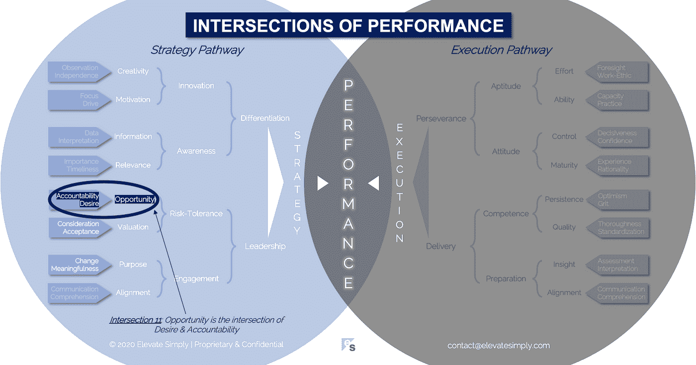

# 机会:欲望和责任的交集

> 原文：<https://medium.datadriveninvestor.com/opportunity-the-intersection-of-desire-accountability-7e81adb1e195?source=collection_archive---------9----------------------->

Image By [Creativa Images](https://www.shutterstock.com/g/Creativa)

机会要么被抓住，要么被错过，有意或无意。一个简单的象限可以描述这一点(如文本所示):

1.  被故意带走
2.  无意中拍摄的
3.  错过——故意的
4.  错过——无意中

这些类别背后的基本原理很简单:

*   抓住机会是因为 1)这样做有价值(即有意的)，或者 2)它只是在不知情的情况下发生(即无意的)
*   一个机会被错过了，因为 1)它没有价值(即有意的)，或者 2)没有意识到它(即无意的)

每种方法的详细原理要复杂得多，需要根据具体情况进行检查，这超出了本文的范围。

**有意还是无意**

无意中抓住的机会可能被认为是运气，具有讽刺意味的是，这有时被定义为“当准备遇到机会”(循环引用)。无意中错过的机会只能从错过的原因或方式来评估，因为对于某个特定的个人或实体来说，这些机会从未真正实现。

探索机会最好是在那些被故意抓住或错过的机会上进行。意图很重要，因为它意味着远见、风险评估、成本效益分析和可行性等要素发挥作用。

**有什么机会交集？**

机会是欲望和责任的交叉点*(见下图 11 号交叉点)*。它是对未来将要做出的一个或一组决策的陈述。个人和公司面临着源源不断的机会前景。那么他们如何决定哪些机会值得，哪些不值得呢？

*欲望*

欲望是机遇的关键，因为它是感性的，并不总是合乎逻辑的。此外，当涉及到风险时，欲望会模糊清晰。也就是说，欲望是强大的。它能把不可能变成可能。

在人和组织中，欲望创造并验证意图。欲望是基于对机会存在的认识。没有认知，就没有关于某样东西是否值得的知识。

欲望不仅仅适用于被抓住的机会。在有意不抓住或错过机会时，这也是一种强大的力量。当欲望不够强烈，不足以证明所涉风险的合理性时，或者当完全缺乏对机会的欲望，而回避的吸引力更大时，就会发生这种情况。

交叉点 11:机会=愿望+责任

Image by [Brett Simpson](https://medium.com/u/191cf90a65d7?source=post_page-----7e81adb1e195--------------------------------)

*问责*

当涉及到机会时，问责制是理想的合作伙伴。对责任的要求会影响对责任的渴望或缺乏。决定是否接受或放弃一个机会的人或实体对这个决定以及随后发生的一切负有责任。

“随之而来的一切”包括工作、成本、影响以及如果抓住机会的结果(积极的和消极的)。它包括“如果错过机会，本可以做什么”或“避免了什么”。

责任存在于机会生命周期的每个阶段。必须有人(或公司)负责:

*   识别它
*   评估它
*   做出决定
*   根据决定采取行动
*   决定错过它
*   结果/影响

欲望和责任共同构成了如何以及为什么决定抓住或错过机会的基础。

**领导者能做什么？**

领导者应该提倡发现机会。没有机会，人和企业就会停滞不前。

领导者应该清楚地传达这样的信息:机会识别并不能保证机会的追求。不受约束、猖獗的机会识别可能效率低下，所以应该设定合理的界限。基于人员、文化和所做工作的类型，每个团队和公司的这些界限会有所不同。

**总结&下一步**

在机会评估中平衡愿望和责任促进了创新并提高了决策技能，这在组织的各个层面都很重要。机会最终会推动所有业务的战略。

下次我们将考察性能的第 12 个交叉点，即**相关性交叉点**。

*本系列文章中，我们探索了*性能的交集*，其中有 30 篇(文章列表见下文)。*绩效交集*框架基于* [*董事总经理布雷特·辛普森(Brett Simpson)*](https://www.linkedin.com/in/brettjsimpson/)*[*仅提升*](https://www.linkedin.com/company/elevatesimply/) *的经验和见解，以及他作为企业家、顾问和投资者 20 多年的领导经验。**

***性能的交叉点-文章链接***

*1.[绩效:策略&执行](https://medium.com/the-innovation/1-performance-the-intersection-of-strategy-execution-2bf06329f8d4)的交汇点*

*2.[战略:领导力的交叉点&差异化](https://medium.com/the-innovation/2-strategy-the-intersection-of-leadership-differentiation-a568b17731ab)*

*3.[领导力:参与度的交集&风险承受度](https://medium.com/the-innovation/3-leadership-the-intersection-of-engagement-risk-tolerance-f8c887e6c1d3)*

*4.[差异化:创新的交叉点&意识](https://medium.com/@brettjsimpson/4-differentiation-the-intersection-of-innovation-awareness-a21d053ecf12)*

*5.[啮合:目的交集&对准](https://medium.com/@brettjsimpson/5-engagement-the-intersection-of-purpose-alignment-953747437c26)*

*6.[风险承受能力:机会的交集&估值](https://medium.com/@brettjsimpson/6-risk-tolerance-the-intersection-of-opportunity-valuation-29cf4d9a0ac)*

*7.[认知:信息的交集&关联性](https://medium.com/@brettjsimpson/7-awareness-the-intersection-of-information-relevance-f0fd5322bcb7)*

*8.[创新:创造力的交汇点&动机](https://medium.com/@brettjsimpson/8-innovation-the-intersection-of-creativity-motivation-7c1a12e0d5e2)*

*9.[目的:变化的交集&意义](https://medium.com/@brettjsimpson/9-purpose-the-intersection-of-change-meaningfulness-9f12b0153e1)*

*10.[估价:对价的交集&验收](https://medium.com/@brettjsimpson/valuation-the-intersection-of-consideration-acceptance-eebe7b15e763)*

*11.[机会:欲望的交汇&责任](https://medium.com/the-innovation/opportunity-the-intersection-of-desire-accountability-7e81adb1e195)*

*12.[相关性:重要性的交集&及时性](https://medium.com/@brettjsimpson/relevance-the-intersection-of-importance-timeliness-56cc748eb066)*

*13.[信息:数据的交集&解读](https://medium.com/@brettjsimpson/information-the-intersection-of-data-interpretation-62acc94ba8bf)*

*14.[动力:焦点的交汇&驱动](https://medium.com/@brettjsimpson/14-motivation-the-intersection-of-focus-drive-d9ebd3ca9951)*

*15.[创造力:观察的交集&独立性](https://medium.com/@brettjsimpson/15-creativity-the-intersection-of-observation-independence-57f7294acb2b)*

*16.执行力:毅力与交付的交集*(即将推出！)**

*17.交付:准备与能力的交集*(即将推出！)**

*18.毅力:能力和态度的交汇*(即将推出！)**

*19.准备:洞察力和一致性的交汇*(即将推出！)**

*20.能力:坚持与质量的交汇点*(即将推出！)**

*21.态度:控制&成熟的交集*(即将推出！)**

*22.资质:努力与能力的交集*(即将推出！)**

*23.洞察力:评估与解释的交集*(即将推出！)**

*24.质量:彻底性和标准化的交汇点*(即将推出！)**

*25.坚持:乐观与勇气的交汇*(即将推出！)**

*26.成熟:经验与理性的交汇*(即将推出！)**

*27.控制:果断与自信的交集*(即将推出！)**

*28.能力:能力与实践的交集*(即将推出！)**

*29.努力:远见和职业道德的交集*(即将推出！)**

*30.对齐:传播与综合的交汇点*(即将推出！)**

****在*** [***管理与企业咨询***](https://app.ddichat.com/category/management-and-corporate-consulting)***:***中安排一个 DDIChat 会话*

* [## 专家-管理和企业咨询- DDIChat

### DDIChat 允许个人和企业直接与主题专家交流。它使咨询变得快速…

app.ddichat.com](https://app.ddichat.com/category/management-and-corporate-consulting) 

***申请成为 DDIChat 专家*** [***这里***](https://app.ddichat.com/expertsignup) ***。
使用 DDI 的方法:***[***https://datadriveninvestor.com/collaborate***](https://datadriveninvestor.com/collaborate) ***访问我们的***[***https://www.datadriveninvestor.com/***](https://www.datadriveninvestor.com/)*