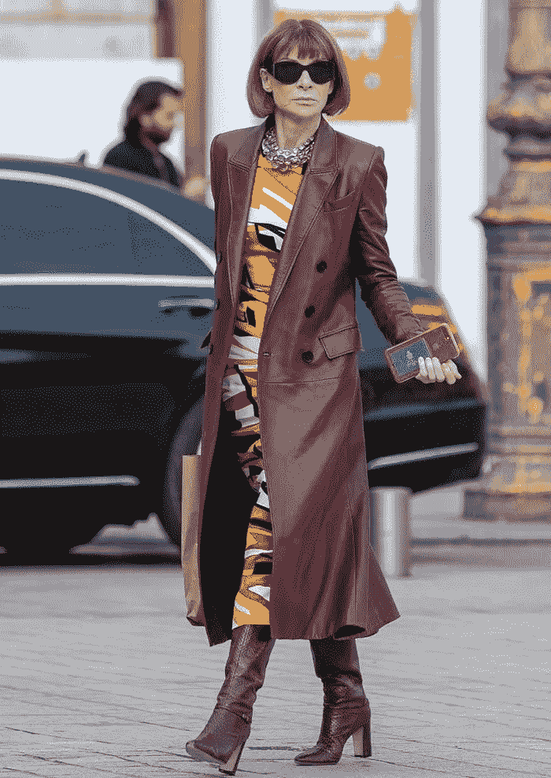

# 相反的行动

> 原文：<https://medium.datadriveninvestor.com/opposite-action-b480765fa40a?source=collection_archive---------5----------------------->

# 如何扭转乾坤，乔治·克斯坦萨式的

Seinfeld*’s George Costanza in action*

上周是我的生日！尽管当今世界发生了这么多事情，帕特里克和我还是度过了一段美好的时光。

但是如果你像我一样，不是每天都充满乐趣。差远了。这些年来，我意识到我的自然倾向是拖延、逃避和惰性。如果我跟着感觉走，我会每天一整天都呆在床上，一边阅读图书馆里无穷无尽的书籍，一边吃手边最容易/最接近的食物。我从不锻炼、洗澡、工作或与他人交谈。

*Sub in hot chocolate for the coffee, and you’d have default me.*

大多数时候，我能够克服这些倾向，但普遍的焦虑、抑郁和/或压力情况(像 2020 年的所有情况)可能会在任何给定的早上伏击我。这时候，为了完成任何事情并获得一些自尊，我会使用我多年来发展的几种应对策略中的一种。

我把所有这些策略放在一个大伞下，我称之为乔治·克斯坦萨(乔治·克斯坦萨的对立面)或 GCO。如果你对 [*宋飞*](https://www.imdb.com/title/tt0098904/) 不熟悉，乔治是体现我所有自然倾向胡作非为的伙伴角色。因此，他的生活总体上很悲惨。然而，在第一集中，乔治决定做一件与他平时完全相反的事情，生活开始变得美好。

一般来说，事情越重要和/或对我越有利，我就越不想做。我个人的欧比万，史蒂文·普莱斯菲尔德称这个原理为抵抗。无论是在微观还是宏观层面上，阻力都可以提示我们，我们真正应该做些什么。我向阻力屈服的次数比我愿意承认的要多，但是当我设法运用 GCO，把阻力踢到路边时，我感觉很好，并且能够建立动力。

直到上周一，当我亲爱的朋友伊冯娜提到周末在她家使用[相反的动作](https://www.mindfulnessmuse.com/dialectical-behavior-therapy/10-practical-examples-of-opposite-action-part-one)来整理房间的时候，我才意识到有人已经开发出了和我的 GCO 一样的东西。原来，反向动作是在[辩证行为疗法](https://dialecticalbehaviortherapy.com/) (DBT)中教授的一种技能。坏消息是我没有自己想象的那么有创意——但好消息是有大量的[证据](https://www.psychologytoday.com/us/blog/mindful-musings/201703/feeling-urge-and-then-doing-opposite-action)支持 GCO 的智慧。

以下是我的一些屡试不爽的 GCO 子程序:

*The book I co-wrote with my excellent accountability partner*

1) **责任:**我已经有一个[天使般的责任伙伴](https://annettelyon.wordpress.com/)多年了，我们已经[写了关于](https://smile.amazon.com/Done-Power-Accountability-Partnering-Reaching-ebook/dp/B00K58Z890/ref=sr_1_1?dchild=1&keywords=done+and+done+lyon+perkins&qid=1604358037&sr=8-1)[我们的系统](https://luisa.substack.com/p/choice-and-accountability)的长篇大论。每当我不想汇报时，我就知道我最需要它。有时给安妮特发短信说我刷牙了，感觉像是一种胜利——当我刷牙时，她总是为我加油。

2)**45/15:**我想这是几十年前从 [FlyLady](http://flylady.net/) 那得到的。每小时被分成四个 15 分钟的时间段。设置好你的计时器，尽可能快地做你不想做的事情。当计时器停止计时时，重置计时器并切换到另一项工作。当定时器再次响起时，重置它并再次切换家务。第四段 15 分钟，做一些有趣的事情。重复这个系列，直到你完成所有的事情。

你可以这样做:15 分钟打扫厨房/15 分钟叠衣服/15 分钟整理抽屉/15 分钟看一场有趣的网飞秀。

或者你可以:15 分钟写作/15 分钟研究/15 分钟修改/用最后 15 分钟在社交媒体上赶上进度。

你会惊讶于你能做多少事情，当你把那些内置的 15 分钟休息作为奖励时，事情是多么容易。

*Cailler’s Frigor, my favorite chocolate in the world*

3) **CH3** :说到奖励，这是我发明的最有效的自我激励方法之一。CH3 =章节/家务/巧克力。买一本爱不释手的书——有趣、引人入胜、逃避现实的书。读一章(或者 15 分钟)，然后*把书放下*。做清单上的家务。吃一块巧克力吧。重复直到你完成你的清单。这和 45/15 是我每年至少阅读 85 本书的方法之一。但是你可以在电视上这样做，如果你是个电视迷的话。

4) **Just10:** 我以前写过我每个月追踪的[日常习惯](https://medium.com/curious/my-carnet-eb83cb00c3fb)。有时候我真的没有心情，在这种情况下，我向自己保证，不管是什么事情，我只需要做 10 分钟。*几乎总是*，一旦我进入 10 分钟，我就有坚持下去的意愿。但是偶尔，我会把自己限制在 10 分钟，这样我就可以在其他的日子里相信自己。对我来说，常见的“10 秒”是遛狗；划船；写作；练习钢琴和/或管风琴；和圣经研究。

*Sometimes, you need to channel your inner Wintour.*

5) **打扮:**自然趋势我更喜欢一天 24 小时穿着 t 恤和瑜伽裤四处闲逛。大多数时候，我可以克服这一点，做我通常的淋浴/擦亮(SH2)，但是当我真的不想做的时候，我会穿上 GCO 和盛装。多化一点妆，额外的珠宝，再喷一点香水，更可爱的鞋子……即使我不出门(这几天已经很多了)，当我感觉有点时髦的时候，我会做得更好。

*Shake it till you make it.*

6) **舞会:**尽管我做了一吨的菜，还写了一本[食谱](https://smile.amazon.com/Comfortably-Yum-Food-Body-Spirit/dp/1442145056/ref=tmm_pap_swatch_0?_encoding=UTF8&qid=1604360017&sr=8-1)，其实我并不爱做饭。我喜欢做了的*，我喜欢*吃*，所以这通常足以激励我做好晚餐准备。但是偶尔，当我最想往家里扔些奶酪然后逃跑的时候，我会举办一个舞会来代替。*

首先，我打乱了一个名为“落魄”的特殊播放列表这些歌曲总能提升我的情绪。我听到开始的和弦，我已经在微笑了。我相信你能想到适合你的歌曲，但如果你需要想法，我会在下面列出我的。

一旦音乐响起(美妙而响亮，非常感谢)，我就放声歌唱，边做饭边摇摆。我感觉好多了，真是不可思议。同样神奇的是，我让我的孩子感到多么尴尬——甚至更尴尬！一旦晚餐准备好了，我就可以吃了，所以:又一个奖励！

7) **成为梦想:**对我来说，去参加一个葬礼，听到一段精彩的悼词总是一件令人兴奋的事情。我回家后想知道当我不在的时候，人们会怎么说我*。在这种时候，我意识到仅仅希望自己有某些特质是不够的。帕特里克喜欢引用美国国家橄榄球联盟教练比尔·帕塞尔斯的话，“你就是你的记录所说的那样。”不是你的意图或梦想，而是你每天的选择形成了你的性格。以下是我理想自我的一些方面:*

*谦逊的基督徒
成功的作家
慷慨的朋友
有效的活动家
体贴的邻居
热情的妻子
酷酷的妈妈和孩子们一起做有趣的事情
亲切的美国人，法语出奇的好
神奇的奶奶(遥远的未来的某一天)
在外面下雨的时候在钢琴上弹奏肖邦的女士
有用的牧师，可以在没有通知的情况下为赞美诗伴奏*

*光梦想成为那个人是不够的。我必须成为梦想。朝着实现这些愿望迈出的任何一小步都会让我感觉更好，并帮助我继续前进。*

*你呢？你有什么方法可以让我加入我的武器库吗？如果有，请分享！我总是在寻找新的东西。*

***落魄播放列表:**
[随波逐流](https://www.youtube.com/watch?v=nEidbkibsiE)，由快速马车合唱团
[当我是国王](https://www.youtube.com/watch?v=-l3FzmZkbnQ)，由大海
[基德船长](https://www.youtube.com/watch?v=Hyhiqq-FzDU)，由大海
[卢基](https://www.youtube.com/watch?v=D-edW2NZ_WE)，由大海&酋长乐队
[Ce Qui Guide Mes Pas](https://www.youtube.com/watch?v=hFbbZ6untdY) ，由 Soleil
[别这样离开我](https://www.youtube.com/watch?v=1RHBAd5YUR8)，由 commu 由洛·罗萨里奥
[摸](https://www.youtube.com/watch?v=gBAfejjUQoA)，由小混
[蛋黄派](https://www.youtube.com/watch?v=VVP3g1-Wq_0)，由
[移民歌曲](https://www.youtube.com/watch?v=y8OtzJtp-EM)，由
[摇滚](https://www.youtube.com/watch?v=lncr2g9XJHU)，由
[疑神疑鬼](https://www.youtube.com/watch?v=13iMsGNUHFo)，由精少年食人族
[炸药](https://www.youtube.com/watch?v=gdZLi9oWNZg)，由 BTS
[配音](https://www.youtube.com/watch?v=20W4slP2PGg)，由
由现代英语
[中国小树林](https://www.youtube.com/watch?v=RX7iHsAIw9o)，由杜比兄弟
[把你所有的爱都放在我身上](https://www.youtube.com/watch?v=vfnOaLQHKh8)，由阿爸
[给我一个机会](https://www.youtube.com/watch?v=-crgQGdpZR0)，由阿爸
[特斯拉女孩](https://www.youtube.com/watch?v=zdzNcVQqTnw)，由 OMD
[得到幸运](https://www.youtube.com/watch?v=5NV6Rdv1a3I)，由蠢朋克/法瑞尔·威廉姆斯
[任何你想要的方式](https://www.youtube.com/watch?v=atxUuldUcfI)，由旅程 [那个人](https://www.youtube.com/watch?v=vf7To6vdg7A)[缺心眼的市长](https://www.youtube.com/watch?v=5Da9sc6YDBo)，由 XTC*

**

*如果你喜欢这篇文章，请订阅我的时事通讯。谢谢！https://luisa.substack.com/T2*